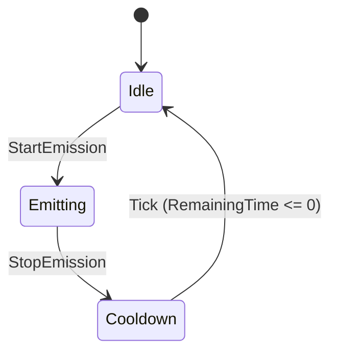
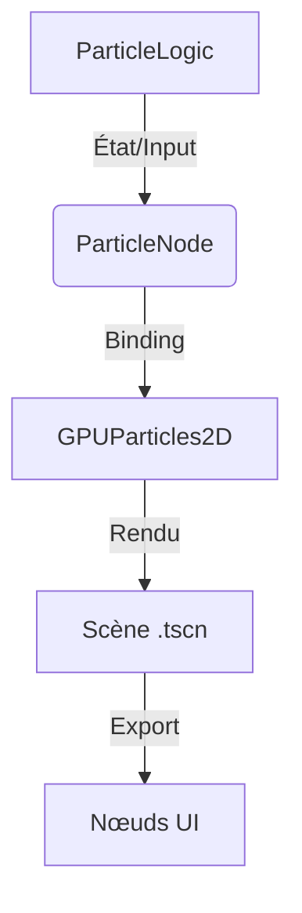
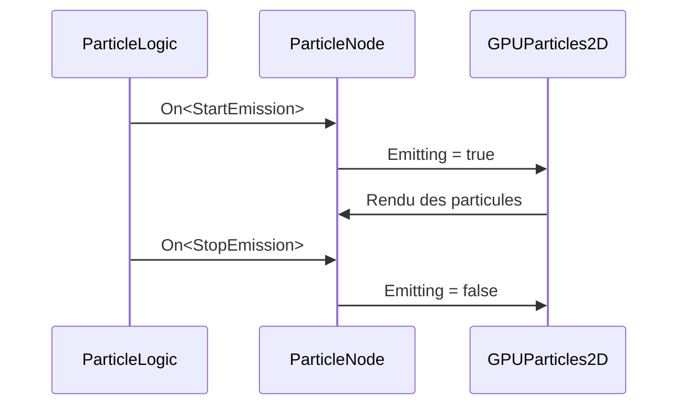

# Système de Particules 2D - Optimisation avec ChickenSoft/LogicBlocks
*Guide ultime pour intégrer des particules 2D performantes, modulaires et découplées dans Godot 4.x.*

---

## **Contexte**
- **Objectif** : Créer un système de particules 2D **performant**, **modulaire** et **100% compatible** avec ChickenSoft/LogicBlocks, en utilisant `GPUParticles2D` pour les cas modernes et `CPUParticles2D` pour les cas spécifiques.
- **Public cible** : Développeurs C#/Godot utilisant ChickenSoft pour des jeux 2D avec des effets visuels avancés (explosions, traînées, poussière ambiante).
- **Prérequis** :
  - Godot 4.2+
  - C# 11+
  - Packages : `ChickenSoft.LogicBlocks`, `ChickenSoft.AutoInject`

---

## **Règles d'Architecture Impératives**

### **1. Découplage Strict**
- **LogicBlock** : Gère la **logique pure** (états, inputs, transitions).
  - **Interdictions** : Aucune référence à Godot (`Node`, `Vector2`, etc.).
  - **Obligations** : États (`IState`) et inputs (`IInput`) en `record` immuables.
- **Binding** : Pont entre Godot et les LogicBlocks.
  - **Responsabilités** :
    - Injection des dépendances via `IAutoNode`.
    - Gestion du cycle de vie (`_Ready`, `_ExitTree`).
    - Nettoyage des ressources (`Dispose()`).
- **Scènes .tscn** : Uniquement responsable de l’**affichage** et de l’**export des nœuds UI**. 

### **2. Immutabilité**
- **États** : Toujours utiliser des `record` pour les états (ex: `ParticleState`).
- **Inputs** : Toujours utiliser des `record` pour les inputs (ex: `EmitParticlesInput`).
- **Transitions** : Utiliser `On<TInput>((input, state) => ...)` pour les transitions d’état.

### **3. Performances**
- **Préférer `GPUParticles2D`** pour les jeux modernes (Vulkan/GL).
- **Utiliser `CPUParticles2D`** uniquement pour du matériel obsolète.
- **Optimiser les shaders** : Utiliser `ParticleProcessMaterial` pour les effets avancés (émissions, mouvements, apparences).

---

## **Exemples Minimaux**

### **1. LogicBlock : Gestion des États des Particules**

#### **Fichiers**
- `ParticleLogic.State.cs` : États immuables.
- `ParticleLogic.Input.cs` : Inputs immuables.
- `ParticleLogic.cs` : Bloc logique.

#### **Code**
```csharp
// ParticleLogic.State.cs
namespace MyGame.Logic.Particles;

public partial class ParticleLogic
{
    public interface IState : ChickenSoft.LogicBlocks.StateLogic { }
    public record Idle : IState;
    public record Emitting(float Duration, float Intensity) : IState;
    public record Cooldown(float RemainingTime) : IState;
}
```

```csharp
// ParticleLogic.Input.cs
namespace MyGame.Logic.Particles;

public partial class ParticleLogic
{
    public interface IInput : ChickenSoft.LogicBlocks.InputLogic { }
    public record StartEmission(float Duration, float Intensity) : IInput;
    public record StopEmission : IInput;
}
```

```csharp
// ParticleLogic.cs
using ChickenSoft.LogicBlocks;

namespace MyGame.Logic.Particles;

public partial class ParticleLogic : LogicBlock<ParticleLogic.IState, ParticleLogic.IInput>
{
    protected override IState InitialState => new Idle();

    public ParticleLogic()
    {
        // Transition vers Emitting
        On<StartEmission>((input, _) =>
            new Emitting(input.Duration, input.Intensity));

        // Transition vers Cooldown
        On<StopEmission, Emitting>((_, state) =>
            new Cooldown(state.Duration));

        // Transition vers Idle après Cooldown
        On<ChickenSoft.LogicBlocks.Tick, Cooldown>((_, state) =>
            state.RemainingTime <= 0 ? new Idle() : state with { RemainingTime = state.RemainingTime - 0.1f });
    }
}
```

---

### **2. Binding : Intégration avec Godot**

#### **Fichier**
- `ParticleNode.cs` : Script Godot pour lier le `ParticleLogic` à `GPUParticles2D`.

#### **Code**
```csharp
// ParticleNode.cs
using Godot;
using ChickenSoft.AutoInject;
using ChickenSoft.LogicBlocks;
using MyGame.Logic.Particles;

namespace MyGame.Nodes;

public partial class ParticleNode : GPUParticles2D, IAutoNode
{
    [Export] public float EmissionDuration = 2.0f;
    [Export] public float EmissionIntensity = 10.0f;

    private readonly ParticleLogic.Block _logic = new();
    private ParticleLogic.Block.Binding _binding;

    public override void _Ready()
    {
        _binding = _logic.Bind();
        _binding.Handle<ParticleLogic.Emitting>(state =>
        {
            Emitting = true;
            OneShot = false;
            Restart();
        });
        _binding.Handle<ParticleLogic.Idle>(_ =>
        {
            Emitting = false;
        });
        _logic.Start();
    }

    public override void _ExitTree()
    {
        _logic.Stop();
        _binding.Dispose();
    }

    public void EmitParticles()
    {
        _logic.Input(new ParticleLogic.StartEmission(EmissionDuration, EmissionIntensity));
    }
}
```

---

### **3. Scène .tscn : Configuration Visuelle**

#### **Fichier**
- `ParticleEffect.tscn` : Scène Godot avec `GPUParticles2D` et `ParticleNode.cs` attaché.

#### **Contenu**
```ini
[gd_scene load_steps=2 format=3]
[ext_resource type="Script" path="res://Source/Nodes/ParticleNode.cs" id="1_particle_node"]
[ext_resource type="Material" path="res://Materials/ParticleProcessMaterial.tres" id="2_particle_material"]

[node name="ParticleEffect" type="GPUParticles2D"]
script = ExtResource("1_particle_node")
process_material = ExtResource("2_particle_material")
emitting = false
one_shot = false
amount = 100
```

---

## **Bonnes Pratiques**

### **1. Utilisation des Shaders**
- **`ParticleProcessMaterial`** : Permet de contrôler :
  - **Émission** : `emission_shape`, `emission_velocity`, `emission_lifetime`.
  - **Mouvement** : `gravity`, `radial_accel`, `tangential_accel`.
  - **Apparence** : `color_ramp`, `size_ramp`, `opacity_ramp`.

- **Exemple de configuration** :
  ```csharp
  // Dans ParticleNode.cs
  public override void _Ready()
  {
      var material = new ParticleProcessMaterial();
      material.EmissionShape = ParticleProcessMaterial.EmissionShapeEnum.Sphere;
      material.Gravity = new Vector3(0, 10, 0);
      material.ColorRamp = new Gradient()
      {
          Colors = new[] { Colors.Red, Colors.Orange, Colors.Yellow },
          Offsets = new[] { 0f, 0.5f, 1f }
      };
      ProcessMaterial = material;
  }
  ```

### **2. Patterns ChickenSoft**
- **`IAutoNode`** : Pour l’injection de dépendances et l’initialisation retardée.
- **Réactivité** : Utiliser `OnResolved()` pour initialiser les propriétés après résolution des dépendances.
- **Nettoyage** : Toujours appeler `Dispose()` dans `_ExitTree`.

### **3. Optimisations**
- **Culling** : Utiliser `VisibilityRect` pour limiter le rendu aux particules visibles.
- **Flipbook** : Pour les animations de particules complexes (ex: explosions en sprite sheet).
- **Masques d’émission** : Utiliser `EmissionMask` pour contrôler la zone d’émission.

---

## **Erreurs Courantes à Éviter**

<mui:table-metadata title="Anti-Patterns et Corrections" />

| ❌ Anti-Pattern | ✅ Correction | Explication |
|----------------|--------------|-------------|
| Utiliser `_Ready()` pour initialiser les propriétés des particules. | Utiliser `OnResolved()` avec `IAutoNode`. | `_Ready()` peut être appelé avant que les dépendances ne soient injectées. |
| Modifier directement `Emitting` ou `OneShot` dans `_Process()`. | Utiliser des **transitions d’état** via `LogicBlock`. | Évite les mutations directes et centralise la logique. |
| Utiliser `CPUParticles2D` pour des milliers de particules. | Préférer `GPUParticles2D` + shaders. | `CPUParticles2D` est limité en performances. |
| Stocker l’état des particules dans des variables locales. | Utiliser des `record` immuables pour les états. | Garantit l’immuabilité et la prévisibilité. |
| Ne pas nettoyer les bindings dans `_ExitTree`. | Toujours appeler `_binding.Dispose()`. | Évite les fuites mémoire.

---

## **Diagrammes**

### **1. Flux des États des Particules**


### **2. Architecture Globale**


### **3. Intégration avec ChickenSoft**


---

## **Recettes Pratiques avec ChickenSoft**

### **1. Explosion**
- **Objectif** : Effet d’explosion en une seule émission.
- **Configuration** :
  - `OneShot = true`
  - `Amount = 50`
  - `EmissionShape = Sphere`
  - `Lifetime = 0.5f`
- **Code** :
  ```csharp
  _logic.Input(new ParticleLogic.StartEmission(0.5f, 50f));
  ```

### **2. Traînées Continues**
- **Objectif** : Effet de traînée derrière un personnage.
- **Configuration** :
  - `OneShot = false`
  - `Amount = 10`
  - `EmissionVelocity = new Vector3(-5, 0, 0)`
  - `Lifetime = 1.0f`
- **Code** :
  ```csharp
  _logic.Input(new ParticleLogic.StartEmission(1.0f, 10f));
  ```

### **3. Poussière Ambiant**
- **Objectif** : Effet de poussière en arrière-plan.
- **Configuration** :
  - `OneShot = false`
  - `Amount = 5`
  - `EmissionShape = Box`
  - `Gravity = new Vector3(0, 0.1f, 0)`
- **Code** :
  ```csharp
  _logic.Input(new ParticleLogic.StartEmission(float.MaxValue, 5f));
  ```

---

## **Exemples Avancés**

### **1. Particules avec Collisions**
- **Objectif** : Particules qui rebondissent sur les surfaces.
- **Configuration** :
  - Utiliser `CollisionShape2D` pour définir les surfaces.
  - Configurer `ParticleProcessMaterial` pour la physique.
- **Code** :
  ```csharp
  // Dans ParticleNode.cs
  public override void _Ready()
  {
      var material = new ParticleProcessMaterial();
      material.CollisionShape = new SphereShape3D { Radius = 0.5f };
      material.Bounce = 0.8f; // Coefficient de rebond
      ProcessMaterial = material;
  }
  ```

### **2. Effets de Lumière Dynamique**
- **Objectif** : Particules qui émettent de la lumière.
- **Configuration** :
  - Ajouter un `Light2D` comme enfant de `GPUParticles2D`.
  - Lier l’intensité de la lumière à l’état des particules.
- **Code** :
  ```csharp
  // Dans ParticleNode.cs
  [Export] private Light2D _particleLight;

  public override void _Ready()
  {
      _binding.Handle<ParticleLogic.Emitting>(state =>
      {
          _particleLight.Intensity = state.Intensity / 10f;
      });
  }
  ```

### **3. Particules avec Animation de Sprite (Flipbook)**
- **Objectif** : Utiliser une animation de sprite pour les particules.
- **Configuration** :
  - Créer un `SpriteFrames` avec les frames de l’animation.
  - Configurer `ParticleProcessMaterial` pour utiliser le flipbook.
- **Code** :
  ```csharp
  // Dans ParticleNode.cs
  [Export] private SpriteFrames _spriteFrames;

  public override void _Ready()
  {
      var material = new ParticleProcessMaterial();
      material.SpriteFrames = _spriteFrames;
      material.AnimationSpeed = 10f; // Vitesse de l'animation
      ProcessMaterial = material;
  }
  ```

---

## **Templates Réutilisables**

### **1. Template pour un Nouveau LogicBlock**
```csharp
// [Feature]Logic.State.cs
namespace MyGame.Logic.[Feature];

public partial class [Feature]Logic
{
    public interface IState : ChickenSoft.LogicBlocks.StateLogic { }
    // Ajouter les états ici
}

// [Feature]Logic.Input.cs
namespace MyGame.Logic.[Feature];

public partial class [Feature]Logic
{
    public interface IInput : ChickenSoft.LogicBlocks.InputLogic { }
    // Ajouter les inputs ici
}

// [Feature]Logic.cs
using ChickenSoft.LogicBlocks;

namespace MyGame.Logic.[Feature];

public partial class [Feature]Logic : LogicBlock<[Feature]Logic.IState, [Feature]Logic.IInput>
{
    protected override IState InitialState => new [InitialState]();

    public [Feature]Logic()
    {
        // Ajouter les transitions ici
    }
}
```

### **2. Template pour un Nouveau Binding**
```csharp
// [Feature]Node.cs
using Godot;
using ChickenSoft.AutoInject;
using ChickenSoft.LogicBlocks;
using MyGame.Logic.[Feature];

namespace MyGame.Nodes;

public partial class [Feature]Node : [NodeType], IAutoNode
{
    [Export] // Ajouter les propriétés exportées ici

    private readonly [Feature]Logic.Block _logic = new();
    private [Feature]Logic.Block.Binding _binding;

    public override void _Ready()
    {
        _binding = _logic.Bind();
        // Configurer les handlers ici
        _logic.Start();
    }

    public override void _ExitTree()
    {
        _logic.Stop();
        _binding.Dispose();
    }
}
```

---

## **Checklist de Validation**
- [ ] **LogicBlock** :
  - [ ] Aucun référence à Godot.
  - [ ] États et inputs en `record` immuables.
  - [ ] Transitions via `On<TInput>`.
- [ ] **Binding** :
  - [ ] Implémente `IAutoNode`.
  - [ ] Gère le cycle de vie (`_Ready`, `_ExitTree`).
  - [ ] Nettoie les bindings (`Dispose()`).
- [ ] **Scène .tscn** :
  - [ ] Script de binding attaché au nœud racine.
  - [ ] Nœuds UI exportés (`[Export]`).
- [ ] **Performances** :
  - [ ] Utilise `GPUParticles2D` pour les effets modernes.
  - [ ] Optimise les shaders (`ParticleProcessMaterial`).
- [ ] **Documentation** :
  - [ ] Diagrammes Mermaid pour les flux.
  - [ ] Exemples concrets en C# et TOML/TSN.

---

## **Ressources Complémentaires**
- [Documentation officielle Godot sur les particules 2D](https://docs.godotengine.org/en/stable/tutorials/2d/particles_2d.html)
- [ChickenSoft.LogicBlocks - GitHub](https://github.com/ChickenSoft-Games/LogicBlocks)
- [ChickenSoft.AutoInject - GitHub](https://github.com/ChickenSoft-Games/AutoInject)
