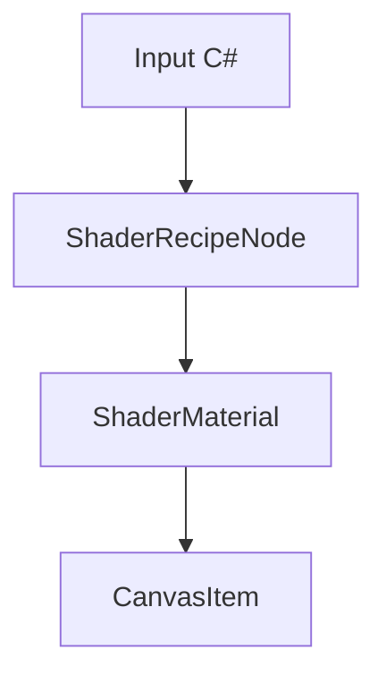
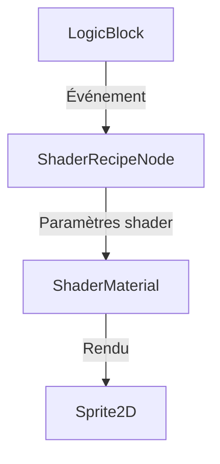

# 2D Shader Recipes pour Godot 4 et ChickenSoft
*Guide pragmatique pour implémenter des shaders 2D CanvasItem en C# avec une intégration ChickenSoft propre et maintenable.*

---

## **Contexte**
- **Objectif** : Proposer des recettes de shaders 2D conçues pour Godot 4/C# et compatibles avec l’architecture ChickenSoft.
- **Public cible** : développeurs Godot utilisant C# et les packages `ChickenSoft.AutoInject` / `ChickenSoft.LogicBlocks`.
- **Prérequis** :
  - Godot 4.2+
  - C# 11+
  - Packages : `ChickenSoft.AutoInject`, `ChickenSoft.LogicBlocks`
  - Base de scène 2D utilisant `CanvasItem` (`Sprite2D`, `TextureRect`, `Control`, etc.)

---

## **Règles d'Architecture Impératives**

### **1. Séparation logique / rendu**
- `LogicBlock` gère l’état et les transitions d’effets.
- Les shaders restent responsables du rendu, des paramètres et de l’animation visuelle.
- Les `ShaderMaterial` doivent être configurés par des bindings C# plutôt que par des passages de variables globales.

### **2. Binding C# propre**
- Utiliser `IAutoNode` pour injecter et initier les nœuds.
- Exporter les paramètres de shader avec `[Export]`.
- Lier les paramètres dans `_Ready()` ou `OnResolved()` si `IAutoNode` est utilisé.
- Préférer les noms de paramètres explicites : `shader_parameter/dissolve_amount`, `shader_parameter/scroll_speed`.

### **3. Immutabilité de la configuration**
- Les paramètres de temporisation et d’intensité doivent être des champs exportés ou des `record` immuables.
- Le code applicatif communique avec le shader via des inputs immuables et des transitions d’état.

### **4. Performance**
- Éviter les shaders trop complexes sur des textures volumineuses.
- Prioriser les effets légers sur `CanvasItem`.
- Limiter l’utilisation de `discard` à des cas où l’économie de pixels est significative.

---

## **Exemples Minimaux**

### 1. Fichiers
- `ShaderRecipeNode.cs` : binding C# pour configurer un shader 2D.
- `Dissolve2D.shader` : shader canvas_item.
- `DissolveEffect.tscn` : scène avec `Sprite2D` et `ShaderMaterial`.

### 2. Exemple de binding C#
```csharp
using Godot;
using ChickenSoft.AutoInject;

namespace MyGame.Nodes;

public partial class ShaderRecipeNode : Sprite2D, IAutoNode
{
    [Export] public ShaderMaterial? ShaderMaterial;
    [Export] public float DissolveDuration = 1.0f;

    private Tween? _tween;

    public override void _Ready()
    {
        if (ShaderMaterial is null)
        {
            GD.PrintErr("ShaderMaterial non assigné !");
            return;
        }

        _tween = CreateTween();
    }

    public void AnimateDissolve()
    {
        if (ShaderMaterial is null || _tween is null)
            return;

        ShaderMaterial.SetShaderParameter("dissolve_amount", 0.0f);

        _tween.TweenProperty(ShaderMaterial, "shader_parameter/dissolve_amount", 1.0f, DissolveDuration)
              .SetTrans(Tween.TransitionType.Sine)
              .SetEase(Tween.EaseType.InOut);
    }
}
```

### 3. Exemple de scène `.tscn`
- Racine : `Sprite2D`
- Script : `ShaderRecipeNode.cs`
- Material : `ShaderMaterial` avec shader 2D
- Texture exportée via `Sprite2D.Texture`

---

## **Bonnes Pratiques**

### **1. Configurer les shaders via C#**
- Centraliser la logique d’animation de shader dans un nœud C#.
- Exposer les variables et durées via `[Export]`.
- Utiliser `CreateTween()` ou `AnimationPlayer` pour piloter les transitions.

### **2. Réutilisabilité**
- Créer des shaders modulaires :
  - `dissolve_amount`
  - `outline_width`
  - `flash_amount`
  - `scroll_speed`
  - `wave_amplitude`
- Utiliser des `ShaderMaterial` séparés pour chaque type d’effet.
- Partager les `ShaderMaterial` via des ressources `.tres`.

### **3. ChickenSoft + shaders**
- Avec `ChickenSoft.AutoInject`, injecter et lier automatiquement les nœuds.
- Avec `LogicBlocks`, déclencher les effets par des inputs immuables.
- Exemple : `On<HitReceived>((input, state) => new FlashState(input.Duration));`

### **4. Maintenance**
- Commenter chaque paramètre de shader.
- Garder les shaders simples et lisibles.
- Tester chaque recette indépendamment sur des sprites ou des textures neutres.

---

## **Recettes de shaders 2D**

### Dissolve Effect
- Usage : disparition progressive, transition d’apparition, dissolve d’ennemis.
- Paramètres :
  - `dissolve_amount`
  - `noise_texture`
  - `edge_color`
  - `edge_width`

```glsl
shader_type canvas_item;

uniform float dissolve_amount : hint_range(0.0, 1.0) = 0.0;
uniform sampler2D noise_texture : filter_linear_mipmap;
uniform vec4 edge_color : source_color = vec4(1.0, 0.5, 0.0, 1.0);
uniform float edge_width : hint_range(0.0, 0.1) = 0.03;

void fragment() {
    vec4 tex = texture(TEXTURE, UV);
    float noise = texture(noise_texture, UV).r;

    if (noise < dissolve_amount) {
        discard;
    }

    float edge = smoothstep(dissolve_amount, dissolve_amount + edge_width, noise);
    COLOR = mix(edge_color, tex, edge);
    COLOR.a = tex.a;
}
```

### Outline Effect
- Usage : mise en valeur, sélection, dessin de contours.
- Paramètres :
  - `outline_color`
  - `outline_width`

```glsl
shader_type canvas_item;

uniform vec4 outline_color : source_color = vec4(0.0, 0.0, 0.0, 1.0);
uniform float outline_width : hint_range(0.0, 10.0, 0.5) = 1.0;

void fragment() {
    vec2 size = TEXTURE_PIXEL_SIZE * outline_width;
    vec4 tex = texture(TEXTURE, UV);

    float alpha_sum = 0.0;
    alpha_sum += texture(TEXTURE, UV + vec2(size.x, 0.0)).a;
    alpha_sum += texture(TEXTURE, UV + vec2(-size.x, 0.0)).a;
    alpha_sum += texture(TEXTURE, UV + vec2(0.0, size.y)).a;
    alpha_sum += texture(TEXTURE, UV + vec2(0.0, -size.y)).a;

    if (tex.a < 0.5 && alpha_sum > 0.0) {
        COLOR = outline_color;
    } else {
        COLOR = tex;
    }
}
```

### Flash White (Hit Effect)
- Usage : feedback de coup, flash d’impact.
- Paramètres :
  - `flash_amount`

```glsl
shader_type canvas_item;

uniform float flash_amount : hint_range(0.0, 1.0) = 0.0;

void fragment() {
    vec4 tex = texture(TEXTURE, UV);
    COLOR = mix(tex, vec4(1.0, 1.0, 1.0, tex.a), flash_amount);
}
```

### Color Swap / Palette Shift
- Usage : changement de palette, effets magiques, altérations d’état.
- Paramètres :
  - `original_color`
  - `replacement_color`
  - `tolerance`

```glsl
shader_type canvas_item;

uniform vec4 original_color : source_color = vec4(1.0, 0.0, 0.0, 1.0);
uniform vec4 replacement_color : source_color = vec4(0.0, 0.0, 1.0, 1.0);
uniform float tolerance : hint_range(0.0, 1.0) = 0.1;

void fragment() {
    vec4 tex = texture(TEXTURE, UV);
    float dist = distance(tex.rgb, original_color.rgb);
    if (dist < tolerance) {
        COLOR = vec4(replacement_color.rgb, tex.a);
    } else {
        COLOR = tex;
    }
}
```

### Scrolling UV (Water, Lava, Clouds)
- Usage : surfaces animées, néons, parallaxe simple.
- Paramètres :
  - `scroll_speed`

```glsl
shader_type canvas_item;

uniform vec2 scroll_speed = vec2(0.1, 0.05);

void fragment() {
    vec2 scrolled_uv = UV + scroll_speed * TIME;
    COLOR = texture(TEXTURE, scrolled_uv);
}
```

### Wave Distortion
- Usage : distorsion, énergie, miroirs ondulés.
- Paramètres :
  - `wave_amplitude`
  - `wave_frequency`
  - `wave_speed`

```glsl
shader_type canvas_item;

uniform float wave_amplitude : hint_range(0.0, 0.1) = 0.02;
uniform float wave_frequency : hint_range(0.0, 50.0) = 10.0;
uniform float wave_speed : hint_range(0.0, 10.0) = 2.0;

void fragment() {
    vec2 uv = UV;
    uv.x += sin(uv.y * wave_frequency + TIME * wave_speed) * wave_amplitude;
    COLOR = texture(TEXTURE, uv);
}
```

---

## **Erreurs Courantes à Éviter**

| ❌ Anti-Pattern | ✅ Correction |
|----------------|--------------|
| Modifier des paramètres de shader dans `_Process()` sans raison. | Animer via `Tween` ou `AnimationPlayer`. |
| Stocker les shaders directement dans du code métier. | Laisser les shaders dans des ressources `.shader` ou `.tres`. |
| Ne pas exposer les paramètres importants. | Utiliser `[Export]` sur les contrôles et durées. |
| Mélanger la logique ChickenSoft avec le rendu shader. | Keep `LogicBlock` pour l’état, `ShaderMaterial` pour le visuel. |
| Oublier de `Dispose()` ou de nettoyer des tweens actifs. | Nettoyer dans `_ExitTree()` et gérer les transitions proprement. |

---

## **Diagrammes**

### Flux de shader


### Architecture ChickenSoft + Shader


---

## **Checklist de validation**
- [ ] Le guide mentionne Godot 4.2+, C# 11+, ChickenSoft.
- [ ] Les shaders restent `canvas_item`.
- [ ] Les exemples C# montrent la liaison des paramètres de shader.
- [ ] Les recettes sont présentées avec usage, paramètres et bonnes pratiques.
- [ ] Il existe une section erreurs courantes et une checklist.


