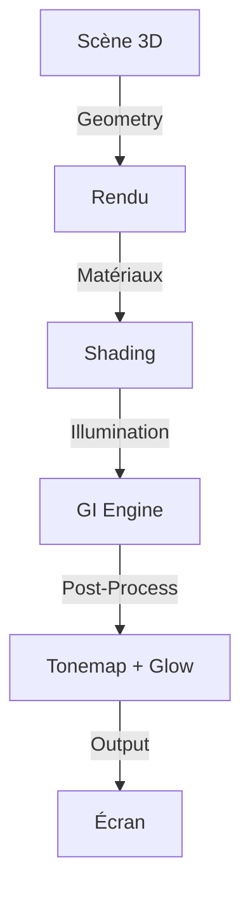
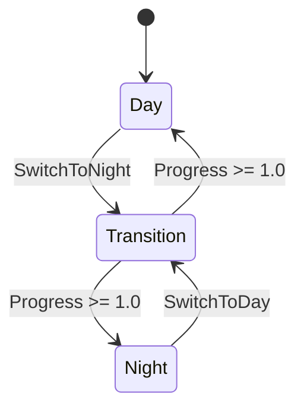
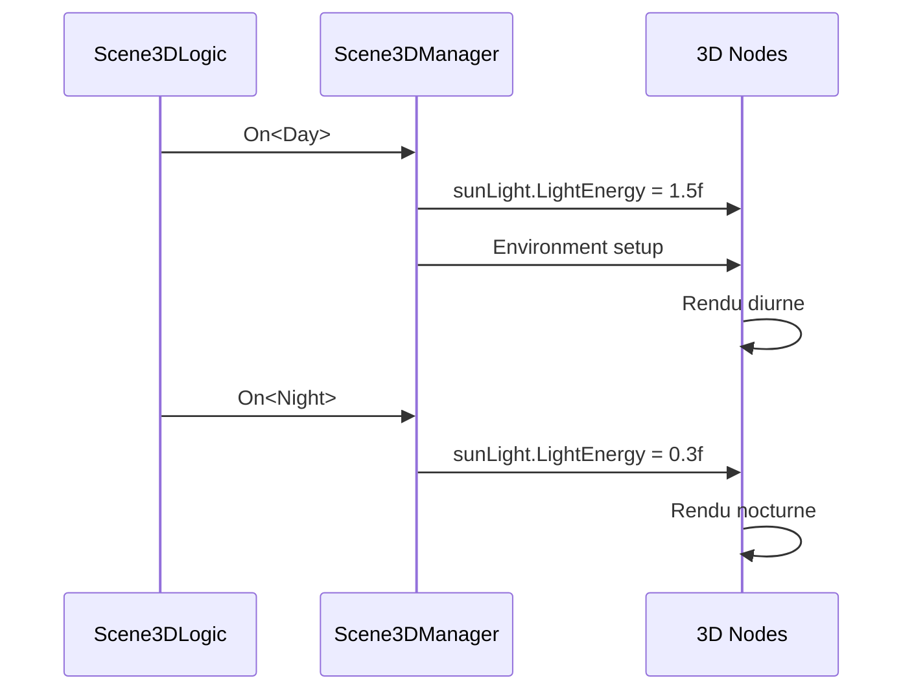
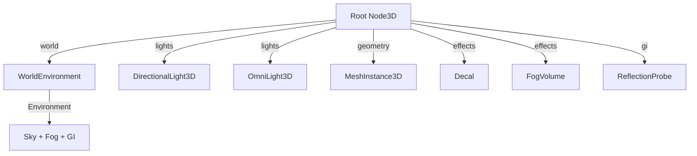

# 3D Essentials - Architecture Complète avec ChickenSoft/LogicBlocks
*Guide complet pour créer des scènes 3D performantes, modulaires et découplées dans Godot 4.x utilisant ChickenSoft.*

---

## **Contexte**
- **Objectif** : Maîtriser les fondamentaux 3D de Godot (matériaux, éclairage, illumination globale, optimisations) de manière **modulaire** et **100% compatible** avec ChickenSoft/LogicBlocks et l'architecture C#.
- **Public cible** : Développeurs C#/Godot utilisant ChickenSoft pour créer des environnements 3D (jeux d'action, RPG, simulations).
- **Prérequis** :
  - Godot 4.2+
  - C# 11+
  - Packages : `ChickenSoft.LogicBlocks`, `ChickenSoft.AutoInject`
  - Renderers supportés : Forward+, Mobile, Compatibility

---

## **Règles d'Architecture Impératives**

### **1. Séparation des Responsabilités**
- **LogicBlock** : Gère l'**état 3D pur** (états de lumière, états d'environnement, transitions d'illumination).
  - **Interdictions** : Aucune référence directe à `Node3D`, `Vector3`, `Transform3D`.
  - **Obligations** : États et inputs en `record` immuables.
- **Binding Node** : Pont entre Godot et les LogicBlocks.
  - **Responsabilités** :
    - Injection des dépendances via `IAutoNode`.
    - Gestion du cycle de vie (`_Ready`, `_ExitTree`, `_Process`).
    - Application des propriétés 3D (positions, transformations, matériaux).
- **Scènes .tscn** : **Affichage et hiérarchie uniquement** (Node3D, MeshInstance3D, Lights, etc.).

### **2. Immuabilité**
- **États** : `record` pour tous les états (ex: `LightingState`, `EnvironmentState`).
- **Inputs** : `record` pour tous les inputs (ex: `SetLightColorInput`).
- **Propriétés dynamiques** : Utiliser `with` pour les transitions.

### **3. Performances**
- **Préférer Forward+** pour les projets modernes (PC/Console).
- **Utiliser Mobile** uniquement pour des cibles mobiles.
- **LOD automatique** : Laisser Godot gérer les niveaux de détail sur les meshes importés.
- **Culling** : Utiliser l'occlusion culling pour les scènes fermées.
- **MultiMesh** : Pour les instances massives (herbe, débris, essaims).

---

## **Composants 3D Essentiels**

### **1. Système de Lumière**

#### **Types de Lumières**

| Type | Usage | Coût |
|------|-------|------|
| **DirectionalLight3D** | Sun/Moon, éclairage général extérieur | Bas |
| **OmniLight3D** | Lampes, explosions, effets dynamiques | Moyen |
| **SpotLight3D** | Projecteurs, phares | Moyen-Haut |
| **Ambient** (via Environment) | Remplissage d'ombres | Très bas |

#### **Code : Lumière Dynamique avec Tween**

```csharp
// LightManager.cs - Gestion des lumières dynamiques
using Godot;
using ChickenSoft.LogicBlocks;

namespace MyGame.Nodes;

public partial class DynamicLightNode : OmniLight3D, IAutoNode
{
    private OmniLight3D _light;

    public override void _Ready()
    {
        _light = this;
        _light.LightColor = Colors.White;
        _light.LightEnergy = 1.0f;
        _light.OmniRange = 10.0f;
        _light.OmniAttenuation = 2.0f;
    }

    public void CreateExplosionLight(Vector3 pos)
    {
        var light = new OmniLight3D();
        light.LightColor = new Color(1.0f, 0.6f, 0.2f);  // Orange
        light.LightEnergy = 4.0f;
        light.OmniRange = 10.0f;
        light.OmniAttenuation = 2.0f;
        light.Position = pos;
        AddChild(light);

        // Decay avec Tween
        var tween = CreateTween();
        tween.TweenProperty(light, "light_energy", 0.0f, 0.5);
        tween.TweenCallback(Callable.From(light.QueueFree));
    }

    public void FlickerLight(float flickerSpeed)
    {
        var tween = CreateTween().SetLoops();
        tween.TweenProperty(_light, "light_energy", 0.5f, flickerSpeed);
        tween.TweenProperty(_light, "light_energy", 1.5f, flickerSpeed);
    }
}
```

### **2. Matériaux Runtime**

#### **Créer et Assigner des Matériaux**

```csharp
// MaterialBuilder.cs
using Godot;

namespace MyGame.Rendering;

public static class MaterialBuilder
{
    public static StandardMaterial3D CreateStandardMaterial(
        Color albedo,
        float metallic = 0.0f,
        float roughness = 0.5f,
        bool emission = false
    )
    {
        var mat = new StandardMaterial3D();
        mat.AlbedoColor = albedo;
        mat.Metallic = metallic;
        mat.Roughness = roughness;

        if (emission)
        {
            mat.EmissionEnabled = true;
            mat.Emission = albedo;
            mat.EmissionEnergyMultiplier = 1.5f;
        }

        return mat;
    }

    public static void AssignToMesh(MeshInstance3D mesh, StandardMaterial3D material)
    {
        // Créer une copie indépendante pour éviter de modifier tous les instances
        mesh.MaterialOverride = (Material)material.Duplicate();
    }
}
```

#### **Utilisation dans un Binding Node**

```csharp
// ColoredMeshNode.cs
using Godot;
using ChickenSoft.AutoInject;
using MyGame.Rendering;

namespace MyGame.Nodes;

public partial class ColoredMeshNode : MeshInstance3D, IAutoNode
{
    [Export] public Color BaseColor = Colors.White;
    [Export] public float Metallic = 0.3f;
    [Export] public float Roughness = 0.7f;

    public override void _Ready()
    {
        var mat = MaterialBuilder.CreateStandardMaterial(BaseColor, Metallic, Roughness);
        MaterialBuilder.AssignToMesh(this, mat);
    }

    public void FlashEmissive()
    {
        var mat = MaterialOverride as StandardMaterial3D;
        if (mat == null) return;

        mat.EmissionEnabled = true;
        mat.Emission = Colors.White;
        mat.EmissionEnergyMultiplier = 3.0f;

        var tween = CreateTween();
        tween.TweenProperty(mat, "emission_energy_multiplier", 0.0f, 0.3);
        tween.TweenCallback(Callable.From(() => mat.EmissionEnabled = false));
    }
}
```

### **3. Environnement et Post-Processing**

#### **Configuration de l'Environnement (WorldEnvironment)**

```csharp
// EnvironmentSetup.cs
using Godot;

namespace MyGame.Rendering;

public static class EnvironmentSetup
{
    public static void SetupBasicEnvironment(WorldEnvironment worldEnv)
    {
        var env = new Godot.Environment();

        // ** Sky Configuration **
        var sky = new Sky();
        var skyMat = new ProceduralSkyMaterial();
        skyMat.SkyTopColor = new Color(0.4f, 0.6f, 1.0f);
        skyMat.SkyHorizonColor = new Color(0.7f, 0.8f, 1.0f);
        skyMat.GroundBottomColor = new Color(0.2f, 0.15f, 0.1f);
        sky.SkyMaterial = skyMat;
        env.Sky = sky;
        env.BackgroundMode = Godot.Environment.BGMode.Sky;

        // ** Tonemap Configuration **
        env.TonemapMode = Godot.Environment.ToneMapper.Filmic;
        env.TonemapExposure = 1.0f;

        // ** Ambient Light (from Sky) **
        env.AmbientLightSource = Godot.Environment.AmbientSource.Sky;
        env.AmbientLightEnergy = 1.0f;

        // ** Fog **
        env.FogEnabled = true;
        env.FogLightColor = new Color(0.7f, 0.75f, 0.8f);
        env.FogDensity = 0.01f;
        env.FogHeight = 0.0f;
        env.FogHeightDensity = 0.5f;

        // ** Glow (Bloom) **
        env.GlowEnabled = true;
        env.GlowIntensity = 0.3f;
        env.GlowBloomThreshold = 0.8f;
        env.GlowHdrThreshold = 1.0f;

        worldEnv.Environment = env;
    }

    public static void EnableVolumetricFog(WorldEnvironment worldEnv)
    {
        var env = worldEnv.Environment;
        env.VolumetricFogEnabled = true;
        env.VolumetricFogDensity = 0.05f;
        env.VolumetricFogAlbedo = new Color(0.9f, 0.9f, 0.9f);
        env.VolumetricFogEmission = Colors.Black;
        env.VolumetricFogLength = 64.0f;
        env.VolumetricFogTemporalReprojectionEnabled = true;
    }

    public static void EnableSSR(WorldEnvironment worldEnv)
    {
        var env = worldEnv.Environment;
        env.SsrEnabled = true;
        env.SsrMaxSteps = 64;
        env.SsrFadeIn = 0.15f;
        env.SsrFadeOut = 2.0f;
        env.SsrDepthTolerance = 0.2f;
    }
}
```

### **4. Illumination Globale (GI)**

#### **Méthodes GI Comparées**

| Méthode | Qualité | Perf | Dynamique | Usage |
|---------|---------|------|-----------|-------|
| Ambient seul | Basse | Gratuit | Oui | Jeux stylisés |
| ReflectionProbe | Moyenne | Basse | Option | Petits espaces fermés |
| LightmapGI | Très haute | Gratuit runtime | Non | Archviz, niveaux statiques |
| SDFGI | Haute | Moyenne | Oui | Open-world dynamique |
| VoxelGI | Très haute | Haute | Oui | Petit-moyen scope dynamique |

#### **ReflectionProbe : Code**

```csharp
// ReflectionManager.cs
using Godot;

namespace MyGame.Rendering;

public partial class ReflectionProbeNode : ReflectionProbe, IAutoNode
{
    [Export] public Vector3 ProbeSize = new Vector3(10.0f, 4.0f, 10.0f);
    [Export] public ReflectionProbe.UpdateModeEnum UpdateMode = 
        ReflectionProbe.UpdateModeEnum.Once;

    public override void _Ready()
    {
        Size = ProbeSize;
        UpdateMode = this.UpdateMode;
    }
}
```

#### **SDFGI : Activation**

```csharp
// SDFGISetup.cs
using Godot;

namespace MyGame.Rendering;

public static void EnableSDFGI(WorldEnvironment worldEnv)
{
    var env = worldEnv.Environment;
    env.SdfgiEnabled = true;
    env.SdfgiCascades = 4;
    env.SdfgiUseOcclusion = true;
}
```

### **5. Décals (Impacts, Traces)**

#### **Spawner de Décals Dynamiques**

```csharp
// DecalSpawner.cs
using Godot;

namespace MyGame.Rendering;

public static class DecalSpawner
{
    public static void SpawnBulletHole(Node3D parent, Vector3 hitPos, Vector3 hitNormal)
    {
        var decal = new Decal();
        decal.Size = new Vector3(0.3f, 0.2f, 0.3f);
        decal.TextureAlbedo = GD.Load<Texture2D>("res://textures/bullet_hole.png");
        decal.Position = hitPos;

        // Orienter le décal selon la normale de frappe
        if (hitNormal.Abs() != Vector3.Up)
        {
            decal.LookAt(hitPos - hitNormal, Vector3.Up);
            decal.RotateObjectLocal(Vector3.Right, Mathf.Pi / 2.0f);
        }

        decal.DistanceFadeEnabled = true;
        decal.DistanceFadeBegin = 20.0f;
        decal.DistanceFadeLength = 5.0f;

        parent.AddChild(decal);

        // Cleanup après 30 secondes
        parent.GetTree().CreateTimer(30.0f).Timeout += decal.QueueFree;
    }

    public static void SpawnBloodSplatter(Node3D parent, Vector3 pos)
    {
        var decal = new Decal();
        decal.Size = new Vector3(0.5f, 0.3f, 0.5f);
        decal.TextureAlbedo = GD.Load<Texture2D>("res://textures/blood_splatter.png");
        decal.Position = pos;

        parent.AddChild(decal);
        parent.GetTree().CreateTimer(20.0f).Timeout += decal.QueueFree;
    }
}
```

### **6. Fog (Brouillard)**

#### **Depth & Height Fog**

```csharp
// FogSetup.cs
using Godot;

namespace MyGame.Rendering;

public static void SetupDepthFog(WorldEnvironment worldEnv)
{
    var env = worldEnv.Environment;
    env.FogEnabled = true;
    env.FogLightColor = new Color(0.7f, 0.75f, 0.8f);
    env.FogDensity = 0.01f;
}

public static void SetupHeightFog(WorldEnvironment worldEnv)
{
    var env = worldEnv.Environment;
    env.FogHeight = 0.0f;
    env.FogHeightDensity = 0.5f;
}

public static void SetupVolumeFog(Node3D parent, Vector3 pos)
{
    var fog = new FogVolume();
    fog.Shape = RenderingServer.FogVolumeShape.Ellipsoid;
    fog.Size = new Vector3(4.0f, 2.0f, 4.0f);
    fog.Position = pos;

    var mat = new FogMaterial();
    mat.Density = 0.5f;
    mat.Albedo = new Color(0.8f, 0.85f, 0.9f);
    fog.Material = mat;

    parent.AddChild(fog);
}
```

### **7. Optimisations**

#### **Visibility Ranges (LOD Manuel)**

```csharp
// LODManager.cs
using Godot;

namespace MyGame.Rendering;

public partial class LODManagedMesh : MeshInstance3D, IAutoNode
{
    [Export] public float DetailRangeEnd = 30.0f;
    [Export] public float FarRangeEnd = 100.0f;

    public override void _Ready()
    {
        // Close: Detailed mesh
        VisibilityRangeBegin = 0.0f;
        VisibilityRangeEnd = DetailRangeEnd;
        VisibilityRangeFadeMode = GeometryInstance3D.VisibilityRangeFadeModeEnum.Self;
    }
}
```

#### **MultiMesh pour Instances Massives**

```csharp
// MultiMeshBuilder.cs
using Godot;

namespace MyGame.Rendering;

public static void SpawnGrassField(Node3D parent, Vector3[] positions)
{
    var mm = new MultiMesh();
    mm.TransformFormat = MultiMesh.TransformFormatEnum.Transform3D;
    mm.Mesh = GD.Load<Mesh>("res://meshes/grass_blade.tres");
    mm.InstanceCount = positions.Length;

    for (int i = 0; i < positions.Length; i++)
    {
        var xform = Transform3D.Identity;
        xform.Origin = positions[i];
        xform = xform.Rotated(Vector3.Up, (float)GD.Randf() * Mathf.Tau);
        float scale = (float)GD.RandRange(0.8, 1.2);
        xform = xform.Scaled(new Vector3(scale, scale, scale));
        mm.SetInstanceTransform(i, xform);
    }

    var mmi = new MultiMeshInstance3D();
    mmi.Multimesh = mm;
    parent.AddChild(mmi);
}
```

---

## **Exemples Minimaux avec ChickenSoft**

### **1. LogicBlock : Gestion d'État 3D**

#### **Fichier Structure**
- `Scene3DLogic.State.cs` : États immuables.
- `Scene3DLogic.Input.cs` : Inputs immuables.
- `Scene3DLogic.cs` : Bloc logique.

```csharp
// Scene3DLogic.State.cs
namespace MyGame.Logic.Scene;

public partial class Scene3DLogic
{
    public interface IState : ChickenSoft.LogicBlocks.StateLogic { }
    public record Day : IState;
    public record Night : IState;
    public record Transition(float Progress) : IState;
}
```

```csharp
// Scene3DLogic.Input.cs
namespace MyGame.Logic.Scene;

public partial class Scene3DLogic
{
    public interface IInput : ChickenSoft.LogicBlocks.InputLogic { }
    public record SwitchToDayInput : IInput;
    public record SwitchToNightInput : IInput;
    public record TickTransitionInput(float DeltaTime) : IInput;
}
```

```csharp
// Scene3DLogic.cs
using ChickenSoft.LogicBlocks;

namespace MyGame.Logic.Scene;

public partial class Scene3DLogic : LogicBlock<Scene3DLogic.IState, Scene3DLogic.IInput>
{
    protected override IState InitialState => new Day();

    public Scene3DLogic()
    {
        On<SwitchToNightInput, Day>((_, _) =>
            new Transition(0.0f));

        On<SwitchToDayInput, Night>((_, _) =>
            new Transition(0.0f));

        On<TickTransitionInput, Transition>((input, state) =>
        {
            float newProgress = state.Progress + input.DeltaTime;
            return newProgress >= 1.0f
                ? state.Progress > 0.5f ? new Night() : new Day()
                : state with { Progress = newProgress };
        });
    }
}
```

### **2. Binding Node : Intégration Godot**

```csharp
// Scene3DManager.cs
using Godot;
using ChickenSoft.AutoInject;
using ChickenSoft.LogicBlocks;
using MyGame.Logic.Scene;
using MyGame.Rendering;

namespace MyGame.Nodes;

public partial class Scene3DManager : Node3D, IAutoNode
{
    [NodeExport] private DirectionalLight3D _sunLight;
    [NodeExport] private WorldEnvironment _worldEnv;

    private readonly Scene3DLogic.Block _logic = new();
    private Scene3DLogic.Block.Binding _binding;

    public override void _Ready()
    {
        _binding = _logic.Bind();

        // Handle Day state
        _binding.Handle<Scene3DLogic.Day>(_ =>
        {
            _sunLight.LightEnergy = 1.5f;
            EnvironmentSetup.SetupBasicEnvironment(_worldEnv);
        });

        // Handle Night state
        _binding.Handle<Scene3DLogic.Night>(_ =>
        {
            _sunLight.LightEnergy = 0.3f;
            var env = _worldEnv.Environment;
            env.AmbientLightEnergy = 0.2f;
        });

        // Handle Transition
        _binding.Handle<Scene3DLogic.Transition>(state =>
        {
            float targetEnergy = state.Progress > 0.5f ? 0.3f : 1.5f;
            _sunLight.LightEnergy = Mathf.Lerp(1.5f, targetEnergy, state.Progress);
        });

        _logic.Start();
    }

    public override void _Process(double delta)
    {
        _logic.Input(new Scene3DLogic.TickTransitionInput((float)delta));
    }

    public override void _ExitTree()
    {
        _logic.Stop();
        _binding.Dispose();
    }

    public void TriggerDayNight()
    {
        _logic.Input(new Scene3DLogic.SwitchToNightInput());
    }
}
```

---

## **Bonnes Pratiques**

### **1. Forward+ vs Mobile Renderer**
- **Forward+** : Meilleure qualité, supporte tous les effets (SDFGI, SSR, Volumetric Fog).
- **Mobile** : Rendement limité, idéal pour mobiles (max 8 décals, SSAO limité).
- Configurer via **Project Settings > Rendering > Textures > VRAM Compression**.

### **2. Gestion des Ressources Matériaux**
- **Ne jamais modifier directement** les matériaux partagés → toujours dupliquer via `Duplicate()`.
- **Pré-charger** les matériaux courants en cache.
- **Utiliser des shaders personnalisés** pour les effets complexes (distorsion, décalage UV).

### **3. Performances**
- **Baking** : Utiliser `LightmapGI` pour les scènes statiques.
- **Occlusion Culling** : Baker les occludeurs depuis la géométrie statique uniquement.
- **LOD** : Activer automatiquement sur les imports glTF/Blend.
- **MultiMesh** : Pour les herbes, débris, essaims (1000+ instances).

### **4. Structuration avec ChickenSoft**
- Chaque système 3D majeur (Lights, GI, Fog) = 1 LogicBlock séparé.
- Utiliser `IAutoNode` pour l'injection et l'initialisation retardée.
- **Réactivité** : Utiliser `.Handle<TState>()` dans les bindings.
- **Nettoyage** : Toujours `Dispose()` dans `_ExitTree()`.

---

## **Erreurs Courantes à Éviter**

| ❌ Anti-Pattern | ✅ Correction | Explication |
|----------------|--------------|-------------|
| Modifier des matériaux partagés directement. | Dupliquer le matériau avant modification. | Évite d'affecter tous les instances. |
| Modifier les lumières dans `_Process()` sans logique d'état. | Utiliser LogicBlocks pour les transitions. | Centralise et prévisibilise les changements. |
| Utiliser `LightmapGI` sur des objets dynamiques. | Réserver au contenu statique uniquement. | Évite les artefacts de lightmap invalides. |
| Activer tous les post-processing simultanément. | Profiler et activer selon les besoins. | Prévient les chutes FPS. |
| Ne pas dupliquer les OccluderInstance3D mobiles. | Garder les occludeurs entièrement statiques. | Évite les reconstructions BVH coûteuses. |
| Oublier de `Dispose()` les LogicBlocks. | Appeler `_binding.Dispose()` dans `_ExitTree()`. | Prévient les fuites mémoire. |
| Créer trop de OmniLight3D dynamiques. | Utiliser des pooled lights ou limiter le compte. | Forward+ supporte max 512 clusters. |

---

## **Diagrammes**

### **1. Pipeline Rendu 3D**


### **2. Architecture Day/Night**


### **3. Intégration ChickenSoft 3D**


### **4. Hiérarchie Scene 3D**


---

## **Recettes Pratiques avec ChickenSoft**

### **1. Cycle Jour/Nuit**
- **Objectif** : Transition progressive entre éclairage diurne et nocturne.
- **Setup LogicBlock** :
  - États : `Day`, `Night`, `Transition(progress)`
  - Inputs : `SwitchToDayInput`, `SwitchToNightInput`, `TickTransitionInput`
- **Code Binding** :
  ```csharp
  _binding.Handle<Scene3DLogic.Transition>(state =>
  {
      float sunEnergy = Mathf.Lerp(1.5f, 0.3f, state.Progress);
      _sunLight.LightEnergy = sunEnergy;
      var env = _worldEnv.Environment;
      env.AmbientLightEnergy = Mathf.Lerp(1.0f, 0.1f, state.Progress);
  });
  ```

### **2. Effets d'Impact Dynamiques (Bullet Holes + Lights)**
- **Objectif** : Décals + lumière d'explosion au même endroit.
- **Recette** :
  ```csharp
  public void OnBulletHit(Vector3 pos, Vector3 normal)
  {
      DecalSpawner.SpawnBulletHole(this, pos, normal);
      _dynamicLightNode.CreateExplosionLight(pos);
  }
  ```

### **3. Open-World avec SDFGI**
- **Setup** :
  - Enabler SDFGI sur WorldEnvironment.
  - Paramètres : `cascades = 4`, `use_occlusion = true`.
  - Activer SSR pour réflexions screen-space.
- **Bénéfices** : GI dynamique sans baking, support du day/night en temps réel.

### **4. Environnement Cinématique**
- **Materials** : Utiliser `emissive` pour les surfaces brillantes (néons, feu).
- **Lights** : Layering (key light + rim light + fill).
- **Post-Process** : ACES tonemap + Glow intensity = 0.5.
- **Code** :
  ```csharp
  var env = _worldEnv.Environment;
  env.TonemapMode = Godot.Environment.ToneMapper.Aces;
  env.GlowIntensity = 0.5f;
  env.GlowBloomThreshold = 0.7f;
  ```

### **5. Scène Statique Baked (Archviz)**
- **Setup** : LightmapGI baked, Forward+ renderer.
- **Résultat** : Qualité très haute, zéro coût runtime.
- **Processus** :
  1. Ajouter `LightmapGI` node.
  2. Mettre tous les lights bakes à `Bake Mode = Static`.
  3. Mettre tous les meshes à `GI Mode = Static`.
  4. Cliquer **Bake Lightmaps** (toolbar).

---

## **Renderer Comparison Table**

| Renderer | Lights | SDFGI | SSR | Volumetric | Mobile | Notes |
|----------|--------|-------|-----|-----------|--------|-------|
| **Forward+** | 512 clusters | ✓ | ✓ | ✓ | Non | Recommandé pour PC/Console |
| **Mobile** | Limité | ✗ | ✗ | ✗ | ✓ | 8 décals max, SSAO limité |
| **Compatibility** | Standard | ✗ | ✗ | ✗ | ✓ | Fallback pour ancien hardware |

---

## **Ressources Clés**

- **Godot Docs 3D Rendering** : `https://docs.godotengine.org/en/stable/tutorials/3d/introduction_to_3d.html`
- **Material System** : `StandardMaterial3D`, `ShaderMaterial` pour custom shaders.
- **GI Methods** : Comparer `LightmapGI` (static) vs `SDFGI` (dynamic) selon vos besoins.
- **Performance Profiling** : Utiliser le **Profiler** Godot pour identifier les goulots.

---
