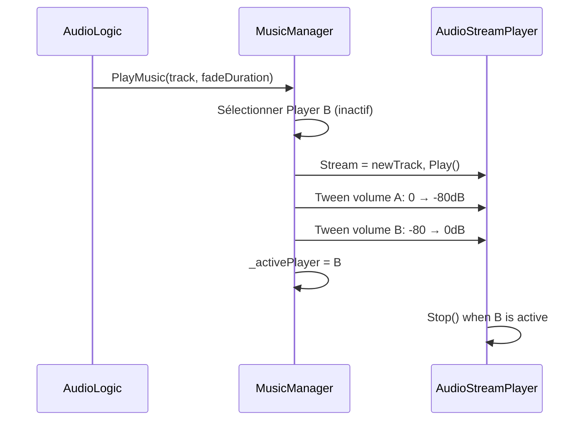
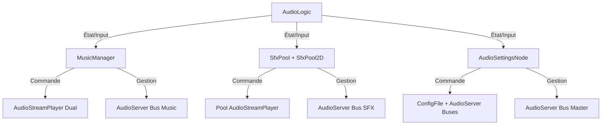
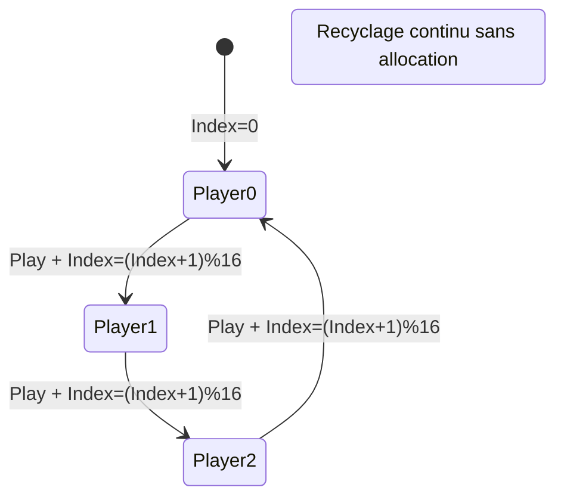

# Système Audio - Intégration Complète avec ChickenSoft/LogicBlocks
*Guide ultime pour un système audio performant, modulaire et découplé dans Godot 4.x avec gestion de la musique, SFX, et paramètres.*

---

## **Contexte**
- **Objectif** : Créer un système audio **complet et performant** utilisant `AudioStreamPlayer`, pooling SFX, gestion interactive de musique et paramètres persévérés, **100% compatible** avec ChickenSoft/LogicBlocks.
- **Public cible** : Développeurs C#/Godot utilisant ChickenSoft pour des jeux avec une gestion audio avancée (musique adaptative, SFX spatialisé, paramètres de volume).
- **Prérequis** :
  - Godot 4.2+
  - C# 11+
  - Packages : `ChickenSoft.LogicBlocks`, `ChickenSoft.AutoInject`
  - Buses audio configurés : `Master`, `Music`, `SFX`

---

## **Règles d'Architecture Impératives**

### **1. Découplage Strict**

#### **LogicBlock : Gestion Pure des États Audio**
- **Interdictions** : Aucune référence à Godot (`Node`, `AudioStreamPlayer`, etc.).
- **Obligations** : 
  - États (`IState`) en `record` immuables pour chaque système (Musique, SFX, Paramètres).
  - Inputs (`IInput`) en `record` immuables pour tous les événements audio.
  - **Exemple** : `PlayMusicInput`, `MusicPlayingState`, `VolumeChangedInput`.

#### **Bindings : Ponts Godot**
- **Responsabilités** :
  - Injection des dépendances via `IAutoNode`.
  - Gestion du cycle de vie (`_Ready`, `_ExitTree`, `_Process`).
  - Synchronisation Godot ↔ LogicBlock via handlers.
  - Nettoyage des ressources (`Dispose()`).

#### **Autoloads : Singletons Pratiques**
- Utilisés **uniquement** pour l'accès global (SFXPool, MusicManager).
- **Séparation** : Métier (LogicBlock) vs. infrastructure (Autoload).

### **2. Immutabilité**
- **États** : Utiliser des `record` (ex: `MusicState`, `SFXPoolState`).
- **Inputs** : Utiliser des `record` (ex: `PlaySfxInput`, `SetVolumeInput`).
- **Transitions** : Via `On<TInput>` avec nouvelles instances d'état.

### **3. Performances & Pooling**
- **SFX Pooling** : Recycler `AudioStreamPlayer` en liste circulaire (16–32 joueurs).
- **2D SFX Spatialisé** : Pool séparé d'`AudioStreamPlayer2D` pour sons positionnels.
- **Buses Audio** : Utiliser `AudioServer` pour muting, volume en dB, real-time mixing.
- **Musique Crossfade** : Transition lisse avec dual-player (alterné A ↔ B).

### **4. Persévérance des Paramètres**
- Stocker volumes dans **ConfigFile** ou système de sauvegarde personnalisé.
- Charger au démarrage et appliquer aux buses.

---

## **Exemples Minimaux**

### **1. LogicBlocks : Gestion des États Audio**

#### **Fichiers**
- `AudioLogic.State.cs` : États immuables (Music, SFX, Volume).
- `AudioLogic.Input.cs` : Inputs immuables (play, stop, changeVolume).
- `AudioLogic.cs` : Bloc logique complet.

#### **Code**

```csharp
// AudioLogic.State.cs
namespace MyGame.Logic.Audio;

public partial class AudioLogic
{
    public interface IState : ChickenSoft.LogicBlocks.StateLogic { }

    // États de Musique
    public record MusicStopped : IState;
    public record MusicPlaying(string TrackId, float Position) : IState;
    public record MusicCrossfading(string FromTrack, string ToTrack, float Progress) : IState;

    // États de Paramètres
    public record VolumeState(float MasterVolume, float MusicVolume, float SfxVolume) : IState;

    // État Combiné Principal
    public record AudioState(
        IState MusicState,
        VolumeState VolumeState
    ) : IState;
}
```

```csharp
// AudioLogic.Input.cs
namespace MyGame.Logic.Audio;

public partial class AudioLogic
{
    public interface IInput : ChickenSoft.LogicBlocks.InputLogic { }

    // Inputs Musique
    public record PlayMusicInput(string TrackId, float CrossfadeDuration) : IInput;
    public record StopMusicInput(float FadeDuration) : IInput;
    public record UpdateMusicPositionInput(float NewPosition) : IInput;

    // Inputs Volume
    public record SetMasterVolumeInput(float LinearValue) : IInput;
    public record SetMusicVolumeInput(float LinearValue) : IInput;
    public record SetSfxVolumeInput(float LinearValue) : IInput;

    // Inputs Système
    public record SaveAudioSettingsInput : IInput;
    public record LoadAudioSettingsInput : IInput;
    
    // Tick pour animations (crossfade, fade)
    public record AudioTickInput(float DeltaTime) : IInput;
}
```

```csharp
// AudioLogic.cs
using ChickenSoft.LogicBlocks;
namespace MyGame.Logic.Audio;

public partial class AudioLogic : LogicBlock<AudioLogic.IState, AudioLogic.IInput>
{
    protected override IState InitialState => new AudioState(
        new MusicStopped(),
        new VolumeState(1.0f, 1.0f, 1.0f)
    );

    public AudioLogic()
    {
        // Transition: Play Music
        On<PlayMusicInput, AudioState>((input, state) =>
        {
            var newMusicState = new MusicPlaying(input.TrackId, 0f);
            return state with { MusicState = newMusicState };
        });

        // Transition: Stop Music
        On<StopMusicInput, AudioState>((input, state) =>
        {
            var newMusicState = new MusicStopped();
            return state with { MusicState = newMusicState };
        });

        // Transition: Set Master Volume
        On<SetMasterVolumeInput, AudioState>((input, state) =>
        {
            var newVolume = state.VolumeState with { MasterVolume = input.LinearValue };
            return state with { VolumeState = newVolume };
        });

        // Transition: Set Music Volume
        On<SetMusicVolumeInput, AudioState>((input, state) =>
        {
            var newVolume = state.VolumeState with { MusicVolume = input.LinearValue };
            return state with { VolumeState = newVolume };
        });

        // Transition: Set SFX Volume
        On<SetSfxVolumeInput, AudioState>((input, state) =>
        {
            var newVolume = state.VolumeState with { SfxVolume = input.LinearValue };
            return state with { VolumeState = newVolume };
        });
    }
}
```

---

### **2. Music Manager - Autoload & Binding**

#### **Fichiers**
- `MusicManager.cs` : Autoload singleton pour gestion de musique (dual-player crossfade).
- `AudioSettingsNode.cs` : Binding pour les paramètres.

#### **Code**

```csharp
// MusicManager.cs - Autoload (registeré dans autoload.tres)
using Godot;

namespace MyGame.Autoloads;

public partial class MusicManager : Node
{
    [Export] public float CrossfadeDuration { get; set; } = 1.5f;

    private AudioStreamPlayer _playerA;
    private AudioStreamPlayer _playerB;
    private AudioStreamPlayer _activePlayer;

    public override void _Ready()
    {
        // Créer deux joueurs pour crossfade
        _playerA = new AudioStreamPlayer { Bus = "Music", Name = "PlayerA" };
        AddChild(_playerA);

        _playerB = new AudioStreamPlayer { Bus = "Music", Name = "PlayerB" };
        AddChild(_playerB);

        _activePlayer = _playerA;
    }

    /// <summary>
    /// Jouer une musique avec crossfade vers la précédente (s'il y a).
    /// </summary>
    public void PlayMusic(AudioStream stream, float fromPosition = 0.0f)
    {
        if (_activePlayer.Stream == stream && _activePlayer.Playing)
            return;

        var nextPlayer = _activePlayer == _playerA ? _playerB : _playerA;

        nextPlayer.Stream = stream;
        nextPlayer.VolumeDb = -80.0f;
        nextPlayer.Play(fromPosition);

        // Crossfade parallèle
        var tween = CreateTween().SetParallel(true);
        tween.TweenProperty(_activePlayer, "volume_db", -80.0f, CrossfadeDuration);
        tween.TweenProperty(nextPlayer, "volume_db", 0.0f, CrossfadeDuration);
        tween.Chain().TweenCallback(Callable.From(_activePlayer.Stop));

        _activePlayer = nextPlayer;
    }

    /// <summary>
    /// Arrêter la musique avec fade-out progressif.
    /// </summary>
    public void StopMusic(float fadeDuration = 1.0f)
    {
        var tween = CreateTween();
        tween.TweenProperty(_activePlayer, "volume_db", -80.0f, fadeDuration);
        tween.TweenCallback(Callable.From(_activePlayer.Stop));
    }

    /// <summary>
    /// Définir volume du bus Musique en valeur linéaire (0.0–1.0).
    /// </summary>
    public void SetMusicVolume(float linear)
    {
        int index = AudioServer.GetBusIndex("Music");
        AudioServer.SetBusVolumeDb(index, Mathf.LinearToDb(Mathf.Max(linear, 0.001f)));
    }

    /// <summary>
    /// Récupérer position de lecture actuelle.
    /// </summary>
    public float GetPlaybackPosition() => _activePlayer.GetPlaybackPosition();

    /// <summary>
    /// Vérifier si musique est en cours de lecture.
    /// </summary>
    public bool IsPlaying => _activePlayer.Playing;
}
```

```csharp
// AudioSettingsNode.cs - Binding pour interface paramètres
using Godot;
using ChickenSoft.AutoInject;

namespace MyGame.Nodes;

public partial class AudioSettingsNode : Control, IAutoNode
{
    [Export] public string ConfigPath { get; set; } = "user://audio_settings.ini";

    private HSlider _masterSlider;
    private HSlider _musicSlider;
    private HSlider _sfxSlider;

    public override void _Ready()
    {
        _masterSlider = GetNode<HSlider>("%MasterSlider");
        _musicSlider = GetNode<HSlider>("%MusicSlider");
        _sfxSlider = GetNode<HSlider>("%SFXSlider");

        // Charger paramètres sauvegardés
        LoadAudioSettings();

        // Connecter signaux
        _masterSlider.ValueChanged += v => SetBusVolume("Master", (float)v);
        _musicSlider.ValueChanged += v => SetBusVolume("Music", (float)v);
        _sfxSlider.ValueChanged += v => SetBusVolume("SFX", (float)v);
    }

    private void SetBusVolume(string busName, float linear)
    {
        int index = AudioServer.GetBusIndex(busName);
        if (linear <= 0.01f)
            AudioServer.SetBusMute(index, true);
        else
        {
            AudioServer.SetBusMute(index, false);
            AudioServer.SetBusVolumeDb(index, Mathf.LinearToDb(linear));
        }

        SaveAudioSettings();
    }

    private void LoadAudioSettings()
    {
        var config = new ConfigFile();
        if (config.Load(ConfigPath) == Error.Ok)
        {
            _masterSlider.Value = config.GetValue("audio", "master_volume", 1.0f);
            _musicSlider.Value = config.GetValue("audio", "music_volume", 1.0f);
            _sfxSlider.Value = config.GetValue("audio", "sfx_volume", 1.0f);

            // Appliquer
            SetBusVolume("Master", (float)_masterSlider.Value);
            SetBusVolume("Music", (float)_musicSlider.Value);
            SetBusVolume("SFX", (float)_sfxSlider.Value);
        }
    }

    private void SaveAudioSettings()
    {
        var config = new ConfigFile();
        config.SetValue("audio", "master_volume", _masterSlider.Value);
        config.SetValue("audio", "music_volume", _musicSlider.Value);
        config.SetValue("audio", "sfx_volume", _sfxSlider.Value);
        config.Save(ConfigPath);
    }
}
```

---

### **3. SFX Pool & Pool 2D**

#### **Fichiers**
- `SfxPool.cs` : Autoload pour SFX non-spatialisé.
- `SfxPool2D.cs` : Autoload pour SFX 2D spatialisé.

#### **Code**

```csharp
// SfxPool.cs - Autoload (registré dans autoload.tres)
using Godot;

namespace MyGame.Autoloads;

public partial class SfxPool : Node
{
    [Export] public int PoolSize { get; set; } = 16;

    private AudioStreamPlayer[] _players;
    private int _index;

    public override void _Ready()
    {
        _players = new AudioStreamPlayer[PoolSize];
        for (int i = 0; i < PoolSize; i++)
        {
            var player = new AudioStreamPlayer { Bus = "SFX" };
            AddChild(player);
            _players[i] = player;
        }
    }

    /// <summary>
    /// Jouer un SFX avec volume et pitch spécifiés (round-robin pool).
    /// </summary>
    public void Play(AudioStream stream, float volumeDb = 0.0f, float pitchScale = 1.0f)
    {
        var player = _players[_index];
        _index = (_index + 1) % PoolSize;

        player.Stream = stream;
        player.VolumeDb = volumeDb;
        player.PitchScale = pitchScale;
        player.Play();
    }

    /// <summary>
    /// Jouer un SFX avec pitch aléatoire pour variation.
    /// </summary>
    public void PlayRandomPitch(AudioStream stream, float minPitch = 0.9f, float maxPitch = 1.1f)
    {
        Play(stream, 0.0f, (float)GD.Randf() * (maxPitch - minPitch) + minPitch);
    }

    /// <summary>
    /// Jouer un SFX avec tween de volume (ex: fade-in).
    /// </summary>
    public void PlayWithFade(AudioStream stream, float fromVolumeDb, float toVolumeDb, float duration)
    {
        var player = _players[_index];
        _index = (_index + 1) % PoolSize;

        player.Stream = stream;
        player.VolumeDb = fromVolumeDb;
        player.Play();

        var tween = CreateTween();
        tween.TweenProperty(player, "volume_db", toVolumeDb, duration);
    }
}
```

```csharp
// SfxPool2D.cs - Autoload pour SFX spatialisé (2D)
using Godot;

namespace MyGame.Autoloads;

public partial class SfxPool2D : Node
{
    [Export] public int PoolSize { get; set; } = 16;

    private AudioStreamPlayer2D[] _players;
    private int _index;

    public override void _Ready()
    {
        _players = new AudioStreamPlayer2D[PoolSize];
        for (int i = 0; i < PoolSize; i++)
        {
            var player = new AudioStreamPlayer2D { Bus = "SFX" };
            AddChild(player);
            _players[i] = player;
        }
    }

    /// <summary>
    /// Jouer un SFX 2D à position mondiale donnée.
    /// </summary>
    public void PlayAt(AudioStream stream, Vector2 globalPos, float volumeDb = 0.0f, float pitchScale = 1.0f)
    {
        var player = _players[_index];
        _index = (_index + 1) % PoolSize;

        player.GlobalPosition = globalPos;
        player.Stream = stream;
        player.VolumeDb = volumeDb;
        player.PitchScale = pitchScale;
        player.Play();
    }

    /// <summary>
    /// Jouer un SFX 2D avec pitch aléatoire.
    /// </summary>
    public void PlayAtRandomPitch(AudioStream stream, Vector2 globalPos, float minPitch = 0.9f, float maxPitch = 1.1f)
    {
        PlayAt(stream, globalPos, 0.0f, (float)GD.Randf() * (maxPitch - minPitch) + minPitch);
    }
}
```

---

### **4. Scènes .tscn**

#### **Fichier**
- `AudioManager.tscn` : Scène contenant tous les autoloads audio.

#### **Structure**
```ini
[gd_scene load_steps=3 format=3]
[ext_resource type="Script" path="res://Source/Autoloads/MusicManager.cs" id="1"]
[ext_resource type="Script" path="res://Source/Autoloads/SfxPool.cs" id="2"]
[ext_resource type="Script" path="res://Source/Autoloads/SfxPool2D.cs" id="3"]

[node name="AudioManager" type="Node"]

[node name="MusicManager" type="Node" parent="."]
script = ExtResource("1")
crossfade_duration = 1.5

[node name="SfxPool" type="Node" parent="."]
script = ExtResource("2")
pool_size = 16

[node name="SfxPool2D" type="Node" parent="."]
script = ExtResource("3")
pool_size = 16
```

#### **Enregistrement dans project.settings**
```ini
[autoload]
MusicManager="*res://AudioManager/MusicManager.tscn"
SFXPool="*res://AudioManager/SfxPool.tscn"
SFXPool2D="*res://AudioManager/SfxPool2D.tscn"
```

---

### **5. Intégration Audio Interactive (Godot 4.3+)**

Pour musique adaptative (exploration → combat) :

```csharp
// AdaptiveMusicManager.cs
using Godot;

namespace MyGame.Autoloads;

public partial class AdaptiveMusicManager : Node
{
    private AudioStreamPlayer _musicPlayer;
    private AudioStreamInteractive _currentStream;

    public override void _Ready()
    {
        _musicPlayer = new AudioStreamPlayer { Bus = "Music" };
        AddChild(_musicPlayer);
    }

    /// <summary>
    /// Charger musique interactive et commuter vers clip.
    /// </summary>
    public void PlayInteractiveMusic(AudioStreamInteractive stream, int initialClip = 0)
    {
        _currentStream = stream;
        _musicPlayer.Stream = stream;
        _musicPlayer.Play();

        var playback = _musicPlayer.GetStreamPlayback() as AudioStreamPlaybackInteractive;
        playback?.SwitchToClip(initialClip);
    }

    /// <summary>
    /// Commuter à un clip spécifique (ex: exploration → combat).
    /// </summary>
    public void SwitchClip(int clipIndex)
    {
        var playback = _musicPlayer.GetStreamPlayback() as AudioStreamPlaybackInteractive;
        playback?.SwitchToClip(clipIndex);
    }

    /// <summary>
    /// Utiliser AudioStreamSynchronized pour musique en couches.
    /// </summary>
    public void SetLayerVolume(int layerIndex, float volumeDb)
    {
        var playback = _musicPlayer.GetStreamPlayback() as AudioStreamPlaybackSynchronized;
        playback?.SetStreamVolume(layerIndex, volumeDb);
    }
}
```

---

## **Bonnes Pratiques**

### **1. Architecture Système Audio**
- **Séparation des Concerns** :
  - `LogicBlock` : États métier purs.
  - `MusicManager` : Gestion dual-player + crossfade.
  - `SfxPool` : Recyclage performant.
  - `AudioSettingsNode` : Interface utilisateur + persistance.

- **Buses Audio Structurés** :
  ```
  Master
    ├─ Music
    └─ SFX
  ```

### **2. Optimisations Critiques**
- **Pool de SFX** : Toujours recycler `AudioStreamPlayer` plutôt que créer/détruire.
- **Crossfade** : Utiliser dual-player + tween pour transition lisse sans artefact.
- **Muting vs. Volume** : Pour silence complet, utiliser `AudioServer.SetBusMute()` plutôt que `-80dB`.
- **Persévérance** : Charger paramètres audio au démarrage du jeu.

### **3. Patterns ChickenSoft**
- **LogicBlock Immuable** : Tous les états sont `record`.
- **Bindings Explicites** : Via `IAutoNode` et handlers.
- **Dispose Systématique** : Toujours nettoyer dans `_ExitTree`.

### **4. Cas d'Usage Courants**

| Cas | Solution |
|-----|----------|
| Musique boucle infiniment | `AudioStreamPlayer.Stream = clip; Player.Play();` + `Loop = true` sur stream |
| Intro → Boucle → Outro | `AudioStreamPlaylist` avec 3 clips et `Loop = true` |
| Musique adaptative (combat) | `AudioStreamInteractive` + `SwitchToClip()` |
| Couches de musique (ambiance + intensité) | `AudioStreamSynchronized` + `SetStreamVolume()` |
| SFX haute polyphonie (projectiles, pas) | `SfxPool` (16–32 joueurs) |
| SFX spatialisé (explosions lointaines) | `SfxPool2D` avec distance atténuation |
| Variation de son (footsteps) | `PlayRandomPitch()` avec min/max |
| Fade in/out progressif | `PlayWithFade()` ou tween sur volume_db |

---

## **Erreurs Courantes à Éviter**

| ❌ Anti-Pattern | ✅ Correction | Explication |
|---|---|---|
| Créer `AudioStreamPlayer` à chaque SFX. | Utiliser `SfxPool` avec recyclage round-robin. | Évite allocations/GC répétées. |
| Changer directement `stream` et `play()` sans fade. | Utiliser `MusicManager.PlayMusic()` avec crossfade. | Évite coupures audio désagréables. |
| Stocker volumes en dB sans normalisation. | Convertir dB ↔ linéaire via `LinearToDb()` / `DbToLinear()`. | dB est logarithmique, l'interface utilisateur attend linéaire. |
| Oublier persistance des paramètres. | Implémenter `LoadAudioSettings()` / `SaveAudioSettings()`. | Améliore UX (mémoriser choix utilisateur). |
| Utiliser un seul `AudioStreamPlayer` pour tout. | Utiliser architecture multi-bus (Master, Music, SFX). | Permet contrôle indépendant + muting. |
| Ne pas nettoyer tweens audio. | Stocker `Tween` et `Kill()` explicitement. | Évite tweens qui se chevauchent. |
| Oublier `_ExitTree()` pour binding. | Toujours appeler `_binding.Dispose()`. | Évite fuites mémoire + dangling references. |

---

## **Diagrammes**

### **1. Flux Musique Crossfade**


### **2. Architecture Système Audio Global**


### **3. État SFX Pool Round-Robin**


### **4. Flux Paramètres Persistants**
```mermaid
sequenceDiagram
    participant Game as MainScene
    participant Audio as AudioSettingsNode
    participant Disk as ConfigFile

    Game->>Audio: _Ready()
    Audio->>Disk: Load user://audio_settings.ini
    Disk-->>Audio: MasterVolume, MusicVolume, SfxVolume
    Audio->>AudioServer: SetBusVolumeDb() pour chaque bus
    Note: À chaque changement de slider
    Audio->>Audio: SetBusVolume()
    Audio->>Disk: Save config
```

---

## **Recettes Pratiques Complètes**

### **1. Menu Paramètres Audio Complet**

```csharp
// SettingsMenuNode.cs
using Godot;
using ChickenSoft.AutoInject;

namespace MyGame.UI;

public partial class SettingsMenuNode : PanelContainer, IAutoNode
{
    [Export] public string ConfigPath { get; set; } = "user://game_settings.ini";

    private HSlider _masterSlider;
    private HSlider _musicSlider;
    private HSlider _sfxSlider;
    private Button _resetButton;

    public override void _Ready()
    {
        _masterSlider = GetNode<HSlider>("%MasterSlider");
        _musicSlider = GetNode<HSlider>("%MusicSlider");
        _sfxSlider = GetNode<HSlider>("%SFXSlider");
        _resetButton = GetNode<Button>("%ResetButton");

        LoadSettings();

        _masterSlider.ValueChanged += _ => SaveSettings();
        _musicSlider.ValueChanged += _ => SaveSettings();
        _sfxSlider.ValueChanged += _ => SaveSettings();
        _resetButton.Pressed += ResetToDefaults;
    }

    private void SaveSettings()
    {
        // Appliquer aux buses
        ApplyVolume("Master", (float)_masterSlider.Value);
        ApplyVolume("Music", (float)_musicSlider.Value);
        ApplyVolume("SFX", (float)_sfxSlider.Value);

        // Persévérer
        var config = new ConfigFile();
        config.SetValue("audio", "master", _masterSlider.Value);
        config.SetValue("audio", "music", _musicSlider.Value);
        config.SetValue("audio", "sfx", _sfxSlider.Value);
        config.Save(ConfigPath);
    }

    private void LoadSettings()
    {
        var config = new ConfigFile();
        if (config.Load(ConfigPath) == Error.Ok)
        {
            _masterSlider.Value = config.GetValue("audio", "master", 1.0f);
            _musicSlider.Value = config.GetValue("audio", "music", 1.0f);
            _sfxSlider.Value = config.GetValue("audio", "sfx", 1.0f);
        }
        SaveSettings();
    }

    private void ResetToDefaults()
    {
        _masterSlider.Value = 1.0f;
        _musicSlider.Value = 1.0f;
        _sfxSlider.Value = 1.0f;
        SaveSettings();
    }

    private void ApplyVolume(string busName, float linear)
    {
        int index = AudioServer.GetBusIndex(busName);
        if (linear <= 0.01f)
            AudioServer.SetBusMute(index, true);
        else
        {
            AudioServer.SetBusMute(index, false);
            AudioServer.SetBusVolumeDb(index, Mathf.LinearToDb(linear));
        }
    }
}
```

### **2. Système Musique Boss avec Changement d'Intensité**

```csharp
// BossMusicManager.cs
using Godot;

namespace MyGame.Combat;

public partial class BossMusicManager : Node
{
    private const string BOSS_MUSIC_PATH = "res://audio/music/boss_theme.tres";
    private AudioStreamInteractive _bossMusic;

    private const int CLIP_INTRO = 0;
    private const int CLIP_NORMAL = 1;
    private const int CLIP_INTENSE = 2;

    public override void _Ready()
    {
        _bossMusic = GD.Load<AudioStreamInteractive>(BOSS_MUSIC_PATH);
    }

    public void StartBossMusic()
    {
        GetNode<MusicManager>("/root/MusicManager").PlayMusic(_bossMusic);
    }

    public void IntensifyMusic()
    {
        GetNode<MusicManager>("/root/MusicManager").SwitchClip(CLIP_INTENSE);
    }

    public void NormalizeMusic()
    {
        GetNode<MusicManager>("/root/MusicManager").SwitchClip(CLIP_NORMAL);
    }
}
```

### **3. SFX Projectile avec Tween Distance-Atténué**

```csharp
// ProjectileNode.cs
using Godot;

namespace MyGame.Projectiles;

public partial class ProjectileNode : Area2D
{
    private const string IMPACT_SFX_PATH = "res://audio/sfx/impact.wav";

    public void OnImpact()
    {
        var impact = GD.Load<AudioStream>(IMPACT_SFX_PATH);
        
        // Distance au joueur
        var player = GetTree().FirstChildInGroup("player") as Node2D;
        if (player != null)
        {
            float distance = GlobalPosition.DistanceTo(player.GlobalPosition);
            float volumeDb = Mathf.Clamp(-20.0f + (50.0f - distance) * 0.5f, -80.0f, 0.0f);
            
            SFXPool2D.PlayAt(impact, GlobalPosition, volumeDb);
        }
        else
        {
            SFXPool2D.PlayAt(impact, GlobalPosition);
        }

        QueueFree();
    }
}
```

### **4. Forage de Son (Footsteps + Variation)**

```csharp
// PlayerFootstepsNode.cs
using Godot;

namespace MyGame.Player;

public partial class PlayerFootstepsNode : CharacterBody2D
{
    private const string FOOTSTEP_SFX = "res://audio/sfx/footstep.wav";
    private float _footstepCooldown;

    public override void _Process(double delta)
    {
        _footstepCooldown -= (float)delta;

        if (Velocity.Length() > 10.0f && _footstepCooldown <= 0)
        {
            // Variation pitch + légère variation volume
            SFXPool.PlayRandomPitch(GD.Load<AudioStream>(FOOTSTEP_SFX), 0.85f, 1.15f);
            _footstepCooldown = 0.3f;  // Cooldown entre pas
        }
    }
}
```

---

## **Intégration Godot 4.3+ : Musique Avancée**

### **AudioStreamPlaylist (intro → boucle → outro)**

```csharp
public override void _Ready()
{
    var playlist = new AudioStreamPlaylist();
    playlist.StreamCount = 3;
    playlist.SetListStream(0, GD.Load<AudioStream>("res://audio/intro.ogg"));
    playlist.SetListStream(1, GD.Load<AudioStream>("res://audio/loop.ogg"));
    playlist.SetListStream(2, GD.Load<AudioStream>("res://audio/outro.ogg"));
    playlist.Loop = true;
    
    GetNode<AudioStreamPlayer>("MusicPlayer").Stream = playlist;
    GetNode<AudioStreamPlayer>("MusicPlayer").Play();
}
```

### **AudioStreamSynchronized (couches adaptatives)**

```csharp
public override void _Ready()
{
    var sync = new AudioStreamSynchronized();
    sync.StreamCount = 3;
    sync.SetSyncStream(0, GD.Load<AudioStream>("res://audio/base.ogg"));
    sync.SetSyncStream(1, GD.Load<AudioStream>("res://audio/drums.ogg"));      // Initialement silencieux
    sync.SetSyncStream(2, GD.Load<AudioStream>("res://audio/intense.ogg"));    // Initialement silencieux
    
    sync.SetSyncStreamVolume(0, 0.0f);
    sync.SetSyncStreamVolume(1, -80.0f);
    sync.SetSyncStreamVolume(2, -80.0f);
    
    GetNode<AudioStreamPlayer>("MusicPlayer").Stream = sync;
    GetNode<AudioStreamPlayer>("MusicPlayer").Play();
}

public void OnCombatStarted()
{
    var playback = GetNode<AudioStreamPlayer>("MusicPlayer").GetStreamPlayback() as AudioStreamPlaybackSynchronized;
    var tween = CreateTween();
    tween.TweenMethod(Callable.From<float>(db => playback.SetStreamVolume(1, db)), -80.0f, 0.0f, 1.5);
}
```

---

## **Checklist Implémentation Complète**

- [ ] Configurer buses audio (Master, Music, SFX) dans AudioServer Godot.
- [ ] Créer `AudioLogic` avec states et inputs.
- [ ] Implémenter `MusicManager` autoload avec crossfade dual-player.
- [ ] Implémenter `SfxPool` et `SfxPool2D` autoloads.
- [ ] Créer `AudioSettingsNode` avec UI sliders.
- [ ] Enregistrer autoloads dans `project.settings`.
- [ ] Tester persistance paramètres (ConfigFile).
- [ ] Tester crossfade musique (sans artefact).
- [ ] Tester SFX pooling (16+ sons simultanés).
- [ ] Intégrer `AdaptiveMusicManager` pour musique interactive (4.3+).
- [ ] Documenter configuration des buses dans le projet.
- [ ] Intégrer muting global (pause menu).

---

## **Ressources Godot Officielles**
- [AudioServer API](https://docs.godotengine.org/en/stable/classes/class_audioserver.html)
- [AudioStreamPlayer](https://docs.godotengine.org/en/stable/classes/class_audiostreamplayer.html)
- [AudioStreamInteractive (4.3+)](https://docs.godotengine.org/en/stable/classes/class_audiostreaminteractive.html)
- [Audio Buses](https://docs.godotengine.org/en/stable/tutorials/audio/using_audio_buses.html)

---
