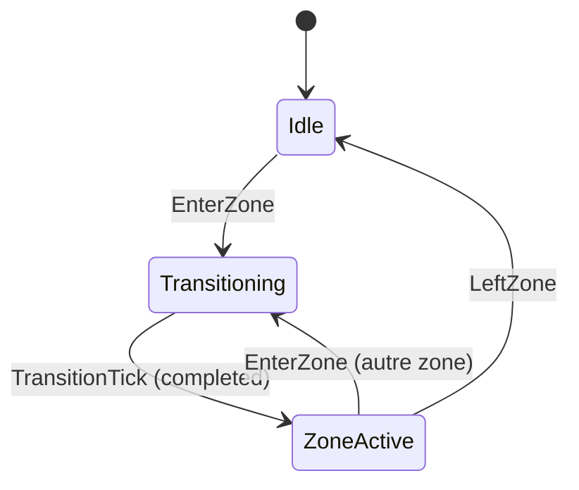
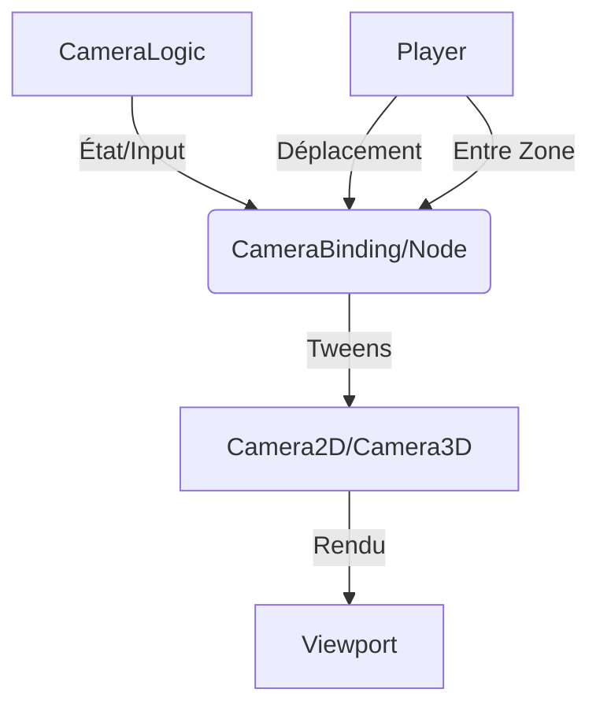
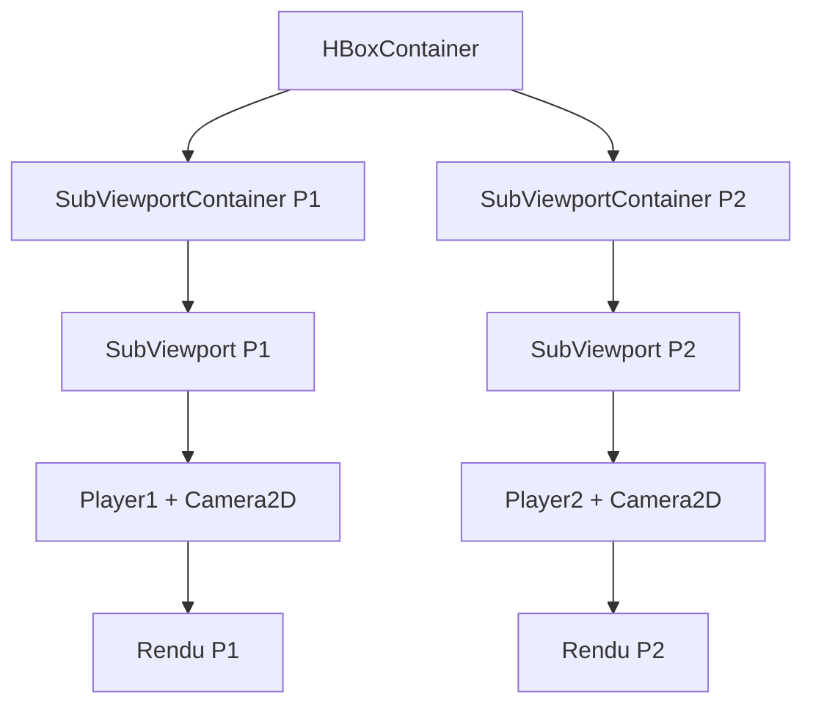
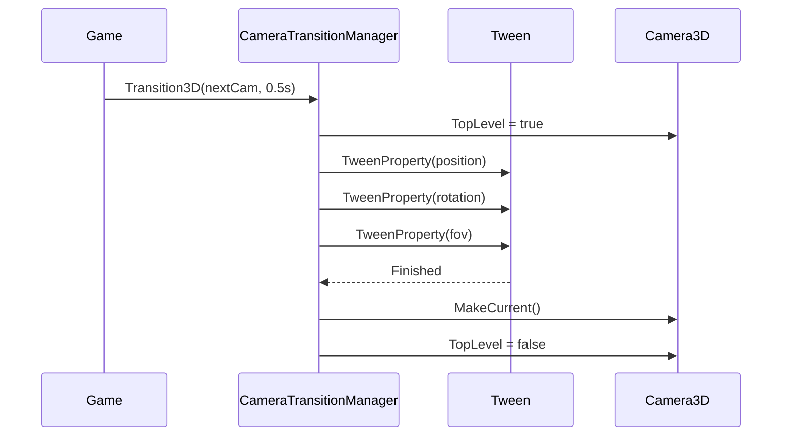

# Système de Caméra Complète - Architecture avec ChickenSoft/LogicBlocks
*Guide ultime pour intégrer un système de caméra 2D/3D performant, modulaire et découplé dans Godot 4.x.*

---

## **Contexte**
- **Objectif** : Créer un système de caméra **performant**, **modulaire** et **100% compatible** avec ChickenSoft/LogicBlocks, couvrant caméra 2D (zones/salles), caméra 3D (suivi, orbite, première personne), transitions fluides, et écran partagé.
- **Public cible** : Développeurs C#/Godot utilisant ChickenSoft pour des jeux 2D/3D avec des besoins de caméra avancée (Metroidvania, RPG 3D, jeux coopératifs locaux).
- **Prérequis** :
  - Godot 4.2+
  - C# 11+
  - Packages : `ChickenSoft.LogicBlocks`, `ChickenSoft.AutoInject`
  - Familiarité avec les patterns ChickenSoft

---

## **Règles d'Architecture Impératives**

### **1. Découplage Strict**
- **LogicBlock** : Gère la **logique pure** de la caméra (états, transitions, limites).
  - **Interdictions** : Aucune référence à Godot (`Camera2D`, `Camera3D`, `Vector2`, etc.).
  - **Obligations** : États (`IState`) immuables en `record`.
- **Binding** : Pont entre Godot et les LogicBlocks.
  - **Responsabilités** :
    - Injection des dépendances via `IAutoNode`.
    - Application des transformations à la caméra Godot.
    - Gestion des Tweens pour les transitions fluides.
    - Nettoyage des ressources (`Dispose()`).
- **Scènes .tscn** : Uniquement responsable de la **hiérarchie des nœuds** et de l'**export des caméras**.

### **2. Immutabilité et Réactivité**
- **États** : Toujours utiliser des `record` pour les états caméra (ex: `CameraState`).
- **Transitions** : Utiliser `On<TInput>((input, state) => ...)` pour les transitions.
- **Pas d'effets secondaires** dans la logique : les effets secondaires (Tweens, rendu) se produisent dans le Binding.

### **3. Performances**
- **Caméra 2D** : Utiliser `Camera2D` avec `top_level = true` pour les transitions lisses.
- **Caméra 3D** : Préférer `SpringArm3D` pour les caméras à la troisième personne (collision automatique).
- **Optimisation** : Limiter les Tweens parallèles ; utiliser `set_parallel()` judicieusement.
- **Split-screen** : Utiliser `SubViewport` avec `own_world_3d = true` (3D) pour chaque joueur.

---

## **Exemples Minimaux**

### **1. Logique 2D : Zones de Caméra (Metroidvania)**

#### **Fichiers**
- `CameraLogic.State.cs` : États immuables.
- `CameraLogic.Input.cs` : Inputs immuables.
- `CameraLogic.cs` : Bloc logique.

#### **Code**

```csharp
// CameraLogic.State.cs
namespace MyGame.Logic.Camera;

public partial class CameraLogic
{
    public interface IState : ChickenSoft.LogicBlocks.StateLogic { }
    
    public record Idle(Vector2 Position, float Zoom) : IState;
    public record Transitioning(
        Vector2 SourcePosition,
        Vector2 TargetPosition,
        float SourceZoom,
        float TargetZoom,
        float ElapsedTime,
        float TotalDuration
    ) : IState;
    
    public record ZoneActive(
        int LimitLeft,
        int LimitRight,
        int LimitTop,
        int LimitBottom,
        Vector2 CurrentPosition,
        float CurrentZoom
    ) : IState;
}
```

```csharp
// CameraLogic.Input.cs
namespace MyGame.Logic.Camera;

public partial class CameraLogic
{
    public interface IInput : ChickenSoft.LogicBlocks.InputLogic { }
    
    public record EnterZone(
        int LimitLeft,
        int LimitRight,
        int LimitTop,
        int LimitBottom
    ) : IInput;
    
    public record UpdatePosition(Vector2 Position) : IInput;
    
    public record TransitionTick(float DeltaTime) : IInput;
}
```

```csharp
// CameraLogic.cs
using ChickenSoft.LogicBlocks;

namespace MyGame.Logic.Camera;

public partial class CameraLogic : LogicBlock<CameraLogic.IState, CameraLogic.IInput>
{
    protected override IState InitialState => new Idle(Vector2.Zero, 1.0f);

    public CameraLogic()
    {
        // Entrée dans une zone
        On<EnterZone>((input, state) =>
            state switch
            {
                Idle idle => new Transitioning(
                    idle.Position,
                    new Vector2(input.LimitLeft + (input.LimitRight - input.LimitLeft) / 2f, 
                                idle.Position.Y),
                    idle.Zoom,
                    idle.Zoom,
                    0f,
                    0.4f
                ),
                _ => state
            });

        // Mise à jour de la position (suivi du joueur)
        On<UpdatePosition, ZoneActive>((input, state) =>
            state with { CurrentPosition = input.Position });

        // Tick de transition
        On<TransitionTick, Transitioning>((input, state) =>
        {
            var newElapsed = state.ElapsedTime + input.DeltaTime;
            if (newElapsed >= state.TotalDuration)
            {
                return new ZoneActive(
                    state.TargetPosition.X < 0 ? 0 : (int)state.TargetPosition.X,
                    state.TargetPosition.X > 0 ? (int)state.TargetPosition.X + 320 : 320,
                    state.TargetPosition.Y < 0 ? 0 : (int)state.TargetPosition.Y,
                    state.TargetPosition.Y > 0 ? (int)state.TargetPosition.Y + 180 : 180,
                    state.TargetPosition,
                    state.TargetZoom
                );
            }
            return state with { ElapsedTime = newElapsed };
        });
    }
}
```

---

### **2. Binding 2D : Intégration avec Camera2D**

```csharp
// CameraZone.cs - Attach à un Area2D, une zone par chambre
using Godot;
using ChickenSoft.AutoInject;
using ChickenSoft.LogicBlocks;
using MyGame.Logic.Camera;

namespace MyGame.Nodes;

public partial class CameraZone : Area2D, IAutoNode
{
    [Export] public int LimitLeft { get; set; } = 0;
    [Export] public int LimitRight { get; set; } = 320;
    [Export] public int LimitTop { get; set; } = 0;
    [Export] public int LimitBottom { get; set; } = 180;
    [Export] public float TransitionTime { get; set; } = 0.4f;

    private readonly CameraLogic.Block _logic = new();
    private CameraLogic.Block.Binding _binding;
    private Tween _activeTween;
    private Camera2D _currentCamera;

    public override void _Ready()
    {
        BodyEntered += OnBodyEntered;
        _binding = _logic.Bind();
        
        _binding.Handle<CameraLogic.Transitioning>(state =>
        {
            _activeTween?.Kill();
            _currentCamera ??= GetViewport().GetCamera2D();
            if (_currentCamera == null) return;

            _currentCamera.TopLevel = true;
            _activeTween = CreateTween();
            _activeTween.SetParallel(true);
            _activeTween.SetEase(Tween.EaseType.InOut);
            _activeTween.SetTrans(Tween.TransitionType.Sine);
            
            _activeTween.TweenProperty(_currentCamera, "limit_left", LimitLeft, TransitionTime);
            _activeTween.TweenProperty(_currentCamera, "limit_right", LimitRight, TransitionTime);
            _activeTween.TweenProperty(_currentCamera, "limit_top", LimitTop, TransitionTime);
            _activeTween.TweenProperty(_currentCamera, "limit_bottom", LimitBottom, TransitionTime);
        });

        _logic.Start();
    }

    public override void _ExitTree()
    {
        _activeTween?.Kill();
        _logic.Stop();
        _binding.Dispose();
    }

    private void OnBodyEntered(Node2D body)
    {
        if (!body.IsInGroup("player")) return;
        _logic.Input(new CameraLogic.EnterZone(LimitLeft, LimitRight, LimitTop, LimitBottom));
    }
}
```

---

### **3. Logique 3D : Caméra Tiers Personne avec SpringArm3D**

```csharp
// Camera3DLogic.cs
using ChickenSoft.LogicBlocks;

namespace MyGame.Logic.Camera;

public partial class Camera3DLogic : LogicBlock<Camera3DLogic.IState, Camera3DLogic.IInput>
{
    public interface IState : StateLogic { }
    public record Following(float Yaw, float Pitch) : IState;

    public interface IInput : InputLogic { }
    public record RotateInput(float DeltaYaw, float DeltaPitch) : IInput;

    protected override IState InitialState => new Following(0f, 0.3f);

    public Camera3DLogic()
    {
        On<RotateInput, Following>((input, state) =>
            state with
            {
                Yaw = state.Yaw - input.DeltaYaw,
                Pitch = float.Clamp(state.Pitch - input.DeltaPitch, -0.6f, 1.0f)
            });
    }
}
```

```csharp
// ThirdPersonCamera.cs - Attach à SpringArm3D
using Godot;
using ChickenSoft.AutoInject;
using MyGame.Logic.Camera;

namespace MyGame.Nodes;

public partial class ThirdPersonCamera : SpringArm3D, IAutoNode
{
    [Export] public Node3D Target { get; set; }
    [Export] public float FollowSpeed = 10.0f;
    [Export] public float MouseSensitivity = 0.003f;

    private readonly Camera3DLogic.Block _logic = new();
    private Camera3DLogic.Block.Binding _binding;

    public override void _Ready()
    {
        Input.MouseMode = Input.MouseModeEnum.Captured;
        TopLevel = true;

        _binding = _logic.Bind();
        
        _binding.Handle<Camera3DLogic.Following>(state =>
        {
            GlobalPosition = GlobalPosition.Lerp(Target.GlobalPosition, FollowSpeed * (float)GetPhysicsProcess.Delta);
            Rotation = new Vector3(state.Pitch, state.Yaw, 0.0f);
        });

        _logic.Start();
    }

    public override void _UnhandledInput(InputEvent @event)
    {
        if (@event is InputEventMouseMotion motion && Input.MouseMode == Input.MouseModeEnum.Captured)
        {
            _logic.Input(new Camera3DLogic.RotateInput(
                motion.Relative.X * MouseSensitivity,
                motion.Relative.Y * MouseSensitivity
            ));
        }
    }

    public override void _ExitTree()
    {
        _logic.Stop();
        _binding.Dispose();
    }
}
```

---

### **4. Caméra Orbite (Souris)**

```csharp
// OrbitCamera.cs - Attach à Camera3D
using Godot;

namespace MyGame.Nodes;

public partial class OrbitCamera : Camera3D
{
    [Export] public Node3D Target;
    [Export] public float OrbitDistance = 5.0f;
    [Export] public float OrbitSpeed = 0.005f;
    [Export] public float ZoomSpeed = 0.5f;
    [Export] public float MinDistance = 1.0f;
    [Export] public float MaxDistance = 20.0f;

    private float _yaw;
    private float _pitch = 0.3f;

    public override void _UnhandledInput(InputEvent @event)
    {
        if (@event is InputEventMouseMotion motion && Input.IsMouseButtonPressed(MouseButton.Right))
        {
            _yaw -= motion.Relative.X * OrbitSpeed;
            _pitch = Mathf.Clamp(_pitch - motion.Relative.Y * OrbitSpeed, -1.4f, 1.4f);
        }

        if (@event is InputEventMouseButton btn)
        {
            if (btn.ButtonIndex == MouseButton.WheelUp)
                OrbitDistance = Mathf.Max(OrbitDistance - ZoomSpeed, MinDistance);
            else if (btn.ButtonIndex == MouseButton.WheelDown)
                OrbitDistance = Mathf.Min(OrbitDistance + ZoomSpeed, MaxDistance);
        }
    }

    public override void _Process(double delta)
    {
        if (Target == null) return;
        
        var offset = new Vector3(
            OrbitDistance * Mathf.Cos(_pitch) * Mathf.Sin(_yaw),
            OrbitDistance * Mathf.Sin(_pitch),
            OrbitDistance * Mathf.Cos(_pitch) * Mathf.Cos(_yaw)
        );
        GlobalPosition = Target.GlobalPosition + offset;
        LookAt(Target.GlobalPosition);
    }
}
```

---

### **5. Transitions de Caméra Fluides**

```csharp
// CameraTransitionManager.cs - Autoload ou attach à un gestionnaire de scène
using Godot;
using System.Threading.Tasks;

namespace MyGame.Managers;

public partial class CameraTransitionManager : Node
{
    public async Task Transition2D(Camera2D nextCam, float duration = 0.5f)
    {
        var currentCam = GetViewport().GetCamera2D();
        if (currentCam == null || currentCam == nextCam) return;

        currentCam.TopLevel = true;

        var tween = CreateTween().SetParallel();
        tween.SetEase(Tween.EaseType.InOut);
        tween.SetTrans(Tween.TransitionType.Cubic);
        tween.TweenProperty(currentCam, "global_position", nextCam.GlobalPosition, duration);
        tween.TweenProperty(currentCam, "zoom", nextCam.Zoom, duration);

        await ToSignal(tween, Tween.SignalName.Finished);

        nextCam.MakeCurrent();
        currentCam.TopLevel = false;
    }

    public async Task Transition3D(Camera3D nextCam, float duration = 0.5f)
    {
        var currentCam = GetViewport().GetCamera3D();
        if (currentCam == null || currentCam == nextCam) return;

        currentCam.TopLevel = true;

        var tween = CreateTween().SetParallel();
        tween.SetEase(Tween.EaseType.InOut);
        tween.SetTrans(Tween.TransitionType.Cubic);
        tween.TweenProperty(currentCam, "global_position", nextCam.GlobalPosition, duration);
        tween.TweenProperty(currentCam, "global_rotation", nextCam.GlobalRotation, duration);
        tween.TweenProperty(currentCam, "fov", nextCam.Fov, duration);

        await ToSignal(tween, Tween.SignalName.Finished);

        nextCam.MakeCurrent();
        currentCam.TopLevel = false;
    }
}
```

---

### **6. Écran Partagé (Multijoueur Local)**

```csharp
// SplitScreenSetup.cs - Attach au nœud racine
using Godot;

namespace MyGame.Scenes;

public partial class SplitScreenSetup : Node
{
    [Export] public PackedScene PlayerScene;

    public override void _Ready()
    {
        SetupViewport(GetNode<SubViewport>("HBoxContainer/P1Container/P1Viewport"), 0);
        SetupViewport(GetNode<SubViewport>("HBoxContainer/P2Container/P2Viewport"), 1);
    }

    private void SetupViewport(SubViewport viewport, int playerIndex)
    {
        var windowSize = DisplayServer.WindowGetSize();
        viewport.Size = new Vector2I(windowSize.X / 2, windowSize.Y);
        viewport.OwnWorld3D = true; // Pour la 3D uniquement

        var player = PlayerScene.Instantiate<Node>();
        viewport.AddChild(player);

        if (player.HasMethod("SetDevice"))
            player.Call("SetDevice", playerIndex);
    }
}
```

**Structure de scène pour écran partagé :**
```
HBoxContainer (remplit l'écran)
├── SubViewportContainer (P1 - gauche)
│   └── SubViewport
│       ├── Player1 (CharacterBody2D/3D)
│       └── Camera2D/3D
└── SubViewportContainer (P2 - droite)
    └── SubViewport
        ├── Player2 (CharacterBody2D/3D)
        └── Camera2D/3D
```

---

## **Bonnes Pratiques**

### **1. Découplage et Tests**
- **Tester la LogicBlock** indépendamment de Godot : pas de dépendances Godot dans `CameraLogic.cs`.
- **Utiliser `IAutoNode`** pour l'injection automatique des dépendances.
- **Émettre des signaux** depuis le Binding pour notifier le reste du jeu des changements de caméra.

### **2. Optimisation des Zones 2D**
- **Alignement aux tuiles** : Pour les jeux pixel-art, aligner les `CollisionShape2D` aux frontières des tuiles pour éviter les chevauchements.
- **Espacement** : Un petit écart (1 pixel) entre les zones adjacentes prévient les déclenchements multiples.
- **Layers** : Configurer les couches de collision pour que seul le joueur déclenche les zones.

### **3. Caméra 3D avec SpringArm3D**
- **Collision automatique** : `SpringArm3D` réduit automatiquement sa portée si un obstacle bloque la caméra.
- **Shape casting** : Utiliser `shape_cast_mask` pour contrôler quels objets bloquent la caméra.
- **Lissage** : Combiner `follow_speed` et Tweens pour des transitions fluides.

### **4. Patterns ChickenSoft**
- **`IAutoNode`** : Pour l'injection et l'initialisation retardée.
- **Réactivité** : Utiliser `OnResolved()` pour initialiser les propriétés après résolution des dépendances.
- **Nettoyage** : Toujours appeler `Dispose()` dans `_ExitTree` pour éviter les fuites mémoire.

### **5. Performance en Écran Partagé**
- **SubViewport séparé** par joueur : Chacun a sa propre Camera et physique.
- **`own_world_3d = true`** : Mondes 3D séparés pour éviter les interférences.
- **Audio** : Activer `audio_listener_enable_2d` ou `_3d` sur un seul viewport (le primaire).

---

## **Erreurs Courantes à Éviter**

| ❌ Anti-Pattern | ✅ Correction | Explication |
|---|---|---|
| Modifier directement `Camera2D.GlobalPosition` dans `_Process()`. | Utiliser des transitions d'état via `LogicBlock` et Tweens. | Évite les mutations directes et centralise la logique. |
| Oublier `camera.TopLevel = true` avant une transition. | Toujours activer `TopLevel` avant de modifier manuellement la position. | Si `TopLevel` est faux, la caméra suit son parent. |
| Ne pas configurer `PhysicsProcess` pour `SpringArm3D`. | Utiliser `_PhysicsProcess()` pour les mises à jour de caméra. | `_Process()` n'est pas synchronisé avec la physique. |
| Utiliser le même `Camera` pour plusieurs joueurs en écran partagé. | Créer une `Camera2D`/`3D` par `SubViewport`. | Chaque viewport doit avoir sa propre caméra active. |
| Ne pas appeler `Dispose()` sur les bindings. | Toujours appeler `_binding.Dispose()` dans `_ExitTree()`. | Évite les fuites mémoire et les références fantômes. |
| Tween infini sans vérifier l'état de la caméra. | Vérifier si la caméra existe avant de créer un Tween. | Évite les erreurs si la caméra est détruite. |
| Overlays de zone sans espacement. | Laisser un petit écart entre les CollisionShapes des zones. | Prévient les faux déclenchements de transition. |

---

## **Diagrammes**

### **1. Flux des États 2D (Zones de Caméra)**


### **2. Architecture Complète**


### **3. Écran Partagé - Architecture**


### **4. Transition de Caméra**


---

## **Recettes Pratiques avec ChickenSoft**

### **1. Caméra Metroidvania (Zone à Zone)**
- **Objectif** : Transition fluide entre les salles lors de l'entrée du joueur.
- **Setup** :
  - Créer une `CameraZone` par salle avec ses limites.
  - Configurer `TransitionTime = 0.4s`.
  - Aligner les zones aux frontières des tuiles.
- **Code** :
  ```csharp
  // Dans la scène
  - Room1 (TileMapLayer)
    - CameraZone (Area2D, LimitLeft=0, LimitRight=320, etc.)
  - Room2 (TileMapLayer)
    - CameraZone (Area2D, LimitLeft=320, LimitRight=640, etc.)
  ```

### **2. Caméra RPG 3D (Suivre + Orbiter)**
- **Objectif** : Caméra à la troisième personne qui suit le joueur et peut être contrôlée à la souris.
- **Setup** :
  - Utiliser `SpringArm3D` avec `ThirdPersonCamera.cs`.
  - Ajouter une `Camera3D` comme enfant.
  - Configurer les limites de pitch/yaw.
- **Code** :
  ```csharp
  public override void _Ready()
  {
      _binding.Handle<Camera3DLogic.Following>(state =>
      {
          GlobalPosition = GlobalPosition.Lerp(
              Target.GlobalPosition, 
              FollowSpeed * (float)GetPhysicsProcess.Delta
          );
          Rotation = new Vector3(state.Pitch, state.Yaw, 0.0f);
      });
  }
  ```

### **3. Écran Partagé - Jeu Coopératif Local**
- **Objectif** : Deux joueurs sur le même écran, avec chacun leur caméra et viewport.
- **Setup** :
  - Créer une `HBoxContainer` avec deux `SubViewportContainer`.
  - Chaque viewport contient un joueur et sa caméra.
  - Configurer `own_world_3d = true` (3D uniquement).
- **Code** :
  ```csharp
  private void SetupViewport(SubViewport viewport, int playerIndex)
  {
      var windowSize = DisplayServer.WindowGetSize();
      viewport.Size = new Vector2I(windowSize.X / 2, windowSize.Y);
      var player = PlayerScene.Instantiate<Node>();
      viewport.AddChild(player);
  }
  ```

### **4. Cutscène avec Transitions Caméra**
- **Objectif** : Passer de la caméra du joueur à une caméra de cutscène avec transition fluide.
- **Setup** :
  - Créer deux caméras : l'une pour le jeu, une autre pour la cutscène.
  - Utiliser `CameraTransitionManager` pour la transition.
- **Code** :
  ```csharp
  await CameraTransitionManager.Transition3D(cutsceneCamera, 1.0f);
  // ... Jouer la cutscène
  await CameraTransitionManager.Transition3D(gameCamera, 1.0f);
  ```

### **5. Caméra Cinemématique avec Dolly**
- **Objectif** : Caméra qui se déplace le long d'une courbe (path3d) pour une scène cinématique.
- **Setup** :
  - Créer un `Path3D` avec des points de contrôle.
  - Utiliser un `PathFollow3D` pour suivre la courbe.
- **Code** :
  ```csharp
  public partial class DollyCam : Camera3D
  {
      [Export] public PathFollow3D DollyPath;
      [Export] public float DollySpeed = 1.0f;

      public override void _Process(double delta)
      {
          DollyPath.Progress += DollySpeed * (float)delta;
          GlobalPosition = DollyPath.GlobalPosition;
          GlobalRotation = DollyPath.GlobalRotation;
      }
  }
  ```

---

## **Intégration avec ChickenSoft - Exemple Complet**

Voici un exemple complet montrant comment intégrer le système de caméra dans une application ChickenSoft :

```csharp
// GameManager.cs - Autoload ou scène gestionnaire
using Godot;
using ChickenSoft.AutoInject;
using MyGame.Logic.Camera;

namespace MyGame.Managers;

public partial class GameManager : Node, IAutoNode
{
    [Dependency] public CameraTransitionManager CameraManager { get; set; }
    
    [Export] public Camera3D CutsceneCamera;
    [Export] public Camera3D GameplayCamera;

    public async void StartCutscene()
    {
        await CameraManager.Transition3D(CutsceneCamera, 0.8f);
        GD.Print("Cutscene started");
    }

    public async void EndCutscene()
    {
        await CameraManager.Transition3D(GameplayCamera, 0.8f);
        GD.Print("Gameplay resumed");
    }
}
```

```csharp
// Autoload ou inscription dans l'arborescence
public override void _Ready()
{
    AutoInject.Wire(this); // Injecte les dépendances
    GetTree().Root.AddChild(new CameraTransitionManager { Name = "CameraManager" });
}
```

---

## **Optimisations Avancées**

### **1. LOD Caméra (Level of Detail)**
Pour les jeux 3D avec beaucoup d'objets :
```csharp
public partial class CameraLOD : Camera3D
{
    [Export] public float HighLODDistance = 50.0f;
    [Export] public float MediumLODDistance = 100.0f;

    public override void _Process(double delta)
    {
        // Basculer les niveaux de détail en fonction de la distance de la caméra
    }
}
```

### **2. Shake Caméra**
Pour les explosions, impacts, etc. :
```csharp
public async Task ShakeCamera(float intensity = 1.0f, float duration = 0.3f)
{
    var tween = CreateTween();
    tween.SetTrans(Tween.TransitionType.Sine);
    
    for (int i = 0; i < 5; i++)
    {
        var offset = new Vector2(
            GD.Randf() * intensity - intensity / 2,
            GD.Randf() * intensity - intensity / 2
        );
        tween.TweenCallback(() => GlobalPosition += offset);
        tween.TweenCallback(() => GlobalPosition -= offset);
    }
    
    await ToSignal(tween, Tween.SignalName.Finished);
}
```

### **3. Culling Dynamique avec SubViewport**
Pour améliorer les perfs en écran partagé, limiter le rendu :
```csharp
viewport.DisableInput = true; // N'accepter pas d'input si hors focus
viewport.TransparentBg = false; // Plus rapide que transparent
```

---

## **Ressources et Références**

- **Documentation Godot** : [Camera2D](https://docs.godotengine.org/en/stable/classes/class_camera2d.html), [Camera3D](https://docs.godotengine.org/en/stable/classes/class_camera3d.html), [SpringArm3D](https://docs.godotengine.org/en/stable/classes/class_springarm3d.html)
- **ChickenSoft** : [LogicBlocks](https://github.com/chickensoftware/logic-blocks), [AutoInject](https://github.com/chickensoftware/auto-inject)
- **Godot Tweens** : [Tween Documentation](https://docs.godotengine.org/en/stable/classes/class_tween.html)

---
