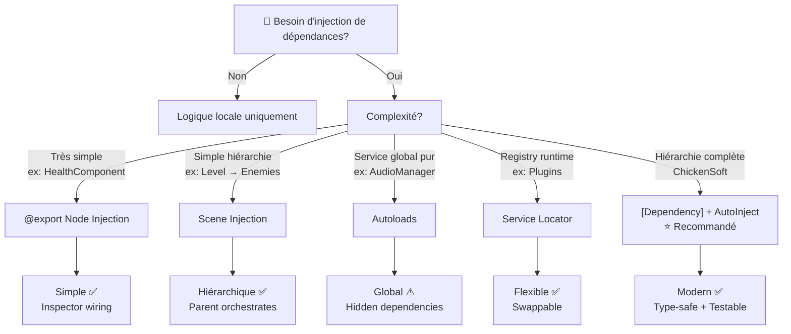
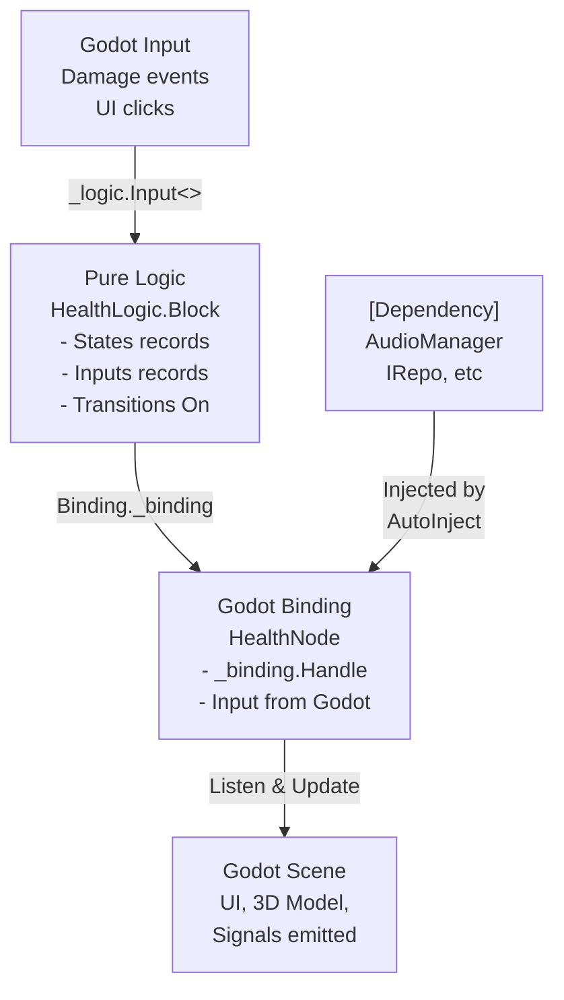
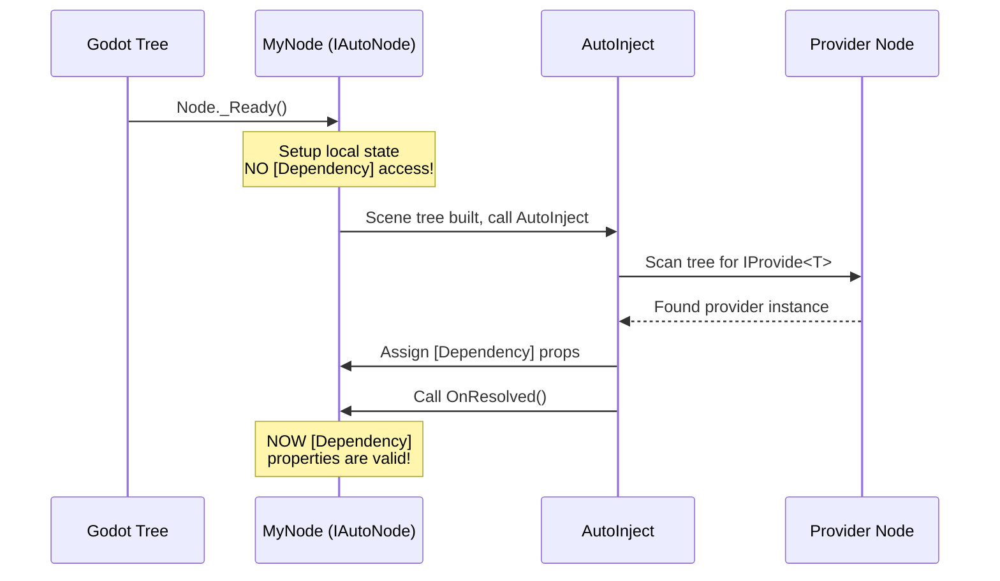
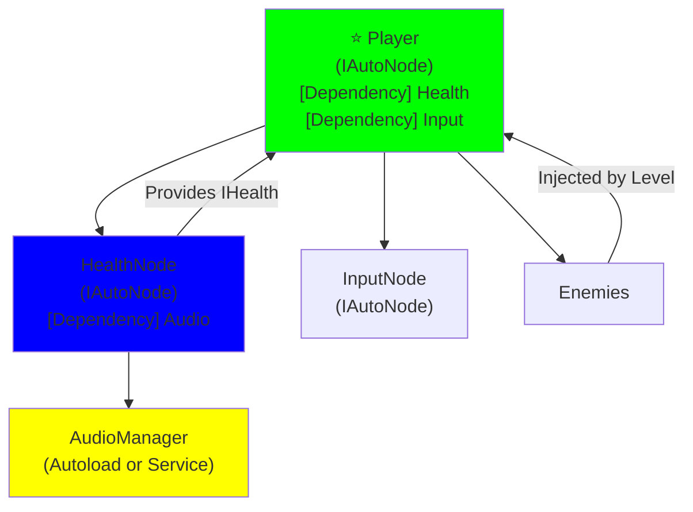
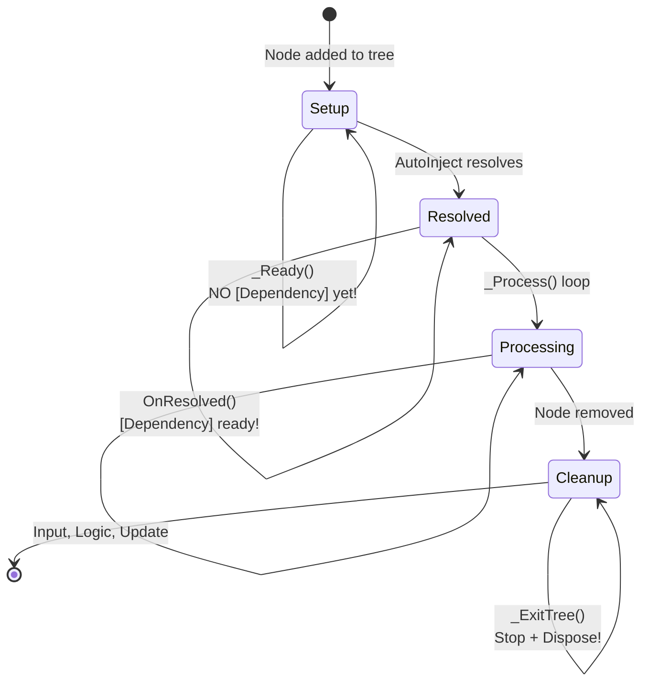

# Injection de Dépendances – Patterns et Architecture avec ChickenSoft
*Guide complet pour découpler, tester et structurer vos dépendances en Godot 4.x avec C# et ChickenSoft.*

---

## **Contexte**
- **Objectif** : Maîtriser **tous les patterns d'injection de dépendances** (DI) — du plus simple (@export) au plus avancé ([Dependency] + AutoInject) — pour construire des systèmes **découplés**, **testables** et **modulaires**.
- **Public cible** : Développeurs C#/Godot utilisant ChickenSoft (LogicBlocks, AutoInject) ou souhaitant adopter des patterns de DI robustes pour éviter les hard-coded paths et les dépendances cachées.
- **Prérequis** :
  - Godot 4.2+
  - C# 11+
  - Packages optionnels : `ChickenSoft.AutoInject`, `ChickenSoft.LogicBlocks`
  - Compréhension basique de machine états et Godot node tree

---

## **Règles d'Architecture Impératives**

### **1. Découplage Strict**

L'injection de dépendances repose sur une séparation claire entre les responsabilités :

- **Logique Pure (LogicBlocks)** :
  - **Interdictions** : Aucune référence à Godot (`Node`, `Vector2`, `Transform3D`, etc.).
  - **Obligations** : États et inputs en `record` immuables, transitions d'état via `On<TInput>()`.
  - **Bénéfice** : Testable sans scène Godot, déterministe et prédictible.

- **Binding (Node Godot)** :
  - **Responsabilités** : 
    - Injection des dépendances via `@export`, `[Dependency]` ou `IProvide<T>`.
    - Écoute des changements d'état du LogicBlock (`_binding.Handle<TState>()`).
    - Mise à jour de l'UI/scène Godot en réaction.
  - **Interdictions** : Pas de logique métier — uniquement orchestration Godot ↔ Logic.

- **Scènes .tscn** :
  - **Responsabilité** : Affichage et configuration visuelle uniquement.
  - **Export** : Nœuds critiques (`@export` ou `[Node("%Path")]`), jamais de logique.

### **2. Hiérarchie des Patterns (du simple au complexe)**

Choisir le pattern **adapté à votre cas d'usage** :

| Complexité | Pattern | Quand l'utiliser | Couplage | Testabilité |
|-----------|---------|------------------|----------|-------------|
| 🟢 Très simple | `@export` | Composants réutilisables (HealthComponent, Damage) | Modéré | ✅ Bonne |
| 🟡 Simple | Scene Injection | Parent injecte dans enfants (Level → Enemies) | Faible | ✅ Bonne |
| 🟡 Modéré | Autoloads | Services globaux purs (AudioManager, Config) | **Élevé** ⚠️ | ⚠️ Délicate |
| 🟠 Avancé | Service Locator | Registry runtime (plugin systems) | Modéré | ✅ Bonne |
| 🔴 Maître | `[Dependency]` + AutoInject (ChickenSoft) | Hiérarchies complètes avec LogicBlocks | **Très faible** ✅ | ✅ Excellente |

**Règle d'or** : Utiliser le pattern **le moins complexe** qui répond à votre besoin. Ne pas abuser de `[Dependency]` pour des cas simples.

### **3. Immuabilité et Testabilité**

- **États et Inputs** : Toujours utiliser des `record` — pas de `class` mutable.
  ```csharp
  // ✅ Bon
  public record Idle : IState;
  public record Moving(Vector3 Direction, float Speed) : IState;
  
  // ❌ Mauvais
  public class Idle : IState { public void SetState() { } }
  ```

- **Dépendances Injectées** : Les dépendances ne sont **jamais** créées localement ; toujours injectées :
  ```csharp
  // ✅ Bon — dépendance injectée via @export
  [Export] public AudioManager Audio { get; set; }
  
  // ❌ Mauvais — création locale = couplage fort
  var audio = new AudioManager();
  ```

- **Avantage** : Facilite les tests (mocker la dépendance) et la réutilisabilité (même composant, dépendances différentes).

---

## **5 Patterns d'Injection de Dépendances**

### **Pattern 1 : @export Node Injection**

L'approche la plus **Godot-idiomatic** et simple. Déclarez une dépendance en `@export` et câblez-la dans l'Inspector ou en code.

#### **Quand l'utiliser**
- Composants réutilisables (HealthComponent, DamageZone, WeaponController)
- Relations simples parent-enfant
- Avoid hard-coded `GetNode("../../SomeNode")` paths

#### **Exemple : HealthComponent**

**Fichiers**
- `HealthComponent.cs` : Composant réutilisable

**Code**

```csharp
using Godot;

/// <summary>
/// Reusable health component. Wire dependencies via Inspector or parent.
/// </summary>
public partial class HealthComponent : Node
{
    [Export] public AudioManager Audio { get; set; }          // Set in Inspector
    [Export] public int MaxHealth { get; set; } = 100;

    [Signal] public delegate void HealthChangedEventHandler(int current, int maximum);
    [Signal] public delegate void DiedEventHandler();

    private int _currentHealth;

    public override void _Ready()
    {
        _currentHealth = MaxHealth;
    }

    public void TakeDamage(int amount)
    {
        _currentHealth = Mathf.Clamp(_currentHealth - amount, 0, MaxHealth);
        
        // Use injected dependency — no direct autoload access
        Audio?.PlaySfx("hurt");
        
        EmitSignal(SignalName.HealthChanged, _currentHealth, MaxHealth);
        if (_currentHealth == 0)
            EmitSignal(SignalName.Died);
    }

    public void Heal(int amount)
    {
        _currentHealth = Mathf.Clamp(_currentHealth + amount, 0, MaxHealth);
        Audio?.PlaySfx("heal");
        EmitSignal(SignalName.HealthChanged, _currentHealth, MaxHealth);
    }
}
```

**Utilisation en parent**

```csharp
using Godot;

public partial class Player : CharacterBody3D
{
    [Export] public HealthComponent Health { get; set; }  // Drag node in Inspector
    [Export] public AudioManager Audio { get; set; }

    public override void _Ready()
    {
        // Optional: wire programmatically
        if (Health != null && Audio != null)
            Health.Audio = Audio;
    }

    public override void _Process(double delta)
    {
        // Player can call Health.TakeDamage() without knowing where Audio lives
    }
}
```

**Avantages** ✅
- Type-safe, self-documenting
- Flexible : changer dépendance = changer Inspector
- Aucun hard-coded path

**Inconvénients** ⚠️
- Dépend de configuration manuelle (Inspector)
- Oublis faciles si nœud non assigné

---

### **Pattern 2 : Scene Injection (Parent → Children)**

Un parent constructeur injecte les dépendances dans ses enfants lors de `_Ready()`. Enfants déclarent ce dont ils ont besoin via `@export` ou propriétés publiques.

#### **Quand l'utiliser**
- Hiérarchies où enfants dépendent du parent
- Level injecte Player référence dans tous Enemies
- Éviter que Enemies fassent `GetNode("../../Player")`

#### **Exemple : Level + Enemies**

**Fichiers**
- `Enemy.cs` : Décrit ses besoins
- `Level.cs` : Injecte Player dans tous Enemies

**Code**

```csharp
using Godot;

// Enemy.cs — declares its dependency; does NOT search for Player
public partial class Enemy : CharacterBody3D
{
    /// <summary>Set by Level in _Ready(). Do not call GetNode here.</summary>
    public CharacterBody3D Player { get; set; }

    private float _speed = 120f;

    public override void _PhysicsProcess(double delta)
    {
        if (Player == null)
            return;

        // Move toward injected Player reference
        Vector3 direction = (Player.GlobalPosition - GlobalPosition).Normalized();
        Velocity = direction * _speed;
        MoveAndSlide();
    }
}

// Level.cs — owns Player and Enemies; wires the dependency
public partial class Level : Node3D
{
    private CharacterBody3D _player;

    public override void _Ready()
    {
        _player = GetNode<CharacterBody3D>("Player");

        // Inject Player reference into every Enemy in group
        foreach (Node node in GetTree().GetNodesInGroup("enemies"))
        {
            if (node is Enemy enemy)
                enemy.Player = _player;
        }
    }
}
```

**Avantages** ✅
- Hiérarchique et naturel (parent orchestrate)
- Enfants ne connaissent pas la structure de la scène
- Facile à tester (créer Level avec Player mock)

**Inconvénients** ⚠️
- Responsabilité du parent d'injecter
- Ne scale pas avec centaines de dépendances

---

### **Pattern 3 : Autoloads as Singletons**

Services **véritablement globaux** exposés comme Autoloads. Idéal pour AudioManager, ConfigFile, PlatformAPI.

**⚠️ Avertissement** : Utilisez **uniquement** pour services sans test double significatif. Évitez d'utiliser comme dumping ground pour n'importe quel state partagé.

#### **Quand l'utiliser**
- Services globaux (Audio, Settings, Platform APIs)
- Services sans dépendances d'autres systèmes

#### **Quand NE PAS l'utiliser** ❌
- Logique métier (Player, Enemies, Items)
- Systèmes complexes (testabilité réduite)

#### **Exemple : AudioManager**

**Fichier**
- `AutoLoad AudioManager` : Enregistré comme autoload nommé "AudioManager" dans project.godot

**Code**

```csharp
using Godot;
using System.Collections.Generic;

/// <summary>
/// Global audio service. Register as autoload named "AudioManager".
/// </summary>
public partial class AudioManager : Node
{
    private readonly Dictionary<string, AudioStream> _sfxLibrary = new();

    public override void _Ready()
    {
        LoadSfxLibrary();
    }

    /// <summary>Plays a one-shot sound effect by key.</summary>
    public void PlaySfx(string key)
    {
        if (!_sfxLibrary.TryGetValue(key, out AudioStream stream))
        {
            GD.PushWarning($"AudioManager: unknown sfx key '{key}'");
            return;
        }

        var player = new AudioStreamPlayer { Stream = stream };
        player.Finished += player.QueueFree;
        AddChild(player);
        player.Play();
    }

    /// <summary>Plays background music with crossfade.</summary>
    public void PlayMusic(string key, float crossfadeTime = 0.5f)
    {
        // Implementation: stop current music, fade in new
    }

    private void LoadSfxLibrary()
    {
        // Populate _sfxLibrary from a Resource or folder scan
        _sfxLibrary["hurt"] = GD.Load<AudioStream>("res://Audio/sfx_hurt.wav");
        _sfxLibrary["pickup"] = GD.Load<AudioStream>("res://Audio/sfx_pickup.wav");
    }
}
```

**Utilisation**

```csharp
// Anywhere in code
AudioManager.PlaySfx("pickup");
```

**Avantages** ✅
- Extrêmement simple pour services purs
- Aucune configuration nécessaire

**Inconvénients** ⚠️
- **Dépendances cachées** — personne ne sait qui dépend du AudioManager
- **Testabilité faible** — AudioManager doit être fully operational dans tests
- **Ordering bugs** — AutoLoadA dépend AutoLoadB, mais B pas prêt
- **Couplage global** — difficile à désactiver ou swapper

---

### **Pattern 4 : Service Locator Pattern**

Registry runtime où services s'enregistrent eux-mêmes. Contrairement aux Autoloads directs, la locator est le **seul** hard dependency — tout le reste est swappable.

#### **Quand l'utiliser**
- Architectures plugin (systèmes opt-in à runtime)
- Services optionnels (analytics, telemetry)
- Swapping real ↔ stub implementations en tests

#### **Exemple : ServiceLocator + AudioService**

**Fichiers**
- `ServiceLocator.cs` : AutoLoad registry
- `AudioService.cs` : Service qui s'auto-enregistre
- `Pickup.cs` : Consumer qui retrieves service

**Code**

```csharp
using Godot;
using System.Collections.Generic;

/// <summary>
/// Runtime service registry. Register as autoload named "ServiceLocator".
/// </summary>
public partial class ServiceLocator : Node
{
    private readonly Dictionary<string, GodotObject> _services = new();

    /// <summary>Registers a service under serviceName.</summary>
    public void Register(string serviceName, GodotObject instance)
    {
        if (_services.ContainsKey(serviceName))
            GD.PushWarning($"ServiceLocator: overwriting existing service '{serviceName}'");
        _services[serviceName] = instance;
    }

    /// <summary>Removes a service registration.</summary>
    public void Unregister(string serviceName) => _services.Remove(serviceName);

    /// <summary>Returns the service or null, with a warning if missing.</summary>
    public GodotObject GetService(string serviceName)
    {
        if (!_services.TryGetValue(serviceName, out var service))
        {
            GD.PushWarning($"ServiceLocator: no service registered for '{serviceName}'");
            return null;
        }
        return service;
    }

    /// <summary>Typed retrieval — returns null and warns on type mismatch.</summary>
    public T GetService<T>(string serviceName) where T : GodotObject
    {
        var service = GetService(serviceName);
        if (service is T typed)
            return typed;
        if (service != null)
            GD.PushWarning($"ServiceLocator: '{serviceName}' is not of type {typeof(T).Name}");
        return null;
    }
}

// AudioService.cs — self-registers
public partial class AudioService : Node
{
    public override void _Ready()
    {
        GetNode<ServiceLocator>("/root/ServiceLocator").Register("audio", this);
    }

    public override void _ExitTree()
    {
        GetNode<ServiceLocator>("/root/ServiceLocator").Unregister("audio");
    }

    public void PlaySfx(string key)
    {
        GD.Print($"Playing SFX: {key}");
    }
}

// Pickup.cs — typed retrieval from locator
public partial class Pickup : Area2D
{
    public override void _Ready()
    {
        var audio = GetNode<ServiceLocator>("/root/ServiceLocator")
            .GetService<AudioService>("audio");
        audio?.PlaySfx("pickup");
    }
}
```

**Avantages** ✅
- Services opt-in à runtime
- Easy swapping (stubs pour tests)
- Moins couplé qu'Autoloads directs

**Inconvénients** ⚠️
- Dépendances toujours "invisible" au compile-time
- String keys (pas type-safe comme `[Dependency]`)
- Overhead runtime de lookup

---

### **Pattern 5 : [Dependency] + AutoInject (ChickenSoft – Moderne)**

Convention-based injection via attribute `[Dependency]`. AutoInject traverse le tree, trouve les providers et injecte automatiquement. **Le pattern moderne et recommandé pour projets ChickenSoft.**

#### **Quand l'utiliser**
- Hiérarchies ChickenSoft complètes (LogicBlocks + Bindings)
- Dépendances complexes à plusieurs niveaux
- **Best practice moderne**

#### **Concepts Clés**

| Concept | Explication |
|---------|------------|
| `[Dependency]` attribute | Marque une propriété comme dépendance à injecter |
| `this.DependOn<T>()` | Helper pour lookup la dépendance |
| `IAutoNode` | Interface Chickensoft : node se configure post-DI |
| `IProvide<T>` | Interface de provisioning : node offre une capacité |
| `OnResolved()` | Hook appelé après résolution complète des dépendances |
| Two-phase init | Setup (_Ready) puis dépendances (OnResolved) |

#### **Exemple : Player + HealthSystem avec ChickenSoft**

**Fichiers**
- `HealthLogic.cs` : LogicBlock pur
- `HealthNode.cs` : Binding Godot avec [Dependency]
- `IPlayer.cs` : Interface publique
- `Player.cs` : Utilise HealthNode via [Dependency]

**Code : LogicBlock**

```csharp
using ChickenSoft.LogicBlocks;

namespace MyGame.Logic.Health;

public partial class HealthLogic : LogicBlock<HealthLogic.IState, HealthLogic.IInput>
{
    public interface IState : StateLogic { }
    public record Alive(int Current, int Maximum) : IState;
    public record Dead : IState;

    public interface IInput : InputLogic { }
    public record TakeDamage(int Amount) : IInput;
    public record Heal(int Amount) : IInput;

    protected override IState InitialState => new Alive(100, 100);

    public HealthLogic()
    {
        // Transition: TakeDamage
        On<TakeDamage, Alive>((input, state) =>
        {
            int newCurrent = Mathf.Clamp(state.Current - input.Amount, 0, state.Maximum);
            return newCurrent == 0 ? new Dead() : state with { Current = newCurrent };
        });

        // Transition: Heal
        On<Heal, Alive>((input, state) =>
            state with { Current = Mathf.Clamp(state.Current + input.Amount, 0, state.Maximum) });
    }
}
```

**Code : Binding Godot**

```csharp
using Godot;
using ChickenSoft.AutoInject;
using ChickenSoft.LogicBlocks;
using MyGame.Logic.Health;

namespace MyGame.Nodes;

/// <summary>
/// Health system binding. Receives dependencies via [Dependency] + AutoInject.
/// </summary>
public partial class HealthNode : Node, IAutoNode
{
    #region Dependencies
    [Dependency]
    public AudioManager Audio => this.DependOn<AudioManager>();
    #endregion

    #region State
    private readonly HealthLogic.Block _logic = new();
    private HealthLogic.Block.Binding _binding = null!;
    #endregion

    #region Signals
    [Signal] public delegate void HealthChangedEventHandler(int current, int maximum);
    [Signal] public delegate void DiedEventHandler();
    #endregion

    public override void _Ready()
    {
        _binding = _logic.Bind();
        
        // Handle state changes
        _binding.Handle<HealthLogic.Alive>(state =>
        {
            EmitSignal(SignalName.HealthChanged, state.Current, state.Maximum);
        });
        
        _binding.Handle<HealthLogic.Dead>(_ =>
        {
            Audio?.PlaySfx("death");
            EmitSignal(SignalName.Died);
        });
        
        _logic.Start();
    }

    public override void _ExitTree()
    {
        _logic.Stop();
        _binding.Dispose();  // OBLIGATOIRE : évite fuites mémoire
    }

    public void TakeDamage(int amount)
    {
        _logic.Input(new HealthLogic.TakeDamage(amount));
    }

    public void Heal(int amount)
    {
        _logic.Input(new HealthLogic.Heal(amount));
    }
}
```

**Code : Interface publique**

```csharp
namespace MyGame.Traits;

public interface IPlayer
{
    void TakeDamage(int amount);
}
```

**Code : Player node avec dépendance**

```csharp
using Godot;
using ChickenSoft.AutoInject;
using MyGame.Traits;
using MyGame.Nodes;

namespace MyGame.Nodes;

/// <summary>
/// Player character. Receives HealthNode via [Dependency] + AutoInject.
/// </summary>
public partial class Player : CharacterBody3D, IAutoNode, IPlayer
{
    #region Exports
    [Export] public float Speed = 200f;
    #endregion

    #region Dependencies
    [Dependency]
    public HealthNode Health => this.DependOn<HealthNode>();
    #endregion

    public void TakeDamage(int amount)
    {
        Health?.TakeDamage(amount);
    }

    public override void _Process(double delta)
    {
        // Player logic
    }
}
```

**Avantages** ✅
- **Type-safe** : `this.DependOn<T>()` compile-time checked
- **Self-documenting** : Toutes les dépendances déclarées
- **Testable** : Facile de mock (créer Player sans scène)
- **Tree traversal automatique** : AutoInject trouve providers
- **Two-phase init** : Setup puis OnResolved() pour dépendances
- **Modern** : Chickensoft best practice

**Inconvénients** ⚠️
- Dépend de ChickenSoft.AutoInject
- Overhead runtime de résolution (minimal mais présent)
- Courbe d'apprentissage pour [Dependency] workflow

---

## **Bonnes Pratiques**

### **1. Conventions de Namespaces**

```csharp
// Logic pure (NO Godot references)
namespace MyGame.Logic.{Feature}
{
    public partial class {Feature}Logic : LogicBlock { }
}

// Godot bindings
namespace MyGame.Nodes
{
    public partial class {Feature}Node : Node, IAutoNode { }
}

// Public interfaces / contracts
namespace MyGame.Traits
{
    public interface I{Feature} { }
}

// Data layer
namespace MyGame.Repos
{
    public interface I{Feature}Repo { }
}
```

### **2. Conventions de Fichiers**

```
ProjectRoot/
├── Source/
│   ├── Logic/
│   │   ├── Health/
│   │   │   ├── HealthLogic.cs        // Main block
│   │   │   ├── HealthLogic.State.cs  // States
│   │   │   └── HealthLogic.Input.cs  // Inputs
│   ├── Nodes/
│   │   ├── HealthNode.cs             // Godot binding
│   │   └── PlayerNode.cs
│   ├── Traits/
│   │   ├── IPlayer.cs
│   │   ├── IEnemy.cs
│   │   └── IHealth.cs
│   └── Repos/
│       └── IGameRepo.cs
```

### **3. Cycle de Vie (_Ready → OnResolved → _ExitTree)**

**Ordre impératif strict** :

```csharp
public partial class MyNode : Node, IAutoNode
{
    // Phase 1: Setup (Node ajouté à l'arbre)
    public override void _Ready()
    {
        GD.Print("1. _Ready called — dépendances PAS encore résolues!");
        // ✅ OK: Initialiser données locales, créer LogicBlock, bind handlers
        // ❌ INTERDIT: Accéder [Dependency] ici — sera null!
    }

    // Phase 2: Dépendances résolues (APRÈS _Ready, dépendances assignées)
    public override void OnResolved()
    {
        GD.Print("2. OnResolved called — toutes dépendances résolues!");
        // ✅ OK: Utiliser [Dependency] ici, initialiser handlers qui dépendent d'autres
        // Commencer logique qui dépend d'autres systèmes
    }

    // Phase 3: Update loop
    public override void _Process(double delta)
    {
        // Normal Godot processing
    }

    // Phase 4: Cleanup (OBLIGATOIRE)
    public override void _ExitTree()
    {
        GD.Print("3. _ExitTree called — cleanup");
        // ✅ OBLIGATOIRE: Dispose() des Bindings
        // ✅ OBLIGATOIRE: Stop() des LogicBlocks
        // ✅ OBLIGATOIRE: Unsubscribe signals
        _logic.Stop();
        _binding.Dispose();
    }
}
```

### **4. Patterns ChickenSoft : When to Use [Dependency] vs @export**

| Situation | Pattern | Raison |
|-----------|---------|--------|
| Composant simple (HealthComponent, Damage) | `@export` | KISS, pas besoin d'AutoInject |
| Logique métier pure (Player, Enemy) | `[Dependency]` | DI complète, testable |
| Service global pur (AudioManager) | Autoload | Simple, aucun test double |
| Registry optionnel (Analytics) | Service Locator | Plugin architecture |
| Hiérarchie complète ChickenSoft | `[Dependency]` | Best practice moderne |

### **5. Testing : Mock Dependencies**

```csharp
using NUnit.Framework;

[TestFixture]
public class HealthNodeTests
{
    private HealthNode _health;
    private MockAudio _mockAudio;

    [SetUp]
    public void Setup()
    {
        // Create node WITHOUT scene
        _health = new HealthNode();
        
        // Inject mock dependency
        _mockAudio = new MockAudio();
        _health.Audio = _mockAudio;  // Accessible car propriété [Dependency]
        
        // Simulate _Ready (no Godot tree needed)
        _health.Call("_Ready");
    }

    [Test]
    public void TakeDamage_PlaysSfx()
    {
        _health.TakeDamage(10);
        
        Assert.IsTrue(_mockAudio.PlayedSfx.Contains("hurt"));
    }
}

// Mock implementation
public class MockAudio : AudioManager
{
    public List<string> PlayedSfx { get; } = new();

    public override void PlaySfx(string key)
    {
        PlayedSfx.Add(key);
    }
}
```

---

## **Erreurs Courantes à Éviter**

<mui:table-metadata title="Anti-Patterns et Corrections" />

| ❌ Anti-Pattern | ✅ Correction | Explication |
|---|---|---|
| Hard-coded `GetNode("../../Path")` | Utiliser `@export`, `[Dependency]`, ou Scene Injection | Hard-coded paths se brisent silencieusement avec restructurations |
| Dépendances circulaires (A → B → A) | Architecture unidirectionnelle (parent → children) | Impossible à résoudre, crée deadlocks |
| Mélanger logique Godot dans LogicBlocks | Séparation stricte : Logic = pure, Binding = Godot | Casse testabilité et réutilisabilité |
| Oublier `_binding.Dispose()` dans `_ExitTree()` | Toujours appeler dans `_ExitTree()` | Fuites mémoire, événements non nettoyés |
| Mutations d'état directes dans Binding | Transitions via LogicBlock uniquement | Non-déterministe, breaks state machines |
| Accéder `[Dependency]` dans `_Ready()` | Utiliser `OnResolved()` pour dépendances | `_Ready()` appelé avant résolution DI |
| Autoloads pour logique métier | Autoloads = services purs globaux uniquement | Rend testabilité impossible |
| Services avec multiples responsabilités | Single Responsibility : 1 service = 1 concept | Breaks modularity, hard à tester |
| Oublier nœud Provider dans IProvide<T> | Toujours `GetNode("%Path")` pour Provider | AutoInject ne peut pas trouver provider |

---

## **Diagrammes**

### **1. Hiérarchie des Patterns – Décision**



### **2. Architecture LogicBlocks + Binding + [Dependency]**



### **3. Flux Injection [Dependency] et OnResolved()**



### **4. Système Complet – Dépendances Multi-Niveaux**



### **5. Cycle de Vie Complet (_Ready → OnResolved → _ExitTree)**



---

## **Recettes Pratiques**

### **Recipe 1 : Composant Réutilisable (HealthComponent)**

**Objectif** : Créer un composant santé réutilisable sans hard-coded dépendances.

**Approche** : @export Node Injection (simple)

**Fichiers à créer**
- `HealthComponent.cs`
- `Player.cs` (utilise HealthComponent)
- `Enemy.cs` (réutilise HealthComponent)

**Implémentation**

```csharp
// HealthComponent.cs
using Godot;

public partial class HealthComponent : Node
{
    [Export] public AudioManager Audio { get; set; }
    [Export] public int MaxHealth { get; set; } = 100;

    [Signal] public delegate void DamagedEventHandler(int damageAmount);
    [Signal] public delegate void DiedEventHandler();

    private int _currentHealth;

    public override void _Ready()
    {
        _currentHealth = MaxHealth;
    }

    public void TakeDamage(int amount)
    {
        _currentHealth = Mathf.Clamp(_currentHealth - amount, 0, MaxHealth);
        Audio?.PlaySfx("hurt");
        EmitSignal(SignalName.Damaged, amount);
        
        if (_currentHealth == 0)
            EmitSignal(SignalName.Died);
    }
}

// Player.cs — reuse HealthComponent
public partial class Player : CharacterBody3D
{
    [Export] public HealthComponent Health { get; set; }

    public override void _Ready()
    {
        Health.Damaged += OnDamaged;
        Health.Died += OnDied;
    }

    private void OnDamaged(int amount)
    {
        GD.Print($"Player took {amount} damage!");
    }

    private void OnDied()
    {
        QueueFree();
    }
}

// Enemy.cs — SAME HealthComponent, different usage
public partial class Enemy : CharacterBody3D
{
    [Export] public HealthComponent Health { get; set; }

    public override void _Ready()
    {
        Health.Died += OnDied;
    }

    private void OnDied()
    {
        DropLoot();
        QueueFree();
    }

    private void DropLoot() { /* ... */ }
}
```

**Configuration dans Scène**
```
Player (CharacterBody3D)
  └─ HealthComponent
     - Audio: [drag AudioManager node or autoload]
     - MaxHealth: 100

Enemy (CharacterBody3D)
  └─ HealthComponent
     - Audio: [same AudioManager]
     - MaxHealth: 50
```

---

### **Recipe 2 : Système Hiérarchique (Level + Enemy AI)**

**Objectif** : Enemies attaquent Player sans hard-coded GetNode paths.

**Approche** : Scene Injection (parent injecte)

**Fichiers à créer**
- `Enemy.cs`
- `Level.cs`

**Implémentation**

```csharp
// Enemy.cs — RECEIVES Player reference
public partial class Enemy : CharacterBody3D
{
    public CharacterBody3D Player { get; set; }  // Set by Level
    
    private float _attackRange = 50f;
    private float _moveSpeed = 100f;

    public override void _PhysicsProcess(double delta)
    {
        if (Player == null || Player.IsQueuedForDeletion())
            return;

        float distanceToPlayer = GlobalPosition.DistanceTo(Player.GlobalPosition);

        if (distanceToPlayer < _attackRange)
        {
            Attack();
        }
        else
        {
            MoveToward(Player.GlobalPosition);
        }
    }

    private void MoveToward(Vector3 target)
    {
        Vector3 direction = (target - GlobalPosition).Normalized();
        Velocity = direction * _moveSpeed;
        MoveAndSlide();
    }

    private void Attack()
    {
        GD.Print("Attacking player!");
        // Find HealthComponent on player and call TakeDamage
        var health = Player.GetNode<HealthComponent>("HealthComponent");
        health?.TakeDamage(10);
    }
}

// Level.cs — ORCHESTRATES injection
public partial class Level : Node3D
{
    private CharacterBody3D _player;

    public override void _Ready()
    {
        _player = GetNode<CharacterBody3D>("Player");

        // Inject Player into all enemies
        foreach (Node node in GetTree().GetNodesInGroup("enemies"))
        {
            if (node is Enemy enemy)
            {
                enemy.Player = _player;
            }
        }
    }
}
```

**Scene Structure**
```
Level (Node3D)
├─ Player (CharacterBody3D)
│  └─ HealthComponent
├─ Enemy1 (CharacterBody3D)
│  └─ [Script: Enemy.cs]
│  └─ [Group: "enemies"]
└─ Enemy2 (CharacterBody3D)
   └─ [Script: Enemy.cs]
   └─ [Group: "enemies"]
```

---

### **Recipe 3 : Système Complet (CoinCollection avec LogicBlocks)**

**Objectif** : Système de collecte pièces utilisant LogicBlocks + [Dependency] + Interfaces.

**Approche** : ChickenSoft LogicBlocks + AutoInject + IProvide<T>

**Fichiers à créer**
- `CoinLogic.cs`, `CoinLogic.State.cs`, `CoinLogic.Input.cs`
- `CoinNode.cs`
- `ICoin.cs` (interface)
- `CoinCollector.cs` (écoute coins)

**Implémentation : LogicBlock**

```csharp
// CoinLogic.cs
using ChickenSoft.LogicBlocks;

namespace MyGame.Logic.Coin;

public partial class CoinLogic : LogicBlock<CoinLogic.IState, CoinLogic.IInput>
{
    public interface IState : StateLogic { }
    public record Idle : IState;
    public record Collected : IState;

    public interface IInput : InputLogic { }
    public record Collect : IInput;

    protected override IState InitialState => new Idle();

    public CoinLogic()
    {
        On<Collect, Idle>(_ => new Collected());
    }
}
```

**Implémentation : Binding**

```csharp
// CoinNode.cs
using Godot;
using ChickenSoft.AutoInject;
using ChickenSoft.LogicBlocks;
using MyGame.Logic.Coin;
using MyGame.Traits;

namespace MyGame.Nodes;

public partial class CoinNode : Area3D, IAutoNode, ICoin
{
    #region Dependencies
    [Dependency]
    public AudioManager Audio => this.DependOn<AudioManager>();
    #endregion

    #region Signals
    [Signal] public delegate void CollectedEventHandler();
    #endregion

    #region State
    private readonly CoinLogic.Block _logic = new();
    private CoinLogic.Block.Binding _binding = null!;
    private CollisionShape3D _collider;
    #endregion

    public override void _Ready()
    {
        _collider = GetNode<CollisionShape3D>("CollisionShape3D");
        AreaEntered += OnAreaEntered;

        _binding = _logic.Bind();
        _binding.Handle<CoinLogic.Idle>(_ => 
        {
            _collider.Disabled = false;
        });
        _binding.Handle<CoinLogic.Collected>(_ =>
        {
            Audio?.PlaySfx("coin_pickup");
            EmitSignal(SignalName.Collected);
            _collider.Disabled = true;
            QueueFree();
        });
        _logic.Start();
    }

    public override void _ExitTree()
    {
        _logic.Stop();
        _binding.Dispose();
    }

    private void OnAreaEntered(Area3D area)
    {
        if (area is ICoinCollector collector)
        {
            _logic.Input(new CoinLogic.Collect());
            collector.OnCoinCollected(this);
        }
    }
}
```

**Interfaces**

```csharp
// ICoin.cs
namespace MyGame.Traits;

public interface ICoin
{
    signal void Collected;
}

// ICoinCollector.cs
namespace MyGame.Traits;

public interface ICoinCollector
{
    void OnCoinCollected(ICoin coin);
}
```

**Collector implémentation**

```csharp
// Player.cs implements ICoinCollector
public partial class Player : CharacterBody3D, IAutoNode, ICoinCollector
{
    private int _coinCount = 0;

    public void OnCoinCollected(ICoin coin)
    {
        _coinCount++;
        GD.Print($"Coins: {_coinCount}");
    }
}
```

---

### **Recipe 4 : Service Global – 3 Approches Comparées (AudioManager)**

**Objectif** : Jouer de la musique/SFX globalement. Comparer Autoload vs Service Locator vs [Dependency].

**Approche 1 : Autoload (Simple, Couplage élevé)**

```csharp
// AudioManager.cs — registered as autoload "AudioManager"
public partial class AudioManager : Node
{
    public void PlaySfx(string key) { /* ... */ }
}

// Anywhere — Direct access (HIDDEN dependency)
AudioManager.PlaySfx("hit");  // ⚠️ Invisible dependency!
```

**Problèmes** ⚠️
- Dépendance cachée
- Impossible à mock sans scène
- Autoload ordering bugs

**Approche 2 : Service Locator (Flexible, Un peu verbose)**

```csharp
// AudioService.cs — self-registers
public partial class AudioService : Node
{
    public override void _Ready()
    {
        GetNode<ServiceLocator>("/root/ServiceLocator").Register("audio", this);
    }

    public void PlaySfx(string key) { /* ... */ }
}

// Consumer
public partial class Enemy : CharacterBody3D
{
    public override void _Ready()
    {
        var audio = GetNode<ServiceLocator>("/root/ServiceLocator")
            .GetService<AudioService>("audio");
        audio?.PlaySfx("attack");
    }
}
```

**Avantages** ✅
- Swappable pour tests
- Opt-in registration

**Inconvénients** ⚠️
- String keys (pas type-safe)
- Verbose lookup

**Approche 3 : [Dependency] + AutoInject (Moderne, Type-safe)**

```csharp
// AudioManager.cs — any node
public partial class AudioManager : Node
{
    public void PlaySfx(string key) { /* ... */ }
}

// Enemy.cs — declares dependency
public partial class Enemy : CharacterBody3D, IAutoNode
{
    [Dependency]
    public AudioManager Audio => this.DependOn<AudioManager>();

    public override void _Ready()
    {
        // ✅ Dependency injected automatically
        Audio?.PlaySfx("attack");
    }
}
```

**Avantages** ✅
- Type-safe
- Self-documenting
- Testable (mock Audio easily)

**Inconvénients** ⚠️
- Dépend ChickenSoft.AutoInject
- Moins simple qu'Autoload

**Recommandation** :
- 🟢 **ChickenSoft projects** → Approche 3 ([Dependency])
- 🟡 **Petits projets simples** → Approche 1 (Autoload)
- 🟠 **Plugin architectures** → Approche 2 (Service Locator)

---

## **Résumé Comparatif des Patterns**

| Pattern | Couplage | Testabilité | Complexité | Quand l'utiliser |
|---------|----------|-------------|-----------|------------------|
| `@export` | Modéré | ✅ Bonne | 🟢 Très simple | Composants réutilisables |
| Scene Injection | Faible | ✅ Bonne | 🟡 Simple | Hiérarchies parent-enfant |
| Autoloads | **Élevé** | ⚠️ Délicate | 🟢 Très simple | Services purs globaux UNIQUEMENT |
| Service Locator | Modéré | ✅ Bonne | 🟠 Moyen | Plugin architectures |
| `[Dependency]` + AutoInject | **Très faible** | ✅✅ Excellente | 🔴 Avancé | Hiérarchies ChickenSoft, modern |

---

## **Conclusion**

L'injection de dépendances en Godot existe sur un spectre :
- **Simple** (@export) pour composants légers
- **Hiérarchique** (Scene Injection) pour parent-enfant
- **Global** (Autoloads) pour services véritablement purs
- **Flexible** (Service Locator) pour architectures modulaires
- **Moderne** ([Dependency] + AutoInject) pour projets ChickenSoft complets

**Best practice** : Commencer simple (@export), escalader en complexité selon besoins réels. **Jamais** overengineer avec [Dependency] pour cas trivials.

Pour projets ChickenSoft, **[Dependency] + AutoInject** est la recommandation moderne — type-safe, testable, self-documenting.
