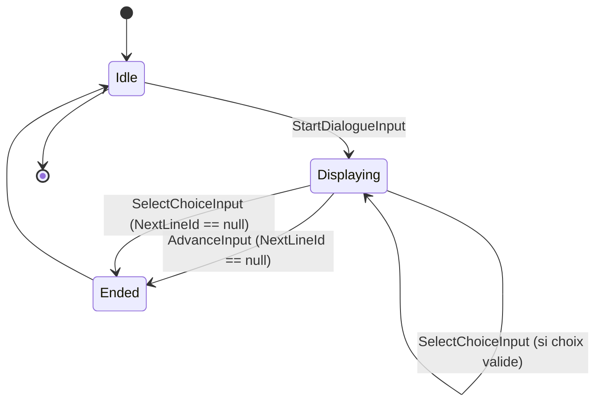
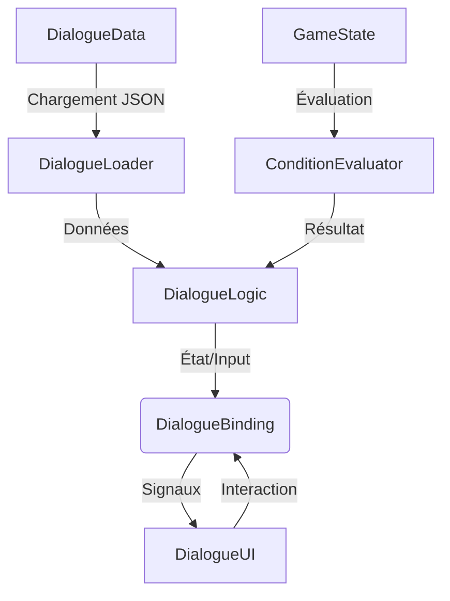
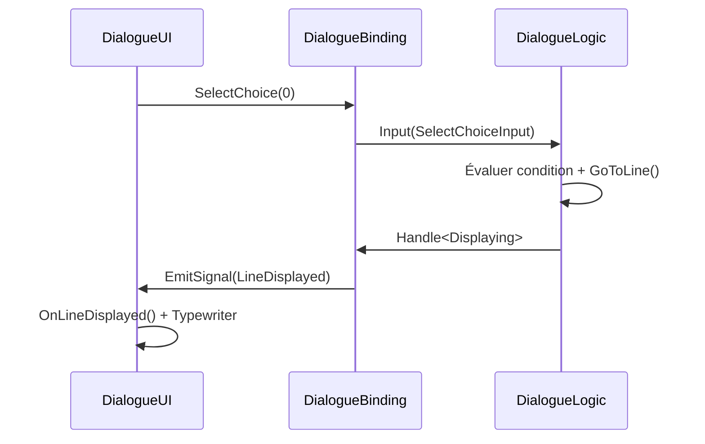

# Système de Dialogue - Implémentation Modulaire avec ChickenSoft/LogicBlocks
*Guide complet pour créer un système de dialogue flexible, découplé et 100% compatible avec ChickenSoft/LogicBlocks, en utilisant C# et Godot 4.x.*

---

## **Contexte**
- **Objectif** : Construire un système de dialogue **robuste**, **réutilisable** et **entièrement découplé**, supportant les embranchements conditionnels, les choix dynamiques, l'interpolation de variables, et le chargement JSON.
- **Public cible** : Développeurs C#/Godot utilisant ChickenSoft pour des jeux narratifs (RPG, adventures, puzzle games).
- **Prérequis** :
  - Godot 4.2+
  - C# 11+
  - Packages : `ChickenSoft.LogicBlocks`, `ChickenSoft.AutoInject`
  - Optionnel : Extension [Dialogic](https://github.com/coppolaemilio/dialogic) pour projets de grande taille.

---

## **Règles d'Architecture Impératives**

### **1. Découplage Strict**
- **DialogueLogic** : Gère la **logique pure** (navigation, états, évaluation de conditions).
  - **Interdictions** : Aucune référence à Godot (`Node`, `RichTextLabel`, UI).
  - **Obligations** : États (`IState`) et inputs (`IInput`) en `record` immuables.
- **DialogueData** : Conteneur immutable des données de dialogue.
  - Peut être chargé depuis JSON, ressources ou code.
  - Aucune dépendance aux nœuds Godot.
- **DialogueBinding** : Pont entre `DialogueLogic` et Godot.
  - **Responsabilités** :
    - Injection des dépendances via `IAutoNode`.
    - Gestion du cycle de vie (`_Ready`, `_ExitTree`).
    - Nettoyage des ressources.
- **DialogueUI** : Responsable uniquement de l'**affichage** et de l'**interaction utilisateur**.
  - Émet des signaux vers le binding.
  - Reçoit les mises à jour d'état et les affiche.

### **2. Immutabilité et Prévisibilité**
- **États** : Toujours utiliser des `record` (ex: `Displaying`, `Choosing`, `Ended`).
- **Inputs** : Toujours utiliser des `record` (ex: `SelectChoiceInput`, `AdvanceInput`).
- **Transitions** : Utiliser `On<TInput>((input, state) => ...)` pour décrire les chemins d'état.
- **Conditions** : Évaluer les conditions avant les transitions, jamais after.

### **3. Performances et Scalabilité**
- **Lazy-load** : Charger les dialogues depuis JSON uniquement quand nécessaire.
- **Caching** : Mémoriser les lignes conditionnelles résolues pour éviter les re-évaluations.
- **Streaming** : Pour les projets volumineux, utiliser des fichiers JSON séparés par NPC/quête.

---

## **Structure de Données**

### **1. Modèles Immuables**

```csharp
// DialogueData.cs
namespace MyGame.Logic.Dialogue;

public record DialogueData(
    string StartLineId,
    IReadOnlyDictionary<string, DialogueLine> Lines
)
{
    public DialogueLine? GetLine(string id) =>
        Lines.TryGetValue(id, out var line) ? line : null;
}

public record DialogueLine(
    string Speaker,
    string Text,
    string? Condition = null,
    string? NextLineId = null,
    IReadOnlyList<DialogueChoice> Choices = null
)
{
    public DialogueChoice[]? Choices { get; } = Choices?.ToArray() ?? Array.Empty<DialogueChoice>();
}

public record DialogueChoice(
    string Text,
    string? NextLineId = null,
    string? Condition = null
);
```

### **2. Parser JSON**

```csharp
// DialogueLoader.cs
using Godot;
using Godot.Collections;
using System.Collections.Generic;

namespace MyGame.Logic.Dialogue;

public partial class DialogueLoader : RefCounted
{
    public static DialogueData? LoadFromJson(string path)
    {
        using var file = FileAccess.Open(path, FileAccess.ModeFlags.Read);
        if (file == null)
        {
            GD.PushError($"DialogueLoader: Cannot open '{path}'");
            return null;
        }

        var json = new Json();
        var err = json.Parse(file.GetAsText());
        if (err != Error.Ok)
        {
            GD.PushError($"DialogueLoader: JSON parse error in '{path}' — {json.GetErrorMessage()}");
            return null;
        }

        var raw = (Dictionary)json.Data;
        var startLineId = raw.TryGetValue("start_line_id", out var sid) ? sid.AsString() : "";
        
        var lines = new Dictionary<string, DialogueLine>();
        if (raw.TryGetValue("lines", out var linesVar))
        {
            var linesDict = (Dictionary)linesVar;
            foreach (var lineId in linesDict.Keys)
            {
                var entry = (Dictionary)linesDict[lineId];
                var choices = new List<DialogueChoice>();

                if (entry.TryGetValue("choices", out var choicesVar))
                {
                    var choicesList = (Array)choicesVar;
                    foreach (var choice in choicesList)
                    {
                        var choiceDict = (Dictionary)choice;
                        choices.Add(new DialogueChoice(
                            Text: choiceDict.TryGetValue("text", out var t) ? t.AsString() : "",
                            NextLineId: choiceDict.TryGetValue("next_line_id", out var nid) ? nid.AsString() : null,
                            Condition: choiceDict.TryGetValue("condition", out var cond) ? cond.AsString() : null
                        ));
                    }
                }

                lines[lineId.AsString()] = new DialogueLine(
                    Speaker: entry.TryGetValue("speaker", out var sp) ? sp.AsString() : "",
                    Text: entry.TryGetValue("text", out var tx) ? tx.AsString() : "",
                    Condition: entry.TryGetValue("condition", out var c) ? c.AsString() : null,
                    NextLineId: entry.TryGetValue("next_line_id", out var next) ? next.AsString() : null,
                    Choices: choices
                );
            }
        }

        return new DialogueData(startLineId, lines);
    }
}
```

**Exemple de fichier JSON** (`res://dialogue/guard.json`) :
```json
{
  "start_line_id": "greet",
  "lines": {
    "greet": {
      "speaker": "Guard",
      "text": "Halt! State your business.",
      "choices": [
        { "text": "I bring a message.", "next_line_id": "message" },
        { "text": "Never mind.", "next_line_id": "" }
      ]
    },
    "message": {
      "speaker": "Guard",
      "text": "Very well. You may pass.",
      "next_line_id": ""
    }
  }
}
```

---

## **Exemples Minimaux**

### **1. LogicBlock : Gestion d'État du Dialogue**

#### **Fichiers**
- `DialogueLogic.State.cs` : États immuables.
- `DialogueLogic.Input.cs` : Inputs immuables.
- `DialogueLogic.cs` : Bloc logique principal.

#### **Code**

```csharp
// DialogueLogic.State.cs
namespace MyGame.Logic.Dialogue;

public partial class DialogueLogic
{
    public interface IState : ChickenSoft.LogicBlocks.StateLogic { }
    
    public record Idle : IState;
    
    public record Displaying(
        DialogueLine CurrentLine,
        IReadOnlyList<DialogueChoice> VisibleChoices
    ) : IState;
    
    public record Ended : IState;
}
```

```csharp
// DialogueLogic.Input.cs
namespace MyGame.Logic.Dialogue;

public partial class DialogueLogic
{
    public interface IInput : ChickenSoft.LogicBlocks.InputLogic { }
    
    public record StartDialogueInput(DialogueData Data) : IInput;
    public record AdvanceInput : IInput;
    public record SelectChoiceInput(int ChoiceIndex) : IInput;
    public record EvaluateConditionsInput : IInput;
}
```

```csharp
// DialogueLogic.cs
using ChickenSoft.LogicBlocks;
using System.Collections.Generic;
using System.Linq;

namespace MyGame.Logic.Dialogue;

public partial class DialogueLogic : LogicBlock<DialogueLogic.IState, DialogueLogic.IInput>
{
    private DialogueData? _currentData;
    private IConditionEvaluator _evaluator;

    protected override IState InitialState => new Idle();

    public DialogueLogic(IConditionEvaluator evaluator)
    {
        _evaluator = evaluator;

        // Démarrer le dialogue
        On<StartDialogueInput, Idle>((input, _) =>
        {
            _currentData = input.Data;
            if (string.IsNullOrEmpty(input.Data.StartLineId))
                return new Ended();
            return GoToLine(input.Data.StartLineId);
        });

        // Avancer à la ligne suivante
        On<AdvanceInput, Displaying>((_, state) =>
        {
            if (state.VisibleChoices.Count > 0)
            {
                // Ne pas avancer s'il y a des choix
                return state;
            }
            var nextLineId = state.CurrentLine.NextLineId;
            return string.IsNullOrEmpty(nextLineId) ? new Ended() : GoToLine(nextLineId);
        });

        // Sélectionner un choix
        On<SelectChoiceInput, Displaying>((input, state) =>
        {
            if (input.ChoiceIndex < 0 || input.ChoiceIndex >= state.VisibleChoices.Count)
            {
                GD.PushError($"DialogueLogic: Invalid choice index {input.ChoiceIndex}");
                return state;
            }
            var choice = state.VisibleChoices[input.ChoiceIndex];
            var nextLineId = choice.NextLineId ?? "";
            return string.IsNullOrEmpty(nextLineId) ? new Ended() : GoToLine(nextLineId);
        });
    }

    private IState GoToLine(string lineId)
    {
        if (_currentData == null)
            return new Ended();

        var line = _currentData.GetLine(lineId);
        if (line == null)
        {
            GD.PushError($"DialogueLogic: Unknown line ID '{lineId}'");
            return new Ended();
        }

        // Sauter la ligne si la condition n'est pas satisfaite
        if (!string.IsNullOrEmpty(line.Condition) && !_evaluator.Evaluate(line.Condition))
        {
            var nextLineId = line.NextLineId ?? "";
            return string.IsNullOrEmpty(nextLineId) ? new Ended() : GoToLine(nextLineId);
        }

        var visibleChoices = line.Choices
            .Where(c => string.IsNullOrEmpty(c.Condition) || _evaluator.Evaluate(c.Condition))
            .ToList();

        return new Displaying(line, visibleChoices);
    }
}

public interface IConditionEvaluator
{
    bool Evaluate(string condition);
}
```

---

### **2. Évaluateur de Conditions**

```csharp
// ConditionEvaluator.cs
using Godot;
using System;

namespace MyGame.Logic.Dialogue;

public partial class GameState : Node
{
    public static GameState Instance { get; private set; }
    
    private Dictionary<string, object> _flags = new();
    public Inventory Inventory { get; set; }

    public override void _Ready()
    {
        Instance = this;
    }

    public bool HasFlag(string key) =>
        _flags.TryGetValue(key, out var val) && (bool)val;

    public void SetFlag(string key, bool value) =>
        _flags[key] = value;

    public bool HasItem(string itemId, int quantity = 1) =>
        Inventory != null && Inventory.HasItem(itemId, quantity);

    public int QuestStage(string questId)
    {
        var key = $"quest_{questId}_stage";
        return _flags.TryGetValue(key, out var val) ? (int)val : 0;
    }
}

public partial class DialogueConditionEvaluator : Node, IConditionEvaluator
{
    public bool Evaluate(string condition)
    {
        try
        {
            var expr = new Expression();
            var err = expr.Parse(condition);
            if (err != Error.Ok)
            {
                GD.PushError($"DialogueConditionEvaluator: Parse error in '{condition}' — {expr.GetErrorText()}");
                return false;
            }

            var result = expr.Execute(System.Array.Empty<Variant>(), GameState.Instance);
            if (expr.HasExecuteFailed())
            {
                GD.PushError($"DialogueConditionEvaluator: Execution failed for '{condition}'");
                return false;
            }

            return result.AsBool();
        }
        catch (Exception ex)
        {
            GD.PushError($"DialogueConditionEvaluator: {ex.Message}");
            return false;
        }
    }
}
```

Conditions supportées :
```csharp
// Drapeaux
"GameState.Instance.HasFlag('met_queen')"

// Quêtes
"GameState.Instance.QuestStage('main') >= 2"

// Inventaire
"GameState.Instance.HasItem('potion', 3)"

// Combinées
"GameState.Instance.HasFlag('has_letter') && GameState.Instance.QuestStage('main') == 3"
```

---

### **3. Binding : Intégration avec Godot**

```csharp
// DialogueBinding.cs
using Godot;
using ChickenSoft.AutoInject;
using ChickenSoft.LogicBlocks;

namespace MyGame.Nodes.Dialogue;

public partial class DialogueBinding : Node, IAutoNode
{
    [Signal] public delegate void DialogueStartedEventHandler();
    [Signal] public delegate void LineDisplayedEventHandler(DialogueLine line);
    [Signal] public delegate void ChoicesPresentedEventHandler(Godot.Collections.Array choices);
    [Signal] public delegate void DialogueEndedEventHandler();

    public DialogueLogic.IState CurrentState => _logic.State;

    private DialogueLogic _logic;
    private DialogueLogic.Binding _binding;

    public override void _Ready()
    {
        var evaluator = GetNode<DialogueConditionEvaluator>("/root/DialogueConditionEvaluator");
        _logic = new DialogueLogic(evaluator);
        _binding = _logic.Bind();

        // Gérer les transitions d'état
        _binding.Handle<DialogueLogic.Displaying>(state =>
        {
            EmitSignal(SignalName.LineDisplayed, state.CurrentLine);
            
            var choices = new Godot.Collections.Array();
            foreach (var choice in state.VisibleChoices)
            {
                choices.Add(new Godot.Collections.Dictionary
                {
                    { "text", choice.Text },
                    { "index", state.VisibleChoices.IndexOf(choice) }
                });
            }
            
            if (choices.Count > 0)
                EmitSignal(SignalName.ChoicesPresented, choices);
        });

        _binding.Handle<DialogueLogic.Ended>(_ =>
        {
            EmitSignal(SignalName.DialogueEnded);
        });

        _logic.Start();
    }

    public override void _ExitTree()
    {
        _logic.Stop();
        _binding?.Dispose();
    }

    public void StartDialogue(DialogueData data)
    {
        _logic.Input(new DialogueLogic.StartDialogueInput(data));
        EmitSignal(SignalName.DialogueStarted);
    }

    public void Advance()
    {
        _logic.Input(new DialogueLogic.AdvanceInput());
    }

    public void SelectChoice(int choiceIndex)
    {
        _logic.Input(new DialogueLogic.SelectChoiceInput(choiceIndex));
    }
}
```

---

### **4. Interface Utilisateur**

```csharp
// DialogueUI.cs
using Godot;

namespace MyGame.Nodes.Dialogue;

public partial class DialogueUI : Control
{
    [Export] public DialogueBinding DialogueBinding { get; set; }
    [Export] public float TypewriterInterval = 0.04f;

    private Label _speakerLabel;
    private RichTextLabel _dialogueText;
    private VBoxContainer _choiceContainer;
    private Timer _typewriterTimer;
    private int _currentCharIndex = 0;

    public override void _Ready()
    {
        _speakerLabel = GetNode<Label>("%SpeakerLabel");
        _dialogueText = GetNode<RichTextLabel>("%DialogueText");
        _choiceContainer = GetNode<VBoxContainer>("%ChoiceContainer");
        _typewriterTimer = new Timer();
        AddChild(_typewriterTimer);

        if (DialogueBinding != null)
        {
            DialogueBinding.LineDisplayed += OnLineDisplayed;
            DialogueBinding.ChoicesPresented += OnChoicesPresented;
            DialogueBinding.DialogueEnded += OnDialogueEnded;
        }

        _typewriterTimer.Timeout += OnTypewriterTick;
        Hide();
    }

    public override void _UnhandledInput(InputEvent @event)
    {
        if (!Visible) return;

        if (@event.IsActionPressed("ui_accept"))
        {
            GetTree().Root.SetInputAsHandled();
            
            if (_typewriterTimer.IsStopped())
                DialogueBinding?.Advance();
            else
            {
                _typewriterTimer.Stop();
                _dialogueText.VisibleCharacters = -1;
            }
        }
    }

    private void OnLineDisplayed(DialogueLine line)
    {
        Show();
        ClearChoices();

        _speakerLabel.Text = line.Speaker;
        var interpolated = Interpolate(line.Text);
        _dialogueText.Text = interpolated;
        _dialogueText.VisibleCharacters = 0;
        _currentCharIndex = 0;

        _typewriterTimer.WaitTime = TypewriterInterval;
        _typewriterTimer.Start();
    }

    private void OnChoicesPresented(Godot.Collections.Array choices)
    {
        ClearChoices();
        
        foreach (var choiceVar in choices)
        {
            var choice = (Godot.Collections.Dictionary)choiceVar;
            var text = choice["text"].AsString();
            var index = (int)choice["index"];

            var button = new Button { Text = text };
            button.Pressed += () => DialogueBinding?.SelectChoice(index);
            _choiceContainer.AddChild(button);
        }
    }

    private void OnDialogueEnded()
    {
        _typewriterTimer.Stop();
        Hide();
        ClearChoices();
    }

    private void OnTypewriterTick()
    {
        if (_dialogueText.VisibleCharacters < _dialogueText.GetTotalCharacterCount())
            _dialogueText.VisibleCharacters += 1;
        else
            _typewriterTimer.Stop();
    }

    private void ClearChoices()
    {
        foreach (var child in _choiceContainer.GetChildren())
            child.QueueFree();
    }

    private string Interpolate(string text)
    {
        var gameState = GameState.Instance;
        var playerName = gameState.GetMeta("player_name", "Hero").AsString();
        return text
            .Replace("{player_name}", playerName)
            .Replace("{chapter}", gameState.QuestStage("main").ToString());
    }
}
```

---

## **Bonnes Pratiques**

### **1. Organisation des Fichiers de Dialogue**
```
res://dialogue/
  ├── guard.json
  ├── merchant.json
  ├── quest_giver.json
  └── main_story.json
```

Charger à la demande :
```csharp
var guardDialogue = DialogueLoader.LoadFromJson("res://dialogue/guard.json");
_dialogueBinding.StartDialogue(guardDialogue);
```

### **2. Gestion des Variables**
Utiliser un dictionnaire centralisé pour toutes les substitutions :
```csharp
private string Interpolate(string text)
{
    var vars = new Dictionary<string, string>
    {
        ["player_name"] = GameState.Instance.GetMeta("player_name", "Hero").AsString(),
        ["chapter"] = GameState.Instance.QuestStage("main").ToString(),
        ["gold"] = GameState.Instance.GetMeta("gold", "0").AsString(),
    };

    foreach (var (key, value) in vars)
        text = text.Replace($"{{{key}}}", value);

    return text;
}
```

### **3. BBCode dans les Dialogues**
`RichTextLabel` supporte BBCode natif et l'interpolation coexistent :
```csharp
var bbcodeText = "[color=yellow]{item_name}[/color] has been added to your inventory.";
var result = bbcodeText.format({"item_name": "Golden Key"});
// → "[color=yellow]Golden Key[/color] has been added to your inventory."
```

### **4. Conditions Avancées**
Ajouter des méthodes helper à `GameState` :
```csharp
public bool CanSpeak(string npcId)
{
    var quest = QuestStage("main");
    var hasItem = HasItem("letter");
    var hasFlag = HasFlag($"talked_to_{npcId}");
    return quest >= 2 && hasItem && !hasFlag;
}
```

Utiliser dans les conditions :
```json
"condition": "GameState.Instance.CanSpeak('merchant')"
```

---

## **Erreurs Courantes à Éviter**

<mui:table-metadata title="Anti-Patterns et Corrections" />

| ❌ Anti-Pattern | ✅ Correction | Explication |
|----------------|--------------|-------------|
| Stocker l'état du dialogue dans des variables mutables. | Utiliser des `record` immuables dans `DialogueLogic`. | Les mutations directes rendent le débogage difficile et imprévisible. |
| Évaluer les conditions à chaque frame dans `_Process()`. | Évaluer une seule fois lors de la transition vers une ligne. | Évite les appels répétés et les effets de bord imprévus. |
| Charger tous les dialogues au démarrage. | Charger les dialogues JSON à la demande. | Réduit la mémoire et améliore le temps de démarrage. |
| Modifier le texte du dialogue directement dans `DialogueUI`. | Passer par `DialogueLogic` pour toute modification d'état. | Maintient une source unique de vérité. |
| Ne pas nettoyer les bindings dans `_ExitTree`. | Toujours appeler `_binding.Dispose()`. | Évite les fuites mémoire et les signaux orphelins. |
| Utiliser `String.Format()` au lieu de dictionnaire pour l'interpolation. | Centraliser l'interpolation dans une méthode `Interpolate()`. | Plus facile à maintenir et à étendre. |
| Hardcoder les IDs de lignes de dialogue. | Définir des constantes ou utiliser une enum. | Facilite les refactorisations et réduit les erreurs. |

---

## **Diagrammes**

### **1. Flux d'État du Dialogue**


### **2. Architecture Globale**


### **3. Intégration avec ChickenSoft**


---

## **Recettes Pratiques avec ChickenSoft**

### **1. Dialogue Simple avec Choix**
```csharp
// Dans une scène de jeu
var data = DialogueLoader.LoadFromJson("res://dialogue/guard.json");
_dialogueBinding.StartDialogue(data);
```

JSON :
```json
{
  "start_line_id": "greet",
  "lines": {
    "greet": {
      "speaker": "Guard",
      "text": "What brings you here?",
      "choices": [
        { "text": "I need help.", "next_line_id": "help" },
        { "text": "Just passing.", "next_line_id": "pass" }
      ]
    }
  }
}
```

### **2. Dialogue avec Conditions**
```json
{
  "start_line_id": "encounter",
  "lines": {
    "encounter": {
      "speaker": "Merchant",
      "text": "Welcome! What do you need?",
      "choices": [
        { "text": "Show me rare items.", "next_line_id": "rare_items", "condition": "GameState.Instance.QuestStage('main') >= 2" },
        { "text": "I'm just looking.", "next_line_id": "browsing" }
      ]
    },
    "rare_items": {
      "speaker": "Merchant",
      "text": "Ah, a seasoned adventurer!",
      "next_line_id": ""
    }
  }
}
```

### **3. Dialogue avec Interpolation de Variables**
```csharp
var text = "Welcome back, {player_name}! You have {gold} gold and completed {chapter} quests.";
var interpolated = Interpolate(text);
// → "Welcome back, Aria! You have 150 gold and completed 3 quests."
```

### **4. Sauter des Lignes Basé sur les Conditions**
```json
{
  "start_line_id": "start",
  "lines": {
    "start": {
      "speaker": "NPC",
      "text": "You look familiar...",
      "next_line_id": "check_flag"
    },
    "check_flag": {
      "speaker": "NPC",
      "text": "Oh! We've met before!",
      "condition": "GameState.Instance.HasFlag('met_npc')",
      "next_line_id": "recap",
      "next_line_id_false": "first_meeting"
    }
  }
}
```

> **Note** : L'implémentation actuelle saute silencieusement les lignes avec conditions non satisfaites. Pour plus de flexibilité, ajouter `next_line_id_false` et traiter deux chemins.

---

## **Extension Avancée : Dialogic Addon**

Pour les projets de grande taille avec équipes narratives importantes :

**Quand utiliser Dialogic :**
- Équipe d'écrivains non-techniques
- Visual timeline editor nécessaire
- Gestion complexe des portaits et animations
- Systèmes de localization avancés
- Événements audio natifs

**Drawback :**
- Dépendance externe (mise à jour/maintenance)
- Courbe d'apprentissage
- Moins de contrôle sur la logique sous-jacente

Pour la majorité des projets, le système hand-rolled ci-dessus est plus léger et flexible.

---

## **Résumé des Fichiers Essentiels**

| Fichier | Responsabilité |
|---------|-----------------|
| `DialogueLogic.cs` | Machine d'état, transitions, logique pure |
| `DialogueData.cs` | Modèles immuables des dialogues |
| `DialogueLoader.cs` | Parsing JSON → DialogueData |
| `DialogueBinding.cs` | Pont LogicBlock ↔ Godot, signaux |
| `DialogueUI.cs` | Affichage, interaction utilisateur, typewriter |
| `GameState.cs` | Autoload, drapeaux, conditions globales |
| `ConditionEvaluator.cs` | Parsing et exécution des expressions conditionnelles |

---

