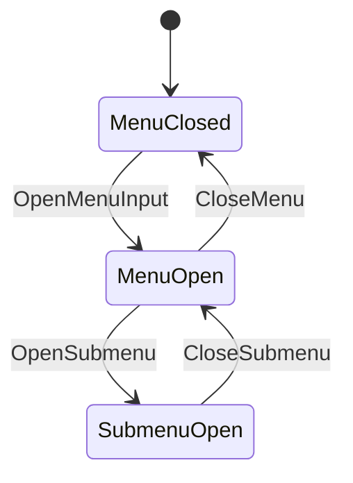
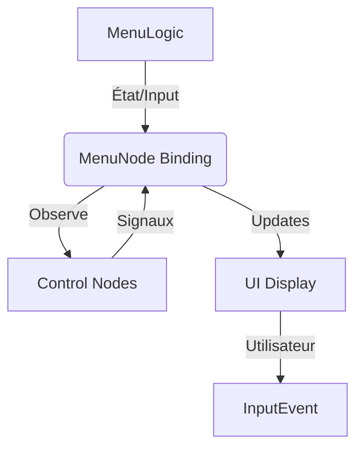
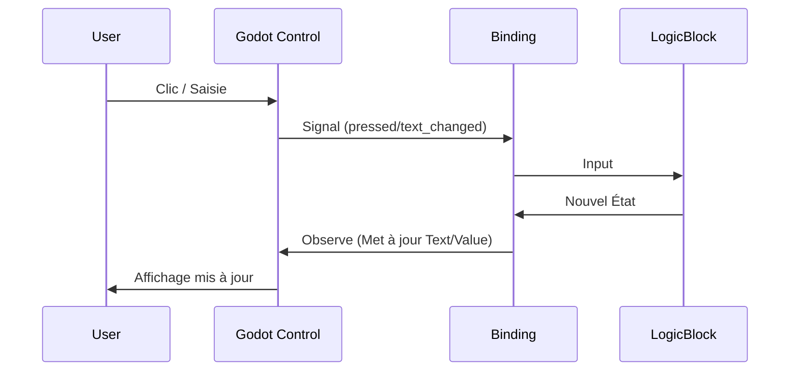

# Système UI Godot 4.x - Architecture Modulaire avec ChickenSoft/LogicBlocks
*Guide ultime pour construire des interfaces utilisateur découplées, réactives et maintenables en Godot 4.x avec C# et ChickenSoft.*

---

## **Contexte**
- **Objectif** : Créer un système UI **découplé**, **testable** et **100% compatible** avec ChickenSoft/LogicBlocks, utilisant les nodes de contrôle Godot (`Button`, `LineEdit`, `Slider`, `TabContainer`, etc.) intégrés dans des bindings réactifs.
- **Public cible** : Développeurs C#/Godot utilisant ChickenSoft pour des jeux 2D/3D avec menus complexes, HUD, dialogues et écrans de paramètres.
- **Prérequis** :
  - Godot 4.2+
  - C# 11+
  - Packages : `ChickenSoft.LogicBlocks`, `ChickenSoft.AutoInject`, `ChickenSoft.Signals`

---

## **Règles d'Architecture Impératives**

### **1. Découplage Strict : Logique ≠ Présentation**
- **UILogicBlock** : Gère la **logique pure** (états UI, inputs utilisateur, navigation).
  - **Interdictions** : Aucune référence directe à Godot (`Control`, `Button`, `Vector2`, etc.).
  - **Obligations** : États (`IState`) et inputs (`IInput`) en `record` immuables.
  - **Responsabilités** : Navigation, validation, transitions d'état, gestion des données.
  
- **UIBinding** : Pont réactif entre LogicBlock et Control nodes.
  - **Responsabilités** :
    - Binding bidirectionnel (état → UI, signaux → LogicBlock).
    - Gestion du cycle de vie (`_Ready`, `_ExitTree`).
    - Connexion des signaux Godot (`pressed`, `value_changed`, `text_changed`).
    - Nettoyage des ressources (`Dispose()`).
  
- **Scènes .tscn** : Uniquement responsable de l'**hiérarchie visuelle** et de l'**export des nodes**. Aucune logique.

### **2. Immutabilité**
- **États** : Toujours utiliser des `record` pour les états (ex: `MenuState`, `DialogState`).
- **Inputs** : Toujours utiliser des `record` pour les inputs (ex: `SelectMenuItemInput`).
- **Transitions** : Utiliser `On<TInput>((input, state) => ...)` pour les transitions d'état.

### **3. Réactivité Basée sur les Signaux**
- **Signaux Godot** : `pressed`, `toggled`, `text_changed`, `value_changed`, `item_selected`, `focus_entered`, `focus_exited`, `visibility_changed`.
- **Binding de Signaux** : Connecter les signaux Godot via le binding pour déclencher les inputs du LogicBlock.
- **Observation d'État** : Utiliser `_binding.Observe<TState>(...)` pour mettre à jour l'UI réactivement quand l'état change.

### **4. Navigation et Focus**
- **Focus Modes** : 
  - `FOCUS_NONE` (0) : Nœuds non interactifs (Label, TextureRect).
  - `FOCUS_CLICK` (1) : Reçoit le focus au clic de souris.
  - `FOCUS_ALL` (2) : Reçoit le focus au clic, Tab, et manettes gamepad (défaut pour Button, LineEdit, etc.).
  
- **Focus Neighbors** : Définir explicitement les `focus_neighbor_*` pour les layouts non linéaires.
- **Grab Focus** : Appeler `grab_focus()` sur le premier widget interactif au chargement de l'écran.

### **5. Thèmes et Styling**
- **Theme Resources** : Créer une ressource `Theme` unique et l'assigner à la racine `Control` de chaque écran.
- **Theme Overrides** : Utiliser `add_theme_*_override()` pour les personnalisations par nœud.
- **Héritage** : L'arborescence Godot marche vers le haut pour trouver la Theme la plus proche.

---

## **Exemples Minimaux**

### **1. LogicBlock : Gestion des États UI**

#### **Fichiers**
- `MenuLogic.State.cs` : États immuables.
- `MenuLogic.Input.cs` : Inputs immuables.
- `MenuLogic.cs` : Bloc logique.

#### **Code**
```csharp
// MenuLogic.State.cs
namespace MyGame.Logic.UI;

public partial class MenuLogic
{
    public interface IState : ChickenSoft.LogicBlocks.StateLogic { }
    public record MenuOpen(int SelectedIndex, bool IsLoading) : IState;
    public record MenuClosed : IState;
    public record SubmenuOpen(string SubmenuName, int SelectedIndex) : IState;
}
```

```csharp
// MenuLogic.Input.cs
namespace MyGame.Logic.UI;

public partial class MenuLogic
{
    public interface IInput : ChickenSoft.LogicBlocks.InputLogic { }
    public record SelectMenuItem(int Index) : IInput;
    public record ConfirmSelection : IInput;
    public record OpenSubmenu(string SubmenuName) : IInput;
    public record CloseSubmenu : IInput;
    public record CloseMenu : IInput;
}
```

```csharp
// MenuLogic.cs
using ChickenSoft.LogicBlocks;

namespace MyGame.Logic.UI;

public partial class MenuLogic : LogicBlock<MenuLogic.IState, MenuLogic.IInput>
{
    protected override IState InitialState => new MenuClosed();

    public MenuLogic()
    {
        // Ouverture du menu
        On<OpenMenuInput>((_, _) =>
            new MenuOpen(SelectedIndex: 0, IsLoading: false));

        // Sélection d'un item
        On<SelectMenuItem, MenuOpen>((input, state) =>
            state with { SelectedIndex = input.Index });

        // Navigation vers un sous-menu
        On<OpenSubmenu, MenuOpen>((input, state) =>
            new SubmenuOpen(input.SubmenuName, SelectedIndex: 0));

        // Retour au menu principal
        On<CloseSubmenu, SubmenuOpen>((_, state) =>
            new MenuOpen(SelectedIndex: 0, IsLoading: false));

        // Fermeture du menu
        On<CloseMenu>((_, state) =>
            new MenuClosed());
    }
}

public record OpenMenuInput : MenuLogic.IInput;
```

---

### **2. Binding : Intégration avec Godot**

#### **Fichier**
- `MenuNode.cs` : Script Godot pour lier le `MenuLogic` aux nodes UI.

#### **Code**
```csharp
// MenuNode.cs
using Godot;
using ChickenSoft.AutoInject;
using ChickenSoft.LogicBlocks;
using MyGame.Logic.UI;

namespace MyGame.Nodes.UI;

public partial class MenuNode : Control, IAutoNode
{
    private MenuLogic.Block _logic = new();
    private MenuLogic.Block.Binding _binding;
    
    private Button _startButton;
    private Button _optionsButton;
    private Button _quitButton;

    public override void _Ready()
    {
        // Récupérer les nœuds
        _startButton = GetNode<Button>("CenterContainer/VBoxContainer/StartButton");
        _optionsButton = GetNode<Button>("CenterContainer/VBoxContainer/OptionsButton");
        _quitButton = GetNode<Button>("CenterContainer/VBoxContainer/QuitButton");

        // Initialiser le binding
        _binding = _logic.Bind();

        // Connecter les signaux Godot
        _startButton.Pressed += () => _logic.Input(new MenuLogic.SelectMenuItem(0));
        _optionsButton.Pressed += () => _logic.Input(new MenuLogic.SelectMenuItem(1));
        _quitButton.Pressed += () => _logic.Input(new MenuLogic.SelectMenuItem(2));

        // Observer les changements d'état
        _binding.Observe<MenuLogic.MenuOpen>(state =>
        {
            UpdateButtonHighlight(state.SelectedIndex);
        });

        // Démarrer la LogicBlock
        _logic.Start();
        
        // Donner le focus au premier bouton
        _startButton.GrabFocus();
    }

    private void UpdateButtonHighlight(int selectedIndex)
    {
        _startButton.Modulate = selectedIndex == 0 ? Colors.Yellow : Colors.White;
        _optionsButton.Modulate = selectedIndex == 1 ? Colors.Yellow : Colors.White;
        _quitButton.Modulate = selectedIndex == 2 ? Colors.Yellow : Colors.White;
    }

    public override void _UnhandledInput(InputEvent @event)
    {
        if (@event.IsActionPressed("ui_accept"))
        {
            _logic.Input(new MenuLogic.ConfirmSelection());
            GetTree().Root.SetInputAsHandled();
        }
        else if (@event.IsActionPressed("ui_cancel"))
        {
            _logic.Input(new MenuLogic.CloseMenu());
            GetTree().Root.SetInputAsHandled();
        }
    }

    public override void _ExitTree()
    {
        _logic.Stop();
        _binding?.Dispose();
    }
}
```

---

### **3. Binding Réactif Avancé : LineEdit et Validation**

#### **Fichier**
- `SearchBoxNode.cs` : Gestion de la saisie utilisateur avec validation.

#### **Code**
```csharp
// SearchBoxNode.cs
using Godot;
using ChickenSoft.AutoInject;
using ChickenSoft.LogicBlocks;
using MyGame.Logic.UI;

namespace MyGame.Nodes.UI;

public partial class SearchBoxNode : Control, IAutoNode
{
    private SearchLogic.Block _logic = new();
    private SearchLogic.Block.Binding _binding;
    
    private LineEdit _searchInput;
    private Label _resultLabel;

    public override void _Ready()
    {
        _searchInput = GetNode<LineEdit>("VBoxContainer/SearchInput");
        _resultLabel = GetNode<Label>("VBoxContainer/ResultLabel");

        _binding = _logic.Bind();

        // Bidirectionnel : LineEdit → LogicBlock
        _searchInput.TextChanged += (newText) =>
        {
            _logic.Input(new SearchLogic.SearchInput(newText));
        };

        // Unidrectionnel : LogicBlock → Label (état → UI)
        _binding.Observe<SearchLogic.SearchResultState>(state =>
        {
            _resultLabel.Text = state.ResultCount > 0
                ? $"Found {state.ResultCount} results"
                : "No results";
            _resultLabel.Modulate = state.ResultCount > 0
                ? Colors.LimeGreen
                : Colors.Red;
        });

        _logic.Start();
        _searchInput.GrabFocus();
    }

    public override void _ExitTree()
    {
        _logic.Stop();
        _binding?.Dispose();
    }
}
```

---

### **4. Scène .tscn : Configuration Visuelle**

#### **Fichier**
- `MainMenu.tscn` : Scène Godot avec structure hiérarchique.

#### **Structure de scène**
```
MainMenu (Control — LayoutPreset: Full Rect)
├── Background (TextureRect — stretch: EXPAND_FIT, anchor: Full Rect)
└── CenterContainer (Control — anchor: Center)
    └── VBoxContainer (separation: 16)
        ├── TitleLabel (Label — text: "Main Menu", font_size: 48)
        ├── StartButton (Button — text: "Start Game", focus_mode: All)
        ├── OptionsButton (Button — text: "Options", focus_mode: All)
        └── QuitButton (Button — text: "Quit", focus_mode: All)
```

---

## **Signaux Godot Courants et Leur Utilisation**

| Signal | Node(s) | Déclenchement | Signature | Utilisation |
|---|---|---|---|---|
| `pressed` | `Button`, `LinkButton` | Clic souris ou confirmation clavier/gamepad | `()` | Validation d'action |
| `toggled` | `Button` (mode toggle), `CheckButton`, `CheckBox` | Changement d'état de bascule | `(button_pressed: bool)` | Options booléennes |
| `text_changed` | `LineEdit`, `TextEdit` | Modification de texte | `(new_text: String)` | Saisie en temps réel |
| `text_submitted` | `LineEdit` | Appui sur Entrée | `(new_text: String)` | Validation du formulaire |
| `value_changed` | `HSlider`, `VSlider`, `SpinBox`, `ScrollBar` | Changement de valeur | `(value: float)` | Volume, luminosité |
| `item_selected` | `OptionButton`, `ItemList`, `TabContainer` | Sélection d'item | `(index: int)` | Menus déroulants |
| `focus_entered` | `Control` (tous) | Reçoit le focus | `()` | Initialisation du focus |
| `focus_exited` | `Control` (tous) | Perd le focus | `()` | Finalisation de l'entrée |
| `mouse_entered` | `Control` (tous) | Souris entre dans le rect | `()` | Survol d'élément |
| `mouse_exited` | `Control` (tous) | Souris sort du rect | `()` | Désélection par survol |
| `visibility_changed` | `Control` (tous) | Visibilité change | `()` | Affichage/masquage d'écran |

---

## **Patterns de Contrôle et Binding**

### **1. Slider / HSlider (Son, Luminosité)**

```csharp
// AudioLogic.cs
public partial class AudioLogic : LogicBlock<AudioLogic.IState, AudioLogic.IInput>
{
    public record VolumeState(float MasterVolume, float MusicVolume, float SFXVolume) : IState;
    public record SetMasterVolumeInput(float Volume) : IInput;
    
    protected override IState InitialState => new VolumeState(0.8f, 0.6f, 0.7f);

    public AudioLogic()
    {
        On<SetMasterVolumeInput>((input, state) =>
            state with { MasterVolume = Mathf.Clamp(input.Volume, 0f, 1f) });
    }
}

// AudioNode.cs
public partial class AudioNode : Control, IAutoNode
{
    private AudioLogic.Block _logic = new();
    private AudioLogic.Block.Binding _binding;
    private HSlider _masterVolumeSlider;

    public override void _Ready()
    {
        _masterVolumeSlider = GetNode<HSlider>("VBoxContainer/MasterVolumeSlider");
        _binding = _logic.Bind();

        // Bidirectionnel
        _masterVolumeSlider.ValueChanged += (value) =>
        {
            _logic.Input(new AudioLogic.SetMasterVolumeInput((float)value));
            AudioServer.SetBusVolumeDb(
                AudioServer.GetBusIndex("Master"),
                Mathf.LinearToDb((float)value)
            );
        };

        // Unidrectionnel (état → UI)
        _binding.Observe<AudioLogic.VolumeState>(state =>
        {
            _masterVolumeSlider.Value = state.MasterVolume;
        });

        _logic.Start();
    }

    public override void _ExitTree()
    {
        _logic.Stop();
        _binding?.Dispose();
    }
}
```

---

### **2. TabContainer (Écrans à Onglets)**

```csharp
// SettingsLogic.cs
public partial class SettingsLogic : LogicBlock<SettingsLogic.IState, SettingsLogic.IInput>
{
    public record SettingsState(int ActiveTab, float MasterVolume, bool Fullscreen) : IState;
    public record SelectTabInput(int TabIndex) : IInput;
    public record SetFullscreenInput(bool Enabled) : IInput;
    
    protected override IState InitialState => new SettingsState(0, 0.8f, false);

    public SettingsLogic()
    {
        On<SelectTabInput>((input, state) =>
            state with { ActiveTab = input.TabIndex });

        On<SetFullscreenInput>((input, state) =>
            state with { Fullscreen = input.Enabled });
    }
}

// SettingsNode.cs
public partial class SettingsNode : Control, IAutoNode
{
    private SettingsLogic.Block _logic = new();
    private SettingsLogic.Block.Binding _binding;
    private TabContainer _tabContainer;
    private CheckButton _fullscreenCheck;

    public override void _Ready()
    {
        _tabContainer = GetNode<TabContainer>("VBoxContainer/TabContainer");
        _fullscreenCheck = GetNode<CheckButton>(
            "VBoxContainer/TabContainer/VideoTab/HBoxContainer/FullscreenCheck");

        _binding = _logic.Bind();

        // Changement d'onglet
        _tabContainer.TabChanged += (tabIndex) =>
        {
            _logic.Input(new SettingsLogic.SelectTabInput((int)tabIndex));
        };

        // Plein écran
        _fullscreenCheck.Toggled += (pressed) =>
        {
            _logic.Input(new SettingsLogic.SetFullscreenInput(pressed));
            DisplayServer.WindowSetMode(pressed
                ? DisplayServer.WindowMode.Fullscreen
                : DisplayServer.WindowMode.Windowed);
        };

        // Observer l'état pour synchroniser l'UI
        _binding.Observe<SettingsLogic.SettingsState>(state =>
        {
            _tabContainer.CurrentTab = state.ActiveTab;
            _fullscreenCheck.ButtonPressed = state.Fullscreen;
        });

        _logic.Start();
    }

    public override void _ExitTree()
    {
        _logic.Stop();
        _binding?.Dispose();
    }
}
```

---

### **3. Menu en Pause (Overlay avec process_mode: ALWAYS)**

```csharp
// PauseLogic.cs
public partial class PauseLogic : LogicBlock<PauseLogic.IState, PauseLogic.IInput>
{
    public record PausedState(bool IsPaused, string SelectedOption) : IState;
    public record PauseGameInput : IInput;
    public record ResumeGameInput : IInput;
    public record SelectOptionInput(string Option) : IInput;
    
    protected override IState InitialState => new PausedState(false, "");

    public PauseLogic()
    {
        On<PauseGameInput>((_, _) => new PausedState(true, "Resume"));
        On<ResumeGameInput>((_, _) => new PausedState(false, ""));
        On<SelectOptionInput, PausedState>((input, state) =>
            state with { SelectedOption = input.Option });
    }
}

// PauseMenuNode.cs
public partial class PauseMenuNode : Control, IAutoNode
{
    private PauseLogic.Block _logic = new();
    private PauseLogic.Block.Binding _binding;
    private Button _resumeButton;
    private Button _optionsButton;
    private Button _quitButton;

    public override void _Ready()
    {
        // IMPORTANT : Continuer le traitement en pause
        ProcessMode = ProcessModeEnum.Always;

        _resumeButton = GetNode<Button>("CenterContainer/PanelContainer/VBoxContainer/ResumeButton");
        _optionsButton = GetNode<Button>("CenterContainer/PanelContainer/VBoxContainer/OptionsButton");
        _quitButton = GetNode<Button>("CenterContainer/PanelContainer/VBoxContainer/QuitButton");

        _binding = _logic.Bind();

        _resumeButton.Pressed += () =>
        {
            _logic.Input(new PauseLogic.ResumeGameInput());
            GetTree().Paused = false;
            QueueFree();
        };

        _optionsButton.Pressed += () =>
        {
            _logic.Input(new PauseLogic.SelectOptionInput("Options"));
        };

        _quitButton.Pressed += () =>
        {
            _logic.Input(new PauseLogic.SelectOptionInput("QuitMenu"));
            GetTree().Paused = false;
            QueueFree();
        };

        _logic.Start();
        _resumeButton.GrabFocus();
    }

    public override void _UnhandledInput(InputEvent @event)
    {
        if (@event.IsActionPressed("ui_cancel"))
        {
            _logic.Input(new PauseLogic.ResumeGameInput());
            GetTree().Paused = false;
            QueueFree();
            GetTree().Root.SetInputAsHandled();
        }
    }

    public override void _ExitTree()
    {
        _logic.Stop();
        _binding?.Dispose();
    }
}
```

---

## **Gestion du Focus et Navigation**

### **Configuration des Neighbors**

```csharp
// Dans MenuNode._Ready()
var startButton = GetNode<Button>("StartButton");
var optionsButton = GetNode<Button>("OptionsButton");
var quitButton = GetNode<Button>("QuitButton");

// Navigation verticale
startButton.FocusNeighborBottom = optionsButton.GetPath();
optionsButton.FocusNeighborTop = startButton.GetPath();
optionsButton.FocusNeighborBottom = quitButton.GetPath();
quitButton.FocusNeighborTop = optionsButton.GetPath();

// Wrapping circulaire
quitButton.FocusNeighborBottom = startButton.GetPath();
startButton.FocusNeighborTop = quitButton.GetPath();
```

---

## **Système de Thèmes et Styling**

### **1. Créer une Ressource Theme**

```csharp
// Dans _Ready() ou code de setup
var theme = new Theme();

// Ajouter des fonts
var primaryFont = GD.Load<FontFile>("res://assets/fonts/Roboto-Regular.ttf");
theme.SetFont("font", "Label", primaryFont);
theme.SetFontSize("font_size", "Label", 24);

// Ajouter des couleurs
theme.SetColor("font_color", "Label", Colors.White);
theme.SetColor("font_color", "Button", new Color(0.8f, 0.8f, 0.8f));

// Assigner à la racine Control
RootControl.Theme = theme;
```

---

### **2. StyleBoxFlat pour Panneaux**

```csharp
// Dans DialogPanelNode._Ready()
var styleBox = new StyleBoxFlat
{
    BgColor = new Color(0.1f, 0.1f, 0.15f, 0.95f),
    CornerRadiusTopLeft = 8,
    CornerRadiusTopRight = 8,
    CornerRadiusBottomLeft = 8,
    CornerRadiusBottomRight = 8,
    BorderWidthLeft = 2,
    BorderWidthTop = 2,
    BorderWidthRight = 2,
    BorderWidthBottom = 2,
    BorderColor = new Color(0.4f, 0.6f, 1.0f, 1.0f),
};

GetNode<PanelContainer>("DialogPanel").AddThemeStyleboxOverride("panel", styleBox);
```

---

## **Bonnes Pratiques**

### **1. Immutabilité Stricte**
- Toujours utiliser `record` pour les états et inputs.
- Ne jamais modifier directement les propriétés d'état.
- Utiliser le pattern `state with { Property = newValue }` pour les transitions.

### **2. Séparation des Responsabilités**
- **LogicBlock** = **0% Godot**, 100% logique métier.
- **Binding** = Ponts réactifs entre LogicBlock et Godot.
- **Scènes** = Hiérarchie visuelle seulement.

### **3. Nettoyage des Ressources**
- Toujours appeler `_logic.Stop()` et `_binding?.Dispose()` dans `_ExitTree()`.
- Déconnecter les signaux manuellement si nécessaire.

### **4. Testabilité**
- LogicBlocks sont **100% testables** sans Godot.
- Les bindings peuvent être testés avec des mocks Godot.
- Utiliser des tests unitaires pour la logique métier.

---

## **Erreurs Courantes à Éviter**

| ❌ Anti-Pattern | ✅ Correction | Explication |
|----------------|--------------|-------------|
| Mélanger logique et présentation dans le même fichier. | Séparer LogicBlock, Binding et Scène. | Permet le test et la réutilisabilité. |
| Modifier directement `Text` ou `Value` depuis la LogicBlock. | Utiliser l'observation d'état dans le Binding. | Les LogicBlocks ne connaissent pas Godot. |
| Oublier `ProcessMode = ALWAYS` pour les menus en pause. | Assigner explicitement dans `_Ready()`. | Sinon le menu se met en pause aussi. |
| Ne pas appeler `grab_focus()` au chargement de l'écran. | Appeler sur le premier widget après `_Ready()`. | Permet une navigation au clavier/gamepad immédiate. |
| Stocker les références de binding en dehors de la classe. | Toujours les garder en tant que champs privés. | Évite les accès croisés et les fuites mémoire. |
| Connecter/déconnecter des signaux manuellement. | Utiliser les bindings ChickenSoft. | Automatise le nettoyage. |
| Focus modes incorrects (`FOCUS_NONE` sur Button). | `FOCUS_ALL` par défaut pour Buttons, `FOCUS_NONE` pour Labels. | Permet la navigation au Tab. |

---

## **Diagrammes**

### **1. Flux des États UI**


### **2. Architecture Globale UI**


### **3. Binding Bidirectionnel**


---

## **Recettes Pratiques avec ChickenSoft**

### **1. Menu Principal Complet**

```csharp
// scenes/screens/main_menu.tscn (export StartButton, OptionsButton, QuitButton)
// Code C# attaché
public partial class MainMenuNode : Control, IAutoNode
{
    private MenuLogic.Block _logic = new();
    private MenuLogic.Block.Binding _binding;

    public override void _Ready()
    {
        var startButton = GetNode<Button>("CenterContainer/VBoxContainer/StartButton");
        var optionsButton = GetNode<Button>("CenterContainer/VBoxContainer/OptionsButton");
        var quitButton = GetNode<Button>("CenterContainer/VBoxContainer/QuitButton");

        _binding = _logic.Bind();

        startButton.Pressed += () => _logic.Input(new MenuLogic.SelectMenuItem(0));
        optionsButton.Pressed += () => _logic.Input(new MenuLogic.SelectMenuItem(1));
        quitButton.Pressed += () => _logic.Input(new MenuLogic.SelectMenuItem(2));

        _binding.Observe<MenuLogic.MenuOpen>(state =>
        {
            startButton.Modulate = state.SelectedIndex == 0 ? Colors.Yellow : Colors.White;
            optionsButton.Modulate = state.SelectedIndex == 1 ? Colors.Yellow : Colors.White;
            quitButton.Modulate = state.SelectedIndex == 2 ? Colors.Yellow : Colors.White;
        });

        _logic.Start();
        startButton.GrabFocus();
    }

    public override void _ExitTree()
    {
        _logic.Stop();
        _binding?.Dispose();
    }
}
```

### **2. Écran de Paramètres Onglets**

```csharp
// Voir SettingsNode.cs dans la section Patterns
```

### **3. HUD Dynamique avec Mise à Jour d'État**

```csharp
// GameHUDLogic.cs
public partial class GameHUDLogic : LogicBlock<GameHUDLogic.IState, GameHUDLogic.IInput>
{
    public record HUDState(int Health, int Score, float TimeRemaining) : IState;
    public record UpdateHealthInput(int NewHealth) : IInput;
    public record UpdateScoreInput(int ScoreDelta) : IInput;
    
    protected override IState InitialState => new HUDState(100, 0, 300f);

    public GameHUDLogic()
    {
        On<UpdateHealthInput>((input, state) =>
            state with { Health = Mathf.Max(0, input.NewHealth) });

        On<UpdateScoreInput>((input, state) =>
            state with { Score = state.Score + input.ScoreDelta });
    }
}

// GameHUDNode.cs
public partial class GameHUDNode : Control, IAutoNode
{
    private GameHUDLogic.Block _logic = new();
    private GameHUDLogic.Block.Binding _binding;
    
    private Label _healthLabel;
    private Label _scoreLabel;
    private ProgressBar _healthBar;

    public override void _Ready()
    {
        _healthLabel = GetNode<Label>("HBoxContainer/HealthLabel");
        _scoreLabel = GetNode<Label>("HBoxContainer/ScoreLabel");
        _healthBar = GetNode<ProgressBar>("HBoxContainer/HealthBar");

        _binding = _logic.Bind();

        // Observer les changements d'état
        _binding.Observe<GameHUDLogic.HUDState>(state =>
        {
            _healthLabel.Text = $"HP: {state.Health}";
            _scoreLabel.Text = $"Score: {state.Score}";
            _healthBar.Value = state.Health;
        });

        _logic.Start();
    }

    // Public pour être appelé depuis le code du joueur/ennemi
    public void TakeDamage(int amount) =>
        _logic.Input(new GameHUDLogic.UpdateHealthInput(100 - amount));

    public void AddScore(int amount) =>
        _logic.Input(new GameHUDLogic.UpdateScoreInput(amount));

    public override void _ExitTree()
    {
        _logic.Stop();
        _binding?.Dispose();
    }
}
```

---

## **Ressources Complémentaires**

- **Focus Modes** : `FOCUS_NONE` (0), `FOCUS_CLICK` (1), `FOCUS_ALL` (2).
- **Signaux par Type de Node** : Voir tableau des signaux courants ci-dessus.
- **ChickenSoft Documentation** : https://github.com/chickensoft-games/LogicBlocks
- **Godot UI Documentation** : https://docs.godotengine.org/en/stable/tutorials/ui/index.html

---

## **Checklist Finale**

- [ ] LogicBlock sans aucune dépendance Godot.
- [ ] États et Inputs définis en `record` immuables.
- [ ] Binding connecte tous les signaux.
- [ ] `grab_focus()` appelé au chargement de l'écran.
- [ ] `ProcessMode = ALWAYS` pour les overlays en pause.
- [ ] Nettoyage complet dans `_ExitTree()`.
- [ ] Tests unitaires pour la LogicBlock.
- [ ] Navigation au clavier/gamepad testée.
- [ ] Thème assignée à la racine `Control`.
- [ ] Focus neighbors configurés pour les layouts non linéaires.
