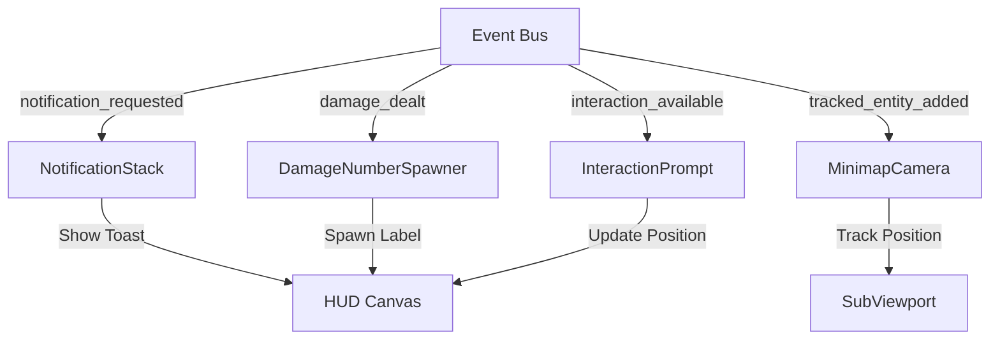
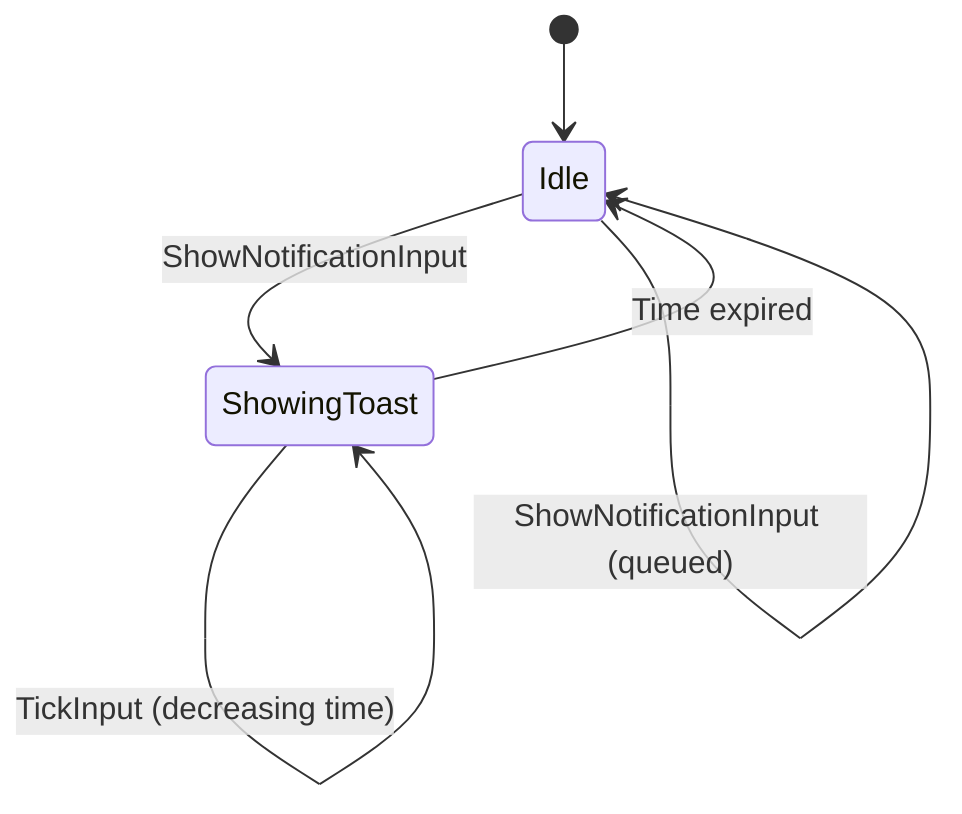
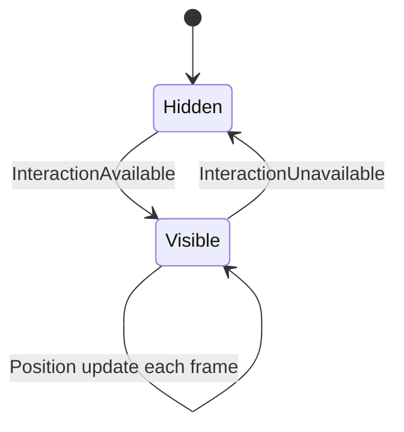
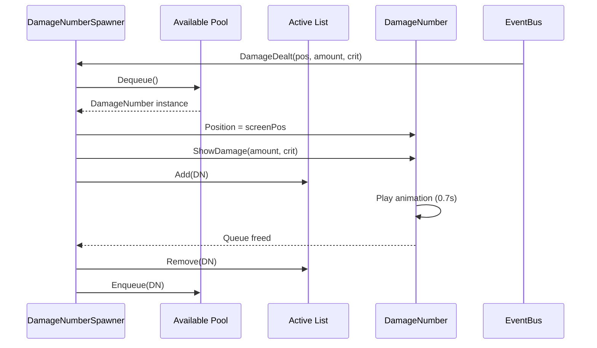

# Système HUD Complet - Architecture Modulaire avec ChickenSoft/LogicBlocks
*Guide ultime pour intégrer un système HUD performant, découplé et évolutif dans Godot 4.x avec notifications, damage numbers, interaction prompts et minimap.*

---

## **Contexte**
- **Objectif** : Créer un système HUD **modulaire**, **découplé** et **100% compatible** avec ChickenSoft/LogicBlocks, en gérant notifications toast, damage numbers flottants, interaction prompts dynamiques et minimap en temps réel.
- **Public cible** : Développeurs C#/Godot utilisant ChickenSoft pour des jeux 2D/3D avec interface utilisateur avancée (RPG, roguelike, action-adventure).
- **Prérequis** :
  - Godot 4.2+
  - C# 11+
  - Packages : `ChickenSoft.LogicBlocks`, `ChickenSoft.AutoInject`
  - CanvasLayer pour HUD séparé du monde

---

## **Règles d'Architecture Impératives**

### **1. Découplage Strict**
- **LogicBlock** : Gère la **logique pure** des systèmes HUD (états, inputs, transitions).
  - **Interdictions** : Aucune référence à Godot (`Node`, `Vector2`, UI, etc.).
  - **Obligations** : États (`IState`) et inputs (`IInput`) en `record` immuables.
- **Binding** : Pont entre Godot et les LogicBlocks.
  - **Responsabilités** :
    - Injection des dépendances via `IAutoNode`.
    - Gestion du cycle de vie (`_Ready`, `_ExitTree`).
    - Nettoyage des ressources (`Dispose()`).
- **EventBus** : Centralise la communication entre systèmes (damage dealt, interaction triggered, etc.).
- **Scènes .tscn** : Uniquement responsable de l'**affichage** et de l'**export des nœuds UI**.

### **2. Immutabilité**
- **États** : Toujours utiliser des `record` pour les états (ex: `HudState`).
- **Inputs** : Toujours utiliser des `record` pour les inputs (ex: `ShowNotificationInput`).
- **Transitions** : Utiliser `On<TInput>((input, state) => ...)` pour les transitions d'état.

### **3. Communication par Événements**
- **EventBus (Autoload)** : Centralise les signaux (notifications, damage, interactions).
- **Pas de références directes** : Les systèmes communiquent via l'EventBus, jamais directement.
- **Pattern Observer** : Chaque système écoute les événements pertinents.

---

## **Architecture Globale**

```
HUD System (CanvasLayer)
├── NotificationStack (VBoxContainer + LogicBlock)
├── DamageNumberSpawner (Node + Object Pool)
├── InteractionPrompt (Control + LogicBlock)
└── MinimapContainer (SubViewportContainer + Camera2D)

EventBus (Autoload)
├── notification_requested
├── damage_dealt
├── interaction_available
└── interaction_unavailable
```

---

## **Exemples Minimaux**

### **1. EventBus Global**

```csharp
// EventBus.cs — Autoload (ajout via project.godot)
using Godot;

namespace MyGame.Bus;

public partial class EventBus : Node
{
    public static EventBus Instance { get; private set; }

    // Notifications toast
    [Signal] public delegate void NotificationRequestedEventHandler(string message);

    // Damage numbers
    [Signal] public delegate void DamageDealtEventHandler(Vector2 worldPosition, int amount, bool isCritical);

    // Interactions
    [Signal] public delegate void InteractionAvailableEventHandler(Node2D interactable, string actionName);
    [Signal] public delegate void InteractionUnavailableEventHandler();

    // Minimap tracking
    [Signal] public delegate void TrackedEntityAddedEventHandler(Node2D entity, Vector4 tint);
    [Signal] public delegate void TrackedEntityRemovedEventHandler(Node2D entity);

    public override void _EnterTree()
    {
        if (Instance != null)
        {
            QueueFree();
            return;
        }
        Instance = this;
    }
}
```

---

### **2. Notification System (LogicBlock + Binding)**

#### **LogicBlock : Gestion des États des Notifications**

```csharp
// NotificationLogic.State.cs
namespace MyGame.Logic.UI;

public partial class NotificationLogic
{
    public interface IState : ChickenSoft.LogicBlocks.StateLogic { }
    public record Idle : IState;
    public record ShowingToast(string Message, float RemainingTime) : IState;
}
```

```csharp
// NotificationLogic.Input.cs
namespace MyGame.Logic.UI;

public partial class NotificationLogic
{
    public interface IInput : ChickenSoft.LogicBlocks.InputLogic { }
    public record ShowNotificationInput(string Message, float Duration) : IInput;
    public record DismissNotificationInput : IInput;
    public record TickInput(float Delta) : IInput;
}
```

```csharp
// NotificationLogic.cs
using ChickenSoft.LogicBlocks;

namespace MyGame.Logic.UI;

public partial class NotificationLogic : LogicBlock<NotificationLogic.IState, NotificationLogic.IInput>
{
    protected override IState InitialState => new Idle();

    public NotificationLogic()
    {
        // Montrer une notification
        On<ShowNotificationInput>((input, _) =>
            new ShowingToast(input.Message, input.Duration));

        // Décompter le temps
        On<TickInput, ShowingToast>((input, state) =>
        {
            var newRemainingTime = state.RemainingTime - input.Delta;
            return newRemainingTime <= 0 ? new Idle() : state with { RemainingTime = newRemainingTime };
        });

        // Rejeter les notifications pendant qu'une est affichée
        On<ShowNotificationInput, ShowingToast>((input, state) =>
            state);
    }
}
```

#### **Binding : NotificationStack**

```csharp
// NotificationStack.cs
using Godot;
using ChickenSoft.AutoInject;
using ChickenSoft.LogicBlocks;
using MyGame.Logic.UI;
using MyGame.Bus;
using System.Collections.Generic;

namespace MyGame.UI;

public partial class NotificationStack : VBoxContainer, IAutoNode
{
    [Export] public PackedScene ToastScene { get; set; }
    [Export] public int MaxVisible { get; set; } = 5;
    [Export] public float AutoDismissTime { get; set; } = 3.0f;

    private readonly NotificationLogic.Block _logic = new();
    private NotificationLogic.Block.Binding _binding;
    private readonly Queue<string> _queue = new();
    private readonly List<Control> _activeToasts = new();

    public override void _Ready()
    {
        _binding = _logic.Bind();

        _binding.Handle<NotificationLogic.ShowingToast>(state =>
        {
            _ShowToast(state.Message);
        });

        _binding.Handle<NotificationLogic.Idle>(_ =>
        {
            _ProcessQueue();
        });

        _logic.Start();

        // Connexion aux événements du bus
        EventBus.Instance.NotificationRequested += Push;
    }

    public override void _Process(double delta)
    {
        if (_logic.State is NotificationLogic.ShowingToast state)
        {
            _logic.Input(new NotificationLogic.TickInput((float)delta));
        }
    }

    public override void _ExitTree()
    {
        EventBus.Instance.NotificationRequested -= Push;
        _logic.Stop();
        _binding.Dispose();
    }

    public void Push(string message)
    {
        if (_logic.State is NotificationLogic.Idle)
        {
            _logic.Input(new NotificationLogic.ShowNotificationInput(message, AutoDismissTime));
        }
        else
        {
            _queue.Enqueue(message);
        }
    }

    private void _ShowToast(string message)
    {
        if (ToastScene == null)
            return;

        var toast = ToastScene.Instantiate<Control>();
        var label = toast.GetNode<Label>("MessageLabel");
        label.Text = message;
        toast.Modulate = new Color(1, 1, 1, 0);
        AddChild(toast);
        MoveChild(toast, 0); // Ajouter en haut
        _activeToasts.Add(toast);

        // Fade in
        var tween = CreateTween();
        tween.TweenProperty(toast, "modulate:a", 1.0f, 0.2f);

        // Supprimer après durée
        await ToSignal(GetTree(), SceneTree.SignalName.ProcessFrame);
        await Task.Delay((int)(AutoDismissTime * 1000));
        _DismissToast(toast);
    }

    private void _DismissToast(Control toast)
    {
        if (!IsNodeValid(toast))
            return;

        _activeToasts.Remove(toast);
        var tween = toast.CreateTween();
        tween.TweenProperty(toast, "modulate:a", 0.0f, 0.2f);
        tween.Finished += () =>
        {
            if (IsNodeValid(toast))
                toast.QueueFree();
            _logic.Input(new NotificationLogic.DismissNotificationInput());
        };
    }

    private void _ProcessQueue()
    {
        if (_queue.Count > 0)
        {
            var message = _queue.Dequeue();
            _logic.Input(new NotificationLogic.ShowNotificationInput(message, AutoDismissTime));
        }
    }

    private bool IsNodeValid(Node node)
    {
        return node != null && !node.IsQueuedForDeletion();
    }
}
```

---

### **3. Damage Numbers System**

#### **DamageNumber Scene (Label)**

```csharp
// DamageNumber.cs — Attach to a Label in DamageNumber.tscn
using Godot;

namespace MyGame.UI;

public partial class DamageNumber : Label
{
    [Export] public float RiseDistance { get; set; } = 40.0f;
    [Export] public float Lifetime { get; set; } = 0.7f;
    [Export] public Color CriticalColor { get; set; } = new(1.0f, 0.3f, 0.1f);
    [Export] public Color NormalColor { get; set; } = new(1.0f, 1.0f, 1.0f);

    public void ShowDamage(int amount, bool isCritical = false)
    {
        Text = isCritical ? $"!{amount}" : amount.ToString();
        Modulate = new Color(Modulate, 1.0f);
        AddThemeFontSizeOverride("font_size", isCritical ? 32 : 24);
        Modulate = isCritical ? CriticalColor : NormalColor;
        _PlayAnimation();
    }

    private void _PlayAnimation()
    {
        var tween = CreateTween();
        tween.SetParallel(true);

        // Rise upward
        tween.TweenProperty(this, "position:y", Position.Y - RiseDistance, Lifetime)
            .SetEase(Tween.EaseType.Out)
            .SetTrans(Tween.TransitionType.Quad);

        // Fade out (start fading at halfway point)
        tween.TweenProperty(this, "modulate:a", 0.0f, Lifetime * 0.5f)
            .SetDelay(Lifetime * 0.5f)
            .SetEase(Tween.EaseType.In);

        tween.Finished += QueueFree;
    }
}
```

#### **DamageNumber Spawner (Object Pool)**

```csharp
// DamageNumberSpawner.cs
using Godot;
using ChickenSoft.AutoInject;
using MyGame.Bus;
using System.Collections.Generic;

namespace MyGame.UI;

public partial class DamageNumberSpawner : Node, IAutoNode
{
    [Export] public PackedScene DamageNumberScene { get; set; }
    [Export] public int PoolSize { get; set; } = 20;

    private readonly Queue<DamageNumber> _availablePool = new();
    private readonly List<DamageNumber> _activeNumbers = new();

    public override void _Ready()
    {
        // Pré-instancier le pool
        for (int i = 0; i < PoolSize; i++)
        {
            var dn = DamageNumberScene.Instantiate<DamageNumber>();
            dn.Visible = false;
            AddChild(dn);
            _availablePool.Enqueue(dn);
        }

        // Connexion aux événements
        EventBus.Instance.DamageDealt += OnDamageDealt;
    }

    public override void _ExitTree()
    {
        EventBus.Instance.DamageDealt -= OnDamageDealt;
    }

    public void OnDamageDealt(Vector2 worldPosition, int amount, bool isCritical)
    {
        Spawn(worldPosition, amount, isCritical);
    }

    public void Spawn(Vector2 worldPosition, int amount, bool isCritical = false)
    {
        if (DamageNumberScene == null)
            return;

        var screenPos = GetViewport().GetCanvasTransform() * worldPosition;

        DamageNumber dn;
        if (_availablePool.Count > 0)
        {
            dn = _availablePool.Dequeue();
        }
        else
        {
            // Pool is empty, create new
            dn = DamageNumberScene.Instantiate<DamageNumber>();
            AddChild(dn);
        }

        dn.Position = screenPos;
        dn.Visible = true;
        dn.ShowDamage(amount, isCritical);
        _activeNumbers.Add(dn);

        // Retourner au pool après animation
        GetTree().CreateTimer(dn.Lifetime).Timeout += () =>
        {
            if (IsNodeValid(dn))
            {
                dn.Visible = false;
                _activeNumbers.Remove(dn);
                _availablePool.Enqueue(dn);
            }
        };
    }

    private bool IsNodeValid(Node node)
    {
        return node != null && !node.IsQueuedForDeletion();
    }
}
```

---

### **4. Interaction Prompt System**

#### **LogicBlock : Gestion des Interactions**

```csharp
// InteractionLogic.State.cs
namespace MyGame.Logic.UI;

public partial class InteractionLogic
{
    public interface IState : ChickenSoft.LogicBlocks.StateLogic { }
    public record Hidden : IState;
    public record Visible(string ActionName) : IState;
}
```

```csharp
// InteractionLogic.Input.cs
namespace MyGame.Logic.UI;

public partial class InteractionLogic
{
    public interface IInput : ChickenSoft.LogicBlocks.InputLogic { }
    public record ShowPromptInput(string ActionName) : IInput;
    public record HidePromptInput : IInput;
}
```

```csharp
// InteractionLogic.cs
using ChickenSoft.LogicBlocks;

namespace MyGame.Logic.UI;

public partial class InteractionLogic : LogicBlock<InteractionLogic.IState, InteractionLogic.IInput>
{
    protected override IState InitialState => new Hidden();

    public InteractionLogic()
    {
        On<ShowPromptInput>((input, _) =>
            new Visible(input.ActionName));

        On<HidePromptInput>((_, _) =>
            new Hidden());
    }
}
```

#### **Binding : InteractionPrompt**

```csharp
// InteractionPrompt.cs — Attach to a Label in HUD CanvasLayer
using Godot;
using ChickenSoft.AutoInject;
using ChickenSoft.LogicBlocks;
using MyGame.Logic.UI;
using MyGame.Bus;

namespace MyGame.UI;

public partial class InteractionPrompt : Label, IAutoNode
{
    [Export] public Vector2 Offset { get; set; } = new(0.0f, -48.0f);

    private readonly InteractionLogic.Block _logic = new();
    private InteractionLogic.Block.Binding _binding;
    private Node2D _target;

    public override void _Ready()
    {
        _binding = _logic.Bind();

        _binding.Handle<InteractionLogic.Visible>(state =>
        {
            Show();
        });

        _binding.Handle<InteractionLogic.Hidden>(_ =>
        {
            Hide();
        });

        _logic.Start();
        Hide();

        // Connexion aux événements
        EventBus.Instance.InteractionAvailable += OnInteractionAvailable;
        EventBus.Instance.InteractionUnavailable += OnInteractionUnavailable;
    }

    public override void _Process(double delta)
    {
        if (_target != null && Visible)
        {
            var screenPos = GetViewport().GetCanvasTransform() * _target.GlobalPosition;
            GlobalPosition = screenPos + Offset;
        }
    }

    public override void _ExitTree()
    {
        EventBus.Instance.InteractionAvailable -= OnInteractionAvailable;
        EventBus.Instance.InteractionUnavailable -= OnInteractionUnavailable;
        _logic.Stop();
        _binding.Dispose();
    }

    public void OnInteractionAvailable(Node2D interactable, string actionName)
    {
        _target = interactable;
        var keyLabel = _GetKeyLabel(actionName);
        Text = $"Press {keyLabel} to interact";
        _logic.Input(new InteractionLogic.ShowPromptInput(actionName));
    }

    public void OnInteractionUnavailable()
    {
        _target = null;
        _logic.Input(new InteractionLogic.HidePromptInput());
    }

    private static string _GetKeyLabel(string actionName)
    {
        var events = InputMap.ActionGetEvents(actionName);
        foreach (var ev in events)
        {
            if (ev is InputEventKey key)
                return key.AsTextPhysicalKeycode();
            if (ev is InputEventJoypadButton btn)
                return btn.AsText();
        }
        return $"[{actionName}]";
    }
}
```

#### **Interactable Component**

```csharp
// Interactable.cs — Attach to Area2D on interactable objects
using Godot;
using MyGame.Bus;

namespace MyGame.Interaction;

public partial class Interactable : Area2D
{
    [Export] public string ActionName { get; set; } = "interact";

    public override void _Ready()
    {
        BodyEntered += OnBodyEntered;
        BodyExited += OnBodyExited;
    }

    public override void _ExitTree()
    {
        BodyEntered -= OnBodyEntered;
        BodyExited -= OnBodyExited;
    }

    private void OnBodyEntered(Node2D body)
    {
        if (!body.IsInGroup("player"))
            return;
        EventBus.Instance.EmitSignal(EventBus.SignalName.InteractionAvailable, this, ActionName);
    }

    private void OnBodyExited(Node2D body)
    {
        if (!body.IsInGroup("player"))
            return;
        EventBus.Instance.EmitSignal(EventBus.SignalName.InteractionUnavailable);
    }
}
```

---

### **5. Minimap System**

#### **MinimapCamera**

```csharp
// MinimapCamera.cs — Attach to Camera2D inside SubViewport
using Godot;
using ChickenSoft.AutoInject;

namespace MyGame.UI;

public partial class MinimapCamera : Camera2D, IAutoNode
{
    [Export] public Node2D FollowTarget { get; set; }
    [Export] public float FollowSpeed { get; set; } = 10.0f;

    public override void _Process(double delta)
    {
        if (FollowTarget == null)
            return;
        GlobalPosition = GlobalPosition.Lerp(FollowTarget.GlobalPosition, FollowSpeed * (float)delta);
    }
}
```

#### **Minimap Tracked Entity**

```csharp
// MinimapTrackedEntity.cs — Attach to entity to show on minimap
using Godot;
using MyGame.Bus;

namespace MyGame.UI;

public partial class MinimapTrackedEntity : Node2D
{
    [Export] public Vector4 MinimapTint { get; set; } = Colors.White;

    private Sprite2D _minimapDot;

    public override void _Ready()
    {
        // Create small dot for minimap
        _minimapDot = new Sprite2D
        {
            Texture = GD.Load<Texture2D>("res://Assets/UI/minimap_dot.png"),
            Scale = Vector2.One * 2.0f,
            Modulate = MinimapTint
        };
        AddChild(_minimapDot);
        _minimapDot.TopLevel = true;

        // Notify minimap
        EventBus.Instance.EmitSignal(EventBus.SignalName.TrackedEntityAdded, this, MinimapTint);
    }

    public override void _ExitTree()
    {
        EventBus.Instance.EmitSignal(EventBus.SignalName.TrackedEntityRemoved, this);
    }
}
```

---

## **Bonnes Pratiques**

### **1. Organisation des Scènes**

```
HUD (CanvasLayer — layer: 128)
├── NotificationStack (VBoxContainer — pos: top-right)
│   └── ToastNotification.tscn (instance)
├── DamageNumbersLayer (Node2D)
│   └── DamageNumberSpawner.cs (attacher)
├── InteractionPrompt (Label)
├── MinimapContainer (SubViewportContainer — size: 128x128)
│   └── MinimapViewport (SubViewport — size: 256x256)
│       ├── MinimapCamera.cs
│       └── (world nodes render via cull_mask)
└── (autres UI)
```

### **2. Utilisation de Visibility Layers**

Pour le minimap :
- **Layer 1** : World (TileMap, terrain)
- **Layer 2** : Minimap indicators (player dot, enemies)
- Main Camera `cull_mask` = 1 (world seulement)
- Minimap Camera `cull_mask` = 3 (world + minimap)

### **3. Patterns ChickenSoft**

- **EventBus** : Évite les références directes entre systèmes.
- **LogicBlocks** : Centralise la logique métier séparée de Godot.
- **IAutoNode** : Pour l'injection de dépendances et l'initialisation retardée.
- **Dispose Pattern** : Toujours appeler `_binding.Dispose()` dans `_ExitTree`.

### **4. Optimisations HUD**

- **Object Pooling** : DamageNumbers réutilisent les instances au lieu de créer/détruire.
- **SubViewport** : Rend uniquement ce qui est nécessaire (minimap isolée).
- **Layering** : Utiliser `CanvasLayer` pour HUD séparé, évite l'ordre de rendu complexe.
- **Culling** : Désactiver les toasts hors écran.

---

## **Erreurs Courantes à Éviter**

| ❌ Anti-Pattern | ✅ Correction | Explication |
|----------------|--------------|-------------|
| Passer des références Godot dans LogicBlock | Utiliser des identifiants/enums immuables | LogicBlocks doivent être découplés de Godot |
| Modifier le state directement au lieu de via Input | Toujours utiliser `_logic.Input(new SomeInput(...))` | Garantit traçabilité et testabilité |
| Événements du bus sans déconnexion | Toujours déconnecter dans `_ExitTree` | Évite les memory leaks et callbacks fantômes |
| Recycler les DamageNumbers trop tôt | Attendre la fin de l'animation | Les nombres partiellement animés bugguent |
| SubViewport avec render_target_update_mode = UPDATE_ONCE | Utiliser UPDATE_ALWAYS | Minimap resterait statique |
| Oublier d'exporter DamageNumberScene ou ToastScene | Toujours fournir les PackedScenes en export | Sans scène, pas d'instances |
| Blocking calls dans _Process (Task.Wait, Thread.Sleep) | Utiliser GetTree().CreateTimer() ou async/await | Gèle l'interface |

---

## **Diagrammes**

### **1. Flux Global du Système HUD**



### **2. Architecture des LogicBlocks Notification**



### **3. Interaction Prompt State**



### **4. DamageNumber Pool Lifecycle**



---

## **Recettes Pratiques avec ChickenSoft**

### **1. Notification Importante avec Délai**

```csharp
// Dans un script gameplay
public async void ShowCriticalNotification(string message)
{
    EventBus.Instance.EmitSignal(EventBus.SignalName.NotificationRequested, "CRITICAL: " + message);
    await Task.Delay(500);
    EventBus.Instance.EmitSignal(EventBus.SignalName.NotificationRequested, message);
}
```

### **2. Damage Burst (Plusieurs Dégâts Rapides)**

```csharp
// Dans un script de dégâts (ex: explosion)
public async void DealBurstDamage(Vector2 origin, int[] amounts)
{
    foreach (var amount in amounts)
    {
        EventBus.Instance.EmitSignal(EventBus.SignalName.DamageDealt, origin, amount, false);
        await Task.Delay(50); // Petit délai entre les nombres
    }
}
```

### **3. Minimap avec Zoom Dynamique**

```csharp
// Dans MinimapCamera.cs
public void SetZoom(float zoomLevel)
{
    var tween = CreateTween();
    tween.TweenProperty(this, "zoom", new Vector2(zoomLevel, zoomLevel), 0.5f);
}
```

### **4. Toast Stack avec Priorités**

Étendre `NotificationStack` pour gérer les messages prioritaires :

```csharp
public void PushPriority(string message, float duration = 5.0f)
{
    // Insérer au début de la queue au lieu de la fin
    _queue.Enqueue(message);
    Push(message);
}
```

### **5. Interaction Multi-Actions**

```csharp
// Dans Interactable.cs, ajouter des signaux pour différentes actions
public void OnBodyEntered(Node2D body)
{
    if (!body.IsInGroup("player"))
        return;

    // Proposer plusieurs actions
    EventBus.Instance.EmitSignal(EventBus.SignalName.InteractionAvailable, this, "interact");

    if (CanPickUp)
        EventBus.Instance.EmitSignal(EventBus.SignalName.InteractionAvailable, this, "pickup");
}
```

---

## **Intégration avec une Partie Existante**

### **Étape 1 : Ajouter l'EventBus en Autoload**

Dans `project.godot` :
```ini
[autoload]
EventBus="res://Source/Bus/EventBus.cs"
```

### **Étape 2 : Créer la Scène HUD Racine**

```gdscript
# res://Scenes/HUD.tscn
[gd_scene load_steps=6 format=3]
[ext_resource type="Script" path="res://Source/UI/NotificationStack.cs"]
[ext_resource type="Script" path="res://Source/UI/DamageNumberSpawner.cs"]
[ext_resource type="Script" path="res://Source/UI/InteractionPrompt.cs"]
[ext_resource type="PackedScene" path="res://Scenes/UI/ToastNotification.tscn"]
[ext_resource type="PackedScene" path="res://Scenes/UI/DamageNumber.tscn"]

[node name="HUD" type="CanvasLayer"]
layer = 128

[node name="NotificationStack" type="VBoxContainer" parent="."]
anchor_left = 1.0
anchor_top = 0.0
anchor_right = 1.0
anchor_bottom = 0.0
offset_left = -260.0
offset_bottom = 200.0
script = ExtResource("1_notification_stack")
notification_scene = ExtResource("4_toast_scene")
max_visible = 5
auto_dismiss_time = 3.0

[node name="DamageNumbersLayer" type="Node2D" parent="."]

[node name="DamageNumberSpawner" type="Node" parent="DamageNumbersLayer"]
script = ExtResource("2_damage_spawner")
damage_number_scene = ExtResource("5_damage_number_scene")
pool_size = 20

[node name="InteractionPrompt" type="Label" parent="."]
offset_left = 512.0
offset_top = 100.0
script = ExtResource("3_interaction_prompt")
```

### **Étape 3 : Instantier la HUD dans la Scène Monde**

```csharp
// Dans Main.cs ou GameManager.cs
public override void _Ready()
{
    var hud = GD.Load<PackedScene>("res://Scenes/HUD.tscn").Instantiate();
    AddChild(hud);
}
```

---

## **Ressources Supplémentaires**

- **Textures minimap** : Créer des petits cercles/carrés (16x16) pour chaque type d'entité
- **Styles toast** : Utiliser `Theme` pour personnaliser couleurs/polices par type de notification
- **Sound effects** : Ajouter des signaux audio à l'EventBus pour feedback sonore
- **Paramètres** : Exporter tous les timings/couleurs pour permettre du tuning sans recompiler

---

## **Résumé de l'Architecture**

```
┌─────────────────────────────────────────────────────────┐
│ EventBus (Autoload) — Communication globale             │
└────────┬────────┬──────────────┬────────────────────────┘
         │        │              │
    ┌────▼──┐  ┌──▼────┐   ┌────▼──┐    ┌──────────┐
    │Notify │  │Damage │   │Interact│   │Minimap  │
    │Logic  │  │Number │   │Logic   │   │Camera   │
    └───┬───┘  └──┬────┘   └────┬───┘   └────┬─────┘
        │         │             │             │
    ┌───▼─────┐ ┌▼─────────┐ ┌──▼──────┐ ┌──▼──────┐
    │Stack    │ │Spawner   │ │Prompt   │ │SubView  │
    │(Binding)│ │(Binding) │ │(Binding)│ │(Camera) │
    └─────────┘ └──────────┘ └─────────┘ └─────────┘
        ↓           ↓             ↓           ↓
    ┌──────────────────────────────────────────┐
    │ HUD CanvasLayer                          │
    │ (affichage et rendu)                     │
    └──────────────────────────────────────────┘
```

Ce système HUD modulaire garantit **scalabilité**, **testabilité** et **maintenabilité** pour tout projet Godot/ChickenSoft de taille.
