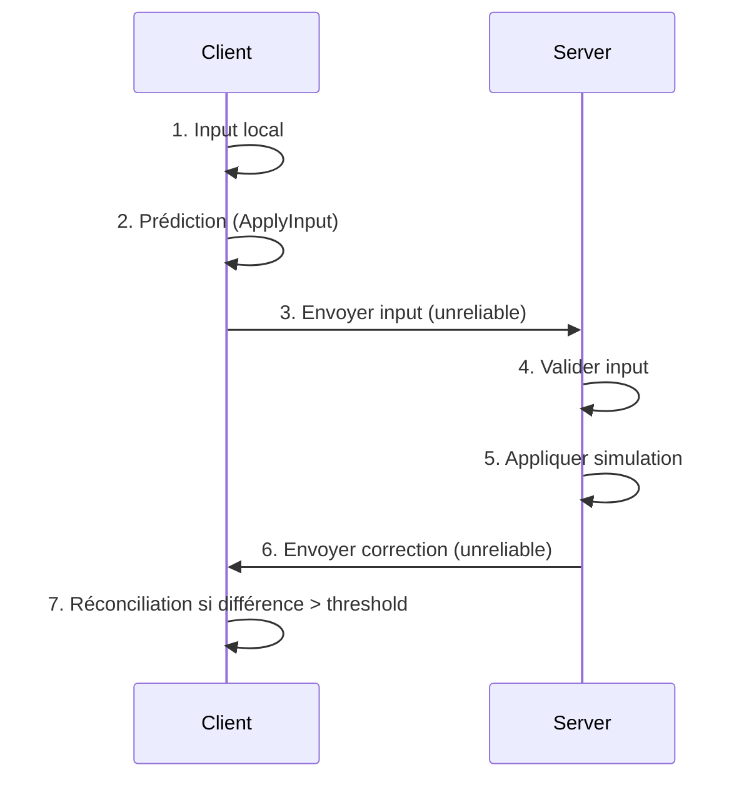
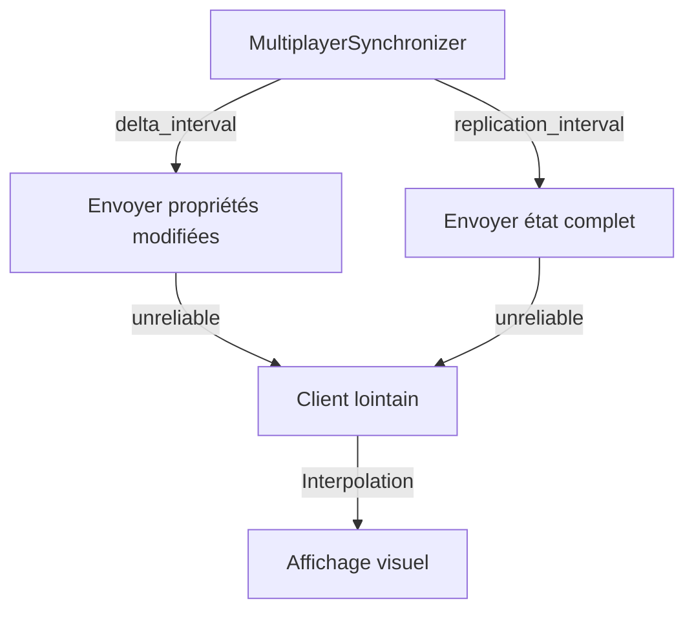
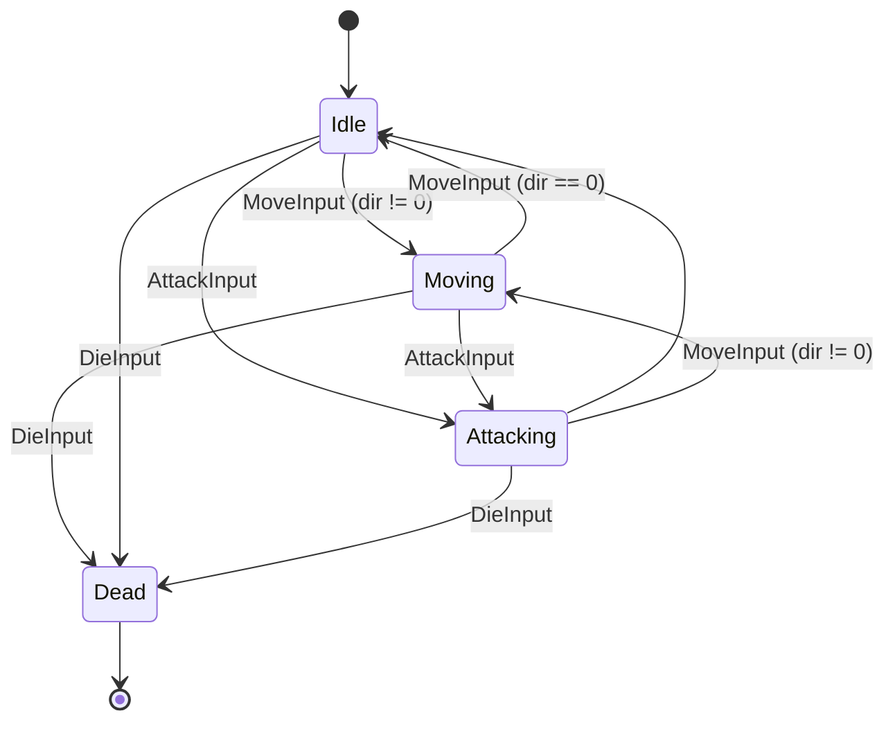
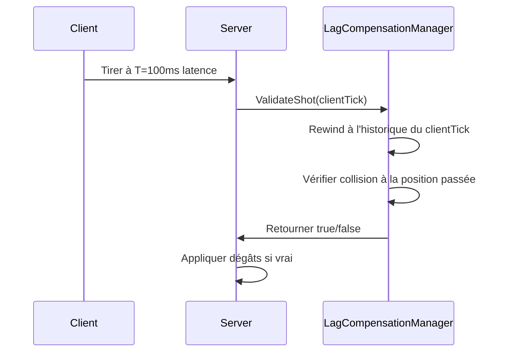

# Système Multiplayer Avancé - Synchronisation Réseau avec ChickenSoft/LogicBlocks
*Guide ultime pour intégrer la synchronisation réseau performante, la prédiction client et la compensation de latence dans Godot 4.x avec C# et ChickenSoft.*

---

## **Contexte**
- **Objectif** : Créer un système multiplayer **robuste**, **performant** et **100% compatible** avec ChickenSoft/LogicBlocks, en utilisant `MultiplayerSynchronizer`, la prédiction client, l'interpolation visuelle, la compensation de latence et l'optimisation de bande passante.
- **Public cible** : Développeurs C#/Godot utilisant ChickenSoft pour des jeux multijoueurs avec synchronisation d'état autoritative serveur, compensation de latence et optimisation réseau.
- **Prérequis** :
  - Godot 4.2+
  - C# 11+
  - Packages : `ChickenSoft.LogicBlocks`, `ChickenSoft.AutoInject`, `ChickenSoft.Serialization` (optionnel)
  - Connaissance des concepts RPC et de la synchronisation réseau

---

## **Règles d'Architecture Impératives**

### **1. Architecture Client-Serveur**
- **Serveur** : Autorité absolue sur l'état du jeu. Valide tous les inputs client, gère la physique, détecte les hits.
- **Client** : Affiche l'état serveur, applique les inputs localement (prédiction), envoie les inputs au serveur.
- **Synchroniseur** : Utilise `MultiplayerSynchronizer` pour synchroniser les propriétés marquées via `@export` ou `[Export]`.

### **2. Découplage Strict**
- **LogicBlock** : Gère la **logique pure** (états, inputs, transitions).
  - **Interdictions** : Aucune référence directe à Godot (`Node`, `Vector2`, etc.), sauf types primitifs immuables.
  - **Obligations** : États (`IState`) et inputs (`IInput`) en `record` immuables.
- **Binding** : Pont entre Godot et les LogicBlocks.
  - **Responsabilités** :
    - Injection des dépendances via `IAutoNode`.
    - Gestion du cycle de vie (`_Ready`, `_ExitTree`, `_Process`, `_PhysicsProcess`).
    - Synchronisation RPC et `MultiplayerSynchronizer`.
    - Nettoyage des ressources (`Dispose()`).
- **Scènes .tscn** : Uniquement responsable de l'**affichage** et de l'**export des nœuds réseau**.

### **3. Immutabilité et Réactivité**
- **États** : Toujours utiliser des `record` pour les états (ex: `PlayerState`).
- **Inputs** : Toujours utiliser des `record` pour les inputs (ex: `MoveInput`).
- **Transitions** : Utiliser `On<TInput>((input, state) => ...)` pour les transitions d'état.
- **Signaux** : Émettre des signaux après chaque transition pour notifier les bindings.

### **4. Synchronisation Réseau**
- **Propriétés Synchronisées** : Utiliser `MultiplayerSynchronizer` avec `delta_interval` pour envoyer uniquement les propriétés modifiées.
- **RPC Autoritative** : Pour les actions ponctuelles (spawning, despawning, dégâts), utiliser `@rpc` avec mode `authority` et canal `reliable`.
- **Validation Serveur** : Le serveur valide TOUS les inputs client avant d'appliquer les modifications.

### **5. Compensation de Latence**
- **Histoire d'État** : Le serveur maintient un historique des positions (snapshots par tick).
- **Rewind au Tick Client** : Pour les hit-scans, le serveur rewind au tick du client lors du tir.
- **Réconciliation** : Le client rejoue les inputs non confirmés après une correction serveur.

---

## **Exemples Minimaux**

### **1. LogicBlock : Gestion du Joueur Multiplayer**

#### **Fichiers**
- `PlayerLogic.State.cs` : États immuables.
- `PlayerLogic.Input.cs` : Inputs immuables.
- `PlayerLogic.cs` : Bloc logique.

#### **Code**
```csharp
// PlayerLogic.State.cs
namespace MyGame.Logic.Player;

public partial class PlayerLogic
{
    public interface IState : ChickenSoft.LogicBlocks.StateLogic { }
    public record Idle : IState;
    public record Moving(Vector2 Direction, float Speed) : IState;
    public record Attacking(Vector2 Direction, float Duration) : IState;
    public record Dead : IState;
}
```

```csharp
// PlayerLogic.Input.cs
namespace MyGame.Logic.Player;

public partial class PlayerLogic
{
    public interface IInput : ChickenSoft.LogicBlocks.InputLogic { }
    public record MoveInput(Vector2 Direction) : IInput;
    public record AttackInput(Vector2 Direction) : IInput;
    public record TakeDamageInput(int Amount) : IInput;
    public record DieInput : IInput;
}
```

```csharp
// PlayerLogic.cs
using ChickenSoft.LogicBlocks;

namespace MyGame.Logic.Player;

public partial class PlayerLogic : LogicBlock<PlayerLogic.IState, PlayerLogic.IInput>
{
    protected override IState InitialState => new Idle();

    public PlayerLogic()
    {
        // Transition vers Moving
        On<MoveInput>((input, state) =>
            input.Direction != Vector2.Zero
                ? new Moving(input.Direction, 200f)
                : new Idle());

        // Transition vers Attacking
        On<AttackInput>((input, state) =>
            new Attacking(input.Direction, 0.5f));

        // Rester en Moving si Direction != Zero
        On<MoveInput, Moving>((input, state) =>
            input.Direction != Vector2.Zero
                ? state with { Direction = input.Direction }
                : new Idle());

        // Transition vers Dead
        On<DieInput>((_, _) => new Dead());

        // Gestion des dégâts (optionnel)
        On<TakeDamageInput>((input, state) =>
            state); // LogicBlock émettra un signal pour le binding de gérer la santé
    }
}
```

---

### **2. Binding : Intégration avec Godot et Multiplayer**

#### **Fichier**
- `PlayerNode.cs` : Script Godot pour lier le `PlayerLogic` à un `CharacterBody2D`.

#### **Code**
```csharp
// PlayerNode.cs
using Godot;
using ChickenSoft.AutoInject;
using ChickenSoft.LogicBlocks;
using MyGame.Logic.Player;

namespace MyGame.Nodes;

[Node]
public partial class PlayerNode : CharacterBody2D, IAutoNode
{
    [Export] public float Speed = 200f;
    [Export] public int MaxHealth = 100;
    [Export] public int Health = 100;

    // Synchronisation réseau
    [Export] public Vector2 SyncedPosition = Vector2.Zero;
    [Export] public Vector2 SyncedVelocity = Vector2.Zero;
    [Export] public int SyncedHealth = 100;

    private readonly PlayerLogic.Block _logic = new();
    private PlayerLogic.Block.Binding _binding;

    private MultiplayerSynchronizer _synchronizer;

    [Signal]
    public delegate void PlayerDiedEventHandler(int playerId);

    [Signal]
    public delegate void HealthChangedEventHandler(int newHealth);

    public override void _Ready()
    {
        // Initialiser le synchroniseur réseau
        _synchronizer = GetNode<MultiplayerSynchronizer>("MultiplayerSynchronizer");
        _synchronizer.ReplicationInterval = 0.05f; // Full state toutes les 50ms en fallback
        _synchronizer.DeltaInterval = 0.05f;       // Propriétés modifiées toutes les 50ms

        // Initialiser la logique
        _binding = _logic.Bind();

        // Handlers pour Idle
        _binding.Handle<PlayerLogic.Idle>(_ =>
        {
            Velocity = Vector2.Zero;
        });

        // Handlers pour Moving
        _binding.Handle<PlayerLogic.Moving>(state =>
        {
            Velocity = state.Direction.Normalized() * state.Speed;
            MoveAndSlide();
            SyncedPosition = GlobalPosition;
            SyncedVelocity = Velocity;
        });

        // Handlers pour Attacking
        _binding.Handle<PlayerLogic.Attacking>(state =>
        {
            // Émission d'une RPC pour l'attaque
            if (IsMultiplayerAuthority())
            {
                RpcUnreliable(MethodName.RemoteAttack, state.Direction);
            }
        });

        // Handlers pour Dead
        _binding.Handle<PlayerLogic.Dead>(_ =>
        {
            Visible = false;
            SetPhysicsProcess(false);
            if (IsMultiplayerAuthority())
            {
                EmitSignal(SignalName.PlayerDied, Multiplayer.GetUniqueId());
            }
        });

        _logic.Start();
    }

    public override void _PhysicsProcess(double delta)
    {
        if (!IsMultiplayerAuthority())
            return; // Le client ne simule que les inputs locaux

        // Lire l'input local
        var inputDir = Input.GetVector("ui_left", "ui_right", "ui_up", "ui_down");
        
        if (inputDir != Vector2.Zero)
        {
            _logic.Input(new PlayerLogic.MoveInput(inputDir));
        }
        else
        {
            _logic.Input(new PlayerLogic.MoveInput(Vector2.Zero));
        }

        if (Input.IsActionJustPressed("ui_accept"))
        {
            _logic.Input(new PlayerLogic.AttackInput(inputDir != Vector2.Zero ? inputDir : Vector2.Right));
        }
    }

    [Rpc(MultiplayerApi.RpcMode.AnyPeer, CallLocal = false, TransferMode = MultiplayerPeer.TransferModeEnum.Unreliable)]
    private void RemoteAttack(Vector2 direction)
    {
        // Afficher l'attaque visuelle sur tous les clients
        GD.Print($"Player {Multiplayer.GetRemoteSenderId()} attaque vers {direction}");
    }

    [Rpc(MultiplayerApi.RpcMode.Authority, CallLocal = false, TransferMode = MultiplayerPeer.TransferModeEnum.Reliable)]
    public void TakeDamage(int amount)
    {
        if (!IsMultiplayerAuthority())
            return;

        SyncedHealth -= amount;
        EmitSignal(SignalName.HealthChanged, SyncedHealth);

        if (SyncedHealth <= 0)
        {
            _logic.Input(new PlayerLogic.DieInput());
        }
    }

    public override void _ExitTree()
    {
        _logic.Stop();
        _binding.Dispose();
    }
}
```

---

### **3. Scène .tscn : Configuration Réseau**

#### **Fichier**
- `Player.tscn` : Scène Godot avec `CharacterBody2D`, `MultiplayerSynchronizer` et `PlayerNode.cs` attaché.

#### **Contenu**
```ini
[gd_scene load_steps=3 format=3]
[ext_resource type="Script" path="res://Source/Nodes/PlayerNode.cs" id="1_player_script"]
[ext_resource type="Shape2D" path="res://Shapes/PlayerCollisionShape.tres" id="2_collision"]

[node name="Player" type="CharacterBody2D"]
script = ExtResource("1_player_script")
speed = 200.0
max_health = 100
health = 100

[node name="CollisionShape2D" type="CollisionShape2D" parent="."]
shape = ExtResource("2_collision")

[node name="Sprite2D" type="Sprite2D" parent="."]
texture = preload("res://Assets/player.png")

[node name="MultiplayerSynchronizer" type="MultiplayerSynchronizer" parent="."]
replication_interval = 0.05
delta_interval = 0.05
replicable_properties = ["SyncedPosition", "SyncedVelocity", "SyncedHealth", "Rotation"]
```

---

## **4. Interpolation Visuelle**

Pour les clients distants, interpoler visuellement la position entre les snapshots réseau afin d'éviter les saccades.

```csharp
// RemotePlayerDisplay.cs — Affichage visuel d'un joueur distant
using Godot;

public partial class RemotePlayerDisplay : Node2D
{
    private Vector2 _prevPos = Vector2.Zero;
    private Vector2 _currPos = Vector2.Zero;
    private int _prevHealth;
    private int _currHealth;

    private PlayerNode _syncSource;

    public override void _Ready()
    {
        SetPhysicsProcess(false);
        _syncSource = GetParent<PlayerNode>();
        _syncSource.Connect(
            MultiplayerSynchronizer.SignalName.Synchronized,
            Callable.From(OnSynchronized));
    }

    private void OnSynchronized()
    {
        _prevPos = _currPos;
        _currPos = _syncSource.SyncedPosition;
        _prevHealth = _currHealth;
        _currHealth = _syncSource.SyncedHealth;
    }

    public override void _Process(double delta)
    {
        float f = (float)Engine.GetPhysicsInterpolationFraction();
        GlobalPosition = _prevPos.Lerp(_currPos, f);
    }
}
```

---

## **5. Prédiction Client et Réconciliation**

Le client prédit les mouvements localement pour une réactivité immédiate, puis réconcilie avec la correction serveur.

```csharp
// PredictedPlayerNode.cs — Autorité serveur avec prédiction client
using Godot;
using System.Collections.Generic;
using System.Linq;

public partial class PredictedPlayerNode : CharacterBody2D
{
    [Export] public float Speed = 200f;

    // Ring buffer des inputs non reconnus indexés par numéro de tick
    private readonly Dictionary<int, (Vector2 Dir, double Delta)> _pendingInputs = new();
    private int _currentTick;

    // Dernier état confirmé par le serveur
    private Vector2 _serverPosition = Vector2.Zero;
    private int _serverTick = -1;

    public override void _PhysicsProcess(double delta)
    {
        var inputDir = Input.GetVector("ui_left", "ui_right", "ui_up", "ui_down");

        // 1. Prédiction : appliquer l'input localement immédiatement
        ApplyInput(inputDir, delta);

        // 2. Stocker l'input pour pouvoir le rejouer si le serveur corrige
        _pendingInputs[_currentTick] = (inputDir, delta);
        _currentTick++;

        // 3. Envoyer l'input au serveur
        if (!IsMultiplayerAuthority())
            return;
        RpcId(1, MethodName.SendInputToServer, inputDir, _currentTick - 1);
    }

    private void ApplyInput(Vector2 dir, double delta)
    {
        Velocity = dir * Speed;
        MoveAndSlide();
    }

    [Rpc(MultiplayerApi.RpcMode.Authority, CallLocal = false, TransferMode = MultiplayerPeer.TransferModeEnum.Unreliable)]
    private void ReceiveServerCorrection(Vector2 correctedPos, int ackTick)
    {
        _serverPosition = correctedPos;
        _serverTick = ackTick;

        // Supprimer tous les inputs que le serveur a déjà traités
        foreach (var tick in _pendingInputs.Keys.Where(t => t <= ackTick).ToList())
            _pendingInputs.Remove(tick);

        // Réconciliation : revenir à la position serveur puis rejouer les inputs en attente
        GlobalPosition = _serverPosition;
        foreach (var tick in _pendingInputs.Keys.OrderBy(t => t))
        {
            var inp = _pendingInputs[tick];
            ApplyInput(inp.Dir, inp.Delta);
        }
    }

    [Rpc(MultiplayerApi.RpcMode.AnyPeer, CallLocal = false, TransferMode = MultiplayerPeer.TransferModeEnum.Unreliable)]
    private void SendInputToServer(Vector2 dir, int tick)
    {
        // Le serveur reçoit l'input client, simule, puis confirme
        ApplyInput(dir, GetPhysicsProcessDeltaTime());
        RpcId(
            Multiplayer.GetRemoteSenderId(),
            MethodName.ReceiveServerCorrection,
            GlobalPosition,
            tick);
    }
}
```

---

## **6. Compensation de Latence (Lag Compensation)**

Le serveur rewind au tick du client pour valider les hit-scans de manière équitable.

```csharp
// LagCompensationManager.cs — Gère l'historique des positions serveur
using Godot;
using System.Collections.Generic;
using System.Linq;

public partial class LagCompensationManager : Node
{
    private const float HistoryDurationSec = 0.5f;
    private const float PhysicsTickRate = 60f;

    // history[tick] = { peerId -> position }
    private readonly Dictionary<int, Dictionary<int, Vector2>> _positionHistory = new();
    private int _currentTick;

    public override void _PhysicsProcess(double delta)
    {
        if (!Multiplayer.IsServer())
            return;

        // Snapshot la position de chaque joueur ce tick
        var snapshot = new Dictionary<int, Vector2>();
        foreach (int peerId in Multiplayer.GetPeers())
        {
            var player = GetPlayer(peerId);
            if (player is not null)
                snapshot[peerId] = player.GlobalPosition;
        }

        _positionHistory[_currentTick] = snapshot;
        _currentTick++;

        // Nettoyer l'historique au-delà de la fenêtre de conservation
        int oldestKept = _currentTick - (int)(HistoryDurationSec * PhysicsTickRate);
        foreach (int oldTick in _positionHistory.Keys.Where(t => t < oldestKept).ToList())
            _positionHistory.Remove(oldTick);
    }

    public bool ValidateShot(
        int shooterId,
        int targetId,
        Vector2 shotOrigin,
        Vector2 shotDirection,
        int clientTick)
    {
        if (!_positionHistory.TryGetValue(clientTick, out var snapshot))
            return false;

        if (!snapshot.TryGetValue(targetId, out Vector2 rewoundPos))
            return false;

        float hitRadius = 32f;
        Vector2 closestPoint = ClosestPointOnRay(shotOrigin, shotDirection, rewoundPos);
        return closestPoint.DistanceTo(rewoundPos) <= hitRadius;
    }

    private static Vector2 ClosestPointOnRay(Vector2 origin, Vector2 direction, Vector2 point)
    {
        Vector2 d = direction.Normalized();
        float t = (point - origin).Dot(d);
        return origin + d * Mathf.Max(t, 0f);
    }

    private Node2D GetPlayer(int peerId)
    {
        return GetTree().GetFirstNodeInGroup($"player_{peerId}") as Node2D;
    }
}
```

---

## **7. Optimisation de Bande Passante**

### **Synchronisation Uniquement des Propriétés Modifiées**
```csharp
// Dans PlayerNode.cs
public override void _Ready()
{
    var sync = GetNode<MultiplayerSynchronizer>("MultiplayerSynchronizer");
    sync.ReplicationInterval = 1.0f;   // État complet toutes les 1s en fallback
    sync.DeltaInterval = 0.05f;        // Propriétés modifiées toutes les 50ms
}
```

### **Quantification des Floats**
```csharp
// Quantifier une position en entier 16-bit (précision 1cm, plage ±327m)
public static int Quantize(float value)
{
    return Mathf.Clamp((int)(value * 100f), -32768, 32767);
}

public static float Dequantize(int value)
{
    return value / 100f;
}
```

### **Synchronisation Basée sur la Distance**
```csharp
// DistanceSyncManager.cs — Ajuster la fréquence de sync selon la distance
public void UpdateSyncIntervals(Node2D localPlayer)
{
    foreach (Node syncNode in GetTree().GetNodesInGroup("synced_objects"))
    {
        if (syncNode.GetParent() is not Node2D obj)
            continue;
        float dist = localPlayer.GlobalPosition.DistanceTo(obj.GlobalPosition);
        var multiplayerSync = (MultiplayerSynchronizer)syncNode;
        if (dist < 200f)
            multiplayerSync.ReplicationInterval = 0.05f;  // 20 Hz — proche
        else if (dist < 600f)
            multiplayerSync.ReplicationInterval = 0.1f;   // 10 Hz — moyen
        else
            multiplayerSync.ReplicationInterval = 0.5f;   // 2 Hz — loin
    }
}
```

### **Canal Reliable vs Unreliable**

| Type de Données | Canal | Raison |
|---|---|---|
| Position, vélocité | `unreliable` | La rapidité prime ; un paquet perdu sera remplacé par le suivant |
| Santé, score, kills | `reliable` | Doit arriver et dans l'ordre ; les lacunes causent des incohérences |
| Spawning/despawning | `reliable` | Événements ponctuels qui ne doivent pas être manqués |
| Messages de chat | `reliable` | L'ordre et la livraison importent |

---

## **Bonnes Pratiques**

### **1. Validation Serveur Stricte**
```csharp
// Toujours valider les inputs côté serveur
[Rpc(MultiplayerApi.RpcMode.AnyPeer, CallLocal = false, TransferMode = MultiplayerPeer.TransferModeEnum.Unreliable)]
private void SendInputToServer(Vector2 dir, int tick)
{
    if (!Multiplayer.IsServer())
        return;

    // Valider que la direction est normalisée et valide
    if (dir.Length() > 1.01f) // Petit buffer pour les erreurs d'arrondi
        return;

    // Appliquer l'input
    ApplyInput(dir, GetPhysicsProcessDeltaTime());
}
```

### **2. Découplage Logique/Vue**
- **LogicBlock** : Logique pure, pas de dépendances Godot.
- **Binding** : Seul responsable de la synchronisation RPC et du rendu.
- **Signaux** : Utiliser les signaux LogicBlock pour notifier les changements d'état.

### **3. Gestion de la Ressource**
```csharp
public override void _ExitTree()
{
    _logic.Stop();
    _binding.Dispose();
}
```

### **4. Patterns ChickenSoft**
- **`IAutoNode`** : Pour l'injection de dépendances et la gestion du cycle de vie.
- **`LogicBlock`** : Pour la gestion d'état déclarative.
- **Réactivité** : Utiliser les handlers de binding pour réagir aux changements d'état.

---

## **Erreurs Courantes à Éviter**

| ❌ Anti-Pattern | ✅ Correction | Explication |
|----------------|--------------|-------------|
| Valider les hits côté client. | Toujours valider sur le serveur. | Le client ne peut pas être de confiance. |
| Synchroniser TOUTES les propriétés à chaque frame. | Utiliser `delta_interval` pour les propriétés modifiées. | Économise la bande passante et réduit la latence. |
| Modifier l'état directement sans passer par LogicBlock. | Utiliser `_logic.Input()` pour tous les changements d'état. | Garantit la traçabilité et la prévisibilité. |
| Stocker l'input dans des variables mutables. | Utiliser des `record` immuables pour les inputs. | Facilite le replay et le debugging. |
| Ignorer les rewinds de latence. | Implémenter la compensation de latence pour les hit-scans. | Égalise les chances pour tous les joueurs. |
| Récupérer directement `GlobalPosition` du serveur. | Utiliser des propriétés exportées synchronisées. | Garanti une synchronisation cohérente. |
| Oublier de net

toyer les bindings dans `_ExitTree`. | Toujours appeler `_binding.Dispose()`. | Évite les fuites mémoire. |

---

## **Diagrammes**

### **1. Architecture Client-Serveur avec Prédiction**


### **2. Flux de Synchronisation**


### **3. États du Joueur Multiplayer**


### **4. Compensation de Latence (Lag Compensation)**


---

## **Recettes Pratiques**

### **1. Jeu Coopératif Simple**
- **Objectif** : Deux joueurs se déplacent et reçoivent des dégâts.
- **Configuration** :
  - Synchroniser `SyncedPosition`, `SyncedVelocity`, `SyncedHealth`.
  - Canaux : `unreliable` pour le mouvement, `reliable` pour les dégâts.
  - Interpolation visuelle sur clients distants.

### **2. Jeu PvP avec Hit-scan**
- **Objectif** : Tirage de projectiles avec compensation de latence.
- **Configuration** :
  - Historique des positions sur le serveur.
  - Rewind et validation de hit côté serveur.
  - Feedback visuel immédiat côté client.
  - Points attribués après validation serveur.

### **3. Optimisation pour Faible Bande Passante**
- **Objectif** : Jeu multiplayer sur connexion lente.
- **Configuration** :
  - Quantifier les floats en 16-bit.
  - Synchronisation basée sur la distance.
  - `DeltaInterval` long (ex: 0.2s).
  - Réduire le nombre de propriétés synchronisées.

### **4. Gestion des Disconnections**
- **Objectif** : Nettoyer les joueurs déconnectés.
- **Code** :
  ```csharp
  public override void _OnPeerDisconnected(int peerId)
  {
      var playerNode = GetTree().GetFirstNodeInGroup($"player_{peerId}");
      if (playerNode != null)
      {
          playerNode.QueueFree();
      }
  }
  ```

---

## **Templates Réutilisables**

### **1. Template pour LogicBlock Multiplayer**
```csharp
// [Feature]Logic.cs
using ChickenSoft.LogicBlocks;

namespace MyGame.Logic.[Feature];

public partial class [Feature]Logic : LogicBlock<[Feature]Logic.IState, [Feature]Logic.IInput>
{
    protected override IState InitialState => new [InitialState]();

    public [Feature]Logic()
    {
        // Ajouter les transitions ici
        On<[InputType]>((input, state) =>
            // Retourner le nouvel état
            state);
    }
}
```

### **2. Template pour Binding Multiplayer**
```csharp
// [Feature]Node.cs
using Godot;
using ChickenSoft.AutoInject;
using ChickenSoft.LogicBlocks;
using MyGame.Logic.[Feature];

namespace MyGame.Nodes;

[Node]
public partial class [Feature]Node : [NodeType], IAutoNode
{
    [Export] public Vector2 SyncedPosition = Vector2.Zero;
    // Ajouter d'autres propriétés synchronisées

    private readonly [Feature]Logic.Block _logic = new();
    private [Feature]Logic.Block.Binding _binding;
    private MultiplayerSynchronizer _synchronizer;

    public override void _Ready()
    {
        _synchronizer = GetNode<MultiplayerSynchronizer>("MultiplayerSynchronizer");
        _synchronizer.ReplicationInterval = 0.05f;
        _synchronizer.DeltaInterval = 0.05f;

        _binding = _logic.Bind();
        // Configurer les handlers
        _logic.Start();
    }

    public override void _ExitTree()
    {
        _logic.Stop();
        _binding.Dispose();
    }
}
```

---

## **Checklist de Validation**
- [ ] **Architecture** :
  - [ ] Serveur autoritaire sur l'état.
  - [ ] Clients prédisent localement.
  - [ ] Réconciliation après correction serveur.
- [ ] **LogicBlock** :
  - [ ] Aucune référence à Godot (sauf primitifs).
  - [ ] États et inputs en `record` immuables.
  - [ ] Transitions via `On<TInput>`.
- [ ] **Binding** :
  - [ ] Implémente `IAutoNode`.
  - [ ] Gère le cycle de vie (`_Ready`, `_ExitTree`).
  - [ ] Synchronisation RPC + `MultiplayerSynchronizer`.
  - [ ] Nettoie les bindings (`Dispose()`).
- [ ] **Synchronisation Réseau** :
  - [ ] `MultiplayerSynchronizer` avec `delta_interval`.
  - [ ] RPC avec mode `authority` pour les actions.
  - [ ] `reliable` pour les données critiques.
  - [ ] `unreliable` pour position/vélocité.
- [ ] **Compensation de Latence** :
  - [ ] Historique des positions sur serveur.
  - [ ] Rewind au tick client pour hit-scans.
  - [ ] Réconciliation après correction.
- [ ] **Optimisation** :
  - [ ] Quantification des floats.
  - [ ] Synchronisation basée sur la distance.
  - [ ] Interpolation visuelle sur clients distants.
- [ ] **Validation** :
  - [ ] Tous les inputs validés côté serveur.
  - [ ] Jamais faire confiance aux clients.
  - [ ] Gestion des inputs invalides ou hors délais.

---

## **Ressources Complémentaires**
- [Documentation officielle Godot sur le Multiplayer](https://docs.godotengine.org/en/stable/tutorials/networking/index.html)
- [MultiplayerSynchronizer - Godot Docs](https://docs.godotengine.org/en/stable/classes/class_multiplayersynchronizer.html)
- [ChickenSoft.LogicBlocks - GitHub](https://github.com/ChickenSoft-Games/LogicBlocks)
- [ChickenSoft.AutoInject - GitHub](https://github.com/ChickenSoft-Games/AutoInject)
- [Godot RPC Documentation](https://docs.godotengine.org/en/stable/tutorials/networking/using_rpc.html)
- [Client-Side Prediction and Server Reconciliation](https://www.gabrielgambetta.com/client-side-prediction-server-reconciliation.html)
- [Latency Compensation Techniques](https://developer.valvesoftware.com/wiki/Latency_Compensating_Methods_in_Client/Server_In-game_Protocol_Design_and_Optimization)
