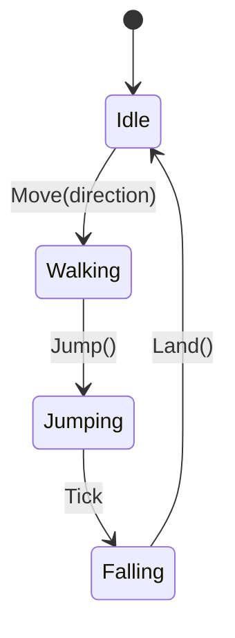
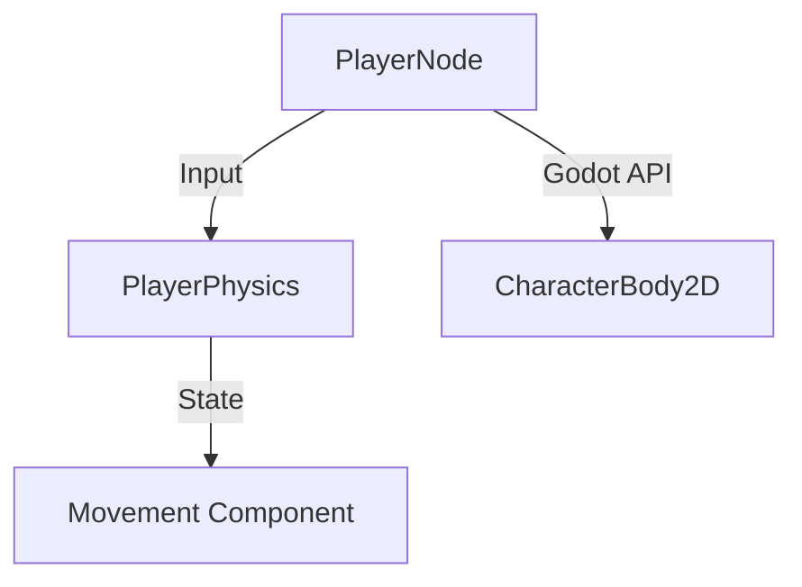
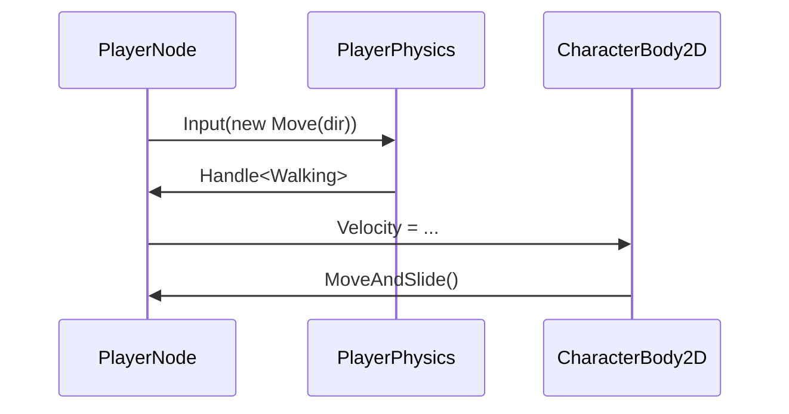

# Système Physique — Godot 4 + ChickenSoft en C#
*Guide de référence pour structurer les systèmes physiques avec Godot et les packages ChickenSoft.*

---

## **Contexte**
- **Objectif** : Concevoir un système physique robuste pour Godot 4 en C#, compatible avec les packages `ChickenSoft.LogicBlocks` et `ChickenSoft.AutoInject`.
- **Public cible** : Développeurs C#/Godot qui veulent intégrer le mouvement, les collisions, les forces, les zones et les interactions physiques tout en gardant une architecture propre et modulaire.
- **Prérequis** :
  - Godot 4.2+
  - C# 11+
  - Packages : `ChickenSoft.LogicBlocks`, `ChickenSoft.AutoInject`
  - Connaissance de base des nœuds physiques : `CharacterBody2D/3D`, `RigidBody2D/3D`, `StaticBody2D/3D`, `Area2D/3D`

---

## **Règles d'Architecture Impératives**

### **1. Découplage Strict**
- **LogicBlock** : gère la logique de jeu pure (états, transitions, inputs).
  - **Interdiction** : pas de référence directe à Godot (`Node`, `Vector3`, `Input`, etc.)
  - **Obligation** : utiliser des `record` immuables pour les états et les commandes.
- **Binding** : fera le lien entre le moteur Godot et le `LogicBlock`.
  - responsable de l’injection de dépendances via `IAutoNode`
  - responsable de l’abonnement aux événements, à l’input et aux propriétés.
- **Nodes Godot** : contiennent seulement l’accès aux API Godot et exposent des méthodes publiques pour piloter le bloc logique.

### **2. Immutabilité**
- États du système physique comme `Idle`, `Walking`, `Falling` doivent être des `record`.
- Inputs de type `Move`, `Jump`, `ApplyForce` doivent être des `record`.
- L’état doit toujours évoluer par héritage/`with` plutôt que par mutations.

### **3. Cycle de vie et injection**
- Utiliser `IAutoNode` pour obtenir l’injection de dépendances et garantir que les nœuds sont prêts.
- `LogicBlock.Start()` / `LogicBlock.Stop()` doit être contrôlé dans `_Ready()` / `_ExitTree()`.
- Toujours appeler `Dispose()` sur les bindings pour éviter les fuites de listeners.

### **4. Séparation physique vs présentation**
- Les calculs de mouvement doivent se faire dans `_PhysicsProcess()` ou `_IntegrateForces()`.
- Les mises à jour visuelles persistantes doivent se faire dans `_Process()` uniquement si elles ne modifient pas la physique.
- Les caméras et effets peuvent lire des positions interpolées, mais le gameplay doit rester dans la boucle physique.

---

## **Exemples Minimaux**

### **1. Mouvement `CharacterBody2D` avec LogicBlock**

#### Fichiers
- `PlayerPhysics.State.cs`
- `PlayerPhysics.Input.cs`
- `PlayerPhysics.cs`
- `PlayerNode.cs`

#### Code
```csharp
// PlayerPhysics.State.cs
namespace MyGame.Logic.Physics;

public partial class PlayerPhysics
{
    public interface IState : ChickenSoft.LogicBlocks.StateLogic { }
    public record Idle : IState;
    public record Walking(Vector2 Velocity) : IState;
    public record Jumping(Vector2 Velocity) : IState;
    public record Falling(float TimeInAir) : IState;
}
```

```csharp
// PlayerPhysics.Input.cs
namespace MyGame.Logic.Physics;

public partial class PlayerPhysics
{
    public interface IInput : ChickenSoft.LogicBlocks.InputLogic { }
    public record Move(Vector2 Direction) : IInput;
    public record Jump() : IInput;
    public record Land() : IInput;
}
```

```csharp
// PlayerPhysics.cs
using ChickenSoft.LogicBlocks;

namespace MyGame.Logic.Physics;

public partial class PlayerPhysics : LogicBlock<PlayerPhysics.IState, PlayerPhysics.IInput>
{
    protected override IState InitialState => new Idle();

    public PlayerPhysics()
    {
        On<Move>((input, state) =>
            new Walking(input.Direction));

        On<Jump, Idle>((_, state) =>
            new Jumping(new Vector2(0, -450)));

        On<Land, Walking>((_, state) => new Idle());
        On<Land, Falling>((_, state) => new Idle());

        On<ChickenSoft.LogicBlocks.Tick, Jumping>((_, state) =>
            new Falling(0));
    }
}
```

```csharp
// PlayerNode.cs
using Godot;
using ChickenSoft.AutoInject;
using MyGame.Logic.Physics;

namespace MyGame.Nodes;

public partial class PlayerNode : CharacterBody2D, IAutoNode
{
    [Export] public float Gravity = 1200f;
    [Export] public float Speed = 200f;
    [Export] public float JumpVelocity = -450f;

    private readonly PlayerPhysics.Block _logic = new();
    private PlayerPhysics.Block.Binding _binding;
    private Vector2 _direction;

    public override void _Ready()
    {
        _binding = _logic.Bind();
        _binding.Handle<PlayerPhysics.Walking>(state => { });
        _binding.Handle<PlayerPhysics.Idle>(state => { });
        _binding.Handle<PlayerPhysics.Falling>(state => { });
        _logic.Start();
    }

    public override void _PhysicsProcess(double delta)
    {
        _direction.x = Input.GetAxis("ui_left", "ui_right");
        if (Input.IsActionJustPressed("jump") && IsOnFloor())
            _logic.Input(new PlayerPhysics.Jump());

        _logic.Input(new PlayerPhysics.Move(_direction));

        var velocity = Velocity;
        velocity.y += Gravity * (float)delta;
        velocity.x = _direction.x * Speed;
        Velocity = velocity;
        MoveAndSlide();
    }

    public override void _ExitTree()
    {
        _logic.Stop();
        _binding.Dispose();
    }
}
```

### **2. Contact Monitoring sur `RigidBody3D`**

#### Code
```csharp
using Godot;

public partial class PhysicsCrate : RigidBody3D
{
    public override void _Ready()
    {
        ContactMonitor = true;
        MaxContactsReported = 8;
        BodyEntered += OnBodyEntered;
    }

    private void OnBodyEntered(Node body)
    {
        if (body.HasMethod("TakeDamage"))
            body.Call("TakeDamage", 10);
    }
}
```

### **3. Zone `Area2D` / Gravité / Détection**

#### Code
```csharp
using Godot;

public partial class GravityZone : Area2D
{
    public override void _Ready()
    {
        GravitySpaceOverride = SpaceOverride.Combine;
        GravityPoint = true;
        GravityPointCenter = Vector2.Zero;
        Gravity = 500f;
        BodyEntered += OnBodyEntered;
    }

    private void OnBodyEntered(Node2D body)
    {
        if (body.Name == "Player")
            GD.Print("Player entered the gravity well");
    }
}
```

---

## **Recettes Clés**

### **1. CharacterBody — Mouvement et Collision**

- `MoveAndSlide()` : utilisé pour le mouvement de joueur et d’ennemis. Retourne le vecteur de mouvement appliqué.
- `Velocity` doit être conservé entre les frames.
- Appeler `IsOnFloor()` dans `_PhysicsProcess()` pour détecter l’atterrissage.
- Pour les plateformes mobiles, utiliser `MoveAndSlideWithSnap()` si nécessaire.

### **2. RigidBody — Forces vs Impulsions**

- `ApplyCentralForce()` : force continue, appelée chaque frame physique.
- `ApplyCentralImpulse()` : changement instantané de vitesse.
- `ApplyTorque()` et `ApplyTorqueImpulse()` pour la rotation.
- Utiliser `_IntegrateForces()` si vous devez contrôler `Velocity`, `AngularVelocity`, ou appliquer une force directe sans conflit avec le moteur.

### **3. Area — Détection et Override**

- `BodyEntered` / `BodyExited` pour détecter un corps qui entre/sort.
- `AreaEntered` / `AreaExited` pour une superposition entre `Area`.
- `GravitySpaceOverride` : `Replace`, `Combine`, `CombineThenReplace`, `ReplaceThenCombine`.
- `Priority` : plus haut = traité en premier quand plusieurs zones se chevauchent.

### **4. Raycast et espace direct**

- Raycast dans `_PhysicsProcess()` avec `GetWorld2D().DirectSpaceState` ou `GetWorld3D().DirectSpaceState`.
- Éviter d’appeler l’espace direct en dehors de la boucle physique.
- Exclure `GetRid()` pour ignorer le corps lui-même.

### **5. Physics Interpolation**

- Les caméras peuvent lire les positions lissées via `GetGlobalTransformInterpolated()`.
- Pour une caméra 3D suivre un joueur : désactiver l’interpolation de la caméra (`PhysicsInterpolationMode = PhysicsInterpolationModeEnum.Off`) et calculer la position dans `_Process()`.
- Ne pas utiliser `GetGlobalTransformInterpolated()` pour la logique de gameplay.

### **6. StaticBody et AnimatableBody**

- `StaticBody2D/3D` : immobile et performant, idéal pour les murs et sols.
- `AnimatableBody2D/3D` : pour les plateformes mobiles et objets animés qui doivent pousser les corps.
- `constant_linear_velocity` sur `StaticBody2D` peut créer des tapis roulants sans code.

### **7. Ragdoll et SoftBody**

- `PhysicalBoneSimulator3D` + `PhysicalBone3D` permet de basculer entre animation et simulation physique.
- `PhysicalBonesStartSimulation()` active les os physiques, `PhysicalBonesStopSimulation()` revient à l’animation.
- `Influence` contrôle le mélange animation vs physique.
- Utilisez des couches de collision différentes ou `PhysicalBonesAddCollisionException()` pour éviter les auto-collisions.

---

## **StaticBody — Tapis roulants et plateformes**

- `StaticBody2D`/`StaticBody3D` reste immobile et performant pour les sols et les murs.
- `AnimatableBody2D`/`AnimatableBody3D` est la bonne option pour les plateformes mobiles qui doivent pousser d’autres corps.
- `constant_linear_velocity` sur `StaticBody2D` permet de créer un tapis roulant sans code supplémentaire.

#### Exemple : Tapis roulant 2D
```csharp
public partial class ConveyorBelt : StaticBody2D
{
    [Export] public float BeltSpeed { get; set; } = 100f;

    public override void _Ready()
    {
        ConstantLinearVelocity = new Vector2(BeltSpeed, 0);
    }
}
```

#### Exemple : Plateforme animée
```csharp
public partial class MovingPlatform : AnimatableBody2D
{
    [Export] public Vector2 Travel { get; set; } = new(0, -200);
    [Export] public float Duration { get; set; } = 2.0f;

    private Vector2 _startPosition;

    public override void _Ready()
    {
        _startPosition = Position;
        var tween = CreateTween().SetLoops();
        tween.TweenProperty(this, "position", _startPosition + Travel, Duration);
        tween.TweenProperty(this, "position", _startPosition, Duration);
    }
}
```

---

## **Area — Zones et détection**

- `Area2D`/`Area3D` est conçu pour la détection, la modification de gravité et les interactions de zone.
- `BodyEntered` / `BodyExited` détectent les corps physiques.
- `AreaEntered` / `AreaExited` détectent d’autres zones (`Area` vs `Area`).
- `GravitySpaceOverride` gère le comportement quand plusieurs zones se chevauchent.
- `Priority` détermine l’ordre de traitement des zones.

#### Exemple : Zone de gravité point
```csharp
public partial class GravityZone : Area2D
{
    public override void _Ready()
    {
        GravitySpaceOverride = SpaceOverride.Combine;
        GravityPoint = true;
        GravityPointCenter = Vector2.Zero;
        Gravity = 500f;
        BodyEntered += OnBodyEntered;
    }

    private void OnBodyEntered(Node2D body)
    {
        if (body.Name == "Player")
            GD.Print("Player entered the gravity well");
    }
}
```

#### Exemple : Détection de chevauchement
```csharp
public partial class Zone : Area2D
{
    public override void _Ready()
    {
        BodyEntered += OnBodyEntered;
        BodyExited += OnBodyExited;
    }

    private void OnBodyEntered(Node2D body)
    {
        if (body.Name == "Player")
            GD.Print("Player entered the zone");
    }

    private void OnBodyExited(Node2D body)
    {
        if (body.Name == "Player")
            GD.Print("Player left the zone");
    }
}
```

---

## **Raycast — Détection précise 2D/3D**

- Les raycasts doivent être exécutés dans `_PhysicsProcess()`.
- `GetWorld2D().DirectSpaceState` / `GetWorld3D().DirectSpaceState` est verrouillé en dehors de la physique.
- Excluez `GetRid()` pour ne pas vous détecter vous-même.

#### Exemple : Clic 3D sur la souris
```csharp
private const float RayLength = 1000f;
private Vector2 _mousePos;

public override void _UnhandledInput(InputEvent @event)
{
    if (@event is InputEventMouseButton mb && mb.Pressed)
        _mousePos = mb.Position;
}

public override void _PhysicsProcess(double delta)
{
    if (_mousePos == Vector2.Zero) return;

    var camera = GetViewport().GetCamera3D();
    var origin = camera.ProjectRayOrigin(_mousePos);
    var end = origin + camera.ProjectRayNormal(_mousePos) * RayLength;

    var space = GetWorld3D().DirectSpaceState;
    var query = PhysicsRayQueryParameters3D.Create(origin, end);
    query.CollideWithAreas = true;

    var result = space.IntersectRay(query);
    if (result.Count > 0)
        GD.Print($"Clicked: {((Node)result["collider"]).Name} at {result["position"]}");

    _mousePos = Vector2.Zero;
}
```

#### Exemple : Raycast 2D d’un point de départ à une destination
```csharp
public override void _PhysicsProcess(double delta)
{
    var space = GetWorld2D().DirectSpaceState;
    var query = PhysicsRayQueryParameters2D.Create(
        GlobalPosition,
        GlobalPosition + new Vector2(0, 100)
    );
    query.Exclude = new Godot.Collections.Array<Rid> { GetRid() };
    query.CollisionMask = 0b0100;

    var result = space.IntersectRay(query);
    if (result.Count > 0)
    {
        var hitPoint = (Vector2)result["position"];
        var hitNormal = (Vector2)result["normal"];
        var hitCollider = (GodotObject)result["collider"];
    }
}
```

---

## **RigidBody — Contacts, matériaux et modes de gel**

- `ContactMonitor = true` et `MaxContactsReported` permettent de recevoir `BodyEntered`.
- `PhysicsMaterial` contrôle `Friction`, `Bounce`, `Rough` et `Absorbent`.
- `FREEZE_MODE_STATIC` transforme le corps en obstacle immobile.
- `FREEZE_MODE_KINEMATIC` permet le déplacement par code tout en conservant les collisions.

#### Exemple : Contact monitoring
```csharp
public partial class PhysicsCrate : RigidBody3D
{
    public override void _Ready()
    {
        ContactMonitor = true;
        MaxContactsReported = 8;
        BodyEntered += OnBodyEntered;
    }

    private void OnBodyEntered(Node body)
    {
        if (body.HasMethod("TakeDamage"))
            body.Call("TakeDamage", 10);
    }
}
```

#### Exemple : Rotation par physique
```csharp
public partial class HomingBody : RigidBody3D
{
    [Export] public float TurnSpeed { get; set; } = 0.1f;

    public override void _IntegrateForces(PhysicsDirectBodyState3D state)
    {
        var targetPos = GetNode<Node3D>("../Target").GlobalPosition;
        var forward = -GlobalTransform.Basis.Z.Normalized();
        var toTarget = (targetPos - GlobalPosition).Normalized();
        float dot = Mathf.Clamp(forward.Dot(toTarget), -1f, 1f);
        float angleToTarget = Mathf.Acos(dot);
        float turnAngle = Mathf.Min(TurnSpeed, angleToTarget);
        if (angleToTarget > 1e-4f)
            state.AngularVelocity = forward.Cross(toTarget).Normalized() * turnAngle / state.Step;
    }
}
```

---

## **Interpolation et caméra**

- Les caméras lisent les positions lissées via `GetGlobalTransformInterpolated()`.
- Définissez `PhysicsInterpolationMode = PhysicsInterpolationModeEnum.Off` sur la caméra.
- Mettez à jour la caméra dans `_Process()`.
- Réservez l’interpolation aux cas visuels spéciaux, pas à la logique de jeu.

#### Exemple : Caméra 3D fluide
```csharp
public partial class FollowCamera : Camera3D
{
    private Node3D _target;
    private Vector3 _smoothPos;

    public override void _Ready()
    {
        _target = GetNode<Node3D>("../Player");
        PhysicsInterpolationMode = PhysicsInterpolationModeEnum.Off;
    }

    public override void _Process(double delta)
    {
        var targetTransform = _target.GetGlobalTransformInterpolated();
        _smoothPos = _smoothPos.Lerp(targetTransform.Origin, Mathf.Min((float)delta * 5f, 1f));
        LookAt(_smoothPos, Vector3.Up);
    }
}
```

---

## **Ragdoll et SoftBody**

- `PhysicalBoneSimulator3D` + `PhysicalBone3D` permet de remplacer les animations par de la physique.
- `PhysicalBonesStartSimulation()` démarre la simulation, `PhysicalBonesStopSimulation()` la stoppe.
- `Influence` permet de mélanger animation et physique.
- Pour éviter les collisions internes, isolez les couches ou utilisez `PhysicalBonesAddCollisionException()`.

#### Exemple : SoftBody3D
- `SoftBody3D` est adapté aux tissus, capes et objets déformables.
- Augmentez `SimulationPrecision` pour stabiliser la simulation.
- Ne mettez `Pressure` que sur des formes fermées.

#### Exemple : Forces/impulsions avec SoftBody3D (Godot 4.5+)
```csharp
public partial class ClothBody : SoftBody3D
{
    public void ExplodeOutward(float forceMagnitude, Vector3 sourcePosition)
    {
        var direction = (GlobalPosition - sourcePosition).Normalized();
        ApplyCentralImpulse(direction * forceMagnitude);
    }

    public void ApplyWind(Vector3 windDirection, float windStrength)
    {
        ApplyCentralForce(windDirection * windStrength);
    }
}
```

---

## **Bonnes Pratiques**

### **1. Moteur et structure**
- Ne modifiez pas `GlobalTransform` ou `Position` directement sur un `RigidBody` dans `_PhysicsProcess()`.
- Préférez `_IntegrateForces()` pour un `RigidBody` si vous devez ajuster la vitesse ou appliquer des forces personnalisées.
- Utilisez `IAutoNode` pour limiter la logique de construction de dépendances dans le binding.

### **2. Gestion du cycle de vie**
- Commencez/arrêtez les `LogicBlock` dans `_Ready()` / `_ExitTree()`.
- Disposez toujours des liaisons et des abonnements de signal.
- Si un noeud peut être désactivé, envisagez un `Dispose()` sécurisé.

### **3. Performances**
- Laissez les corps dormir quand c’est possible (`CanSleep = true`).
- Simplifiez les formes de collision : capsules, rectangles, sphères plutôt que maillages complexes.
- Evitez les raycasts multiples par frame si un `Area` peut faire le travail.

### **4. Réactivité et séparation**
- Maintenez les inputs de jeu dans un bloc logique séparé et alimentez-les depuis le nœud Godot.
- Utilisez des handlers de binding pour changer l’état du nœud sans disperser le code physique.
- Ne dupliquez pas la logique de mouvement entre plusieurs nœuds ; centralisez-la dans un service / bloc logique.

---

## **Erreurs Courantes à Éviter**

| ❌ Anti-Pattern | ✅ Correction | Explication |
|---|---|---|
| Modifier directement `GlobalTransform` sur un `RigidBody3D` | Utiliser `state.ApplyCentralImpulse()` ou `_IntegrateForces()` | Évite les conflits avec le solveur physique.
| Appeler `GetWorld3D().DirectSpaceState` hors de `_PhysicsProcess()` | Appeler dans `_PhysicsProcess()` uniquement | Le monde physique est verrouillé en dehors des frames de physique.
| Ne pas appeler `Dispose()` sur un binding `IAutoNode` | Appeler `_binding.Dispose()` dans `_ExitTree()` | Évite les fuites mémoire et les callbacks persistants.
| Utiliser `AnimatableBody` comme `StaticBody` statique | Choisir `StaticBody` simple ou `AnimatableBody` pour les plateformes mobiles | `AnimatableBody` a un coût et un comportement différent.
| Utiliser `look_at()` sur un `RigidBody3D` | Ajuster `AngularVelocity` dans `_IntegrateForces()` | `look_at()` force la transform, cassant le résultat physique.
| Lire `GetGlobalTransformInterpolated()` partout | Limiter aux caméras et effets visuels spéciaux | Préserve la cohérence de la logique physique.

---

## **Diagrammes**

### **1. Flux de mouvement du joueur**


### **2. Architecture logique**


### **3. Interaction avec ChickenSoft**


---

