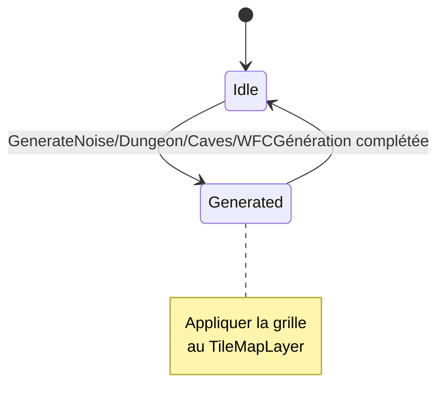
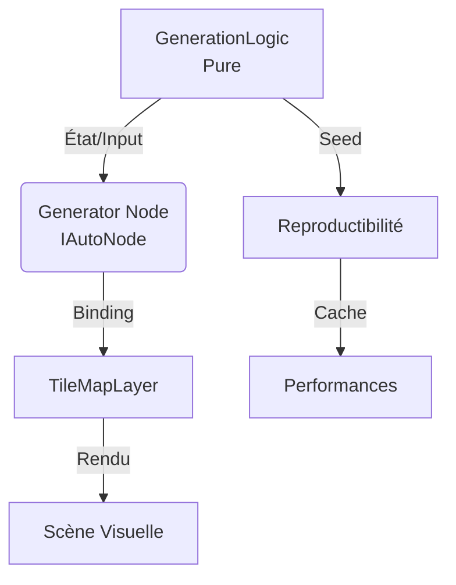
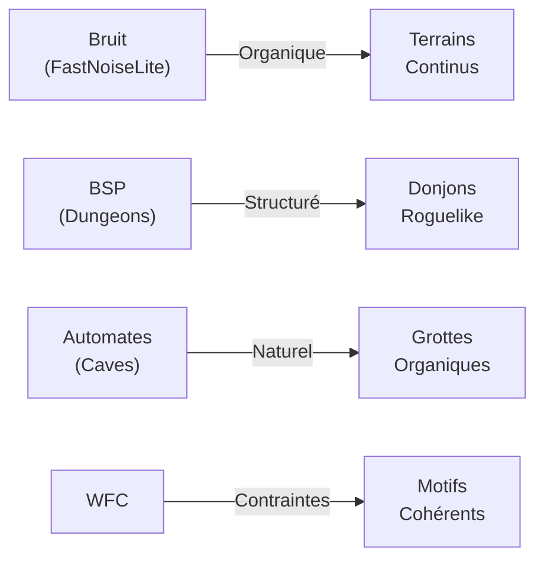

# Génération Procédurale - Guide Complet pour Godot Engine
*Guide complet pour créer des mondes dynamiques, performants et modulaires en C# avec ChickenSoft/LogicBlocks.*

---

## **Contexte**
- **Objectif** : Implémenter des techniques de génération procédurale **efficaces**, **modulaires** et **100% compatibles** avec ChickenSoft/LogicBlocks, incluant bruit, BSP, automates cellulaires et Wave Function Collapse.
- **Public cible** : Développeurs C#/Godot créant des jeux roguelike, sandbox, ou exploratoires avec génération de terrains/donjons dynamiques.
- **Prérequis** :
  - Godot 4.2+
  - C# 11+
  - Packages : `ChickenSoft.LogicBlocks`, `ChickenSoft.AutoInject`
  - `TileMapLayer` pour l'intégration visuelle

---

## **Règles d'Architecture Impératives**

### **1. Découplage Strict**
- **LogicBlock** : Gère la **logique pure** de génération (états, algorithmes, seed management).
  - **Interdictions** : Aucune référence à Godot (`Node`, `Vector2`, `TileMapLayer`).
  - **Obligations** : États (`IState`) et inputs (`IInput`) en `record` immuables.
- **Binding** : Pont entre Godot et les LogicBlocks.
  - **Responsabilités** :
    - Injection des dépendances via `IAutoNode`.
    - Gestion du cycle de vie (`_Ready`, `_ExitTree`).
    - Application de la grille générée au `TileMapLayer`.
    - Nettoyage des ressources (`Dispose()`).
- **Scènes .tscn** : Uniquement responsable de l'**affichage** et de l'**export des nœuds**.

### **2. Immuabilité et Pureté**
- **États** : Utiliser des `record` pour encapsuler les données générées (grille, seed, paramètres).
- **Inputs** : Utiliser des `record` pour les requêtes de génération.
- **Fonctions** : Les algorithmes de génération doivent être **purs** (pas d'effets de bord).

### **3. Performances**
- **Cache les grilles générées** : Éviter de régénérer les mêmes mondes avec le même seed.
- **Utilisez `FastNoiseLite`** (built-in) pour le bruit plutôt que des implémentations custom.
- **Parallélisez la génération** : Pour les grandes cartes, générez par chunk.

---

## **Techniques de Génération Procédurale**

### **1. Génération par Bruit (FastNoiseLite)**

#### **Concept**
Utilise le bruit Perlin/Simplex pour créer des terrains organiques avec différents types de terrain basés sur des valeurs de bruit.

#### **LogicBlock : NoiseGenerationLogic.cs**

```csharp
// NoiseGenerationLogic.State.cs
namespace MyGame.Logic.Generation;

public partial class NoiseGenerationLogic
{
    public interface IState : ChickenSoft.LogicBlocks.StateLogic { }
    public record Idle : IState;
    public record Generating(int Width, int Height, float[,] NoiseMap) : IState;
    public record Generated(float[,] NoiseMap, int Width, int Height) : IState;
}

// NoiseGenerationLogic.Input.cs
namespace MyGame.Logic.Generation;

public partial class NoiseGenerationLogic
{
    public interface IInput : ChickenSoft.LogicBlocks.InputLogic { }
    public record GenerateNoise(int Width, int Height, ulong Seed, float Frequency) : IInput;
}

// NoiseGenerationLogic.cs
using ChickenSoft.LogicBlocks;

namespace MyGame.Logic.Generation;

public partial class NoiseGenerationLogic : LogicBlock<NoiseGenerationLogic.IState, NoiseGenerationLogic.IInput>
{
    protected override IState InitialState => new Idle();

    public NoiseGenerationLogic()
    {
        On<GenerateNoise>((input, _) =>
        {
            var noiseMap = GenerateNoiseMap(input.Width, input.Height, input.Seed, input.Frequency);
            return new Generated(noiseMap, input.Width, input.Height);
        });
    }

    private static float[,] GenerateNoiseMap(int width, int height, ulong seed, float frequency)
    {
        var noise = new FastNoiseLite { Seed = seed, Frequency = frequency, NoiseType = FastNoiseLite.NoiseTypeEnum.SimplexSmooth };
        var noiseMap = new float[height, width];

        for (int y = 0; y < height; y++)
            for (int x = 0; x < width; x++)
                noiseMap[y, x] = noise.GetNoise2D(x, y);

        return noiseMap;
    }
}
```

#### **Binding : NoiseTerrainGenerator.cs**

```csharp
using Godot;
using ChickenSoft.AutoInject;
using ChickenSoft.LogicBlocks;
using MyGame.Logic.Generation;

namespace MyGame.Nodes;

public partial class NoiseTerrainGenerator : Node2D, IAutoNode
{
    [Export] public int Width = 80;
    [Export] public int Height = 60;
    [Export] public float Frequency = 0.05f;
    [Export] public ulong Seed = 42;
    [Export] private TileMapLayer _tileMap;

    private readonly NoiseGenerationLogic.Block _logic = new();
    private NoiseGenerationLogic.Block.Binding _binding;

    public override void _Ready()
    {
        _binding = _logic.Bind();
        _binding.Handle<NoiseGenerationLogic.Generated>(state =>
        {
            ApplyNoiseToTileMap(_tileMap, state.NoiseMap);
        });
        _logic.Start();
        _logic.Input(new NoiseGenerationLogic.GenerateNoise(Width, Height, Seed, Frequency));
    }

    public override void _ExitTree()
    {
        _logic.Stop();
        _binding.Dispose();
    }

    private static void ApplyNoiseToTileMap(TileMapLayer tileMap, float[,] noiseMap)
    {
        for (int y = 0; y < noiseMap.GetLength(0); y++)
        {
            for (int x = 0; x < noiseMap.GetLength(1); x++)
            {
                float value = noiseMap[y, x];
                Vector2I tile = NoiseValueToTile(value);
                tileMap.SetCell(new Vector2I(x, y), 0, tile);
            }
        }
    }

    private static Vector2I NoiseValueToTile(float value) => value switch
    {
        < -0.3f => new(0, 0),   // Deep Water
        < -0.1f => new(1, 0),   // Shallow Water
        < 0.2f  => new(2, 0),   // Grass
        < 0.5f  => new(3, 0),   // Forest
        _       => new(4, 0),   // Mountain
    };
}
```

---

### **2. Génération BSP (Dungeons)**

#### **Concept**
Binary Space Partitioning divise récursivement un rectangle en salles, puis les connecte avec des couloirs pour créer des donjons roguelike classiques.

#### **LogicBlock : BSPDungeonLogic.cs**

```csharp
// BSPDungeonLogic.State.cs
namespace MyGame.Logic.Generation;

public partial class BSPDungeonLogic
{
    public interface IState : ChickenSoft.LogicBlocks.StateLogic { }
    public record Idle : IState;
    public record Generated(Rect2I[] Rooms, Vector2I[] Corridors) : IState;
}

// BSPDungeonLogic.Input.cs
namespace MyGame.Logic.Generation;

public partial class BSPDungeonLogic
{
    public interface IInput : ChickenSoft.LogicBlocks.InputLogic { }
    public record GenerateDungeon(Rect2I Bounds, ulong Seed, int MinRoomSize) : IInput;
}

// BSPDungeonLogic.cs
using ChickenSoft.LogicBlocks;
using Godot;

namespace MyGame.Logic.Generation;

public partial class BSPDungeonLogic : LogicBlock<BSPDungeonLogic.IState, BSPDungeonLogic.IInput>
{
    protected override IState InitialState => new Idle();

    public BSPDungeonLogic()
    {
        On<GenerateDungeon>((input, _) =>
        {
            var generator = new BSPGenerator(input.MinRoomSize);
            var rooms = generator.Generate(input.Bounds, input.Seed);
            var corridors = generator.CreateCorridors(rooms);
            return new Generated(rooms, corridors);
        });
    }
}

public partial class BSPGenerator
{
    private int _minRoomSize;
    private List<Rect2I> _rooms = new();
    private RandomNumberGenerator _rng = new();

    public BSPGenerator(int minRoomSize) => _minRoomSize = minRoomSize;

    public Rect2I[] Generate(Rect2I bounds, ulong seed)
    {
        _rng.Seed = seed;
        _rooms.Clear();
        Split(bounds);
        return _rooms.ToArray();
    }

    private void Split(Rect2I area)
    {
        if (area.Size.X <= _minRoomSize * 2 && area.Size.Y <= _minRoomSize * 2)
        {
            var room = new Rect2I(
                area.Position + new Vector2I(1, 1),
                area.Size - new Vector2I(2, 2)
            );
            if (room.Size.X >= _minRoomSize && room.Size.Y >= _minRoomSize)
                _rooms.Add(room);
            return;
        }

        bool splitHorizontal;
        if (area.Size.X > area.Size.Y * 1.25f)
            splitHorizontal = false;
        else if (area.Size.Y > area.Size.X * 1.25f)
            splitHorizontal = true;
        else
            splitHorizontal = _rng.Randi() % 2 == 0;

        if (splitHorizontal)
        {
            int splitY = _rng.RandiRange(
                area.Position.Y + _minRoomSize,
                area.End.Y - _minRoomSize
            );
            Split(new Rect2I(area.Position, new Vector2I(area.Size.X, splitY - area.Position.Y)));
            Split(new Rect2I(new Vector2I(area.Position.X, splitY), new Vector2I(area.Size.X, area.End.Y - splitY)));
        }
        else
        {
            int splitX = _rng.RandiRange(
                area.Position.X + _minRoomSize,
                area.End.X - _minRoomSize
            );
            Split(new Rect2I(area.Position, new Vector2I(splitX - area.Position.X, area.Size.Y)));
            Split(new Rect2I(new Vector2I(splitX, area.Position.Y), new Vector2I(area.End.X - splitX, area.Size.Y)));
        }
    }

    public Vector2I[] CreateCorridors(Rect2I[] rooms)
    {
        var corridors = new List<Vector2I>();
        for (int i = 0; i < rooms.Length - 1; i++)
        {
            Vector2I centerA = rooms[i].Position + rooms[i].Size / 2;
            Vector2I centerB = rooms[i + 1].Position + rooms[i + 1].Size / 2;

            if (_rng.Randi() % 2 == 0)
            {
                AddHorizontalCorridor(corridors, centerA.X, centerB.X, centerA.Y);
                AddVerticalCorridor(corridors, centerA.Y, centerB.Y, centerB.X);
            }
            else
            {
                AddVerticalCorridor(corridors, centerA.Y, centerB.Y, centerA.X);
                AddHorizontalCorridor(corridors, centerA.X, centerB.X, centerB.Y);
            }
        }
        return corridors.ToArray();
    }

    private static void AddHorizontalCorridor(List<Vector2I> corridors, int x1, int x2, int y)
    {
        for (int x = Mathf.Min(x1, x2); x <= Mathf.Max(x1, x2); x++)
            corridors.Add(new Vector2I(x, y));
    }

    private static void AddVerticalCorridor(List<Vector2I> corridors, int y1, int y2, int x)
    {
        for (int y = Mathf.Min(y1, y2); y <= Mathf.Max(y1, y2); y++)
            corridors.Add(new Vector2I(x, y));
    }
}
```

#### **Binding : BSPDungeonGenerator.cs**

```csharp
using Godot;
using ChickenSoft.AutoInject;
using ChickenSoft.LogicBlocks;
using MyGame.Logic.Generation;

namespace MyGame.Nodes;

public partial class BSPDungeonGenerator : Node2D, IAutoNode
{
    [Export] public int Width = 100;
    [Export] public int Height = 80;
    [Export] public int MinRoomSize = 5;
    [Export] public ulong Seed = 42;
    [Export] private TileMapLayer _tileMap;

    private readonly BSPDungeonLogic.Block _logic = new();
    private BSPDungeonLogic.Block.Binding _binding;

    public override void _Ready()
    {
        _binding = _logic.Bind();
        _binding.Handle<BSPDungeonLogic.Generated>(state =>
        {
            ApplyDungeonToTileMap(_tileMap, state.Rooms, state.Corridors);
        });
        _logic.Start();
        _logic.Input(new BSPDungeonLogic.GenerateDungeon(
            new Rect2I(Vector2I.Zero, new Vector2I(Width, Height)),
            Seed,
            MinRoomSize
        ));
    }

    public override void _ExitTree()
    {
        _logic.Stop();
        _binding.Dispose();
    }

    private static void ApplyDungeonToTileMap(TileMapLayer tileMap, Rect2I[] rooms, Vector2I[] corridors)
    {
        // Dessiner les murs par défaut
        for (int y = 0; y < tileMap.GetUsedRect().Size.Y; y++)
            for (int x = 0; x < tileMap.GetUsedRect().Size.X; x++)
                tileMap.SetCell(new Vector2I(x, y), 0, new Vector2I(0, 0)); // Wall

        // Carver les salles
        foreach (var room in rooms)
            for (int y = room.Position.Y; y < room.End.Y; y++)
                for (int x = room.Position.X; x < room.End.X; x++)
                    tileMap.SetCell(new Vector2I(x, y), 0, new Vector2I(1, 0)); // Floor

        // Carver les couloirs
        foreach (var corridor in corridors)
            tileMap.SetCell(corridor, 0, new Vector2I(1, 0)); // Floor
    }
}
```

---

### **3. Automates Cellulaires (Cave Generation)**

#### **Concept**
Simule des grottes naturelles en itérant une règle simple : une cellule devient un mur si la plupart de ses voisins sont des murs.

#### **LogicBlock : CaveGenerationLogic.cs**

```csharp
// CaveGenerationLogic.State.cs
namespace MyGame.Logic.Generation;

public partial class CaveGenerationLogic
{
    public interface IState : ChickenSoft.LogicBlocks.StateLogic { }
    public record Idle : IState;
    public record Generated(bool[,] Grid, int Width, int Height) : IState;
}

// CaveGenerationLogic.Input.cs
namespace MyGame.Logic.Generation;

public partial class CaveGenerationLogic
{
    public interface IInput : ChickenSoft.LogicBlocks.InputLogic { }
    public record GenerateCaves(int Width, int Height, ulong Seed, float FillChance, int Iterations) : IInput;
}

// CaveGenerationLogic.cs
using ChickenSoft.LogicBlocks;

namespace MyGame.Logic.Generation;

public partial class CaveGenerationLogic : LogicBlock<CaveGenerationLogic.IState, CaveGenerationLogic.IInput>
{
    protected override IState InitialState => new Idle();

    public CaveGenerationLogic()
    {
        On<GenerateCaves>((input, _) =>
        {
            var generator = new CaveGenerator();
            var grid = generator.Generate(input.Width, input.Height, input.Seed, input.FillChance, input.Iterations);
            return new Generated(grid, input.Width, input.Height);
        });
    }
}

public partial class CaveGenerator
{
    private RandomNumberGenerator _rng = new();

    public bool[,] Generate(int width, int height, ulong seed, float fillChance = 0.45f, int iterations = 5)
    {
        _rng.Seed = seed;

        // Remplissage aléatoire initial
        bool[,] grid = new bool[height, width];
        for (int y = 0; y < height; y++)
        {
            for (int x = 0; x < width; x++)
            {
                bool isEdge = x == 0 || y == 0 || x == width - 1 || y == height - 1;
                grid[y, x] = isEdge || _rng.Randf() < fillChance;
            }
        }

        // Lissage itératif
        for (int i = 0; i < iterations; i++)
            grid = Smooth(grid, width, height);

        return grid;
    }

    private static bool[,] Smooth(bool[,] grid, int width, int height)
    {
        bool[,] newGrid = new bool[height, width];
        for (int y = 0; y < height; y++)
        {
            for (int x = 0; x < width; x++)
            {
                int wallCount = CountNeighbors(grid, x, y, width, height);
                // Règle : devient mur si 5+ des 9 cellules (elle-même + 8 voisins) sont des murs
                newGrid[y, x] = wallCount >= 5;
            }
        }
        return newGrid;
    }

    private static int CountNeighbors(bool[,] grid, int cx, int cy, int width, int height)
    {
        int count = 0;
        for (int dy = -1; dy <= 1; dy++)
        {
            for (int dx = -1; dx <= 1; dx++)
            {
                int nx = cx + dx, ny = cy + dy;
                if (nx < 0 || ny < 0 || nx >= width || ny >= height)
                    count++;  // Hors limites compte comme un mur
                else if (grid[ny, nx])
                    count++;
            }
        }
        return count;
    }
}
```

#### **Binding : CaveTerrainGenerator.cs**

```csharp
using Godot;
using ChickenSoft.AutoInject;
using ChickenSoft.LogicBlocks;
using MyGame.Logic.Generation;

namespace MyGame.Nodes;

public partial class CaveTerrainGenerator : Node2D, IAutoNode
{
    [Export] public int Width = 80;
    [Export] public int Height = 60;
    [Export] public float FillChance = 0.45f;
    [Export] public int Iterations = 5;
    [Export] public ulong Seed = 42;
    [Export] private TileMapLayer _tileMap;

    private readonly CaveGenerationLogic.Block _logic = new();
    private CaveGenerationLogic.Block.Binding _binding;

    public override void _Ready()
    {
        _binding = _logic.Bind();
        _binding.Handle<CaveGenerationLogic.Generated>(state =>
        {
            ApplyCavesToTileMap(_tileMap, state.Grid);
        });
        _logic.Start();
        _logic.Input(new CaveGenerationLogic.GenerateCaves(Width, Height, Seed, FillChance, Iterations));
    }

    public override void _ExitTree()
    {
        _logic.Stop();
        _binding.Dispose();
    }

    private static void ApplyCavesToTileMap(TileMapLayer tileMap, bool[,] grid)
    {
        for (int y = 0; y < grid.GetLength(0); y++)
        {
            for (int x = 0; x < grid.GetLength(1); x++)
            {
                Vector2I tile = grid[y, x] ? new Vector2I(0, 0) : new Vector2I(1, 0);
                tileMap.SetCell(new Vector2I(x, y), 0, tile);
            }
        }
    }
}
```

---

### **4. Wave Function Collapse (WFC)**

#### **Concept**
Génère des motifs en effondrant les possibilités de tiles basées sur des contraintes d'adjacence, produisant des résultats visuellement cohérents.

#### **LogicBlock : WFCGenerationLogic.cs**

```csharp
// WFCGenerationLogic.State.cs
namespace MyGame.Logic.Generation;

public partial class WFCGenerationLogic
{
    public interface IState : ChickenSoft.LogicBlocks.StateLogic { }
    public record Idle : IState;
    public record Collapsed(int[] Grid, int Width, int Height) : IState;
    public record Failed : IState;
}

// WFCGenerationLogic.Input.cs
namespace MyGame.Logic.Generation;

public partial class WFCGenerationLogic
{
    public interface IInput : ChickenSoft.LogicBlocks.InputLogic { }
    public record GenerateWFC(int Width, int Height, int TileCount, ulong Seed) : IInput;
}

// WFCGenerationLogic.cs
using ChickenSoft.LogicBlocks;

namespace MyGame.Logic.Generation;

public partial class WFCGenerationLogic : LogicBlock<WFCGenerationLogic.IState, WFCGenerationLogic.IInput>
{
    protected override IState InitialState => new Idle();

    public WFCGenerationLogic()
    {
        On<GenerateWFC>((input, _) =>
        {
            var wfc = new SimpleWFC();
            wfc.Setup(input.Width, input.Height, input.TileCount, input.Seed);
            if (wfc.Collapse())
            {
                return new Collapsed(wfc.GetGrid(), input.Width, input.Height);
            }
            return new Failed();
        });
    }
}

public partial class SimpleWFC
{
    private List<int>[][] _grid;
    private Dictionary<int, Dictionary<string, List<int>>> _rules = new();
    private RandomNumberGenerator _rng = new();

    public void Setup(int width, int height, int tileCount, ulong genSeed)
    {
        _rng.Seed = genSeed;
        _grid = new List<int>[height][];
        for (int y = 0; y < height; y++)
        {
            _grid[y] = new List<int>[width];
            for (int x = 0; x < width; x++)
            {
                _grid[y][x] = new List<int>();
                for (int t = 0; t < tileCount; t++)
                    _grid[y][x].Add(t);
            }
        }
    }

    public bool Collapse()
    {
        while (true)
        {
            // Trouver la cellule avec l'entropie minimale
            var minCell = new Vector2I(-1, -1);
            int minCount = 999;
            for (int y = 0; y < _grid.Length; y++)
            {
                for (int x = 0; x < _grid[y].Length; x++)
                {
                    int count = _grid[y][x].Count;
                    if (count > 1 && count < minCount)
                    {
                        minCount = count;
                        minCell = new Vector2I(x, y);
                    }
                }
            }

            if (minCell == new Vector2I(-1, -1))
                return true;  // Succès

            var cell = _grid[minCell.Y][minCell.X];
            if (cell.Count == 0)
                return false;  // Contradiction

            int chosen = cell[(int)(_rng.Randi() % (uint)cell.Count)];
            _grid[minCell.Y][minCell.X] = new List<int> { chosen };

            Propagate(minCell);
        }
    }

    public int[] GetGrid()
    {
        var result = new List<int>();
        for (int y = 0; y < _grid.Length; y++)
            for (int x = 0; x < _grid[y].Length; x++)
                result.Add(_grid[y][x].Count > 0 ? _grid[y][x][0] : 0);
        return result.ToArray();
    }

    private void Propagate(Vector2I pos)
    {
        var stack = new Stack<Vector2I>();
        stack.Push(pos);
        while (stack.Count > 0)
        {
            var current = stack.Pop();
            var currentTiles = _grid[current.Y][current.X];

            foreach (var dir in new[] { new Vector2I(0, -1), new Vector2I(0, 1), new Vector2I(-1, 0), new Vector2I(1, 0) })
            {
                var neighbor = current + dir;
                if (neighbor.X < 0 || neighbor.Y < 0 || neighbor.Y >= _grid.Length || neighbor.X >= _grid[0].Length)
                    continue;

                var neighborTiles = _grid[neighbor.Y][neighbor.X];
                int oldCount = neighborTiles.Count;

                // Appliquer les contraintes (exemple simplifié)
                var newTiles = neighborTiles.Where(t => IsValidTile(t, dir, currentTiles)).ToList();

                if (newTiles.Count < oldCount)
                {
                    _grid[neighbor.Y][neighbor.X] = newTiles;
                    stack.Push(neighbor);
                }
            }
        }
    }

    private static bool IsValidTile(int tile, Vector2I direction, List<int> currentTiles)
    {
        // Implémentation simplifiée : accepter tous les tiles
        return true;
    }
}
```

#### **Binding : WFCTerrainGenerator.cs**

```csharp
using Godot;
using ChickenSoft.AutoInject;
using ChickenSoft.LogicBlocks;
using MyGame.Logic.Generation;

namespace MyGame.Nodes;

public partial class WFCTerrainGenerator : Node2D, IAutoNode
{
    [Export] public int Width = 50;
    [Export] public int Height = 50;
    [Export] public int TileCount = 4;
    [Export] public ulong Seed = 42;
    [Export] private TileMapLayer _tileMap;

    private readonly WFCGenerationLogic.Block _logic = new();
    private WFCGenerationLogic.Block.Binding _binding;

    public override void _Ready()
    {
        _binding = _logic.Bind();
        _binding.Handle<WFCGenerationLogic.Collapsed>(state =>
        {
            ApplyWFCToTileMap(_tileMap, state.Grid, state.Width, state.Height);
        });
        _binding.Handle<WFCGenerationLogic.Failed>(_ =>
        {
            GD.PrintErr("WFC génération échouée - contradiction trouvée");
        });
        _logic.Start();
        _logic.Input(new WFCGenerationLogic.GenerateWFC(Width, Height, TileCount, Seed));
    }

    public override void _ExitTree()
    {
        _logic.Stop();
        _binding.Dispose();
    }

    private static void ApplyWFCToTileMap(TileMapLayer tileMap, int[] grid, int width, int height)
    {
        for (int y = 0; y < height; y++)
        {
            for (int x = 0; x < width; x++)
            {
                int tileId = grid[y * width + x];
                Vector2I tile = new Vector2I(tileId, 0);
                tileMap.SetCell(new Vector2I(x, y), 0, tile);
            }
        }
    }
}
```

---

## **Bonnes Pratiques**

### **1. Gestion des Seeds**
```csharp
// Toujours utiliser des seeds pour la reproductibilité
ulong seed = (ulong)DateTime.Now.Ticks;  // Seed aléatoire
ulong seed = 42;                           // Seed fixe pour les tests
```

### **2. Optimisation de la Génération**
- **Générez par chunks** : Pour les grandes cartes, générez et chargez par sections.
- **Cachéz les grilles** : Stockez les grilles générées pour éviter les régénérations.
- **Utilisez des threads** : Pour les très grandes générations, utilisez `Task.Run()`.

### **3. Patterns ChickenSoft**
- **`IAutoNode`** : Pour l'injection de dépendances.
- **`OnResolved()`** : Pour initialiser après résolution des dépendances.
- **Nettoyage** : Toujours appeler `Dispose()` dans `_ExitTree`.

---

## **Erreurs Courantes à Éviter**

| ❌ Anti-Pattern | ✅ Correction | Explication |
|---|---|---|
| Générer directement dans `_Ready()` sans logique séparéé. | Utiliser un LogicBlock pour la génération pure. | Permet la testabilité et la réutilisabilité. |
| Modifier directement la grille après génération. | Utiliser des `record` immuables pour les états. | Garantit la prévisibilité et la traçabilité. |
| Utiliser les mêmes seeds pour chaque génération. | Stocker et gérer les seeds via le LogicBlock. | Permet la reproductibilité et le débogage. |
| Générer la grille entière synchronement pour les grandes cartes. | Générer par chunks ou utiliser async/await. | Évite les ralentissements du moteur. |
| Ne pas nettoyer les bindings. | Toujours appeler `_binding.Dispose()`. | Évite les fuites mémoire. |

---

## **Diagrammes**

### **1. Flux de Génération Procédurale**


### **2. Architecture Générale**


### **3. Techniques Comparées**


---

## **Recettes Pratiques**

### **1. Terrains Stratifiés (Bruit + BSP)**
Combinez le bruit pour les zones biome et BSP pour les structures.

```csharp
// Générer d'abord le bruit pour les biomes
var noiseGen = new NoiseGenerationLogic.Block();
noiseGen.Input(new NoiseGenerationLogic.GenerateNoise(80, 60, seed, 0.05f));

// Puis générer BSP pour les structures dans chaque biome
var bspGen = new BSPDungeonLogic.Block();
bspGen.Input(new BSPDungeonLogic.GenerateDungeon(dungeon_bounds, seed, 5));
```

### **2. Grottes avec Points de Repère (Caves + WFC)**
Générez d'abord des grottes, puis utilisez WFC pour placer des salles décorées.

```csharp
var caveGen = new CaveGenerationLogic.Block();
caveGen.Input(new CaveGenerationLogic.GenerateCaves(80, 60, seed, 0.45f, 5));

// Détecter les zones ouvertes et appliquer WFC
var wfcGen = new WFCGenerationLogic.Block();
wfcGen.Input(new WFCGenerationLogic.GenerateWFC(20, 20, 4, seed));
```

### **3. Mondes Infinis (Chunking + Bruit)**
Divisez la carte en chunks et générez chaque chunk indépendamment.

```csharp
const int ChunkSize = 16;

int GetChunkSeed(int chunkX, int chunkY, ulong baseSeed)
{
    // Créer un seed unique par chunk
    return (int)((baseSeed ^ ((ulong)chunkX * 73856093) ^ ((ulong)chunkY * 19349663)) & 0x7FFFFFFF);
}

// Pour chaque chunk visible
for (int cy = minChunkY; cy <= maxChunkY; cy++)
{
    for (int cx = minChunkX; cx <= maxChunkX; cx++)
    {
        ulong chunkSeed = (ulong)GetChunkSeed(cx, cy, baseSeed);
        GenerateChunk(cx, cy, chunkSeed);
    }
}
```

---

## **Exemples Avancés**

### **1. Générateur Multi-Techniques**
Combinei plusieurs techniques pour créer des mondes complexes.

```csharp
public partial class WorldGenerator : Node2D, IAutoNode
{
    private NoiseGenerationLogic.Block _noiseLogic = new();
    private BSPDungeonLogic.Block _bspLogic = new();
    private CaveGenerationLogic.Block _caveLogic = new();
    private WFCGenerationLogic.Block _wfcLogic = new();

    public override void _Ready()
    {
        // Générer bruit pour les biomes
        _noiseLogic.Input(new NoiseGenerationLogic.GenerateNoise(100, 100, 42, 0.05f));

        // En fonction du bruit, générer des structures spécifiques
        // - Biome forêt: utiliser BSP pour les ruines
        // - Biome montagne: utiliser Caves pour les mines
        // - Etc.
    }
}
```

### **2. Édition Procédurale avec Prévisualisation**
Permettez aux utilisateurs de voir les changements en temps réel.

```csharp
[Export] public float Frequency = 0.05f;

public override void _Process(double delta)
{
    if (Input.IsActionPressed("ui_up"))
    {
        Frequency += 0.01f;
        _logic.Input(new NoiseGenerationLogic.GenerateNoise(Width, Height, Seed, Frequency));
    }
}
```

### **3. Sauvegarde et Chargement de Mondes Générés**
Sérialisez les grilles pour un chargement rapide.

```csharp
public void SaveGeneratedWorld(string path, float[,] noiseMap)
{
    var file = FileAccess.Open(path, FileAccess.ModeFlags.Write);
    file.Store32((uint)noiseMap.GetLength(0));
    file.Store32((uint)noiseMap.GetLength(1));
    for (int y = 0; y < noiseMap.GetLength(0); y++)
        for (int x = 0; x < noiseMap.GetLength(1); x++)
            file.StoreFloat(noiseMap[y, x]);
}

public float[,] LoadGeneratedWorld(string path)
{
    var file = FileAccess.Open(path, FileAccess.ModeFlags.Read);
    int height = (int)file.Get32();
    int width = (int)file.Get32();
    var noiseMap = new float[height, width];
    for (int y = 0; y < height; y++)
        for (int x = 0; x < width; x++)
            noiseMap[y, x] = file.GetFloat();
    return noiseMap;
}
```

---

## **Comparaison des Techniques**

| Technique | Caractère | Cas d'Usage | Complexité | Performance |
|---|---|---|---|---|
| **Bruit** | Organique, continu | Terrains, climatologie | Basse | Très rapide |
| **BSP** | Structuré, rectilinéaire | Donjons roguelike | Moyenne | Rapide |
| **Caves** | Naturel, organique | Mines, grottes | Moyenne | Rapide |
| **WFC** | Cohérent, contraint | Motifs complexes, architectures | Élevée | Lent |

---

## **Checklist de Validation**

- [ ] **LogicBlock** :
  - [ ] Aucune référence à Godot.
  - [ ] États et inputs en `record` immuables.
  - [ ] Génération pure et déterministe.
- [ ] **Binding** :
  - [ ] Implémente `IAutoNode`.
  - [ ] Gère le cycle de vie (`_Ready`, `_ExitTree`).
  - [ ] Applique correctement la grille au `TileMapLayer`.
  - [ ] Nettoie les bindings (`Dispose()`).
- [ ] **Générationgeneration** :
  - [ ] Seeds correctement gérés.
  - [ ] Résultats reproductibles.
  - [ ] Performance acceptable (< 100ms pour cartes standard).
- [ ] **Scène .tscn** :
  - [ ] Script de binding attaché.
  - [ ] `TileMapLayer` configuré et exporté.
  - [ ] Propriétés exportées (`[Export]`) pour les tests.

---

## **Ressources Complémentaires**
- [Documentation officielle Godot - TileMapLayer](https://docs.godotengine.org/en/stable/tutorials/2d/using_tilemaps.html)
- [Documentation officielle Godot - FastNoiseLite](https://docs.godotengine.org/en/stable/classes/class_fastnoiselite.html)
- [ChickenSoft.LogicBlocks - GitHub](https://github.com/ChickenSoft-Games/LogicBlocks)
- [Procedural Generation Wiki](https://en.wikipedia.org/wiki/Procedural_generation)
- [Red Blob Games - Noise-based Map Generation](https://www.redblobgames.com/maps/terrain-from-noise/)

---
