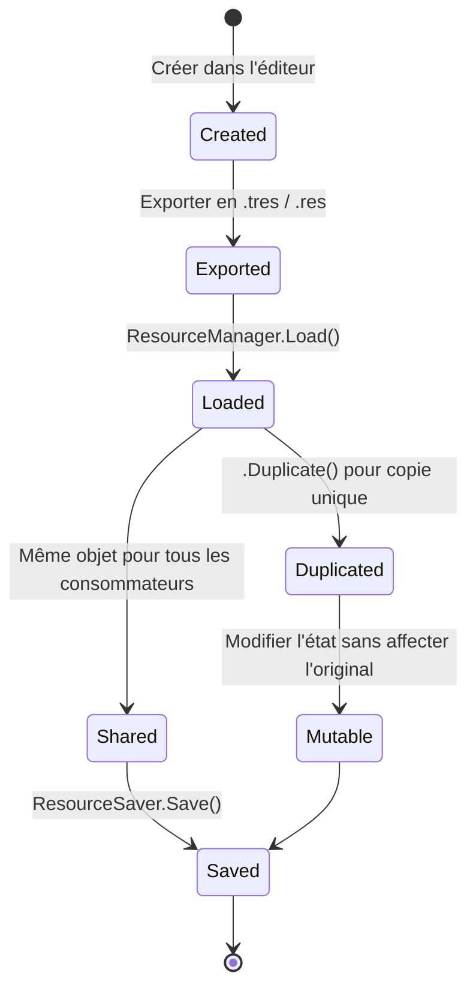
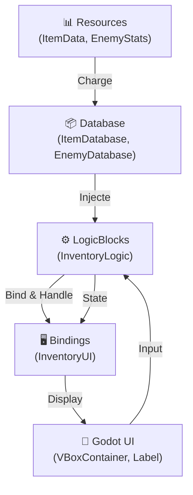
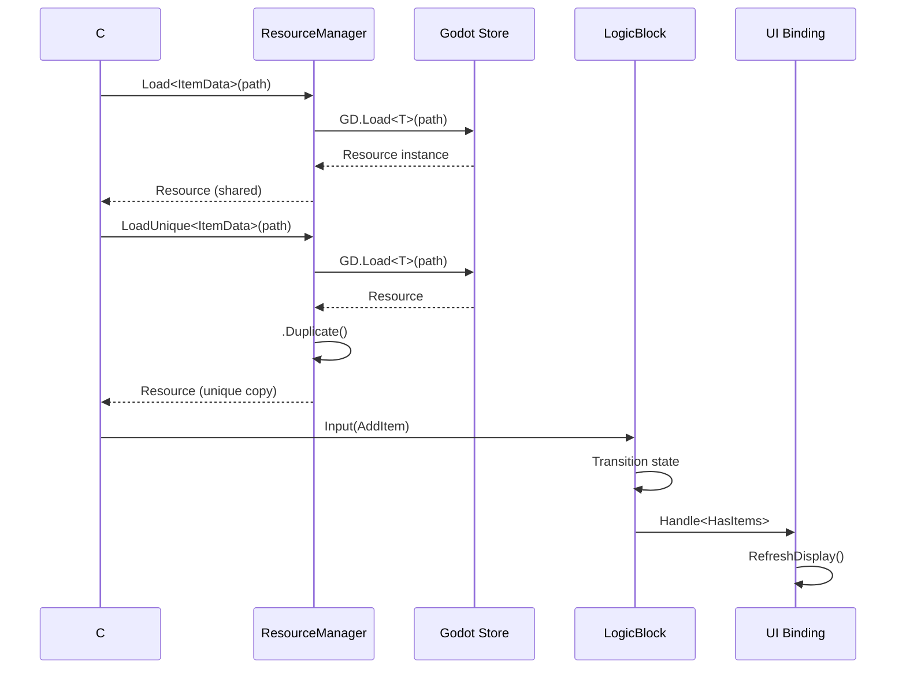

# Resource Pattern - Gestion Centralisée des Données avec ChickenSoft
*Guide complet pour créer, charger, et gérer des Resources typées en Godot 4.x avec C# et ChickenSoft.*

---

## **Contexte**

- **Objectif** : Maîtriser les **Resources** Godot pour une **gestion centralisée des données** de jeu (ennemis, objets, configurations, loot tables), **découplée de la logique métier** via ChickenSoft/LogicBlocks.
- **Public cible** : Développeurs C#/Godot utilisant ChickenSoft pour des projets avec données complexes (RPG, roguelike, simulation).
- **Prérequis** :
  - Godot 4.2+
  - C# 11+
  - Packages : `ChickenSoft.LogicBlocks`, `ChickenSoft.AutoInject`
  - Godot Resource Editor (inclus)

---

## **Règles d'Architecture Impératives**

### **1. Resources : Conteneurs Immuables de Données**
- **Héritage** : Tous les Resources **doivent étendre `Resource`** pour être sérialisables Godot.
- **Propriétés** : Utiliser `[Export]` pour toutes les propriétés exposables en Inspector.
- **Types supportés** : `int`, `float`, `string`, `bool`, `Vector2`, `Vector3`, `Color`, `Texture2D`, autres Resources.
- **Immutabilité au chargement** : Les Resources chargées directement sont **partagées** en mémoire — utiliser `.Duplicate()` pour les instances mutables.

### **2. LogicBlocks : Consommateurs de Resources**
- **Responsabilité unique** : Les LogicBlocks doivent **utiliser les données** des Resources, pas les **créer ou modifier**.
- **Injection** : Injecter les Resources via constructeur ou `[Service]` avec ChickenSoft.AutoInject.
- **Queries** : Implémenter des méthodes de recherche typées (ex: `FindByName()`, `FindByTag()`).

### **3. Bindings : Interface avec Godot**
- **Initialisation** : Charger et dupliquer les Resources dans `_Ready()`.
- **Exposition** : Exposer les Resources via `[Export]` dans les scripts Godot (`.cs` ou nodes).
- **Lifecycle** : Nettoyer les références dans `_ExitTree()`.

### **4. Storage : Persistance et Format**
- **`.tres`** : Format texte pour le développement et les fichiers éditables (humain-lisible, diffable).
- **`.res`** : Format binaire pour la production (compact, rapide).
- **Répertoires organisés** : Grouper par type : `res://data/enemies/`, `res://data/items/`, `res://data/config/`.
- **Sécurité** : Jamais charger `.tres`/`.res` de sources non fiables (utilisateurs, téléchargements).

---

## **Exemples Minimaux**

### **1. Créer une Resource Personnalisée**

#### **Fichiers**
- `ItemData.cs` : Définition de la Resource.
- `EnemyStats.cs` : Resource de configuration.

#### **Code - ItemData**
```csharp
// ItemData.cs
using Godot;

namespace MyGame.Data;

[GlobalClass]
public partial class ItemData : Resource
{
    [ExportGroup("Identity")]
    [Export] public string ItemName { get; set; } = "";
    [Export] public string Description { get; set; } = "";
    [Export] public Texture2D Icon { get; set; }

    [ExportCategory("Stats")]
    [Export(PropertyHint.Range, "0,999,1")] public int Value { get; set; } = 0;
    [Export(PropertyHint.Range, "0,100,1")] public int Weight { get; set; } = 1;

    [ExportGroup("Rarity")]
    public enum RarityLevel { Common, Uncommon, Rare, Epic, Legendary }
    [Export] public RarityLevel Rarity { get; set; } = RarityLevel.Common;

    public override string ToString() => $"ItemData({ItemName}, Rarity={Rarity})";
}
```

#### **Code - EnemyStats**
```csharp
// EnemyStats.cs
using Godot;
using Godot.Collections;

namespace MyGame.Data;

[GlobalClass]
public partial class EnemyStats : Resource
{
    [ExportGroup("Identity")]
    [Export] public string EnemyName { get; set; } = "";
    [Export] public Texture2D Sprite { get; set; }

    [ExportCategory("Combat")]
    [Export(PropertyHint.Range, "1,5000,1")] public int MaxHealth { get; set; } = 100;
    [Export(PropertyHint.Range, "0,500,0.1")] public float Speed { get; set; } = 80.0f;
    [Export(PropertyHint.Range, "0,999,1")] public int Damage { get; set; } = 10;
    [Export(PropertyHint.Range, "0,1,0.01")] public float CritChance { get; set; } = 0.05f;
    [Export(PropertyHint.Range, "0.1,10,0.1")] public float AttackInterval { get; set; } = 1.5f;

    [ExportGroup("Drops")]
    [Export] public Array<ItemData> DropTable { get; set; } = new();
    [Export(PropertyHint.Range, "0,1,0.01")] public float DropChance { get; set; } = 0.3f;

    [ExportGroup("Behavior")]
    [Export(PropertyHint.Range, "0,500,1")] public int DetectionRange { get; set; } = 100;

    // État mutable pour l'instance (ne pas exporter)
    private int _currentHealth;

    public void Initialize()
    {
        _currentHealth = MaxHealth;
    }

    public void TakeDamage(int amount)
    {
        _currentHealth = Mathf.Max(0, _currentHealth - amount);
    }

    public bool IsDead => _currentHealth <= 0;
    public float HealthPercent => (float)_currentHealth / MaxHealth;

    public override string ToString() => $"EnemyStats({EnemyName}, HP={_currentHealth}/{MaxHealth})";
}
```

---

### **2. Charger et Dupliquer les Resources**

#### **Fichier**
- `ResourceManager.cs` : Gestionnaire centralisé.

#### **Code**
```csharp
// ResourceManager.cs
using Godot;
using Godot.Collections;
using MyGame.Data;

namespace MyGame.Services;

[GlobalClass]
public partial class ResourceManager : Node
{
    // Charger une Resource unique
    public static T Load<T>(string path) where T : Resource
    {
        var resource = GD.Load<T>(path);
        if (resource == null)
        {
            GD.PushError($"Failed to load resource: {path}");
            return null;
        }
        return resource;
    }

    // Charger et dupliquer pour une instance unique
    public static T LoadUnique<T>(string path) where T : Resource
    {
        var resource = Load<T>(path);
        if (resource == null) return null;
        return (T)resource.Duplicate(); // Shallow copy
    }

    // Charger et dupliquer profondément (récursif pour les sub-resources)
    public static T LoadUniqueDeeply<T>(string path) where T : Resource
    {
        var resource = Load<T>(path);
        if (resource == null) return null;
        return (T)resource.Duplicate(subresources: true);
    }

    // Charger tous les Resources d'un répertoire
    public static Array<T> LoadAllFromDirectory<T>(string dirPath) where T : Resource
    {
        var result = new Array<T>();
        using var dir = DirAccess.Open(dirPath);
        if (dir == null)
        {
            GD.PushError($"Cannot open directory: {dirPath}");
            return result;
        }

        dir.ListDirBegin();
        string fileName = dir.GetNext();
        while (fileName != string.Empty)
        {
            if (!dir.CurrentIsDir() && (fileName.EndsWith(".tres") || fileName.EndsWith(".res")))
            {
                var fullPath = dirPath.PathJoin(fileName);
                var resource = GD.Load<T>(fullPath);
                if (resource != null)
                    result.Add(resource);
            }
            fileName = dir.GetNext();
        }

        return result;
    }

    // Sauvegarder une Resource
    public static bool Save(Resource resource, string path)
    {
        var error = ResourceSaver.Save(resource, path);
        if (error != Error.Ok)
        {
            GD.PushError($"Failed to save resource to '{path}' — error {error}");
            return false;
        }
        return true;
    }
}
```

---

### **3. Database de Resources**

#### **Fichier**
- `ItemDatabase.cs` : Base de données typée.

#### **Code**
```csharp
// ItemDatabase.cs
using Godot;
using Godot.Collections;
using MyGame.Data;

namespace MyGame.Services;

[GlobalClass]
public partial class ItemDatabase : Resource
{
    [Export] public Array<ItemData> Items { get; set; } = new();

    public ItemData FindByName(string itemName)
    {
        foreach (var item in Items)
        {
            if (item.ItemName == itemName)
                return item;
        }
        GD.PushWarning($"Item not found: {itemName}");
        return null;
    }

    public Array<ItemData> FindByRarity(ItemData.RarityLevel rarity)
    {
        var results = new Array<ItemData>();
        foreach (var item in Items)
        {
            if (item.Rarity == rarity)
                results.Add(item);
        }
        return results;
    }

    public ItemData GetRandom()
    {
        if (Items.Count == 0) return null;
        return Items[GD.Randi() % Items.Count];
    }

    public override string ToString() => $"ItemDatabase({Items.Count} items)";
}
```

---

### **4. Intégration avec LogicBlocks**

#### **Fichiers**
- `InventoryLogic.State.cs` : États du système d'inventaire.
- `InventoryLogic.Input.cs` : Inputs du système.
- `InventoryLogic.cs` : Bloc logique.

#### **Code - États**
```csharp
// InventoryLogic.State.cs
using Godot.Collections;
using MyGame.Data;

namespace MyGame.Logic.Inventory;

public partial class InventoryLogic
{
    public interface IState : ChickenSoft.LogicBlocks.StateLogic { }

    public record Empty : IState;
    public record HasItems(Array<ItemData> Items) : IState;
    public record Full(Array<ItemData> Items) : IState;
}
```

#### **Code - Inputs**
```csharp
// InventoryLogic.Input.cs
using MyGame.Data;

namespace MyGame.Logic.Inventory;

public partial class InventoryLogic
{
    public interface IInput : ChickenSoft.LogicBlocks.InputLogic { }

    public record AddItem(ItemData Item) : IInput;
    public record RemoveItem(ItemData Item) : IInput;
    public record Clear : IInput;
}
```

#### **Code - LogicBlock**
```csharp
// InventoryLogic.cs
using ChickenSoft.LogicBlocks;
using Godot.Collections;
using MyGame.Data;

namespace MyGame.Logic.Inventory;

public partial class InventoryLogic : LogicBlock<InventoryLogic.IState, InventoryLogic.IInput>
{
    private const int MaxSlots = 20;

    protected override IState InitialState => new Empty();

    public InventoryLogic()
    {
        // Ajouter un item à Empty → HasItems
        On<AddItem, Empty>((input, _) =>
        {
            var items = new Array<ItemData> { input.Item };
            return new HasItems(items);
        });

        // Ajouter un item à HasItems → Full ou HasItems
        On<AddItem, HasItems>((input, state) =>
        {
            if (state.Items.Count >= MaxSlots)
                return state; // Inventaire plein

            var items = new Array<ItemData>(state.Items) { input.Item };
            return items.Count >= MaxSlots
                ? (IState)new Full(items)
                : new HasItems(items);
        });

        // Retirer un item
        On<RemoveItem, HasItems>((input, state) =>
        {
            var items = new Array<ItemData>(state.Items);
            items.Remove(input.Item);
            return items.Count == 0 ? (IState)new Empty() : new HasItems(items);
        });

        // Vider l'inventaire
        On<Clear>((_, _) => new Empty());
    }
}
```

---

### **5. Binding : Intégration avec Godot UI**

#### **Fichier**
- `InventoryUI.cs` : Script UI lié au LogicBlock.

#### **Code**
```csharp
// InventoryUI.cs
using Godot;
using ChickenSoft.AutoInject;
using ChickenSoft.LogicBlocks;
using MyGame.Logic.Inventory;
using MyGame.Data;
using MyGame.Services;

namespace MyGame.UI;

public partial class InventoryUI : Control, IAutoNode
{
    [Export] private ItemDatabase _itemDatabase;

    private readonly InventoryLogic.Block _logic = new();
    private InventoryLogic.Block.Binding _binding;
    private VBoxContainer _itemsContainer;

    public override void _Ready()
    {
        _itemsContainer = GetNode<VBoxContainer>("VBoxContainer");

        _binding = _logic.Bind();

        _binding.Handle<InventoryLogic.Empty>(_ =>
        {
            _itemsContainer.GetChildren().ForEach(child => child.QueueFree());
            GD.Print("Inventory: Empty");
        });

        _binding.Handle<InventoryLogic.HasItems>(state =>
        {
            RefreshDisplay(state.Items);
            GD.Print($"Inventory: {state.Items.Count} items");
        });

        _binding.Handle<InventoryLogic.Full>(state =>
        {
            RefreshDisplay(state.Items);
            GD.Print("Inventory: FULL");
        });

        _logic.Start();
    }

    public override void _ExitTree()
    {
        _logic.Stop();
        _binding.Dispose();
    }

    private void RefreshDisplay(Godot.Collections.Array<ItemData> items)
    {
        _itemsContainer.GetChildren().ForEach(child => child.QueueFree());

        foreach (var item in items)
        {
            var label = new Label { Text = $"{item.ItemName} (×{item.Weight})" };
            _itemsContainer.AddChild(label);
        }
    }

    public void OnAddButtonPressed(string itemName)
    {
        var item = _itemDatabase.FindByName(itemName);
        if (item != null)
            _logic.Input(new InventoryLogic.AddItem(item));
    }
}
```

---

## **Bonnes Pratiques**

### **1. Organisation des Répertoires**
```
res://
├── data/
│   ├── enemies/
│   │   ├── goblin.tres
│   │   ├── orc.tres
│   │   └── boss_dragon.tres
│   ├── items/
│   │   ├── sword_iron.tres
│   │   ├── potion_health.tres
│   │   └── gem_ruby.tres
│   ├── config/
│   │   ├── game_settings.tres
│   │   └── difficulty_config.tres
│   └── databases/
│       ├── item_database.tres
│       └── enemy_database.tres
├── scenes/
│   └── ui/
│       └── inventory_ui.tscn
└── scripts/
    ├── data/
    │   ├── ItemData.cs
    │   └── EnemyStats.cs
    ├── logic/
    │   └── InventoryLogic.cs
    └── services/
        └── ResourceManager.cs
```

### **2. Sharing vs Unique**

**Resources partagées** — Chargées une fois, référencées par plusieurs nodes :
```csharp
// Tous deux pointent vers le même objet
var itemA = ResourceManager.Load<ItemData>("res://data/items/sword.tres");
var itemB = ResourceManager.Load<ItemData>("res://data/items/sword.tres");
GD.Print(itemA == itemB); // true
```

**Resources uniques** — Copie pour l'état mutable :
```csharp
// Chaque node a sa propre copie
var uniqueEnemyA = ResourceManager.LoadUnique<EnemyStats>("res://data/enemies/goblin.tres");
var uniqueEnemyB = ResourceManager.LoadUnique<EnemyStats>("res://data/enemies/goblin.tres");
uniqueEnemyA.TakeDamage(10);
GD.Print(uniqueEnemyB.IsDead); // false — indépendant
```

### **3. Lazy Loading avec ResourcePreloader**

Pour charger des groupes de Resources à la démarrage :
```csharp
// Dans la scène, ajouter un node ResourcePreloader
// Dans l'Inspector, ajouter des Resources avec des clés string

public override void _Ready()
{
    var preloader = GetNode<ResourcePreloader>("Preloader");
    var healthPotion = preloader.GetResource("health_potion") as ItemData;
    var ironSword = preloader.GetResource("iron_sword") as ItemData;
}
```

### **4. Validation et Sécurité**

Toujours valider les Resources chargées :
```csharp
public static T SafeLoad<T>(string path) where T : Resource
{
    if (string.IsNullOrEmpty(path))
    {
        GD.PushError("Resource path cannot be empty");
        return null;
    }

    if (!ResourceLoader.Exists(path))
    {
        GD.PushError($"Resource does not exist: {path}");
        return null;
    }

    var resource = GD.Load<T>(path);
    if (resource == null)
        GD.PushError($"Failed to load resource: {path}");

    return resource;
}
```

---

## **Erreurs Courantes à Éviter**

<mui:table-metadata title="Anti-Patterns et Corrections" />

| ❌ Anti-Pattern | ✅ Correction | Explication |
|---|---|---|
| Modifier une Resource chargée directement. | Dupliquer avec `.Duplicate()` avant modification. | Les Resources chargées sont partagées en mémoire — les modifications affectent tous les consommateurs. |
| Charger une Resource dans `_Process()` à chaque frame. | Charger une fois dans `_Ready()` et stocker. | Charge lente + allocation mémoire inutile. |
| Utiliser des noms de Resources en dur dans le code. | Exporter les chemins en `[Export]` ou utiliser une enum. | Évite les bugs si les chemins changent. |
| Créer des Resources par le code au lieu de les éditer visuellement. | Créer et configurer dans l'éditeur, charger au runtime. | L'éditeur offre l'Inspector et preview visuels. |
| Charger des `.tres`/`.res` depuis des sources non fiables. | Valider et charger uniquement `user://` sécurisé. | Les Resources peuvent exécuter du code — risque de sécurité. |
| Stocker des références mutables sans dupliquer. | Toujours appeler `.Duplicate()` pour l'état mutable. | Sinon, modifications non attendues d'autres instances. |
| Oublier de nettoyer les Resources chargées. | Implémenter `IDisposable` et appeler `Dispose()`. | Fuite mémoire à long terme. |

---

## **Diagrammes**

### **1. Cycle de Vie d'une Resource**



### **2. Architecture : Resources + LogicBlocks + UI**



### **3. Cycle : Loading → Sharing/Duplicating → Using**



---

## **Recettes Pratiques**

### **1. Système d'Équipement**

Permet à un personnage de porter et changer d'armes/armure.

```csharp
// EquipmentSlot.cs
[GlobalClass]
public partial class EquipmentSlot : Resource
{
    [Export] public string SlotName { get; set; } = "Head";
    [Export] public ItemData EquippedItem { get; set; }
    [Export(PropertyHint.Range, "0,10,1")] public int MaxStacks { get; set; } = 1;

    public bool CanEquip(ItemData item) => item != null && EquippedItem == null;
    public void Equip(ItemData item) { EquippedItem = item; }
    public void Unequip() { EquippedItem = null; }
}

// EquipmentLogic.cs
public partial class EquipmentLogic : LogicBlock<EquipmentLogic.IState, EquipmentLogic.IInput>
{
    public record Equipped(Dictionary<string, ItemData> Slots) : IState;

    public record EquipItem(string SlotName, ItemData Item) : IInput;
    public record UnequipItem(string SlotName) : IInput;

    protected override IState InitialState => new Equipped(new());

    public EquipmentLogic()
    {
        On<EquipItem, Equipped>((input, state) =>
        {
            var slots = new Dictionary<string, ItemData>(state.Slots);
            slots[input.SlotName] = input.Item;
            return new Equipped(slots);
        });

        On<UnequipItem, Equipped>((input, state) =>
        {
            var slots = new Dictionary<string, ItemData>(state.Slots);
            slots.Remove(input.SlotName);
            return new Equipped(slots);
        });
    }
}
```

### **2. Générateur Procédural de Loot**

Crée des items aléatoires basés sur des tables et rareté.

```csharp
// LootGenerator.cs
public static class LootGenerator
{
    public static ItemData GenerateLoot(ItemDatabase db, ItemData.RarityLevel rarity)
    {
        var candidates = db.FindByRarity(rarity);
        if (candidates.Count == 0) return null;

        var baseItem = candidates[(int)(GD.Randf() * candidates.Count)];
        var loot = (ItemData)baseItem.Duplicate();

        // Modifier les valeurs : affixes aléatoires, bonus, etc.
        loot.Value = (int)(loot.Value * GD.Randf() * 1.5f);

        return loot;
    }

    public static Godot.Collections.Array<ItemData> GenerateLootTable(ItemDatabase db, int count)
    {
        var table = new Godot.Collections.Array<ItemData>();
        for (int i = 0; i < count; i++)
        {
            var rarity = (ItemData.RarityLevel)(GD.Randi() % 5);
            var loot = GenerateLoot(db, rarity);
            if (loot != null) table.Add(loot);
        }
        return table;
    }
}
```

### **3. Système de Configuration Multi-Niveaux**

Charge des profils de difficulté.

```csharp
// DifficultyConfig.cs
[GlobalClass]
public partial class DifficultyConfig : Resource
{
    [Export] public string DifficultyName { get; set; } = "Normal";
    [Export(PropertyHint.Range, "0.1,5,0.1")] public float EnemyHealthMultiplier { get; set; } = 1.0f;
    [Export(PropertyHint.Range, "0.1,5,0.1")] public float EnemyDamageMultiplier { get; set; } = 1.0f;
    [Export(PropertyHint.Range, "0.1,5,0.1")] public float LootDropMultiplier { get; set; } = 1.0f;

    public EnemyStats ApplyDifficulty(EnemyStats baseStats)
    {
        var adjusted = (EnemyStats)baseStats.Duplicate();
        adjusted.MaxHealth = (int)(adjusted.MaxHealth * EnemyHealthMultiplier);
        adjusted.Damage = (int)(adjusted.Damage * EnemyDamageMultiplier);
        return adjusted;
    }
}

// GameSettingsLogic.cs
public partial class GameSettingsLogic : LogicBlock<GameSettingsLogic.IState, GameSettingsLogic.IInput>
{
    public record Settings(DifficultyConfig Difficulty) : IState;
    public record SetDifficulty(DifficultyConfig Difficulty) : IInput;

    protected override IState InitialState => new Settings(null);

    public GameSettingsLogic()
    {
        On<SetDifficulty>((input, _) => new Settings(input.Difficulty));
    }
}
```

---

## **Exemples Avancés**

### **1. Système d'Affixes Dynamiques**

Combine des modificateurs pour créer des items uniques.

```csharp
// ItemAffix.cs
[GlobalClass]
public partial class ItemAffix : Resource
{
    [Export] public string AffixName { get; set; } = "";
    [Export] public string Modifier { get; set; } = ""; // "+10% Speed", "+50 Damage", etc.
    [Export(PropertyHint.Range, "0,100,1")] public int DropChance { get; set; } = 10;
}

// AffixedItem.cs
[GlobalClass]
public partial class AffixedItem : ItemData
{
    [Export] public Godot.Collections.Array<ItemAffix> Affixes { get; set; } = new();

    public ItemData ApplyAffixes(ItemData baseItem)
    {
        var result = (ItemData)baseItem.Duplicate();
        foreach (var affix in Affixes)
        {
            result.Description += $"\n• {affix.Modifier}";
        }
        return result;
    }
}
```

### **2. Cache Thread-Safe pour Resources Coûteuses**

Évite les rechargements répétés.

```csharp
// ResourceCache.cs
public partial class ResourceCache : Node
{
    private static readonly Dictionary<string, Resource> _cache = new();

    public static T GetOrLoad<T>(string path) where T : Resource
    {
        if (_cache.TryGetValue(path, out var cached))
            return cached as T;

        var resource = ResourceManager.Load<T>(path);
        if (resource != null)
            _cache[path] = resource;

        return resource;
    }

    public static void Clear()
    {
        _cache.Clear();
        GD.Print("ResourceCache: Cleared");
    }

    public static void PrintStats()
    {
        GD.Print($"ResourceCache: {_cache.Count} entries");
    }
}
```

### **3. Validation et Schéma de Resources**

Assure la cohérence des données au chargement.

```csharp
// ResourceValidator.cs
public static class ResourceValidator
{
    public static bool ValidateItemData(ItemData item, out string error)
    {
        if (string.IsNullOrEmpty(item.ItemName))
        {
            error = "ItemName cannot be empty";
            return false;
        }

        if (item.Value < 0)
        {
            error = "Value cannot be negative";
            return false;
        }

        if (item.Icon == null)
        {
            error = "Icon cannot be null";
            return false;
        }

        error = null;
        return true;
    }

    public static bool ValidateEnemyStats(EnemyStats stats, out string error)
    {
        if (stats.MaxHealth <= 0)
        {
            error = "MaxHealth must be > 0";
            return false;
        }

        if (stats.Speed < 0)
        {
            error = "Speed cannot be negative";
            return false;
        }

        error = null;
        return true;
    }
}

// Utilisation
public override void _Ready()
{
    var enemy = ResourceManager.Load<EnemyStats>("res://data/enemies/goblin.tres");
    if (!ResourceValidator.ValidateEnemyStats(enemy, out var error))
    {
        GD.PushError($"Invalid enemy: {error}");
        return;
    }
}
```

---

## **Templates Réutilisables**

### **1. Template : Nouvelle Resource Personnalisée**

```csharp
// [FeatureName]Data.cs
using Godot;

namespace MyGame.Data;

[GlobalClass]
public partial class [FeatureName]Data : Resource
{
    [ExportGroup("Identity")]
    [Export] public string Name { get; set; } = "";
    [Export] public string Description { get; set; } = "";

    [ExportCategory("Configuration")]
    [Export] public float Value { get; set; } = 0;

    public override string ToString() => $"[FeatureName]Data({Name})";
}
```

### **2. Template : Nouvelle Database**

```csharp
// [FeatureName]Database.cs
using Godot;
using Godot.Collections;
using MyGame.Data;

namespace MyGame.Services;

[GlobalClass]
public partial class [FeatureName]Database : Resource
{
    [Export] public Array<[FeatureName]Data> Items { get; set; } = new();

    public [FeatureName]Data FindByName(string name)
    {
        foreach (var item in Items)
        {
            if (item.Name == name)
                return item;
        }
        return null;
    }

    public override string ToString() => $"[FeatureName]Database({Items.Count} items)";
}
```

### **3. Template : LogicBlock Consommant une Database**

```csharp
// [FeatureName]Logic.State.cs
using MyGame.Data;

namespace MyGame.Logic.[FeatureName];

public partial class [FeatureName]Logic
{
    public interface IState : ChickenSoft.LogicBlocks.StateLogic { }
    public record Ready([FeatureName]Data Current) : IState;
}

// [FeatureName]Logic.Input.cs
using MyGame.Data;

namespace MyGame.Logic.[FeatureName];

public partial class [FeatureName]Logic
{
    public interface IInput : ChickenSoft.LogicBlocks.InputLogic { }
    public record Select([FeatureName]Data Item) : IInput;
}

// [FeatureName]Logic.cs
using ChickenSoft.LogicBlocks;
using MyGame.Data;
using MyGame.Services;

namespace MyGame.Logic.[FeatureName];

public partial class [FeatureName]Logic : LogicBlock<[FeatureName]Logic.IState, [FeatureName]Logic.IInput>
{
    private readonly [FeatureName]Database _database;

    public [FeatureName]Logic([FeatureName]Database database)
    {
        _database = database;
    }

    protected override IState InitialState => new Ready(null);

    public [FeatureName]Logic()
    {
        On<Select>((input, _) => new Ready(input.Item));
    }
}
```

---

## **Checklist : Avant de Déployer**

- [ ] Toutes les Resources exportées sont valides et non nulles dans l'Inspector.
- [ ] Les chemins des Resources sont hardcodés ou centralisés dans une classe.
- [ ] Les Resources mutables sont dupliquées avant modification.
- [ ] Les bindings appellent `Dispose()` dans `_ExitTree()`.
- [ ] Les Resources chargées au runtime sont validées avec `ResourceValidator`.
- [ ] Les bases de données sont sérialisées en `.tres` pour debug, `.res` pour production.
- [ ] Aucun `load()` n'est appelé chaque frame — tout est chargé une fois.
- [ ] Les Resources ne contiennent pas de logique métier — juste des données.

---

## **Ressources Complémentaires**

- **Godot Documentation** : [Resources](https://docs.godotengine.org/en/stable/tutorials/io/saving_games.html)
- **ChickenSoft** : [AutoInject & Dependency Injection](https://chickensoft.games/)
- **Community Scripts** : Chercher "ChickenSoft Resource" sur le Godot Asset Store.

