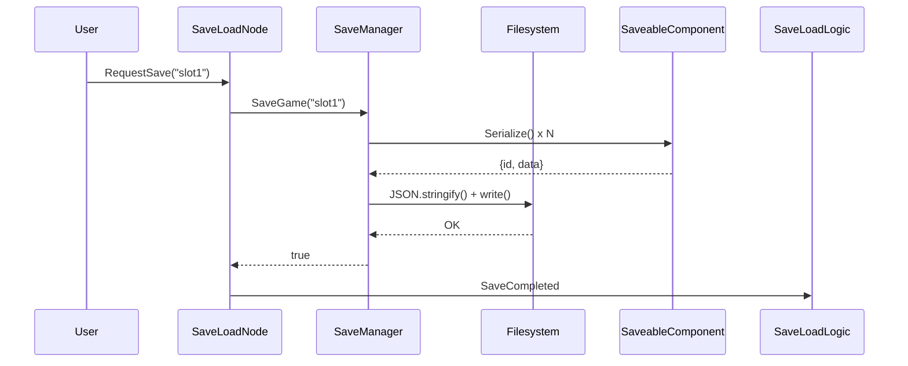
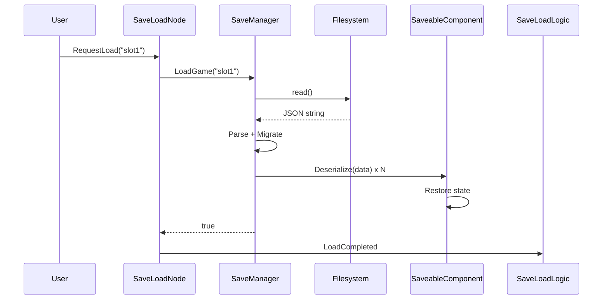
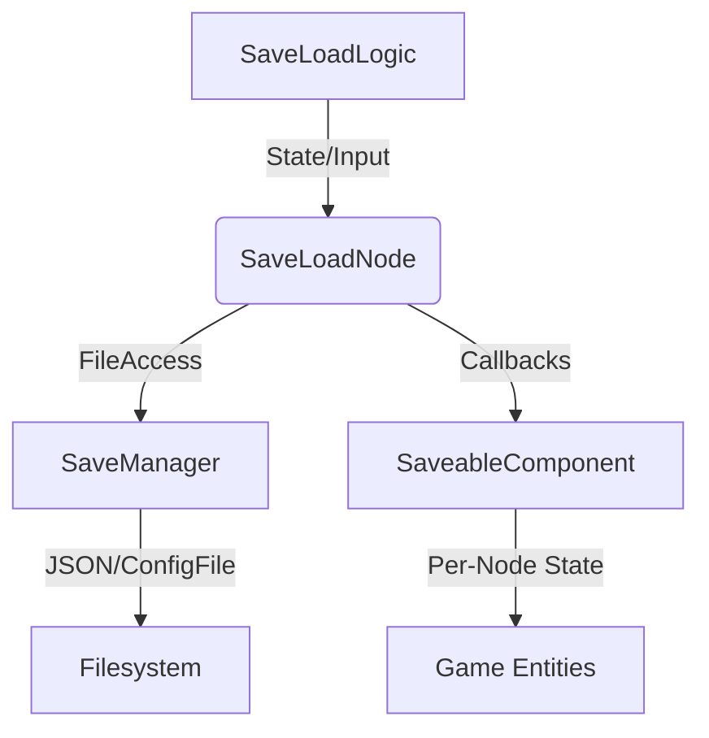
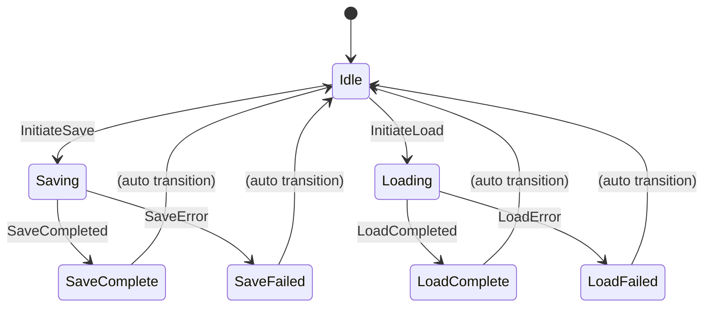

# Système de Sauvegarde et Chargement - Persistance avec ChickenSoft
*Guide ultime pour intégrer un système de sauvegarde performant, modulaire et découplé dans Godot 4.x avec ChickenSoft/LogicBlocks.*

---

## **Contexte**
- **Objectif** : Créer un système de sauvegarde/chargement **robuste**, **modulaire** et **100% compatible** avec ChickenSoft/LogicBlocks, supportant JSON, ConfigFile INI, et le pattern SaveableComponent pour une persistance flexible.
- **Public cible** : Développeurs C#/Godot utilisant ChickenSoft pour des jeux avec sauvegarde d'état, paramètres utilisateur et migration de version.
- **Prérequis** :
  - Godot 4.2+
  - C# 11+
  - Packages : `ChickenSoft.LogicBlocks`, `ChickenSoft.AutoInject`

---

## **Règles d'Architecture Impératives**

### **1. Découplage Strict**
- **LogicBlock** : Gère la **logique pure** (états, inputs, transitions de sauvegarde).
  - **Interdictions** : Aucune référence directe aux fichiers ou nœuds Godot.
  - **Obligations** : États et inputs en `record` immuables.
- **SaveManager** : Autoload centralisé responsable de la persistance.
  - **Responsabilités** : I/O fichier, sérialisation, migrations, gestion des erreurs.
  - **Utilisation** : JSON pour les sauvegardes jeu, ConfigFile pour les paramètres.
- **SaveableComponent** : Pattern par-nœud pour participer à la sauvegarde.
  - **Contrats** : Callbacks `Serialize` et `Deserialize` pour l'état local.

### **2. Immuabilité des États**
- **États** : Toujours utiliser des `record` pour les états (ex: `SaveLogicState`).
- **Inputs** : Toujours utiliser des `record` pour les inputs (ex: `InitiateSaveInput`).
- **Transitions** : Utiliser `On<TInput>((input, state) => ...)` pour les transitions d'état.

### **3. Stratégies de Persistance**
- **ConfigFile (INI)** : Pour les paramètres utilisateur (volume audio, résolution, touches).
- **JSON** : Pour les sauvegardes jeu complexes avec historique et migration.
- **SaveableComponent** : Pour l'encapsulation de l'état par nœud (coffres, ennemis, objets).

---

## **Exemples Minimaux**

### **1. Gestionnaire de Configuration (ConfigFile)**

#### **C# (`SettingsManager.cs` - Autoload)**

```csharp
// SettingsManager.cs — add as autoload named SettingsManager
using Godot;
using System;

public partial class SettingsManager : Node
{
    private const string SettingsPath = "user://settings.cfg";
    private readonly ConfigFile _config = new();

    public override void _Ready()
    {
        LoadSettings();
    }

    public void LoadSettings()
    {
        var err = _config.Load(SettingsPath);
        if (err != Error.Ok)
        {
            SetDefaults();
            SaveSettings();
        }
    }

    public void SaveSettings()
    {
        var err = _config.Save(SettingsPath);
        if (err != Error.Ok)
            GD.PushError($"SettingsManager: failed to save settings — error {err}");
    }

    public Variant GetSetting(string section, string key, Variant @default = default)
        => _config.GetValue(section, key, @default);

    public void SetSetting(string section, string key, Variant value)
    {
        _config.SetValue(section, key, value);
        SaveSettings();
    }

    private void SetDefaults()
    {
        // Audio
        _config.SetValue("audio", "master_volume", Variant.From(1.0f));
        _config.SetValue("audio", "music_volume", Variant.From(0.8f));
        _config.SetValue("audio", "sfx_volume", Variant.From(1.0f));
        
        // Display
        _config.SetValue("display", "fullscreen", Variant.From(false));
        _config.SetValue("display", "vsync", Variant.From(true));
        _config.SetValue("display", "resolution_scale", Variant.From(1.0f));
        
        // Input
        _config.SetValue("input", "invert_mouse_y", Variant.From(false));
        _config.SetValue("input", "mouse_sensitivity", Variant.From(1.0f));
    }
}
```

**Utilisation** :
```csharp
// Lecture
float vol = SettingsManager.GetSetting("audio", "master_volume", Variant.From(1.0f)).As<float>();

// Écriture
SettingsManager.SetSetting("audio", "master_volume", Variant.From(0.5f));
```

---

### **2. Gestionnaire de Sauvegarde (JSON)**

#### **C# (`SaveManager.cs` - Autoload)**

```csharp
// SaveManager.cs — add as autoload named SaveManager
using Godot;
using System.Collections.Generic;
using Godot.Collections;

public partial class SaveManager : Node
{
    private const string SaveDir = "user://saves/";
    private const string SaveExtension = ".json";
    private const int CurrentVersion = 2;

    public override void _Ready()
    {
        DirAccess.MakeDirRecursiveAbsolute(SaveDir);
    }

    // ── Save ──────────────────────────────────────────────────────────────────

    public bool SaveGame(string slotName)
    {
        var player = GetTree().GetFirstNodeInGroup("player");
        var world = GetTree().GetFirstNodeInGroup("world");

        var data = new Dictionary
        {
            ["version"] = CurrentVersion,
            ["timestamp"] = Time.GetUnixTimeFromSystem(),
            ["player"] = SerializePlayer(player),
            ["world"] = SerializeWorld(world),
        };

        // Collect saveable components
        var saveables = new Array();
        foreach (Node node in GetTree().GetNodesInGroup("saveable"))
        {
            if (node is SaveableComponent comp)
                saveables.Add(comp.Serialize());
        }
        data["saveables"] = saveables;

        string json = Json.Stringify(data, "\t");
        string path = SaveDir + slotName + SaveExtension;

        using var file = FileAccess.Open(path, FileAccess.ModeFlags.Write);
        if (file == null)
        {
            GD.PushError($"SaveManager: cannot open '{path}' for writing — error {FileAccess.GetOpenError()}");
            return false;
        }

        file.StoreString(json);
        GD.Print($"SaveManager: saved game to '{path}'");
        return true;
    }

    private Dictionary SerializePlayer(Node player)
    {
        if (player is not CharacterBody2D p)
            return new Dictionary();

        return new Dictionary
        {
            ["position"] = new Dictionary { ["x"] = p.GlobalPosition.X, ["y"] = p.GlobalPosition.Y },
            ["health"] = p.GetNodeOrNull<Node>("HealthComponent")?.Get("current_health") ?? 100,
        };
    }

    private Dictionary SerializeWorld(Node world)
    {
        var enemies = new Array();
        foreach (Node enemy in GetTree().GetNodesInGroup("enemies"))
        {
            if (enemy is Node2D e)
            {
                enemies.Add(new Dictionary
                {
                    ["scene_path"] = enemy.SceneFilePath,
                    ["position"] = new Dictionary { ["x"] = e.GlobalPosition.X, ["y"] = e.GlobalPosition.Y },
                    ["health"] = e.GetNodeOrNull<Node>("HealthComponent")?.Get("current_health") ?? 100,
                });
            }
        }
        return new Dictionary { ["enemies"] = enemies };
    }

    // ── Load ──────────────────────────────────────────────────────────────────

    public bool LoadGame(string slotName)
    {
        string path = SaveDir + slotName + SaveExtension;
        if (!FileAccess.FileExists(path))
        {
            GD.PushError($"SaveManager: save file not found at '{path}'");
            return false;
        }

        using var file = FileAccess.Open(path, FileAccess.ModeFlags.Read);
        if (file == null)
        {
            GD.PushError($"SaveManager: cannot open '{path}' for reading — error {FileAccess.GetOpenError()}");
            return false;
        }

        var json = new Json();
        var err = json.Parse(file.GetAsText());
        if (err != Error.Ok)
        {
            GD.PushError($"SaveManager: JSON parse error in '{path}': {json.GetErrorMessage()}");
            return false;
        }

        var data = json.Data.AsGodotDictionary();
        data = Migrate(data);

        var player = GetTree().GetFirstNodeInGroup("player");
        var world = GetTree().GetFirstNodeInGroup("world");
        DeserializePlayer(player, data["player"].AsGodotDictionary());
        DeserializeWorld(world, data["world"].AsGodotDictionary());

        // Restore saveable components
        if (data.ContainsKey("saveables"))
        {
            var saveables = data["saveables"].AsGodotArray();
            var saveableNodes = new List<SaveableComponent>();
            foreach (Node node in GetTree().GetNodesInGroup("saveable"))
                if (node is SaveableComponent comp)
                    saveableNodes.Add(comp);

            for (int i = 0; i < saveables.Count && i < saveableNodes.Count; i++)
                saveableNodes[i].Deserialize(saveables[i].AsGodotDictionary());
        }

        GD.Print($"SaveManager: loaded game from '{path}'");
        return true;
    }

    private void DeserializePlayer(Node player, Dictionary data)
    {
        if (player is not CharacterBody2D p)
            return;

        var pos = data["position"].AsGodotDictionary();
        p.GlobalPosition = new Vector2(pos["x"].As<float>(), pos["y"].As<float>());

        var health = p.GetNodeOrNull<Node>("HealthComponent");
        if (health != null)
            health.Set("current_health", data["health"].As<int>());
    }

    private void DeserializeWorld(Node world, Dictionary data)
    {
        // Remove existing enemies spawned at runtime
        foreach (Node enemy in GetTree().GetNodesInGroup("enemies"))
            enemy.QueueFree();

        var enemies = data["enemies"].AsGodotArray();
        foreach (Variant entry in enemies)
        {
            var e = entry.AsGodotDictionary();
            var scene = GD.Load<PackedScene>(e["scene_path"].As<string>());
            if (scene == null)
            {
                GD.PushError($"SaveManager: missing scene '{e["scene_path"]}'");
                continue;
            }

            var enemy = scene.Instantiate();
            world.AddChild(enemy);

            if (enemy is Node2D node)
            {
                var pos = e["position"].AsGodotDictionary();
                node.GlobalPosition = new Vector2(pos["x"].As<float>(), pos["y"].As<float>());
            }

            var health = enemy.GetNodeOrNull<Node>("HealthComponent");
            if (health != null)
                health.Set("current_health", e["health"].As<int>());
        }
    }

    // ── Helpers ───────────────────────────────────────────────────────────────

    public List<string> GetSaveSlots()
    {
        var slots = new List<string>();
        using var dir = DirAccess.Open(SaveDir);
        if (dir == null) return slots;

        dir.ListDirBegin();
        string fileName = dir.GetNext();
        while (fileName != "")
        {
            if (!dir.CurrentIsDir() && fileName.EndsWith(SaveExtension))
                slots.Add(fileName.TrimSuffix(SaveExtension));
            fileName = dir.GetNext();
        }
        return slots;
    }

    public bool DeleteSave(string slotName)
    {
        string path = SaveDir + slotName + SaveExtension;
        var err = DirAccess.RemoveAbsolute(path);
        if (err != Error.Ok)
        {
            GD.PushError($"SaveManager: failed to delete '{path}' — error {err}");
            return false;
        }
        return true;
    }

    // ── Migration ─────────────────────────────────────────────────────────────

    private Dictionary Migrate(Dictionary data)
    {
        int version = data.ContainsKey("version") ? data["version"].As<int>() : 0;

        if (version < 1)
        {
            // v0 → v1: add saveables array
            data["saveables"] = new Array();
            version = 1;
        }

        if (version < 2)
        {
            // v1 → v2: add player skills array
            if (!data.ContainsKey("player"))
                data["player"] = new Dictionary();
            var playerData = data["player"].AsGodotDictionary();
            playerData["skills"] = new Array();
            data["player"] = playerData;
            version = 2;
        }

        data["version"] = CurrentVersion;
        return data;
    }
}
```

---

### **3. SaveableComponent Pattern**

#### **C# (`SaveableComponent.cs`)**

Attachez ce composant à tout nœud devant sauvegarder/restaurer son état.

```csharp
// SaveableComponent.cs
using Godot;
using Godot.Collections;
using System;

public partial class SaveableComponent : Node
{
    /// <summary>Unique stable ID for this saveable object (set in the Inspector).</summary>
    [Export] public string SaveId = "";

    /// <summary>Assign a Func that returns a Dictionary of state to save.</summary>
    public Func<Dictionary> Serialize = () => new Dictionary();

    /// <summary>Assign an Action that accepts a Dictionary to restore state from.</summary>
    public Action<Dictionary> Deserialize = _ => { };

    public override void _Ready()
    {
        AddToGroup("saveable");
    }
}
```

#### **Exemple — Coffre utilisant SaveableComponent**

```csharp
// Chest.cs
using Godot;
using Godot.Collections;

public partial class Chest : Node3D
{
    [Export] public SaveableComponent Saveable;

    private bool _isOpen = false;
    private Array _contents = new Array { "sword", "potion" };

    public override void _Ready()
    {
        Saveable.Serialize = () => new Dictionary
        {
            { "save_id", Saveable.SaveId },
            { "is_open", _isOpen },
            { "contents", _contents.Duplicate() },
        };

        Saveable.Deserialize = data =>
        {
            _isOpen = (bool)data["is_open"];
            _contents = (Array)((Array)data["contents"]).Duplicate();
            if (_isOpen)
                PlayOpenAnimation();
        };
    }

    public void OpenChest()
    {
        _isOpen = true;
        PlayOpenAnimation();
    }

    private void PlayOpenAnimation()
    {
        // Animation logic here
        GD.Print("Chest opening animation...");
    }
}
```

---

### **4. SaveLoadLogic avec ChickenSoft**

#### **C# (`SaveLoadLogic.State.cs`)**

```csharp
// SaveLoadLogic.State.cs
namespace MyGame.Logic.SaveLoad;

public partial class SaveLoadLogic
{
    public interface IState : ChickenSoft.LogicBlocks.StateLogic { }
    public record Idle : IState;
    public record Saving : IState;
    public record Loading : IState;
    public record SaveComplete(string SlotName) : IState;
    public record LoadComplete(string SlotName) : IState;
    public record SaveFailed(string Error) : IState;
    public record LoadFailed(string Error) : IState;
}
```

#### **C# (`SaveLoadLogic.Input.cs`)**

```csharp
// SaveLoadLogic.Input.cs
namespace MyGame.Logic.SaveLoad;

public partial class SaveLoadLogic
{
    public interface IInput : ChickenSoft.LogicBlocks.InputLogic { }
    public record InitiateSave(string SlotName) : IInput;
    public record InitiateLoad(string SlotName) : IInput;
    public record SaveCompleted(string SlotName) : IInput;
    public record LoadCompleted(string SlotName) : IInput;
    public record SaveError(string Error) : IInput;
    public record LoadError(string Error) : IInput;
}
```

#### **C# (`SaveLoadLogic.cs`)**

```csharp
// SaveLoadLogic.cs
using ChickenSoft.LogicBlocks;

namespace MyGame.Logic.SaveLoad;

public partial class SaveLoadLogic : LogicBlock<SaveLoadLogic.IState, SaveLoadLogic.IInput>
{
    protected override IState InitialState => new Idle();

    public SaveLoadLogic()
    {
        // Transition to Saving state
        On<InitiateSave, Idle>((input, _) => new Saving());

        // Transition to Loading state
        On<InitiateLoad, Idle>((input, _) => new Loading());

        // Handle save completion
        On<SaveCompleted>((input, state) =>
            state switch
            {
                Saving => new SaveComplete(input.SlotName),
                _ => state
            });

        // Handle load completion
        On<LoadCompleted>((input, state) =>
            state switch
            {
                Loading => new LoadComplete(input.SlotName),
                _ => state
            });

        // Handle errors
        On<SaveError>((input, state) =>
            state switch
            {
                Saving => new SaveFailed(input.Error),
                _ => state
            });

        On<LoadError>((input, state) =>
            state switch
            {
                Loading => new LoadFailed(input.Error),
                _ => state
            });

        // Return to idle after completion or failure
        On<SaveComplete, SaveComplete>((_, _) => new Idle());
        On<LoadComplete, LoadComplete>((_, _) => new Idle());
        On<SaveFailed, SaveFailed>((_, _) => new Idle());
        On<LoadFailed, LoadFailed>((_, _) => new Idle());
    }
}
```

---

### **5. Binding avec Godot**

#### **C# (`SaveLoadNode.cs`)**

```csharp
// SaveLoadNode.cs
using Godot;
using ChickenSoft.LogicBlocks;
using MyGame.Logic.SaveLoad;

namespace MyGame.Nodes;

public partial class SaveLoadNode : Node, IAutoNode
{
    private readonly SaveLoadLogic.Block _logic = new();
    private SaveLoadLogic.Block.Binding _binding;

    public override void _Ready()
    {
        _binding = _logic.Bind();

        _binding.Handle<SaveLoadLogic.Saving>(_ =>
        {
            GD.Print("SaveLoadNode: saving...");
        });

        _binding.Handle<SaveLoadLogic.Loading>(_ =>
        {
            GD.Print("SaveLoadNode: loading...");
        });

        _binding.Handle<SaveLoadLogic.SaveComplete>(state =>
        {
            GD.Print($"SaveLoadNode: save completed for slot '{state.SlotName}'");
        });

        _binding.Handle<SaveLoadLogic.LoadComplete>(state =>
        {
            GD.Print($"SaveLoadNode: load completed for slot '{state.SlotName}'");
        });

        _binding.Handle<SaveLoadLogic.SaveFailed>(state =>
        {
            GD.PrintErr($"SaveLoadNode: save failed — {state.Error}");
        });

        _binding.Handle<SaveLoadLogic.LoadFailed>(state =>
        {
            GD.PrintErr($"SaveLoadNode: load failed — {state.Error}");
        });

        _logic.Start();
    }

    public override void _ExitTree()
    {
        _logic.Stop();
        _binding.Dispose();
    }

    public void RequestSave(string slotName)
    {
        if (SaveManager.SaveGame(slotName))
            _logic.Input(new SaveLoadLogic.SaveCompleted(slotName));
        else
            _logic.Input(new SaveLoadLogic.SaveError("Failed to save game"));
    }

    public void RequestLoad(string slotName)
    {
        if (SaveManager.LoadGame(slotName))
            _logic.Input(new SaveLoadLogic.LoadCompleted(slotName));
        else
            _logic.Input(new SaveLoadLogic.LoadError("Failed to load game"));
    }
}
```

---

## **Bonnes Pratiques**

### **1. Organisation des Données**
- **ConfigFile** : Pour tout paramètre utilisateur non-critique (idéal pour settings UI).
- **JSON** : Pour les sauvegardes jeu complexes (permet la migration, versioning, debugging).
- **SaveableComponent** : Pour l'encapsulation par nœud (chaque entité gère son propre état).

### **2. Gestion des Erreurs**
```csharp
// Toujours vérifier les erreurs d'I/O
public bool SaveGame(string slotName)
{
    try
    {
        var file = FileAccess.Open(path, FileAccess.ModeFlags.Write);
        if (file == null)
        {
            GD.PushError($"Cannot open file: {FileAccess.GetOpenError()}");
            return false;
        }
        file.StoreString(json);
        return true;
    }
    catch (System.Exception ex)
    {
        GD.PushError($"Save error: {ex.Message}");
        return false;
    }
}
```

### **3. Version Migration**
Toujours stocker une version dans les sauvegardes. Appliquez les migrations de façon incrémentale :

```csharp
private Dictionary Migrate(Dictionary data)
{
    int version = data.ContainsKey("version") ? data["version"].As<int>() : 0;

    if (version < 1)
    {
        // v0 → v1: inventory array added
        if (!data.ContainsKey("player"))
            data["player"] = new Dictionary();
        ((Dictionary)data["player"])["inventory"] = new Array();
        version = 1;
    }

    if (version < 2)
    {
        // v1 → v2: skills array added
        ((Dictionary)data["player"])["skills"] = new Array();
        version = 2;
    }

    data["version"] = CurrentVersion;
    return data;
}
```

### **4. Nettoyage des Ressources**
```csharp
public override void _ExitTree()
{
    _logic.Stop();
    _binding?.Dispose();  // Évite les fuites mémoire
}
```

### **5. Utilisation d'IAutoNode pour l'Injection**
```csharp
public partial class SaveLoadNode : Node, IAutoNode
{
    [Dependency] private GameManager _gameManager;

    public void OnResolved()
    {
        // Dépendances résolues, prêt à utiliser _gameManager
    }
}
```

---

## **Erreurs Courantes à Éviter**

| ❌ Anti-Pattern | ✅ Correction | Explication |
|----------------|--------------|-------------|
| Sauvegarder les références de nœuds directement. | Sauvegarder `scene_file_path` et `save_id` au lieu de Node refs. | Les références NodePath ne sont pas sérialisables en JSON. |
| Oublier la version dans les sauvegardes. | Toujours inclure `"version"` dans le dictionnaire. | Impossible de migrer les anciennes sauvegardes sans versioning. |
| Modifier les données de sauvegarde directement dans `_deserialize()`. | Valider et normaliser dans des helper methods. | Risque d'états incohérents. |
| Ne pas gérer les erreurs d'I/O fichier. | Vérifier `FileAccess.GetOpenError()` et logger les erreurs. | Les sauvegardes peuvent échouer silencieusement. |
| Sauvegarder des objets complexes non-sérialisables. | Utiliser uniquement Variant-compatible types (strings, floats, arrays, dicts). | JSON ne supporte pas les types personnalisés. |
| Ne pas appeler `_binding.Dispose()` dans `_ExitTree()`. | Toujours nettoyer les bindings LogicBlock. | Fuites mémoire. |
| Bloquer le thread UI pendant save/load. | Utiliser `CallDeferred()` ou threading pour gros fichiers. | Ralentit le jeu. |

---

## **Diagrammes**

### **1. Flux de Sauvegarde**


### **2. Flux de Chargement**


### **3. Architecture Globale**


### **4. États SaveLoadLogic**


---

## **Recettes Pratiques**

### **1. Save/Load UI Menu**
```csharp
public partial class SaveLoadUI : Control
{
    [Export] private SaveLoadNode _saveLoadNode;
    [Export] private ItemList _slotList;
    [Export] private LineEdit _slotNameInput;

    public override void _Ready()
    {
        _slotList.ItemSelected += OnSlotSelected;
        RefreshSaveSlots();
    }

    private void OnSaveButtonPressed()
    {
        string slotName = _slotNameInput.Text;
        if (!string.IsNullOrEmpty(slotName))
            _saveLoadNode.RequestSave(slotName);
    }

    private void OnLoadButtonPressed()
    {
        if (_slotList.IsAnythingSelected())
        {
            var slots = SaveManager.GetSaveSlots();
            _saveLoadNode.RequestLoad(slots[_slotList.GetSelectedItems()[0]]);
        }
    }

    private void RefreshSaveSlots()
    {
        _slotList.Clear();
        var slots = SaveManager.GetSaveSlots();
        foreach (var slot in slots)
            _slotList.AddItem(slot);
    }
}
```

### **2. Auto-Sauvegarde Périodique**
```csharp
public partial class AutoSaveManager : Node
{
    [Export] private float _saveIntervalSeconds = 300f; // 5 minutes
    private float _timeSinceLastSave = 0f;

    public override void _Process(double delta)
    {
        _timeSinceLastSave += (float)delta;
        if (_timeSinceLastSave >= _saveIntervalSeconds)
        {
            SaveManager.SaveGame("autosave");
            _timeSinceLastSave = 0f;
            GD.Print("AutoSave: saved game");
        }
    }
}
```

### **3. Sauvegarder sur Checkpoint**
```csharp
public partial class Checkpoint : Area2D
{
    [Export] private string _checkpointId = "checkpoint_1";

    private void OnCheckpointReached(Node2D player)
    {
        SaveManager.SaveGame(_checkpointId);
        GD.Print($"Checkpoint reached: {_checkpointId}");
        // Optionally: show UI feedback
    }

    private void OnBodyEntered(Node body)
    {
        if (body is CharacterBody2D player)
            OnCheckpointReached(player);
    }
}
```

### **4. Charger au Démarrage du Jeu**
```csharp
public partial class GameBootstrap : Node
{
    [Export] private string _defaultSlot = "autosave";

    public override void _Ready()
    {
        // Try load autosave, fallback to new game
        if (!SaveManager.LoadGame(_defaultSlot))
        {
            GD.Print("No save found, starting new game");
            InitializeNewGame();
        }
    }

    private void InitializeNewGame()
    {
        // Spawn player at start position, reset world, etc.
    }
}
```

---

## **Chemins des Fichiers**

| Type | Chemin | Plateforme | Modifiable |
|------|--------|-----------|-----------|
| Sauvegardes | `user://saves/` | Tous | ✅ Oui |
| Paramètres | `user://settings.cfg` | Tous | ✅ Oui |
| Logs | `user://logs/` | Tous | ✅ Oui |
| Ressources projet | `res://` | Tous | ❌ Non (lecture seule) |

**Note** : `user://` est automatiquement créé par Godot dans le dossier utilisateur (AppData Windows, ~/.godot Linux, ~/Library macOS).

---

## **Débogage et Testing**

### **Inspecter un fichier de sauvegarde**
```bash
# Linux/macOS
cat ~/.godot/app_userdata/MyGame/saves/slot1.json | jq .

# Windows
Get-Content "$env:APPDATA/Godot/app_userdata/MyGame/saves/slot1.json" | ConvertFrom-Json
```

### **Unit Testing SaveLoadLogic**
```csharp
[TestClass]
public class SaveLoadLogicTests
{
    [TestMethod]
    public void SaveLogic_TransitionsFromIdleToSaving()
    {
        var logic = new SaveLoadLogic.Block();
        var binding = logic.Bind();
        logic.Start();

        logic.Input(new SaveLoadLogic.InitiateSave("test"));
        Assert.IsInstanceOfType(logic.State, typeof(SaveLoadLogic.Saving));

        binding.Dispose();
        logic.Stop();
    }
}
```

---

## **Ressources Supplémentaires**

- **Godot Docs** : [FileAccess](https://docs.godotengine.org/en/stable/classes/class_fileaccess.html)
- **Godot Docs** : [JSON](https://docs.godotengine.org/en/stable/classes/class_json.html)
- **Godot Docs** : [ConfigFile](https://docs.godotengine.org/en/stable/classes/class_configfile.html)
- **ChickenSoft** : [LogicBlocks Documentation](https://github.com/chickensoft-games/LogicBlocks)

---
