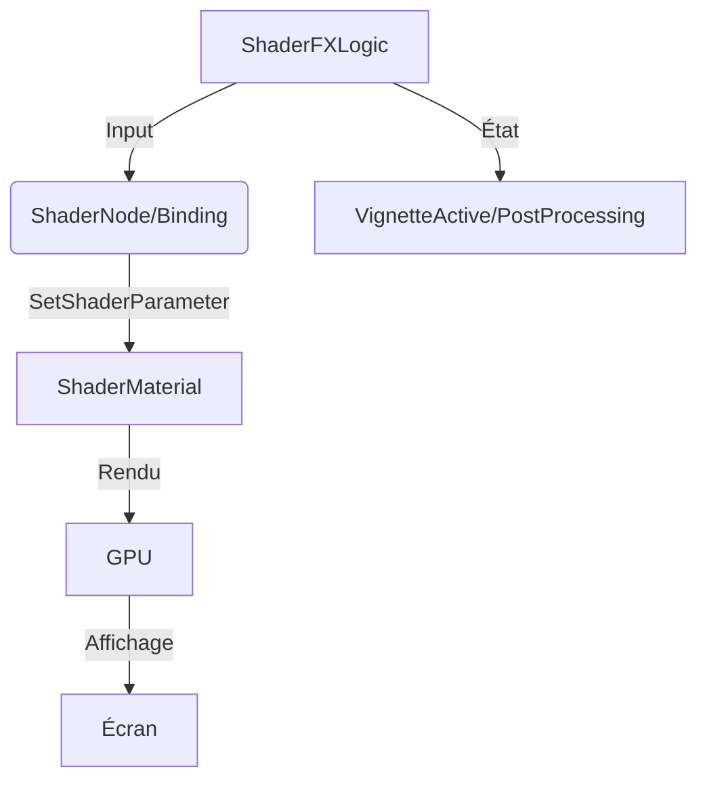
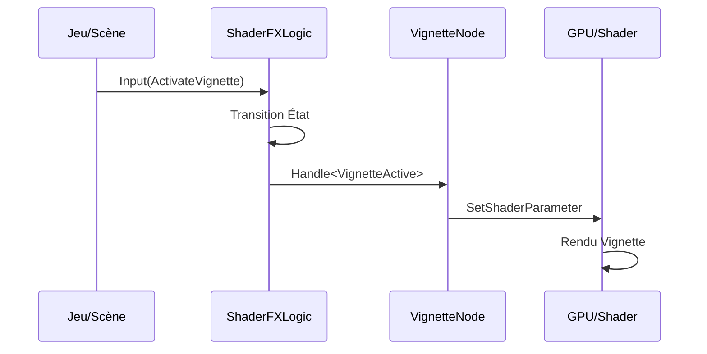
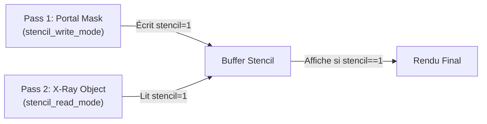

# Système de Shaders Avancés - Optimisation avec ChickenSoft
*Guide ultime pour créer, contrôler et optimiser des shaders personnalisés dans Godot 4.x avec C# et ChickenSoft.*

---

## **Contexte**

- **Objectif** : Maîtriser les shaders Godot 4.x (GLSL) en **C#**, intégrer des effets visuels avancés (post-processing, portails, vignette, CRT) et les découpler via **LogicBlocks/ChickenSoft** pour une architecture modulaire et performante.
- **Public cible** : Développeurs C#/Godot utilisant ChickenSoft pour des jeux 2D/3D avec des effets visuels avancés (post-processing, CompositorEffects, stencil buffer).
- **Prérequis** :
  - Godot 4.2+ (Godot 4.5+ pour stencil buffer)
  - C# 11+
  - Packages : `ChickenSoft.LogicBlocks`, `ChickenSoft.AutoInject`
  - Compréhension de base de GLSL/shaders

---

## **Règles d'Architecture Impératives**

### **1. Découplage Strict**

- **LogicBlock** : Gère la **logique de l'effet** (état d'activation, intensité, paramètres).
  - **Interdictions** : Aucune référence directe à `ShaderMaterial` ou `RenderingDevice`.
  - **Obligations** : États (`IState`) et inputs (`IInput`) en `record` immuables.

- **Binding (ShaderNode)** : Pont entre LogicBlock et les `ShaderMaterial` Godot.
  - **Responsabilités** :
    - Application des paramètres du shader via `SetShaderParameter()`.
    - Gestion du cycle de vie (`_Ready`, `_ExitTree`).
    - Nettoyage des ressources.

- **Fichiers `.gdshader`** : Code GLSL pur, sans dépendance à la logique C#.

### **2. Immutabilité**

- **États** : Toujours utiliser des `record` (ex: `VignetteState`).
- **Inputs** : Toujours utiliser des `record` (ex: `SetVignetteIntensityInput`).
- **Transitions** : Utiliser `On<TInput>((input, state) => ...)` pour calculer les nouveaux paramètres.

### **3. Performance et Opportunité GPU**

- **Préférer les shaders GPU** pour les effets globaux plutôt que des traitements CPU.
- **CompositorEffect** : Pour les effets avancés (compute shaders, passes multiples).
- **ShaderMaterial** : Pour les effets par-objet ou par-couche.
- **Stencil Buffer (Godot 4.5+)** : Pour les masques et portails sans calculs supplémentaires.

---

## **Fondamentaux des Shaders Godot**

### **1. Types de Shaders**

| Type | Shader Type | Utilisation | Exemple |
|------|-------------|-------------|---------|
| **Sprite/2D** | `canvas_item` | Effets sur sprites, ColorRect, 2D en général | Vignette, CRT, distorsion |
| **3D** | `spatial` | Matériaux 3D, objets 3D | PBR personnalisé, dissolve |
| **Noyau/Rendu** | `sky` | Ciels procéduraux | Gradient de ciel, étoiles |
| **Calcul** | `compute` | Traitements GPU avancés (4.2+) | SSAO personnalisé, effets de masse |

### **2. Structure Minimale d'un Shader Canvas Item**

```glsl
// my_effect.gdshader
shader_type canvas_item;

uniform float intensity : hint_range(0.0, 1.0) = 0.5;
uniform vec3 tint : hint_color = vec3(1.0, 1.0, 1.0);

void fragment() {
    vec4 col = texture(TEXTURE, UV);
    col.rgb *= mix(vec3(1.0), tint, intensity);
    COLOR = col;
}
```

### **3. Structure Minimale d'un Shader Spatial (3D)**

```glsl
// my_3d_effect.gdshader
shader_type spatial;
render_mode unshaded;

uniform vec3 base_color : hint_color = vec3(1.0);
uniform float smoothness : hint_range(0.0, 1.0) = 0.5;

void fragment() {
    ALBEDO = base_color;
    ROUGHNESS = 1.0 - smoothness;
}
```

---

## **Exemples Minimaux Intégrés avec ChickenSoft**

### **1. LogicBlock : Gestion des Paramètres de Shader**

#### **Fichiers**
- `ShaderFXLogic.State.cs` : États immuables.
- `ShaderFXLogic.Input.cs` : Inputs immuables.
- `ShaderFXLogic.cs` : Bloc logique.

#### **Code**

```csharp
// ShaderFXLogic.State.cs
namespace MyGame.Logic.Shaders;

public partial class ShaderFXLogic
{
    public interface IState : ChickenSoft.LogicBlocks.StateLogic { }
    
    public record Idle : IState;
    
    public record VignetteActive(
        float Intensity,
        float Opacity,
        float TransitionTime
    ) : IState;
    
    public record PostProcessing(
        float ScanlineIntensity,
        float Curvature,
        bool Enabled
    ) : IState;
}
```

```csharp
// ShaderFXLogic.Input.cs
namespace MyGame.Logic.Shaders;

public partial class ShaderFXLogic
{
    public interface IInput : ChickenSoft.LogicBlocks.InputLogic { }
    
    public record ActivateVignette(float Intensity, float Opacity) : IInput;
    public record DeactivateVignette : IInput;
    public record SetPostProcessing(float ScanlineIntensity, float Curvature) : IInput;
    public record TogglePostProcessing : IInput;
}
```

```csharp
// ShaderFXLogic.cs
using ChickenSoft.LogicBlocks;

namespace MyGame.Logic.Shaders;

public partial class ShaderFXLogic : LogicBlock<ShaderFXLogic.IState, ShaderFXLogic.IInput>
{
    protected override IState InitialState => new Idle();

    public ShaderFXLogic()
    {
        // Activation de la vignette
        On<ActivateVignette>((input, _) =>
            new VignetteActive(input.Intensity, input.Opacity, 0f));

        // Désactivation de la vignette
        On<DeactivateVignette, VignetteActive>((_, _) => new Idle());

        // Configuration du post-processing
        On<SetPostProcessing>((input, state) =>
            new PostProcessing(input.ScanlineIntensity, input.Curvature, true));

        // Bascule du post-processing
        On<TogglePostProcessing, PostProcessing>((_, state) =>
            state with { Enabled = !state.Enabled });
    }
}
```

### **2. Binding : ShaderNode pour Canvas Item (Vignette)**

```csharp
// VignetteNode.cs
using Godot;
using ChickenSoft.AutoInject;
using ChickenSoft.LogicBlocks;
using MyGame.Logic.Shaders;

namespace MyGame.Nodes;

[GlobalClass]
public partial class VignetteNode : ColorRect, IAutoNode
{
    private readonly ShaderFXLogic.Block _logic = new();
    private ShaderFXLogic.Block.Binding _binding;
    private ShaderMaterial _shaderMat;

    public override void _Ready()
    {
        // Initialiser le ShaderMaterial
        _shaderMat = new ShaderMaterial();
        _shaderMat.Shader = GD.Load<Shader>("res://Shaders/vignette.gdshader");
        Material = _shaderMat;

        // Configurer le binding
        _binding = _logic.Bind();
        
        _binding.Handle<ShaderFXLogic.VignetteActive>(state =>
        {
            _shaderMat.SetShaderParameter("vignette_intensity", state.Intensity);
            _shaderMat.SetShaderParameter("vignette_opacity", state.Opacity);
            Visible = true;
        });

        _binding.Handle<ShaderFXLogic.Idle>(_ =>
        {
            Visible = false;
        });

        _logic.Start();

        // Remplir l'écran
        AnchorLeft = 0;
        AnchorTop = 0;
        AnchorRight = 1;
        AnchorBottom = 1;
        MouseFilter = MouseFilterEnum.Ignore;
    }

    public override void _ExitTree()
    {
        _logic.Stop();
        _binding.Dispose();
    }

    public void ActivateVignette(float intensity, float opacity) =>
        _logic.Input(new ShaderFXLogic.ActivateVignette(intensity, opacity));

    public void DeactivateVignette() =>
        _logic.Input(new ShaderFXLogic.DeactivateVignette());
}
```

### **3. Shader : Vignette (vignette.gdshader)**

```glsl
// vignette.gdshader
shader_type canvas_item;

uniform float vignette_intensity : hint_range(0.0, 1.0) = 0.4;
uniform float vignette_opacity : hint_range(0.0, 1.0) = 0.5;

void fragment() {
    float dist = distance(UV, vec2(0.5));
    float vignette = smoothstep(0.2, 0.7, dist * vignette_intensity * 2.0);
    COLOR = vec4(0.0, 0.0, 0.0, vignette * vignette_opacity);
}
```

### **4. Intégration dans la Scène**

```ini
[gd_scene load_steps=1 format=3]
[ext_resource type="Script" path="res://Source/Nodes/VignetteNode.cs" id="1"]

[node name="UI" type="CanvasLayer"]
layer = 100

[node name="VignetteOverlay" type="ColorRect" parent="."]
script = ExtResource("1")
```

---

## **Cas Avancés**

### **1. Post-Processing CRT/Scanlines**

#### **Shader (crt_scanline.gdshader)**

```glsl
// crt_scanline.gdshader
shader_type canvas_item;

uniform float scanline_count : hint_range(0.0, 1000.0) = 300.0;
uniform float scanline_opacity : hint_range(0.0, 1.0) = 0.15;
uniform float curvature : hint_range(0.0, 10.0) = 2.0;

void fragment() {
    // Distorsion de courbure pour effet CRT
    vec2 uv = UV * 2.0 - 1.0;
    uv *= 1.0 + pow(length(uv), 2.0) * curvature * 0.01;
    uv = (uv + 1.0) * 0.5;

    if (uv.x < 0.0 || uv.x > 1.0 || uv.y < 0.0 || uv.y > 1.0) {
        COLOR = vec4(0.0, 0.0, 0.0, 1.0);
    } else {
        vec4 tex = texture(TEXTURE, uv);
        // Scanlines
        float scanline = sin(uv.y * scanline_count * 3.14159) * 0.5 + 0.5;
        tex.rgb -= scanline * scanline_opacity;
        COLOR = tex;
    }
}
```

#### **Node Binding (PostProcessingNode.cs)**

```csharp
// PostProcessingNode.cs
using Godot;
using ChickenSoft.AutoInject;
using MyGame.Logic.Shaders;

namespace MyGame.Nodes;

[GlobalClass]
public partial class PostProcessingNode : ColorRect, IAutoNode
{
    private readonly ShaderFXLogic.Block _logic = new();
    private ShaderFXLogic.Block.Binding _binding;
    private ShaderMaterial _shaderMat;

    public override void _Ready()
    {
        _shaderMat = new ShaderMaterial();
        _shaderMat.Shader = GD.Load<Shader>("res://Shaders/crt_scanline.gdshader");
        Material = _shaderMat;

        _binding = _logic.Bind();

        _binding.Handle<ShaderFXLogic.PostProcessing>(state =>
        {
            _shaderMat.SetShaderParameter("scanline_opacity", state.ScanlineIntensity);
            _shaderMat.SetShaderParameter("curvature", state.Curvature);
            Visible = state.Enabled;
        });

        _logic.Start();
        AnchorLeft = 0;
        AnchorTop = 0;
        AnchorRight = 1;
        AnchorBottom = 1;
        MouseFilter = MouseFilterEnum.Ignore;
    }

    public override void _ExitTree()
    {
        _logic.Stop();
        _binding.Dispose();
    }
}
```

### **2. Stencil Buffer (Godot 4.5+) - Portails X-Ray**

#### **Shader 1 : Masque Portail (portal_mask.gdshader)**

```glsl
// portal_mask.gdshader
shader_type spatial;
render_mode unshaded, stencil_write_mode, stencil_value = 1;

void fragment() {
    // Écrit la valeur de stencil 1 partout où le mesh portail est rendu.
    // Le portail lui-même peut être invisible.
    ALBEDO = vec3(0.0);
    ALPHA = 0.0;
}
```

#### **Shader 2 : Objet X-Ray (xray_object.gdshader)**

```glsl
// xray_object.gdshader
shader_type spatial;
render_mode unshaded, stencil_read_mode, stencil_compare = equal, stencil_value = 1;

void fragment() {
    // Visible uniquement où la valeur de stencil est 1 (à l'intérieur du portail).
    ALBEDO = vec3(0.2, 0.8, 1.0);
}
```

#### **Setup en C# (StencilPortalNode.cs)**

```csharp
// StencilPortalNode.cs
using Godot;
using ChickenSoft.AutoInject;

namespace MyGame.Nodes;

[GlobalClass]
public partial class StencilPortalNode : Node3D, IAutoNode
{
    [Export] public Node3D PortalMesh;
    [Export] public Node3D XrayCharacter;

    public override void _Ready()
    {
        if (PortalMesh != null && PortalMesh is MeshInstance3D portalMesh)
        {
            var portalMaterial = new StandardMaterial3D();
            portalMaterial.Shading = BaseMaterial3D.ShadingModeEnum.Unshaded;
            portalMesh.SetSurfaceOverrideMaterial(0, portalMaterial);
        }

        if (XrayCharacter != null && XrayCharacter is MeshInstance3D xrayMesh)
        {
            var xrayMaterial = new StandardMaterial3D();
            xrayMaterial.Shading = BaseMaterial3D.ShadingModeEnum.Unshaded;
            xrayMaterial.AlbedoColor = new Color(0.2f, 0.8f, 1.0f);
            xrayMesh.SetSurfaceOverrideMaterial(0, xrayMaterial);
        }
    }
}
```

### **3. CompositorEffect (Godot 4.3+) - Rendu Personnalisé**

#### **GDScript (custom_outline_effect.gd)**

```gdscript
# custom_outline_effect.gd
@tool
class_name CustomOutlineEffect
extends CompositorEffect

func _init() -> void:
    effect_callback_type = EFFECT_CALLBACK_TYPE_POST_TRANSPARENT
    needs_normal_roughness = true

func _render_callback(effect_callback_type: int, render_data: RenderData) -> void:
    var render_scene_data: RenderSceneData = render_data.get_render_scene_data()
    var render_scene_buffers: RenderSceneBuffers = render_data.get_render_scene_buffers()

    if not render_scene_buffers:
        return

    var size: Vector2i = render_scene_buffers.get_internal_size()
    var rd: RenderingDevice = RenderingServer.get_rendering_device()
    
    # Logique personnalisée de rendu...
```

#### **Port C# (CustomOutlineEffect.cs)**

```csharp
// CustomOutlineEffect.cs
using Godot;

namespace MyGame.Effects;

[GlobalClass]
public partial class CustomOutlineEffect : CompositorEffect
{
    private RenderingDevice _rd;
    private Rid _shader;

    public CustomOutlineEffect()
    {
        EffectCallbackType = EffectCallbackTypeEnum.PostTransparent;
        NeedsNormalRoughness = true;
        _rd = RenderingServer.GetRenderingDevice();
    }

    public override void _RenderCallback(int effectCallbackType, RenderData renderData)
    {
        if (_rd == null) return;

        var sceneBuffers = renderData.GetRenderSceneBuffers() as RenderSceneBuffersRD;
        if (sceneBuffers == null) return;

        var size = sceneBuffers.GetInternalSize();
        if (size.X == 0 || size.Y == 0) return;

        // Dispatch compute shader ou draw commands...
    }

    public override void _Notification(int what)
    {
        if (what == NotificationPredelete && _shader.IsValid)
            _rd.FreeRid(_shader);
    }
}
```

---

## **Bonnes Pratiques**

### **1. Organisation des Shaders**

```
res://Shaders/
├── canvas_item/
│   ├── vignette.gdshader
│   ├── crt_scanline.gdshader
│   └── distortion.gdshader
├── spatial/
│   ├── portal_mask.gdshader
│   ├── xray_object.gdshader
│   └── custom_pbr.gdshader
└── compute/
    ├── ssao.glsl
    └── particles_integrate.glsl
```

### **2. Utilisation des Uniforms**

- **`hint_range`** : Pour les sliders dans l'inspecteur.
- **`hint_color`** : Pour les sélecteurs de couleur.
- **`hint_enum`** : Pour les énumérations.
- **Noms clairs** : `vignette_intensity` plutôt que `vi`.

```glsl
uniform float intensity : hint_range(0.0, 1.0) = 0.5;
uniform vec3 color : hint_color = vec3(1.0);
uniform int blend_mode : hint_enum("Add,Multiply,Overlay") = 0;
```

### **3. Performance GPU**

- **Éviter les branches** (`if/else`) dans les shaders — utiliser `mix()`, `step()`, `smoothstep()`.
- **Réutiliser les calculs** — stocker les résultats intermédiaires.
- **Utiliser les variations de shader** pour les cas courants.

```glsl
// ❌ Lent
if (intensity > 0.5) {
    COLOR = texture(TEXTURE, UV + vec2(0.01));
} else {
    COLOR = texture(TEXTURE, UV);
}

// ✅ Rapide
float offset = mix(0.0, 0.01, step(0.5, intensity));
COLOR = texture(TEXTURE, UV + vec2(offset));
```

### **4. Patterns ChickenSoft pour Shaders**

- **Un LogicBlock par effet** : `VignetteLogic`, `CRTLogic`, `OutlineLogic`.
- **Paramètres immuables** : Les `record` d'état contiennent tous les paramètres du shader.
- **Transition via Input** : Chaque changement de paramètre passe par un `Input`.
- **Binding applique les paramètres** : Le binding C# utilise `SetShaderParameter()`.

### **5. Optimisation des Post-Processing**

Pour les effets full-screen performants, utiliser ce pattern :

```csharp
// PostProcessLayer.cs - Couche d'effets post-processing
using Godot;

namespace MyGame.Nodes;

[GlobalClass]
public partial class PostProcessLayer : CanvasLayer
{
    public override void _Ready()
    {
        Layer = 100; // Rendre au-dessus de tout
        FollowViewportScale = true;

        var colorRect = new ColorRect();
        colorRect.AnchorLeft = 0;
        colorRect.AnchorTop = 0;
        colorRect.AnchorRight = 1;
        colorRect.AnchorBottom = 1;
        colorRect.MouseFilter = Control.MouseFilterEnum.Ignore;
        
        var shaderMat = new ShaderMaterial();
        shaderMat.Shader = GD.Load<Shader>("res://Shaders/combined_effects.gdshader");
        colorRect.Material = shaderMat;

        AddChild(colorRect);
    }
}
```

---

## **Erreurs Courantes à Éviter**

| ❌ Anti-Pattern | ✅ Correction | Explication |
|----------------|--------------|-------------|
| Modifier `ShaderParameter` directement dans `_Process()`. | Utiliser des transitions d'état via `LogicBlock`. | Centralise la logique, évite les mutations ad-hoc. |
| Charger le shader à chaque frame. | Charger une seule fois dans `_Ready()`. | Grave goulot d'étranglement de performance. |
| Utiliser des `if/else` dans les shaders. | Préférer `mix()`, `step()`, `smoothstep()`. | Les branches GPU sont très coûteuses. |
| Oublier de décharger les ressources. | Appeler `Dispose()` dans `_ExitTree`. | Fuite mémoire. |
| Utiliser `TEXTURE` sans vérifier les variations de shader. | Documenter les sampler attendus. | Erreurs de compilation mystérieuses. |
| Shadering différent pour Canvas et Spatial. | Tester sur la bonne plateforme de rendu. | Les APIs diffèrent (ex: `UV` vs `SCREEN_UV`). |
| CompositorEffect sans gestion de lifecycle. | Implémenter `_Notification(NotificationPredelete)`. | Fuites de ressources GPU. |

---

## **Diagrammes**

### **1. Architecture Shader + LogicBlock**



### **2. Flux de Post-Processing**



### **3. Pipeline de Stencil (Godot 4.5+)**



---

## **Recettes Pratiques**

### **1. Vignette avec Transition Douce**

```csharp
// VignetteNode.cs - avec fade-in/out
using Godot;

namespace MyGame.Nodes;

[GlobalClass]
public partial class VignetteNode : ColorRect, IAutoNode
{
    private float _targetIntensity = 0f;
    private float _currentIntensity = 0f;
    private const float FadeSpeed = 2f;
    private ShaderMaterial _shaderMat;

    public override void _Ready()
    {
        _shaderMat = new ShaderMaterial();
        _shaderMat.Shader = GD.Load<Shader>("res://Shaders/vignette.gdshader");
        Material = _shaderMat;
    }

    public override void _Process(double delta)
    {
        _currentIntensity = Mathf.Lerp(_currentIntensity, _targetIntensity, FadeSpeed * (float)delta);
        _shaderMat.SetShaderParameter("vignette_intensity", _currentIntensity);
    }

    public void SetVignetteTarget(float intensity) => _targetIntensity = intensity;
}
```

### **2. Effect Stacking (Plusieurs Shaders)**

```gdshader
// combined_effects.gdshader - Vignette + CRT ensemble
shader_type canvas_item;

uniform float vignette_intensity : hint_range(0.0, 1.0) = 0.4;
uniform float vignette_opacity : hint_range(0.0, 1.0) = 0.5;
uniform float scanline_opacity : hint_range(0.0, 1.0) = 0.15;
uniform float scanline_count : hint_range(0.0, 1000.0) = 300.0;

void fragment() {
    // CRT Scanlines
    float scanline = sin(UV.y * scanline_count * 3.14159) * 0.5 + 0.5;
    vec4 col = texture(TEXTURE, UV);
    col.rgb -= scanline * scanline_opacity;

    // Vignette
    float dist = distance(UV, vec2(0.5));
    float vignette = smoothstep(0.2, 0.7, dist * vignette_intensity * 2.0);
    col.a *= (1.0 - vignette * vignette_opacity);

    COLOR = col;
}
```

### **3. Dissolve Effect (Shader 3D)**

```glsl
// dissolve.gdshader
shader_type spatial;

uniform sampler2D noise_tex : hint_default_white;
uniform float dissolve_amount : hint_range(0.0, 1.0) = 0.5;
uniform vec3 dissolve_color : hint_color = vec3(1.0, 0.5, 0.0);

void fragment() {
    float noise = texture(noise_tex, UV).r;
    float dissolve_mask = step(dissolve_amount, noise);

    if (dissolve_mask < 0.5) discard;

    ALBEDO = mix(dissolve_color, vec3(1.0), smoothstep(dissolve_amount - 0.1, dissolve_amount, noise));
}
```

### **4. Outline Effect (3D avec Stencil ou Double Pass)**

**Option 1 : Stencil (Godot 4.5+)**

```glsl
// outline_stencil.gdshader
shader_type spatial;
render_mode stencil_write_mode, stencil_value = 2;

uniform vec3 outline_color : hint_color = vec3(0.0, 1.0, 0.0);
uniform float outline_width : hint_range(0.0, 0.1) = 0.01;

void vertex() {
    VERTEX += NORMAL * outline_width;
}

void fragment() {
    ALBEDO = outline_color;
}
```

**Option 2 : Double Pass (avant Godot 4.5)**

```csharp
// OutlineNode.cs - Rendu la géométrie élargie d'abord
using Godot;

namespace MyGame.Nodes;

[GlobalClass]
public partial class OutlineNode : Node3D
{
    private MeshInstance3D _originalMesh;
    private MeshInstance3D _outlineMesh;

    public override void _Ready()
    {
        _originalMesh = GetNode<MeshInstance3D>("Mesh");
        _outlineMesh = new MeshInstance3D();
        _outlineMesh.Mesh = _originalMesh.Mesh;
        
        var outlineMat = new StandardMaterial3D();
        outlineMat.AlbedoColor = Colors.Green;
        outlineMat.Shading = BaseMaterial3D.ShadingModeEnum.Unshaded;
        _outlineMesh.SetSurfaceOverrideMaterial(0, outlineMat);

        AddChild(_outlineMesh);
    }
}
```

---

## **Référence : Sampler et Textures**

| Sampler | Type | Disponibilité | Usage |
|---------|------|----------------|-------|
| `TEXTURE` | `sampler2D` | Canvas Item, Spatial | Texte diffuse / couleur de base |
| `SCREEN_TEXTURE` | `sampler2D` | Canvas Item | Contenu de l'écran (post-processing) |
| `DEPTH_TEXTURE` | `sampler2D` | Spatial | Profondeur (pour effects de profondeur) |
| `NORMAL_TEXTURE` | `sampler2D` | Spatial | Normales de la géométrie |
| Custom uniform | Variable | Tous | Texture assignée depuis C# |

---

## **Ressources Critiques**

- **Godot Shader Docs** : https://docs.godotengine.org/en/stable/tutorials/shaders/index.html
- **Stencil Buffer PR #80710** : Référence pour les mots-clés Godot 4.5+
- **RenderingDevice API** : Pour les CompositorEffects avancés
- **ChickenSoft LogicBlocks** : https://github.com/chickensoft-games/LogicBlocks

---

## **Checklist de Déploiement Shader**

- ✅ Tous les shaders compilent sans erreurs
- ✅ Les uniformes ont des `hint_*` appropriés
- ✅ Les performances sont testées (frame time < 16ms)
- ✅ LogicBlock et Binding sont correctement découplés
- ✅ Les ressources sont libérées dans `_ExitTree()`
- ✅ Stencil write/read render modes sont testés sur Godot 4.5+
- ✅ Les CompositorEffects gèrent le cycle de vie correctement
- ✅ Les shaders fonctionnent sur toutes les plateformes cibles (Vulkan, D3D12, Metal, GLES3)
